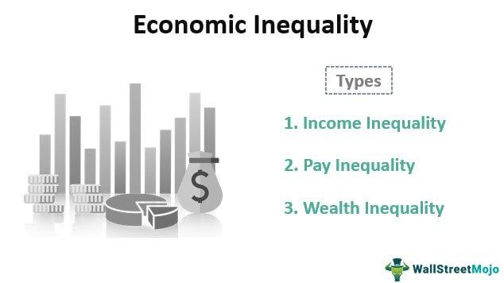

The year 2016 marked a period of notable economic challenges for the United States. Despite some positive indicators, such as Gross Domestic Product (GDP) growth, which saw an increase of around 1.6% for the year according to the Bureau of Economic Analysis, the U.S. economy grappled with several deep-rooted issues. These issues were not only domestic but also interconnected with global economic trends, reflecting the complexities of a globalized economy.

Among the primary domestic challenges was the Federal Reserve's delicate task of managing interest rates. The U.S. central bank faced significant pressure to increase interest rates to prevent inflation without hindering economic growth. The low-interest environment had driven asset prices upwards, triggering concerns about potential asset bubbles—a scenario reminiscent of the pre-2008 financial crisis period.

Internationally, the U.S. economy's performance was impacted by sluggish economic growth in major global economies, notably Europe and China. China's economy was particularly tumultuous, with a significant stock market correction evoking memories of the 2007-2008 financial crisis in the United States. Europe was beset by its own set of challenges, including low growth rates and political instability, which further complicated global economic collaboration.

Additionally, the U.S. jobs market showed signs of stagnation. While there had been job growth in preceding years, much of it was in part-time or low-paying positions. Consequently, labor force participation rates remained at decade-long lows. This undercurrents of the labor market reflected broader structural issues in the U.S. economy, such as wage stagnation and the challenges of creating high-quality employment opportunities.

The landscape of financial markets also evolved significantly in 2016, with algorithmic trading becoming increasingly prominent. This approach involves using computer algorithms to automate trading strategies, thereby increasing market liquidity. However, it also posed risks related to market manipulation and volatility, reflecting the complexities introduced by technological advances in financial markets.

Overall, the economic landscape in 2016 was shaped by a confluence of local and global dynamics, each presenting its own set of challenges. Understanding these issues provides important insights into both historical and present economic dynamics, as well as the ongoing evolution of market behaviors influenced by technological developments like algorithmic trading.

## Table of Contents

## The Fed's Balancing Act

In 2016, the Federal Reserve faced significant challenges in setting appropriate monetary policy, owing to competing economic dynamics. The central issue revolved around deciding whether to increase interest rates to manage inflation levels without adversely impacting economic growth. The U.S. economy showed signs of recovery, with positive indicators such as steady GDP growth, which fueled expectations for a rate hike. However, the backdrop was complicated by inflation that remained persistently below the Federal Reserve's target of 2%, causing a conundrum in policy-making.

The dilemma intensified as the extended period of low interest rates, which had been implemented in response to the 2008 financial crisis, contributed to an increase in asset prices, raising concerns about the formation of financial bubbles. The S&P 500 index, for example, continued to climb, raising alarms about equity market valuations. In such an environment, the Fed had to tread carefully: tightening monetary policy prematurely could stifle the nascent economic recovery, while delaying rate increases risked exacerbating financial imbalances.

Another dimension of the Fed's challenge was maintaining credibility and managing market expectations. The Federal Open Market Committee (FOMC), responsible for setting interest rates, had signaled a path towards normalization, leading to heightened scrutiny from investors and analysts. Market participants closely monitored the Fed's guidance, and any perceived hesitation or abrupt shifts in policy could lead to [volatility](/wiki/volatility-trading-strategies) in financial markets.

In summary, the Federal Reserve's balancing act in 2016 was characterized by its efforts to negotiate the thin line between encouraging economic recovery and maintaining price stability. The intricate interplay of domestic and global factors underscored the complexity of the Fed’s task in ensuring that monetary policy decisions were both timely and judicious. This context is crucial in understanding the broader economic landscape during that period and its implications for future monetary policy strategies.

## Weakness in Global Economies

In 2016, the United States found its economy deeply intertwined with global economic conditions, particularly those prevailing in Europe and China. The sluggish growth demonstrated by these economies had far-reaching implications for the U.S., affecting both trade and investment.

China's economy, once a powerhouse of rapid growth, faced a downturn that shook global markets. The Chinese stock market experienced a significant collapse, drawing parallels to the U.S. financial crisis of 2007-2008. This market upheaval was partially driven by over-leveraged investments and speculative trading, leading to a sharp sell-off that eroded market confidence. The impact of China's stock market collapse was not just confined to its borders; it resonated globally, influencing international trade dynamics and redirecting investment flows. U.S. firms with significant ties to China felt the pinch as consumer demand waned and exports took a hit, highlighting the interconnectedness of global markets.

Europe, on the other hand, continued to grapple with persistent economic challenges that had been long in the making. Growth rates remained stubbornly low, and political instability, exemplified by the United Kingdom's Brexit referendum, added another layer of uncertainty. These conditions had a dampening effect on the entire European Union, a critical trading partner for the United States. The U.S. economy, therefore, found itself in a precarious position, as reduced European demand for exports and investments further strained economic recovery efforts.

The influence of these global economic weaknesses on the U.S. was significant. As Europe and China both struggled to maintain robust growth trajectories, the ripple effects could be felt across the Atlantic. Trade, a vital component of the U.S. economy, experienced disruptions and shifts in patterns as global supply chain dynamics adjusted to these changes. Meanwhile, investment flows, which are sensitive to economic conditions and prospects, realigned in response to the emerging challenges in these key regions.

In conclusion, the sluggish growth in Europe and China during 2016 posed substantial challenges for the U.S. economy. The interconnected nature of global marketplaces meant that economic disruptions abroad invariably affected domestic economic conditions, influencing both policy decisions and market strategies. Understanding these dynamics is crucial for recognizing the broader economic trends that dictate the flow of international trade and investment.

## Sluggish Jobs Market

In 2016, the U.S. labor market faced significant challenges despite noticeable job growth in 2015. A substantial portion of newly created jobs fell into the categories of part-time or low-paying positions, which failed to meet the aspirations of many workers seeking stable and rewarding employment. This trend raised concerns about the overall quality and sustainability of the job market, highlighting fundamental issues in the economic landscape.

Labor force participation rates, a critical indicator of labor market health, sunk to decade-long lows during this period. This decline occurred as many individuals, disheartened by the lack of suitable job opportunities, exited the labor market altogether, thus reducing the pool of active job seekers. The discouraged worker effect was evident, as the official unemployment figures did not fully capture the true extent of underemployment and the unmet demand for higher-quality positions.

Several factors contributed to this situation. Structural changes in the economy, including advancements in automation and the globalization of labor, limited the ability of the private sector to generate a sufficient number of high-quality, well-paying jobs. Many companies adjusted their employment strategies in response to a rapidly evolving economic environment, often opting to hire part-time or temporary workers to maintain flexibility and reduce labor costs.

The sluggish jobs market of 2016 also reflected the broader economic uncertainty. Employers, wary of potential economic slowdowns and global instability, hesitated to commit to long-term investments in their workforce. This cautious approach contributed to the stagnation of wage growth and the prevalence of insecure employment, leaving many workers in precarious economic situations.

Efforts to address these issues focused on policy interventions aimed at stimulating job creation and improving workforce skills to match emerging industry demands. However, the challenges underscored the need for a comprehensive strategy that included education reform, investment in infrastructure, and policies fostering innovation and entrepreneurship to revitalize the U.S. labor market and restore confidence among workers.

## The Rise of Algorithmic Trading

Algorithmic trading, an emergent force in the financial markets, witnessed substantial growth in 2016. This trading approach employs computer algorithms to automate the execution of trading strategies, enhancing both efficiency and precision. One primary advantage of [algorithmic trading](/wiki/algorithmic-trading) is its ability to increase market [liquidity](/wiki/liquidity-risk-premium). By automating trade executions, algorithms facilitate the rapid turnover of stocks and other assets, thereby ensuring that buy and sell orders are executed with minimal delay. This increased liquidity can lead to narrower bid-ask spreads and more stable pricing, benefiting investors and market stability alike.

Despite its advantages, algorithmic trading introduced several complexities and risks. One significant concern is market manipulation. Algorithms, if improperly designed or executed with malicious intent, can engage in manipulative behaviors such as spoofing, where false orders are placed to create the illusion of demand and influence market prices. Furthermore, algorithmic strategies can exacerbate market volatility. The sheer speed and [volume](/wiki/volume-trading-strategy) of transactions conducted by algorithms can amplify price movements, notably during periods of market stress.

The impact of algorithmic trading on market dynamics could be observed during events like the "flash crash" of May 6, 2010, where the Dow Jones Industrial Average plunged about 1,000 points within minutes, only to recover those losses within the same trading session. This event illustrated how the rapid execution of trades by algorithms could lead to dramatic short-term price fluctuations, creating challenges for human traders and regulatory bodies.

Moreover, algorithmic trading systems are reliant on vast datasets and complex mathematical models to predict market movements and execute strategies. These systems often employ techniques from fields such as [machine learning](/wiki/machine-learning) and [artificial intelligence](/wiki/ai-artificial-intelligence) to adapt and optimize their trading decisions in real time. However, the computational nature of these models means they are susceptible to systemic risks, such as software bugs or infrastructure failures, which can have far-reaching consequences on market operations.

As such, while algorithmic trading played a crucial role in shaping market behavior in 2016, it also required continuous oversight and regulation to mitigate risks. Regulatory frameworks needed to evolve to address these challenges, ensuring that the benefits of algorithmic trading could be realized without undermining market integrity.

## Conclusion

The challenges faced by the United States in 2016 underscored significant structural issues within its economy. A confluence of local and global factors played a critical role in shaping economic policy decisions that year. Domestically, the Federal Reserve struggled with the decision of whether to raise interest rates, a move influenced by low inflation rates and modest economic growth. On the international front, the sluggish growth in major economies like China and Europe put additional pressure on U.S. economic strategies, complicating trade and investment landscapes.

Understanding these interconnected challenges is essential for interpreting subsequent economic developments. The 2016 economic scenario was characterized by a peculiar labor market with high levels of part-time employment and low labor force participation rates. These conditions reveal long-term trends that continue to influence the U.S. economy, such as a shift towards gig economy jobs and the challenges in achieving substantial wage growth.

Moreover, the rise of algorithmic trading during this period introduced new dynamics within financial markets. While algorithmic trading enhanced market liquidity and provided efficiencies in trading strategies, it also introduced risks associated with market manipulation and volatility. The flash crashes and abrupt price swings observed during this time were, in part, attributable to the rapid execution and sophistication of algorithmic strategies. As this technology continues to evolve, its effects on market behavior become increasingly pronounced, necessitating regulatory scrutiny and an understanding of its implications.

Overall, the events of 2016 highlighted critical aspects of the U.S. economic landscape, setting the foundation for future economic policy considerations. Policymakers and economists can glean valuable insights by examining how these challenges were managed, helping to inform strategies for addressing similar issues in the future. The continuous evolution of technologies like algorithmic trading is a reminder of the ever-changing nature of market forces and the need for adaptive economic policies.

## References & Further Reading

[1]: ["The Federal Reserve and the Financial Crisis"](https://www.federalreserve.gov/mediacenter/files/chairman-bernanke-lecture1-20120320.pdf) by Ben S. Bernanke

[2]: ["China's Economic Rise: History, Trends, Challenges, and Implications for the United States"](https://crsreports.congress.gov/product/pdf/RL/RL33534) by Wayne M. Morrison

[3]: ["The Post-Crisis Slump in Labor Force Participation"](https://cesr.usc.edu/documents/WP_2020_005.pdf) by Jonas D. M. Fisher and Casey B. Mulligan, Brookings Papers on Economic Activity

[4]: ["Brexit: Causes and Consequences"](https://www.researchgate.net/publication/343386171_BREXIT_CAUSES_AND_CONSEQUENCES) by the Adam Smith Institute

[5]: Aldridge, I. (2013). ["High-Frequency Trading: A Practical Guide to Algorithmic Strategies and Trading Systems"](https://books.google.com/books/about/High_Frequency_Trading.html?id=6l0DDQAAQBAJ)

[6]: ["The Rise of the Robots: Technology and the Threat of a Jobless Future"](https://www.amazon.com/Rise-Robots-Technology-Threat-Jobless/dp/0465059996) by Martin Ford