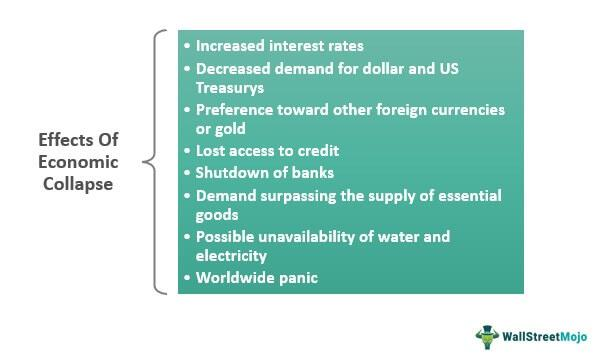

Economic collapse, downturns, and financial crises are events that have persistently influenced global economies, societal structures, and individual livelihoods. These phenomena are intricately linked to the cyclical nature of economies, characterized by periods of growth and contraction. While economic recessions are natural and expected phases within economic cycles, they can sometimes escalate into severe economic collapses if not managed synergistically through effective policies and interventions. Such collapses lead to significant disruptions across financial markets and labor structures, potentially resulting in long-term depressions.

This article examines the critical aspects of economic collapse and downturns, analyzes the pervasive influence of financial crises, and discusses the role of algorithmic trading (algo trading) within this multifaceted landscape. Algo trading utilizes advanced computer algorithms to automatically execute trading strategies, which can greatly enhance market efficiency and liquidity. However, the inherent nature of algorithms to respond to predetermined market conditions can also exacerbate fluctuations during economic downturns.

Gaining an understanding of these phenomena is crucial for a wide array of stakeholders, including policymakers, economists, investors, and individuals who are tasked with navigating and mitigating the profound impacts of such events. Insight into the interplay between policy decisions, market dynamics, and technological advancements is imperative to formulating strategies that can effectively buffer economies against unexpected financial adversities. As economies become increasingly digital and interconnected, the repercussions of financial crises and the stabilizing or destabilizing role of technologies like algo trading become even more significant, necessitating informed and adaptive responses to safeguard economic stability.

## Table of Contents

## Understanding Economic Collapse

An economic collapse is characterized by a steep and sustained decline in the economic activities of a nation or region, often leading to a prolonged depression. This phenomenon represents a severe and pervasive breakdown of the financial and market systems that underpin an economy. Among its most notable features are drastic reductions in industrial production, soaring unemployment rates, and significant declines in consumer and investor confidence. Additionally, currency devaluation and hyperinflation often accompany economic collapses, further eroding economic stability.

Severe disruptions during an economic collapse can propagate across various sectors. For instance, the banking sector might experience liquidity crises, leading to mass withdrawals or bank failures. Meanwhile, businesses may face insolvency due to diminished consumer spending and tight credit conditions. Consequently, the cycle of reduced spending and investment leads to widespread economic stagnation.

Historically, the Great Depression (1929) is a fundamental example of an economic collapse, where global GDP fell by approximately 15% and unemployment rates in the United States soared to around 25%. This period was characterized by a dramatic fall in consumer demand, tightened financial regulations, and significant deflationary pressures. Similarly, the 2008 financial crisis saw an extensive collapse of global financial institutions, predominantly triggered by the subprime mortgage crisis, leading to bank bailouts by national governments and a global recession.

The distinguishing [factor](/wiki/factor-investing) of economic collapses compared to regular economic cycles of expansion and contraction lies in their typically enduring nature and severity. Standard economic downturns are usually part of a natural cycle, involving phases such as peaks (boom periods) transitioning into troughs (recessions), followed by recoveries, all within a relatively short span. Economic collapses, however, can take years, if not decades, to resolve fully. This extended recovery period often requires extensive economic restructuring, policy reforms, and, in some cases, international assistance.

Overall, the devastation associated with economic collapses underscores the necessity for robust financial systems, effective regulation, and agile policy frameworks capable of mitigating such crises. The ability to identify early warning signs and undertake proactive measures can prevent potential collapses or minimize their impacts.

## Economic Downturns and Financial Crises

Economic downturns are periods marked by a significant reduction in economic activity, serving as transitions from the peak of the economic cycle to its trough. These downturns often manifest as decreased consumer spending, reduced industrial production, and rising unemployment rates. Without timely interventions, economic downturns can escalate into severe financial crises.

Financial crises are characterized by the rapid devaluation of financial assets, resulting in widespread panic across financial markets. Such panic often leads to bank failures and defaults on loans as institutions and individuals lose confidence in financial systems. The 2008 financial crisis, for instance, was triggered by the collapse of the housing bubble, which significantly devalued mortgage-backed securities and led to a global recession.

The causes of financial crises are numerous and interconnected. Excessive lending practices, where financial institutions extend credit beyond sustainable limits, often play a critical role. This was evident in the lead-up to the 2008 crisis when subprime mortgage lending became prevalent without adequate risk assessment. Speculative bubbles, where asset prices significantly exceed their intrinsic values, also contribute, as seen in the dot-com bubble of the late 1990s.

Geopolitical tensions can exacerbate economic conditions, influencing global trade and economic policy. For example, trade wars and political conflicts can disrupt supply chains and lead to [volatility](/wiki/volatility-trading-strategies) in currency exchange rates. Regulatory failures, where inadequate oversight allows risky financial practices to proliferate, further compound these issues. The lack of stringent regulations on derivative trading prior to 2008 is a case in point.

The global nature of modern economies means that financial crises often have widespread ripple effects. The interconnectedness of financial systems through trade, currency exchange, and international investments allows crises to propagate rapidly across borders. As a result, a crisis in one region can significantly impact global economic stability, necessitating coordinated international responses to mitigate adverse effects.

In summary, while economic downturns are natural phases of economic cycles, their progression into financial crises poses substantial risks to global economic stability. Understanding the causes and transmission mechanisms of these crises is vital for implementing effective preventive and remedial measures.

## Algorithmic Trading in Economic Crises

Algorithmic trading, commonly known as algo trading, involves the use of computer programs to execute a variety of trading strategies automatically, signifying a substantial shift in how financial markets operate. One of the primary advantages associated with algo trading is increased market [liquidity](/wiki/liquidity-risk-premium), as algorithms can make rapid decisions about buying and selling, often within milliseconds. This swift decision-making process contributes to more efficient and liquid markets by narrowing spreads and improving price discovery.

However, the same attributes that lend to market efficiency and liquidity can also become liabilities during economic downturns. One significant drawback is the potential to exacerbate market volatility. During periods of economic uncertainty, markets are often characterized by quick and significant price movements. In such environments, algorithmic strategies may inadvertently amplify these movements. For example, certain algo trading strategies are designed to detect and capitalize on volatility; thus, if a downward trend is detected, they may quickly execute sell orders to minimize losses, which can lead to further price declines and create a self-fulfilling prophecy of sorts.

Artificial intelligence (AI) and algorithmic models are central components of algo trading. Despite their sophistication, these models sometimes struggle with adapting to unforeseen market conditions that arise during economic crises. A model trained on historical data may not account for unique variables that influence markets during crises. This limitation can hinder the effectiveness of algorithms, as reactive strategies may fail to capture the nuances of evolving market dynamics during such periods.

In extreme economic downturns, the role of algorithms becomes more critical—and potentially problematic. Algorithms that rely on pre-set conditions are designed to execute trades when certain market conditions are met, which can result in massive sell-offs if those conditions are triggered by sudden market dips. This automated selling can lead to sharp market declines, contributing to what is known as a "flash crash," where markets plunge suddenly but may recover just as quickly. A notable example of such an event occurred in 2010, when the Dow Jones Industrial Average dropped nearly 1,000 points within minutes, largely attributed to [algorithmic trading](/wiki/algorithmic-trading).

To mitigate these risks, financial institutions and regulatory bodies sometimes implement safeguards, such as circuit breakers, which temporarily halt trading if a security or index falls beyond a predetermined threshold. These mechanisms are designed to provide a pause, allowing market participants to reassess information and stabilize market activities. Nonetheless, the influence of algo trading during economic crises remains a subject of extensive research and debate among economists and policymakers alike.

## Mitigating Economic Collapse and Crisis Risks

Governments and financial institutions are central to preventing economic collapse through the application of monetary policies and fiscal interventions. Effective monetary policies include adjusting interest rates to stabilize currencies and control inflation, which can boost economic confidence and spending during downturns. Fiscal interventions, on the other hand, involve government spending and taxation strategies aimed at stimulating growth and creating jobs.

Establishing robust regulatory frameworks is crucial to curbing speculative behavior in financial markets. These frameworks can significantly mitigate the risk of financial crises by enforcing transparency and accountability among financial institutions. Regulations such as the Dodd-Frank Wall Street Reform and Consumer Protection Act in the United States are designed to reduce risks in the financial system, emphasizing the importance of strong regulatory measures to preserve market stability.

The application of circuit breakers is an effective strategy to manage the risks associated with algorithmic trading, especially during periods of heightened market volatility. Circuit breakers temporarily halt trading if the market experiences dramatic price movements, thereby preventing panic-induced sell-offs. Implementing such safeguards helps to stabilize markets and reduce the rapid downward spirals that can exacerbate economic downturns.

Post-collapse recovery often necessitates legislative reforms aimed at strengthening economic resilience against future crises. These reforms can include altering the financial architecture to enhance systemic stability and adapt to new economic realities. For example, the introduction of more stringent capital requirements for banks can prevent excessive risk-taking and ensure that financial institutions are better equipped to weather economic turbulence.

In sum, a combination of sound monetary policies, fiscal interventions, robust regulatory frameworks, and innovative market safeguards are essential in mitigating the risks of economic collapse and managing financial crises. Proactive measures and informed decision-making can help economies not only recover from downturns but also build resilience to withstand future economic storms.

## Conclusion

The complexity of economic collapses, downturns, and financial crises necessitates multidimensional strategies for effective prevention and management. Acknowledging the role of technological tools, such as algorithmic trading, is essential for enhancing crisis prediction and mitigation. Algo trading, while providing liquidity and efficiency, can exacerbate market volatility during crises. It becomes crucial to understand and anticipate the interactions between these technological mechanisms and economic conditions to devise strategies that mitigate their potential adverse effects.

Global economic integration and digitalization further emphasize the need for stakeholders to remain informed and vigilant about these topics. An interconnected global economy means that the ripple effects of financial crises can transcend borders, affecting international trade, investment, and economic stability. Digitalization offers both opportunities and challenges, as it enables real-time problem-solving yet poses risks related to data security and technology-driven market dynamics.

Proactive measures combined with informed policy-making and technological adaptation can equip economies to better withstand future financial adversities. Implementing robust regulatory frameworks and adopting financial safeguards can limit the onset of speculative excesses. Furthermore, fostering collaboration among global financial institutions, policymakers, and technological experts can create a synergistic approach to economic resilience. By aligning technological advancement with strategic oversight and policy implementation, economies can be fortified against the inherent uncertainties and volatilities of global financial systems.

## References & Further Reading

[1]: Bernanke, B., Bown, C., & Posen, A. (2008). ["The Financial Crisis and the Global Economy."](https://www.federalreserve.gov/newsevents/speech/bernanke20090113a.htm) Peterson Institute for International Economics.

[2]: Lopez de Prado, M. (2018). ["Advances in Financial Machine Learning."](https://www.amazon.com/Advances-Financial-Machine-Learning-Marcos/dp/1119482089) Wiley.

[3]: Reinhart, C. M., & Rogoff, K. S. (2009). ["This Time Is Different: Eight Centuries of Financial Folly."](https://www.nber.org/system/files/working_papers/w13882/w13882.pdf) Princeton University Press.

[4]: Chan, E. (2008). ["Quantitative Trading: How to Build Your Own Algorithmic Trading Business."](https://github.com/ftvision/quant_trading_echan_book) Wiley.

[5]: Jansen, S. (2020). ["Machine Learning for Algorithmic Trading."](https://github.com/stefan-jansen/machine-learning-for-trading) Packt Publishing.

[6]: Gorton, G. B. (2012). ["Misunderstanding Financial Crises: Why We Don’t See Them Coming."](https://www.amazon.com/Misunderstanding-Financial-Crises-Dont-Coming/dp/019992290X) Oxford University Press.

[7]: Aronson, D. R. (2006). ["Evidence-Based Technical Analysis: Applying the Scientific Method and Statistical Inference to Trading Signals."](https://www.wiley.com/en-us/Evidence+Based+Technical+Analysis%3A+Applying+the+Scientific+Method+and+Statistical+Inference+to+Trading+Signals-p-9780470008744) Wiley.