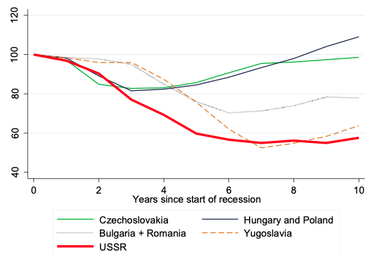

## Table of Contents

## What was the Soviet Union?

The Soviet Union was a big country that existed from 1922 to 1991. It was made up of many smaller countries, like Russia, Ukraine, and others, all joined together. The official name was the Union of Soviet Socialist Republics, or USSR for short. It was led by a group called the Communist Party, and they wanted everyone to be equal and share everything.

During its time, the Soviet Union was very powerful and competed with the United States in something called the Cold War. They had a lot of influence around the world and were known for things like sending the first man into space. But there were also many problems inside the country, like not enough food and people not being free to say what they thought. In 1991, the Soviet Union broke apart into separate countries, and it doesn't exist anymore.

## When did the Soviet Union collapse?

The Soviet Union collapsed in December 1991. Before that, the country was having many problems. People were unhappy because there wasn't enough food, and they couldn't say what they wanted. Also, the different parts of the Soviet Union, like Russia and Ukraine, wanted to be their own countries.

In 1991, things got worse. The leader of the Communist Party, Mikhail Gorbachev, tried to make changes to fix the problems. But some people in the government didn't like these changes and tried to take over. This failed, and it made the Soviet Union even weaker. Finally, on December 25, 1991, the Soviet Union officially ended, and the different parts became separate countries.

## What were the main economic factors that led to the collapse of the Soviet Union?

One big reason the Soviet Union fell apart was because its economy was not doing well. The government controlled everything, like what people could buy and sell, and this made it hard for the economy to grow. They had a system called central planning, which meant the government decided how much of everything should be made, like food and cars. But they often got it wrong, so there were times when there wasn't enough food or other things people needed. This made people unhappy and frustrated.

Another problem was that the Soviet Union spent a lot of money on things like the military and space programs. They wanted to keep up with the United States during the Cold War, so they put a lot of money into building weapons and trying to be the first in space. This took money away from things that could have helped people, like better schools and hospitals. Over time, the economy got weaker and weaker, and it became harder for the government to keep everything under control. This led to the collapse of the Soviet Union in 1991.

## How did the Soviet Union's centralized economic planning contribute to its economic collapse?

The Soviet Union's centralized economic planning meant that the government decided everything about what should be made and how much. This system, called central planning, often didn't work well. The government didn't always know what people really needed, so they made too much of some things and not enough of others. For example, they might make lots of shoes but not enough food. This led to shortages, where people couldn't get the things they needed, like bread or meat. People got frustrated and unhappy because they had to wait in long lines just to buy basic things.

Also, the centralized planning made it hard for the economy to grow. Because the government controlled everything, there wasn't much room for new ideas or businesses to start up. If someone had a good idea for a new product, they couldn't just start making it; they had to get permission from the government. This slowed everything down and made the economy less flexible. Over time, the problems got worse and worse, and the economy got weaker. This was one of the big reasons why the Soviet Union collapsed in 1991.

## What role did the arms race with the United States play in the Soviet Union's economic downfall?

The arms race with the United States was a big reason why the Soviet Union's economy fell apart. During the Cold War, both countries wanted to show they were more powerful, so they spent a lot of money on weapons and military stuff. The Soviet Union tried to keep up with the United States by building more and more weapons, but this was really expensive. They spent so much money on the military that they didn't have enough left to take care of things like schools, hospitals, and roads. This made life harder for people and made the economy weaker.

On top of that, the arms race pushed the Soviet Union to spend money it didn't really have. They borrowed money and used up their resources to build more weapons, but it wasn't enough. The United States had a stronger economy and could spend more without hurting their country as much. The Soviet Union couldn't keep up, and their economy started to fall apart. By the time the arms race was over, the Soviet Union was in such bad shape that it couldn't recover, and this helped lead to its collapse in 1991.

## How did oil prices affect the Soviet economy in the 1980s?

In the 1980s, oil prices had a big impact on the Soviet economy. The Soviet Union made a lot of money from selling oil and gas to other countries. When oil prices were high, they had more money to spend on things like schools and hospitals. But in the 1980s, oil prices started to fall a lot. This meant the Soviet Union didn't make as much money from selling oil, and they had less money to spend on important things. This made their economy weaker and harder to manage.

The falling oil prices made the Soviet Union's problems even worse. They were already spending a lot of money on the military because of the arms race with the United States. Now, with less money coming in from oil, they had to cut back on other things. This made life harder for people and made the economy struggle even more. The lower oil prices were one of the reasons the Soviet Union's economy got so weak that it eventually collapsed in 1991.

## What were the effects of Gorbachev's policies of perestroika and glasnost on the Soviet economy?

When Mikhail Gorbachev became the leader of the Soviet Union, he introduced two big policies called perestroika and glasnost. Perestroika meant "restructuring" and was about changing the economy to make it work better. Gorbachev wanted to give people more freedom to start their own businesses and make their own decisions. But these changes were hard to put into place because the economy had been controlled by the government for so long. People didn't know how to run businesses, and there were a lot of problems. Instead of fixing the economy, perestroika made things more confusing and led to even more shortages and problems.

Glasnost, which meant "openness," was about letting people speak more freely and share their thoughts. This was good because it made people feel like they had more freedom. But it also meant that people started talking about all the problems in the Soviet Union, like the shortages and the bad economy. This made people even more unhappy and less willing to support the government. Together, perestroika and glasnost made the economy more unstable and helped lead to the collapse of the Soviet Union in 1991.

## How did the Soviet Union's agricultural sector contribute to its economic instability?

The Soviet Union's agricultural sector was a big problem for its economy. The government controlled farming and told farmers what to grow and how much. This didn't work well because the government often made bad choices. They might tell farmers to grow a lot of one thing, like wheat, but not enough of something else, like vegetables. This led to shortages where people couldn't get enough food. Farmers were also not motivated to work hard because they didn't get to keep much of what they grew. This made the whole farming system inefficient and caused a lot of economic trouble.

On top of that, the Soviet Union had big problems with getting food from farms to stores. They didn't have good ways to store or move food around, so a lot of it went bad before it could be used. This made the food shortages even worse. The government tried to fix these problems by importing food from other countries, but this was expensive and used up money that could have been spent on other things. The struggles in the agricultural sector were a big reason why the Soviet Union's economy was unstable and eventually collapsed.

## What was the impact of the Soviet Union's foreign debt on its economy?

The Soviet Union's foreign debt made its economic problems even worse. By the 1980s, the country had borrowed a lot of money from other countries to help pay for things like the military and importing food. But when oil prices fell, the Soviet Union didn't have as much money coming in to pay back these loans. This made it hard for them to keep up with their debt payments, and it put a lot of pressure on their economy. They had to use more and more of their money just to pay back what they owed, which meant they had less money to spend on things that could help their people, like schools and hospitals.

The foreign debt also made it harder for the Soviet Union to make changes to their economy. They needed to spend money on new ideas and businesses to try to fix their economic problems, but their debt kept them from doing that. The more they struggled to pay back their loans, the weaker their economy got. This cycle of debt and economic trouble was one of the reasons the Soviet Union couldn't recover and eventually collapsed in 1991.

## How did the decline in productivity and innovation within the Soviet Union lead to its economic collapse?

The Soviet Union's economy struggled because it didn't encourage people to be productive or come up with new ideas. The government controlled everything, so people didn't have much reason to work hard or think of new ways to do things. If someone had a good idea for a new product or a better way to do something, they couldn't just start doing it. They had to get permission from the government, which made everything slow and hard. This meant the economy didn't grow as fast as it could have, and it got stuck in the same old ways of doing things.

Over time, this lack of productivity and innovation made the Soviet Union's economy weaker and weaker. Other countries, like the United States, were coming up with new technologies and ways to make things better, but the Soviet Union was falling behind. They couldn't keep up with the rest of the world, and their economy suffered because of it. This was one of the big reasons why the Soviet Union couldn't fix its problems and eventually collapsed in 1991.

## What were the immediate economic consequences of the Soviet Union's dissolution for its successor states?

When the Soviet Union broke apart in 1991, the new countries that came from it faced big economic problems right away. The Soviet Union had one big economy that was controlled by the government, and when it split into many smaller countries, they had to figure out how to run their own economies. This was hard because they didn't have the money or the know-how to do it well. Many of these new countries had to deal with high inflation, which means prices went up a lot and money became worth less. People's savings lost value, and it was hard to buy things they needed.

On top of that, the new countries had to find new ways to trade with each other and with other countries. Before, everything was handled by the Soviet Union, but now each country had to do it on its own. This caused a lot of confusion and made it hard for them to get the things they needed. Many people lost their jobs because factories and businesses that used to be part of the Soviet Union's big system didn't know how to keep going. It took a long time for these new countries to start fixing their economies and making things better for their people.

## How have economists analyzed the long-term effects of the Soviet Union's economic collapse on global economics?

Economists have looked at how the Soviet Union's collapse affected the world's economy. They say it changed the way countries trade with each other. Before the collapse, the Soviet Union was a big player in the world, and it traded a lot with other countries, especially in Europe. When it broke apart, the new countries had to find new ways to trade, and this changed the flow of goods and money around the world. It also made more countries start using capitalism, where businesses and people can make their own choices, instead of having the government control everything. This shift helped spread ideas about free markets and competition to more places.

Another big effect was on how countries think about their economies. The Soviet Union's collapse showed that having a government-controlled economy can lead to big problems. It made many countries think twice about using that kind of system. Instead, they started to focus more on making their economies strong and flexible, so they could handle changes better. This led to more countries trying to grow their economies by encouraging businesses to start up and by making it easier for people to trade with each other. Overall, the Soviet Union's collapse helped shape how the world thinks about economics and how countries work together.

## References & Further Reading

[1]: Aslund, A. (1995). ["How Russia Became a Market Economy."](https://www.brookings.edu/books/how-russia-became-a-market-economy/) Brookings Institution Press.

[2]: BBC News. (1991). ["Soviet Union: From Coup to Collapse."](https://www.bbc.co.uk/news/world-europe-14579945) BBC.

[3]: Fischer, S. & Gelb, A. (1991). ["The Process of Socialist Economic Transformation."](https://pubs.aeaweb.org/doi/pdfplus/10.1257/jep.5.4.91) Journal of Economic Perspectives, 5(4), 91-105.

[4]: Gaidar, Y. (2007). ["Collapse of an Empire: Lessons for Modern Russia."](https://www.jstor.org/stable/10.7864/j.ctt4cg7d6) Brookings Institution Press.

[5]: Katusa, M. (2014). ["The Colder War: How the Global Energy Trade Slipped from America's Grasp."](https://www.amazon.com/Colder-War-Global-Slipped-Americas/dp/1118799941) Wiley.

[6]: Legvold, R. (2000). ["The Policy World Meets Academia: Designing U.S. Policy Toward Russia."](https://www.amacad.org/sites/default/files/publication/downloads/policyTowardRussia.pdf) American Political Science Association, 33(4), 707-730.

[7]: Popov, V. (2000). ["Shock Therapy versus Gradualism: The End of the Debate (Explaining the Magnitude of Transformational Recession)."](https://link.springer.com/article/10.1057/ces.2000.1) Comparative Economic Studies, 42(1), 1-57.

[8]: Thiel, P. & Masters, B. (2014). ["Zero to One: Notes on Startups, or How to Build the Future."](https://www.amazon.com/Zero-One-Notes-Startups-Future/dp/0804139296) Crown Business.

[9]: Wadhwani, S. (1999). ["The Impact of Algorithmic Trading on Stock Prices."](https://www.semanticscholar.org/paper/Transmission-of-Volatility-between-Stock-Markets-King-Wadhwani/ab6b4d5fd47a4ac572a859730852ae6f281232ba) Speech at the Bank of England.

[10]: Wilson, E.J. (1991). ["Russian Reform in the 1990s: Change in the European Time-Space Matrix."](https://www.researchgate.net/publication/359838250_The_Fight_for_Economic_Reform_in_Russia_1990-1991) World Politics, 43(1), 20-63.