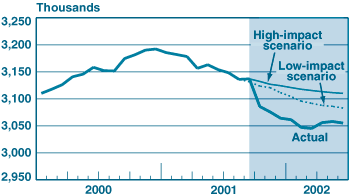

## Table of Contents

## What were the immediate economic impacts on businesses following the September 11 attacks?

The September 11 attacks had a big impact on businesses right away. Many businesses in New York City and around the country had to close because it was hard to get to work and people were scared. The stock market also closed for a few days, which made it hard for businesses to know how much their stocks were worth. A lot of businesses lost money because fewer people were buying things and traveling. The airline industry was hit especially hard because people were afraid to fly.

In the days and weeks after the attacks, businesses started to feel the effects even more. Many companies had to lay off workers because they didn't have enough money coming in. The tourism industry also suffered because fewer people wanted to visit big cities like New York. Overall, the economy slowed down, and it took a while for businesses to recover. The government had to step in with help to try to get the economy moving again.

## How did the attacks affect the stock market and overall financial stability?

The September 11 attacks caused a big shock to the stock market and the overall financial stability. Right after the attacks, the New York Stock Exchange and NASDAQ had to close for four days. This was the longest closure since 1933. When the markets reopened, stock prices dropped a lot. The Dow Jones Industrial Average fell by 7.1% on the first day back, which was the biggest one-day drop since the 1987 crash. This made people very worried about their money and investments.

The attacks also made the economy slow down. Businesses were scared and didn't want to spend money, so they cut back on investments. This led to fewer jobs and less money being spent overall. The government had to step in to help. They lowered interest rates and gave money to businesses to try to keep the economy going. It took a while for things to get back to normal, but slowly, the stock market and the economy started to recover.

## What industries were most severely impacted by the September 11 attacks?

The airline industry was hit the hardest by the September 11 attacks. Right after the attacks, all flights in the U.S. were stopped for several days. When flights started again, fewer people wanted to fly because they were scared. This made airlines lose a lot of money. Many airlines had to lay off workers and cut back on flights. It took a long time for the airline industry to get back to normal.

The tourism industry also suffered a lot. People were afraid to travel, especially to big cities like New York. Hotels, restaurants, and other businesses that depend on tourists lost a lot of money. Many of these businesses had to close or lay off workers. The tourism industry in New York and other places took a long time to recover.

The financial industry was also severely impacted. The attacks happened near the World Trade Center, where many financial companies had offices. Some of these companies lost important documents and data. The stock market had to close for several days, and when it reopened, stock prices dropped a lot. This made people worried about their money and investments. It took time for the financial industry to get back on track.

## How did businesses in New York City specifically cope with the aftermath of the attacks?

Businesses in New York City faced a lot of challenges right after the September 11 attacks. Many businesses near the World Trade Center had to close because the area was damaged and unsafe. Some businesses lost important documents and data, which made it hard for them to keep working. The city was also hard to get around because of road closures and security measures. This made it difficult for workers to get to their jobs, and many businesses had to lay off workers or close temporarily.

To cope with these challenges, businesses in New York City had to be creative. Some businesses moved to new locations to keep working. Others used technology to let their workers work from home. The government and community groups also helped by giving money and support to businesses that were struggling. Over time, businesses started to recover, but it took a lot of hard work and support from the community.

## What were the long-term economic effects on the U.S. economy due to the September 11 attacks?

The September 11 attacks had a big impact on the U.S. economy that lasted for a long time. Right after the attacks, the economy slowed down a lot. Businesses were scared and didn't want to spend money, so they cut back on investments. This led to fewer jobs and less money being spent overall. The government had to step in to help by lowering interest rates and giving money to businesses. It took a while for the economy to start growing again, but slowly, things got better.

Over the years, the attacks changed how the U.S. spent money. The government spent a lot more on security and defense to try to prevent future attacks. This meant less money for other things like schools and roads. The attacks also made people think differently about traveling and working. More people started working from home, and the airline industry had to change how it did business. Overall, the September 11 attacks had a big impact on the U.S. economy that lasted for many years.

## How did the attacks influence global trade and international business relations?

The September 11 attacks changed how countries traded with each other and how businesses worked together around the world. Right after the attacks, many countries were worried about security. They started to check goods more carefully at borders and airports. This made it harder and more expensive to move things from one country to another. Businesses had to wait longer to get their goods, and some had to pay more money for shipping. This slowed down global trade and made it harder for businesses to work together.

Over time, the attacks also changed how countries thought about working together. Many countries started to work more closely with each other to fight against terrorism. This led to new rules and agreements about security and trade. Businesses had to follow these new rules, which sometimes made it harder for them to do business in other countries. But it also helped some businesses grow because they could sell security products and services to other countries. Overall, the September 11 attacks had a big impact on global trade and international business relations that lasted for many years.

## What government policies were enacted to support businesses affected by the September 11 attacks?

After the September 11 attacks, the U.S. government quickly put in place policies to help businesses that were struggling. One big thing they did was to give money to businesses that were hurt by the attacks. They set up special funds to help businesses in New York City and the airline industry. The government also made it easier for businesses to get loans so they could keep working and pay their workers. They did this because they knew businesses needed help to get through the tough times after the attacks.

The government also changed some rules to make it easier for businesses to recover. They lowered interest rates to make it cheaper for businesses to borrow money. They also gave tax breaks to businesses that were affected by the attacks. This meant businesses had to pay less in taxes, which helped them keep more money to stay open and hire workers. Over time, these policies helped many businesses get back on their feet and start growing again.

## How did the insurance industry respond to the economic demands post-September 11?

The insurance industry faced big challenges after the September 11 attacks. Many businesses had insurance to cover damage from things like fires or storms, but they didn't expect something as big as the attacks. This meant insurance companies had to pay out a lot more money than they thought they would. Some insurance companies didn't have enough money to cover all the claims, so they had to ask for help from the government. The government stepped in and created a special program to help insurance companies pay for the damage caused by the attacks.

Over time, the insurance industry changed how it did business. They started to charge more for insurance because they knew they might have to pay out a lot of money if something big happened again. They also started to offer new kinds of insurance that covered things like terrorism. This helped businesses feel safer because they knew they could get help if something bad happened. The insurance industry had to work hard to recover from the September 11 attacks, but slowly, they started to get back on track.

## What changes in business security and operational strategies were implemented after the attacks?

After the September 11 attacks, businesses started to think more about security. They put in new security measures like cameras and guards to keep their workers and buildings safe. Many businesses also made plans for what to do if something bad happened again. They practiced these plans so everyone knew what to do in an emergency. Some businesses even moved their offices to different places to spread out the risk. All these changes helped businesses feel more ready for any future problems.

Businesses also changed how they worked every day. More companies started to let their workers work from home, especially if they could do their jobs using computers. This helped businesses keep going even if something happened that made it hard to get to the office. Some businesses also started to use more technology to keep their important information safe. They backed up their data in different places so they wouldn't lose it if something bad happened. These changes made businesses more flexible and able to keep working no matter what.

## How did the September 11 attacks affect consumer confidence and spending patterns?

The September 11 attacks made people feel very worried and scared. This fear led to a big drop in consumer confidence. People didn't feel safe going out to shops and restaurants, so they spent less money. They also worried about their jobs and the economy, which made them hold onto their money instead of spending it. This drop in spending hurt businesses, especially those that relied on people coming in to buy things.

Over time, as things started to feel more normal, consumer confidence slowly came back. People started to go out more and spend money again, but it took a while. The attacks made people think differently about what was important. Some people started to spend more on things that made them feel safe, like security systems for their homes. Others decided to spend more on experiences with family and friends, realizing that life could change quickly. Overall, the attacks changed how people thought about spending and saving money.

## What were the psychological impacts on business leaders and employees, and how did these affect business operations?

The September 11 attacks had a big impact on the minds of business leaders and employees. Many people felt scared and worried about their safety. This made it hard for them to focus on their work. Business leaders had to deal with their own fears while trying to keep their companies going. They also had to help their employees feel safe and supported. Some leaders found it hard to make decisions because they were so worried about the future.

Employees were also affected a lot. Many people were afraid to go back to work, especially if their office was near the attack sites. Some employees had a hard time trusting that their workplace was safe. This fear made it hard for them to do their jobs well. Businesses had to change how they worked to help their employees feel better. They offered counseling and support to help people deal with their feelings. Over time, as people started to feel safer, businesses were able to get back to normal, but it took a lot of time and effort.

## How have economic theories and models been adapted or developed to better understand and predict the impacts of such catastrophic events on businesses?

After the September 11 attacks, economists started to think more about how to understand and predict the effects of big disasters on businesses. They realized that old economic models didn't always work well for these kinds of events. So, they began to create new models that could handle the sudden and big changes that happen after a disaster. These new models look at things like how businesses might close, how people might stop spending money, and how the government might step in to help. They also try to predict how long it might take for the economy to get back to normal.

These new economic theories and models help us see that disasters can have both short-term and long-term effects on businesses. In the short term, businesses might lose money right away because people are scared and not spending. Over time, businesses might have to change how they work to deal with new risks. The models also show that the government can play a big role in helping businesses recover by giving them money or changing rules. By using these new models, economists can give better advice on how to prepare for and recover from big disasters.

## What was the immediate market reaction to 9/11?

The immediate aftermath of the September 11, 2001, attacks had a profound impact on global financial markets, with the New York Stock Exchange (NYSE) closed from September 11 to September 17. This was the longest closure of U.S. financial markets since the banking crisis of 1933. When trading resumed, the initial market response was characterized by intense volatility and widespread panic selling, which resulted in the market losing an estimated $1.4 trillion in value during the first week of reopening. This significant drop was driven by uncertainty and fear, as investors sold off shares in large volumes.

Globally, markets mirrored this upheaval, experiencing steep declines as investor confidence was shaken. Key indices across Europe and Asia also recorded substantial losses reflecting the interconnectedness of global economies. For instance, London's FTSE 100 fell by 5.7% on the day the NYSE reopened, while markets in Germany and France similarly saw notable declines.

In the currency markets, there was a marked [volatility](/wiki/volatility-trading-strategies), with the U.S. dollar initially weakening due to concerns about the broader economic impact of the attacks. Safe-haven currencies such as the Swiss franc and the Japanese yen were bolstered as investors sought stability amidst the financial uncertainty. 

To quantify the impact of the market reopening, consider the formula for calculating the percentage change in an index's value:

$$
\text{Percentage Change} = \left( \frac{\text{New Value} - \text{Old Value}}{\text{Old Value}} \right) \times 100
$$

If we take an index value that dropped from 10,000 to 9,500 when the markets reopened, the percentage change would be:

$$
\text{Percentage Change} = \left( \frac{9500 - 10000}{10000} \right) \times 100 = -5\%
$$

Thus, the significant drops across various indices illustrate the abrupt shift in market sentiment. Additionally, the increased trading [volume](/wiki/volume-trading-strategy) and sharp price movements highlighted the heightened levels of uncertainty and the scramble among investors to reassess their portfolios in light of the dramatically transformed geopolitical landscape.

Market participants, including institutional investors and hedge funds, were forced to re-evaluate their risk exposure and adjust their trading strategies to account for the new macroeconomic risks. Overall, the immediate market reaction to 9/11 underscored the vulnerabilities of financial systems to geopolitical shocks, prompting a reassessment of risk management and emergency response protocols within trading entities.

## References & Further Reading

[1]: Frey, B. S., & Luechinger, S. (2008). ["Terrorism: Deterrence, Incentives, and Risk Management"](https://www.bsfrey.ch/wp-content/uploads/2021/08/how-to-fight-terrorism-alternatives-to-deterrence.pdf). Review of Law & Economics.

[2]: Goldberg, P. J. P., & Keohane, N. O. (2001). ["Coping with Terrorism: The Week After"](https://www.semanticscholar.org/paper/Power-and-interdependence-Keohane-Nye/76b4023b1534bcd8c579a00a52c82ebbf2a52a34). Brookings Papers on Economic Activity.

[3]: Ito, H., & Lee, D. (2005). ["Assessing the Impact of the September 11 Terrorist Attacks on U.S. Airline Demand"](https://www.sciencedirect.com/science/article/pii/S0148619504000700). Journal of Economics and Business.

[4]: Lopez de Prado, M. (2018). ["Advances in Financial Machine Learning"](https://www.amazon.com/Advances-Financial-Machine-Learning-Marcos/dp/1119482089) by Marcos Lopez de Prado.

[5]: Chan, E. P. (2008). ["Quantitative Trading: How to Build Your Own Algorithmic Trading Business"](https://github.com/ftvision/quant_trading_echan_book). 

[6]: U.S. General Accounting Office (2003). ["Impact of the Terrorist Attacks of September 11, 2001, on Aviation Industry"](https://www.gao.gov/assets/gao-02-882r.pdf).

[7]: OECD (2002). ["The Impact of the 9/11 Terrorist Attacks on the US Economy"](https://www.researchgate.net/publication/228640191_The_impact_of_the_911_terrorist_attacks_on_the_US_economy)21).

[8]: Mills, R., & O'Neill, B. (2003). ["The Implications of 9/11 for the US Financial Services Industry"](https://pubmed.ncbi.nlm.nih.gov/27102489/). Journal of Financial Transformation.