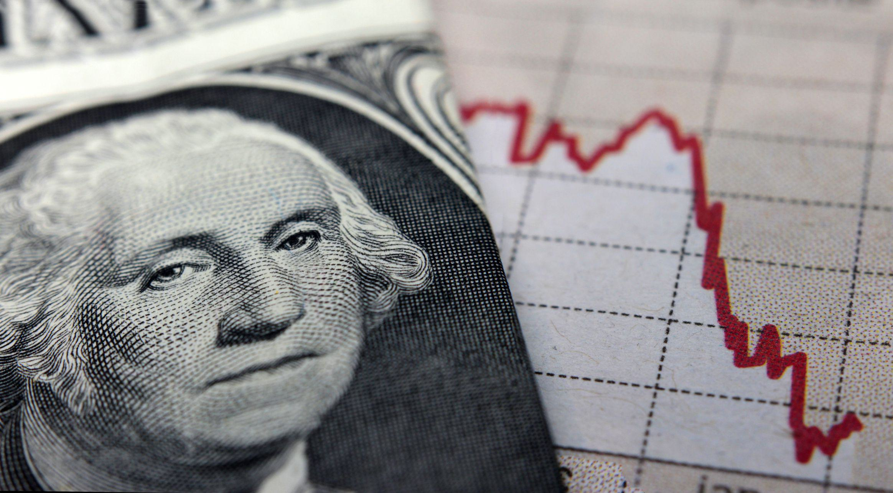

## Table of Contents

## What are the basic economic indicators that show Greece's economic decline?

Greece's economic decline can be seen through several key economic indicators. One of the main indicators is the Gross Domestic Product (GDP), which measures the total value of goods and services produced in a country. Greece's GDP has shrunk significantly since the financial crisis began in 2009. This means that the country is producing less overall, which is a clear sign of economic decline. Another important indicator is the unemployment rate, which has soared in Greece. Many people have lost their jobs, and it's hard for them to find new ones. High unemployment means less money is being spent in the economy, which can make the decline even worse.

Another indicator of Greece's economic troubles is the level of public debt. Greece's debt has grown to be much larger than its GDP, which is a dangerous situation. When a country has too much debt, it can struggle to pay it back, and this can scare away investors. The government has had to cut spending and raise taxes to try to manage the debt, but these actions can slow down the economy even more. Finally, the inflation rate, which measures how quickly prices are rising, has been very low or even negative in Greece. Low inflation or deflation can be a sign that people are not spending much, and businesses are not raising prices because demand is low. All these indicators together show that Greece has been facing serious economic challenges.

## How did the global financial crisis of 2008 impact Greece's economy?

The global financial crisis of 2008 hit Greece hard. Before the crisis, Greece was already borrowing a lot of money to pay for things like pensions and public jobs. When the crisis came, people and banks around the world got scared and stopped lending money. This made it hard for Greece to borrow more money to pay its bills. As a result, Greece's economy started to shrink, and many people lost their jobs. This made it even harder for the country to pay back what it owed.

To try to fix the problem, Greece had to ask for help from other countries in Europe and from the International Monetary Fund. They gave Greece money, but in return, Greece had to make big changes. The government had to cut spending on things like health care and education, and they had to raise taxes. These changes made life harder for many people in Greece. Even though the help stopped Greece from going completely broke, the economy kept struggling for a long time after the crisis.

## What role did government debt play in Greece's economic downturn?

Government debt played a big role in Greece's economic downturn. Before the financial crisis, Greece was borrowing a lot of money to pay for things like pensions and public jobs. This meant that Greece's debt was growing bigger and bigger. When the global financial crisis hit in 2008, it became harder for Greece to borrow more money because other countries and banks were scared about lending. Greece's debt was now much bigger than its economy, which made it very hard for the country to pay back what it owed.

To try to fix the problem, Greece had to get help from other European countries and the International Monetary Fund. They gave Greece money, but in return, Greece had to make big changes. The government had to cut spending on things like health care and education, and they had to raise taxes. These changes made life harder for many people in Greece and slowed down the economy even more. Even though the help stopped Greece from going completely broke, the high debt kept causing problems for a long time.

## How have austerity measures affected the Greek economy and its citizens?

Austerity measures in Greece have had a big impact on the economy and the lives of its citizens. The government had to cut spending on things like health care and education, and they also had to raise taxes. These changes were meant to help Greece pay back its debts, but they made life harder for many people. A lot of people lost their jobs, and it became harder to find new ones. This made it tough for families to make ends meet, and many people had to do without things they needed.

The economy also suffered because of these austerity measures. When people have less money, they spend less, and this can slow down the whole economy. Businesses struggled because fewer people were buying things, and some had to close down. This made the unemployment problem even worse. While the austerity measures were supposed to help fix Greece's debt problem, they ended up causing a lot of pain for the country and its people.

## What were the main causes of the Greek debt crisis?

The Greek debt crisis started because Greece was borrowing a lot of money to pay for things like pensions and public jobs. Before the global financial crisis in 2008, Greece was already in a lot of debt. When the crisis hit, banks and other countries got scared and stopped lending money. This made it hard for Greece to borrow more money to pay its bills. Greece's economy started to shrink, and many people lost their jobs, making it even harder for the country to pay back what it owed.

To try to fix the problem, Greece had to ask for help from other countries in Europe and the International Monetary Fund. They gave Greece money, but in return, Greece had to make big changes. The government had to cut spending on things like health care and education, and they had to raise taxes. These changes made life harder for many people in Greece. Even though the help stopped Greece from going completely broke, the high debt kept causing problems for a long time.

## How has the unemployment rate in Greece changed during its economic decline?

During Greece's economic decline, the unemployment rate went up a lot. Before the global financial crisis in 2008, the unemployment rate in Greece was around 8%. But after the crisis hit, it started to grow quickly. By 2013, the unemployment rate had reached over 27%. This means that more than one in every four people who wanted a job could not find one. Many businesses had to close down because people were not spending as much money, which led to even more job losses.

The high unemployment rate made life very hard for a lot of people in Greece. Families struggled to pay their bills and buy the things they needed. Young people had a particularly tough time finding jobs, with youth unemployment reaching over 50% at its peak. Even though the unemployment rate has come down a bit in recent years, it is still much higher than it was before the crisis. This shows that Greece's economy is still recovering from the big problems it faced.

## What steps has the Greek government taken to address the economic decline?

The Greek government has taken several steps to try to fix the economic problems. One big thing they did was to ask for help from other European countries and the International Monetary Fund. These groups gave Greece money, but in return, Greece had to make big changes. The government had to cut spending on things like health care and education, and they also had to raise taxes. These changes were meant to help Greece pay back its debts and make the economy stronger.

Another step the Greek government took was to try to make it easier for businesses to start and grow. They changed some laws to make it simpler for companies to do business in Greece. The government also worked on making the country more attractive to tourists, because tourism can bring in a lot of money. Even though these steps have helped a bit, Greece's economy is still recovering, and many people are still struggling to find jobs and make ends meet.

## How has the economic decline affected Greece's position within the European Union?

Greece's economic decline has made it harder for the country to be strong in the European Union. Before the financial crisis, Greece was part of the Eurozone, which means it used the euro as its money. But when the crisis hit, Greece needed a lot of help from other countries in the EU. This made some other countries worried about Greece, and it caused tension. Some people in other countries were not happy about giving Greece money, and this made it harder for Greece to work well with the rest of the EU.

Even though Greece got help, the economic problems kept causing trouble. Greece had to follow strict rules set by the EU and the International Monetary Fund to get the money it needed. These rules made life harder for people in Greece, and they also made it harder for the country to make its own decisions. Over time, Greece has been working to fix its economy, but it still has a long way to go to be as strong as it was before the crisis. This affects how other countries in the EU see and work with Greece.

## What are the long-term effects of economic decline on Greece's infrastructure and public services?

The long-term effects of economic decline on Greece's infrastructure and public services have been big. When the economy got worse, the government had less money to spend on things like roads, hospitals, and schools. This meant that the infrastructure started to fall apart. Roads and bridges that were not fixed on time got worse, making it harder for people to get around. Hospitals and clinics had less money, so they could not buy new equipment or hire enough doctors and nurses. This made it harder for people to get the health care they needed.

Public services like education also suffered a lot. Schools had to cut back on teachers and supplies, which made it harder for kids to learn. Some schools even had to close because there was not enough money to keep them open. The economic decline also meant that the government had to raise taxes and cut pensions, which made life harder for many people. Overall, the long-term effects of the economic decline have made it tough for Greece to keep its infrastructure and public services strong and working well for everyone.

## How have international bailouts and financial assistance programs influenced Greece's economy?

International bailouts and financial assistance programs have had a big impact on Greece's economy. When Greece could not pay its debts, it got help from other countries in Europe and the International Monetary Fund. They gave Greece money to keep the country from going completely broke. But in return, Greece had to make big changes. The government had to cut spending on things like health care and education, and they had to raise taxes. These changes made life harder for many people in Greece.

Even though the bailouts helped Greece avoid a total collapse, they also caused problems. The strict rules that came with the money made it hard for Greece to make its own decisions about how to run the country. The economy kept struggling because people had less money to spend, and businesses were closing down. Over time, Greece has been working to fix its economy, but it is still recovering from the big problems it faced. The bailouts were a lifeline, but they also came with a lot of challenges for Greece and its people.

## What are the current economic recovery strategies being implemented in Greece?

Greece is working on several strategies to help its economy get better. One big thing they are doing is trying to make it easier for businesses to start and grow. They changed some laws to make it simpler for companies to do business in Greece. This is important because more businesses can mean more jobs for people. The government is also working on making the country more attractive to tourists. Tourism can bring in a lot of money, which can help the economy grow.

Another thing Greece is doing is trying to fix its big debt problem. They are working on paying back the money they owe to other countries and the International Monetary Fund. To do this, the government has to be careful about how it spends money. They are also trying to bring in more money by making sure people pay their taxes. Even though these steps are helping a bit, Greece's economy is still recovering, and many people are still struggling to find jobs and make ends meet.

## What are the expert opinions on the future economic outlook for Greece?

Experts have different ideas about Greece's future economic outlook. Some think that Greece is slowly getting better. They say that the changes the government made, like making it easier for businesses to start and grow, and working on paying back its debts, are helping. They believe that if Greece keeps working on these things, the economy could keep getting stronger. But they also say that it will take a long time for Greece to be as strong as it was before the crisis.

Other experts are worried that Greece still has big problems. They point out that the unemployment rate is still high, and many people are struggling to make ends meet. They think that Greece needs to do more to help its people and to make sure that the economy keeps growing. Some experts also worry that if something bad happens in the world economy, it could make things harder for Greece again. Overall, while there is hope that Greece can keep getting better, there are also big challenges that the country needs to face.

## References & Further Reading

[1]: Arghyrou, M. G., & Tsoukalas, J. D. (2011). ["The Greek Debt Crisis: Likely Causes, Mechanics and Outcomes."](https://onlinelibrary.wiley.com/doi/abs/10.1111/j.1467-9701.2011.01328.x) The World Economy.

[2]: Lopez de Prado, M. (2018). ["Advances in Financial Machine Learning."](https://www.amazon.com/Advances-Financial-Machine-Learning-Marcos/dp/1119482089) John Wiley & Sons.

[3]: Lane, P. R. (2012). ["The European Sovereign Debt Crisis."](https://www.aeaweb.org/articles?id=10.1257/jep.26.3.49) Journal of Economic Perspectives, 26(3), 49-68.

[4]: Aronson, D. R. (2007). ["Evidence-Based Technical Analysis: Applying the Scientific Method and Statistical Inference to Trading Signals."](https://www.amazon.com/Evidence-Based-Technical-Analysis-Scientific-Statistical/dp/0470008741) John Wiley & Sons.

[5]: Stefan, J. (2020). ["Machine Learning for Algorithmic Trading."](https://github.com/stefan-jansen/machine-learning-for-trading) Packt Publishing.

[6]: Chan, E. P. (2009). ["Quantitative Trading: How to Build Your Own Algorithmic Trading Business."](https://github.com/ftvision/quant_trading_echan_book) John Wiley & Sons.