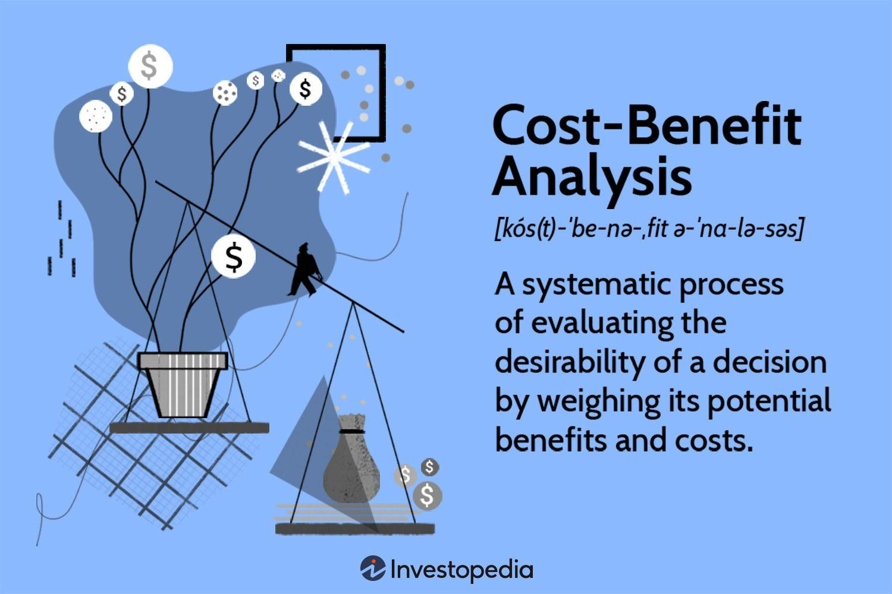

## Table of Contents

## What is an economic deficit?

An economic deficit happens when a country spends more money than it earns. This is like when you spend more money than you have in your wallet. For countries, the money they earn comes from taxes and other sources. When they spend more, they have to borrow money, just like taking a loan from a bank.

Having a deficit is not always bad. Sometimes, governments need to spend more to help the economy grow or to help people during tough times, like during a recession or a natural disaster. But if the deficit is too big for too long, it can cause problems. The country might have to pay a lot of interest on the borrowed money, and it might be harder to borrow more money in the future.

## What are the different types of economic deficits?

There are a few different types of economic deficits that countries can have. One type is called a budget deficit. This happens when the government spends more money than it collects in taxes and other income during a year. It's like when you spend more money than you earn in a month. Governments usually cover this deficit by borrowing money, which adds to the national debt.

Another type is a trade deficit, which happens when a country buys more goods and services from other countries than it sells to them. This is also called a negative balance of trade. It's like if you buy more toys from your friends than you sell to them. A trade deficit can affect the value of a country's currency and its overall economy.

The last type is a current account deficit, which is similar to a trade deficit but includes other things like money sent home by workers living abroad and interest payments on international loans. It's a broader measure of a country's economic transactions with the rest of the world. If a country has a current account deficit, it means it's spending more foreign currency than it's [earning](/wiki/earning-announcement).

## How is a budget deficit different from a trade deficit?

A budget deficit is when a country's government spends more money than it gets from taxes and other income in a year. It's like if you spent more money than you earned in your allowance. When this happens, the government has to borrow money to cover the extra spending, which adds to the country's national debt. Budget deficits are important because they show how the government is managing its money and can affect things like interest rates and economic growth.

A trade deficit, on the other hand, is when a country buys more goods and services from other countries than it sells to them. It's like if you bought more toys from your friends than you sold to them. This can affect the value of the country's money and its economy. A trade deficit means the country is spending more foreign money than it's earning, which can lead to borrowing from other countries or selling assets.

Both types of deficits are important, but they show different things about a country's economy. A budget deficit is about the government's spending and income, while a trade deficit is about the country's buying and selling with the rest of the world.

## What causes economic deficits?

Economic deficits can happen for many reasons. For a budget deficit, it often starts when the government spends more money than it gets from taxes. This can happen if the government wants to help the economy grow by spending on things like roads, schools, and hospitals. Or, it might need to spend more to help people during tough times, like a recession or a natural disaster. Sometimes, the government might not collect enough taxes because people are earning less money or because tax rates are low. When spending is higher than income, the government has to borrow money, which creates a budget deficit.

A trade deficit happens when a country buys more things from other countries than it sells to them. This can happen if people in the country want to buy a lot of foreign goods, like cars or electronics, that are made cheaper or better in other places. It can also happen if the country's own products are not as popular or competitive in the global market. When a country imports more than it exports, it has to use more foreign money than it earns, which leads to a trade deficit. Both types of deficits can affect the economy in different ways, but they often happen because of choices about spending, taxes, and trade.

## What are the short-term effects of economic deficits on an economy?

In the short term, a budget deficit can help an economy grow. When the government spends more money than it earns, it can invest in things like roads, schools, and hospitals. This spending can create jobs and help businesses grow. People might feel more confident about the economy and spend more money themselves. But, if the deficit is too big, it can also cause problems. The government might need to borrow a lot of money, which can lead to higher interest rates. This makes it more expensive for people and businesses to borrow money, which can slow down the economy.

A trade deficit can also have short-term effects on an economy. When a country buys more from other countries than it sells, it means more money is leaving the country than coming in. This can make the country's currency weaker, which can make things from other countries more expensive. But, it can also make the country's own products cheaper for other countries to buy, which might help exports grow in the short term. However, if the trade deficit is too big, it can lead to borrowing from other countries, which can cause problems if it goes on for too long.

## How do economic deficits impact interest rates?

When a government has a budget deficit, it means they are spending more money than they are earning. To cover this extra spending, the government needs to borrow money. When the government borrows a lot, it can make interest rates go up. This happens because there is more competition for money. If lots of people and the government want to borrow money, banks and lenders can charge more interest. Higher interest rates make it more expensive for everyone to borrow money, which can slow down the economy because people and businesses might not want to take out loans.

A trade deficit can also affect interest rates, but in a different way. When a country has a trade deficit, it means they are buying more from other countries than they are selling. This can make their currency weaker, which can lead to higher interest rates. If the currency is weak, people might want to move their money to other countries where the currency is stronger. To keep money in the country, the government might raise interest rates to make it more attractive to keep money there. But, if the trade deficit is too big and lasts too long, it can make it harder for the country to borrow money from other countries, which can also push interest rates up.

## What are the long-term risks associated with persistent economic deficits?

If a country keeps having budget deficits for a long time, it can build up a big national debt. This means the country owes a lot of money to others. Paying back this debt can be hard because the country has to pay interest on the money it borrowed. If the debt gets too big, it might be harder for the country to borrow more money in the future. People might not want to lend money to a country with a lot of debt because they think it might not be able to pay it back. This can slow down the economy because the government might have to cut spending on important things like schools and hospitals, or raise taxes, which can make people feel less happy about the economy.

A long-lasting trade deficit can also cause problems. If a country keeps buying more from other countries than it sells, it will keep losing money. This can make the country's currency weaker over time. A weak currency can make things from other countries more expensive, which can make life harder for people in the country. It can also make it harder for the country to pay for the things it needs to import, like food or oil. If the trade deficit goes on for too long, the country might have to borrow more money from other countries, which can add to the national debt and make the economy even more unstable.

## Can economic deficits ever be beneficial? If so, how?

Yes, economic deficits can sometimes be good for a country. When a government runs a budget deficit, it means they are spending more money than they are getting from taxes. This extra spending can help the economy grow, especially during tough times like a recession. By spending on things like roads, schools, and hospitals, the government can create jobs and help businesses. This can make people feel more confident about the economy and spend more money themselves, which can help the economy recover faster.

Trade deficits can also have some benefits. When a country buys more from other countries than it sells, it means people in the country can enjoy a wider variety of goods and services. This can make life better for people because they have more choices and can buy things that might be cheaper or better quality from other places. Also, a trade deficit can make a country's own products cheaper for other countries to buy, which might help the country's exports grow in the future. So, while deficits can cause problems if they are too big or last too long, they can also help the economy in the short term.

## How do governments typically manage or reduce economic deficits?

Governments usually try to manage or reduce budget deficits by either spending less money or collecting more in taxes. If they spend less, they might cut back on things like building new roads or funding certain programs. This can be hard because people might not like losing these services. On the other hand, if the government decides to raise taxes, it can get more money to help pay for its spending. But, raising taxes can also be unpopular because it means people have to pay more, which might make them unhappy.

For trade deficits, governments can try different things to reduce them. One way is to make it easier for the country's businesses to sell their products to other countries. This can be done by making trade deals with other countries or helping businesses become more competitive. Another way is to make it harder or more expensive for people to buy things from other countries. This can be done by putting taxes on imports, called tariffs, which can make foreign goods more expensive and encourage people to buy things made at home instead. Both approaches have their challenges, but they can help bring the trade deficit down over time.

## What role do economic deficits play in fiscal policy?

Economic deficits are important in fiscal policy because they show how a government is managing its money. Fiscal policy is all about how the government uses taxes and spending to help the economy. When a government has a budget deficit, it means they are spending more money than they are getting from taxes. This can be a part of the government's plan to help the economy grow, especially during tough times like a recession. By spending more, the government can create jobs and help businesses, which can make people feel more confident and spend more money themselves.

Trade deficits also play a role in fiscal policy because they show how much a country is buying and selling with other countries. If a country has a trade deficit, it means they are buying more from other countries than they are selling. This can affect the value of the country's money and its overall economy. Governments might use fiscal policy to try to reduce a trade deficit by making it easier for their own businesses to sell things to other countries or by making it harder for people to buy things from abroad. Both budget and trade deficits are important tools that governments use to manage the economy and make life better for people.

## How do economic deficits affect a country's credit rating?

When a country has a big budget deficit for a long time, it can make people worried about how the country is managing its money. A budget deficit means the government is spending more money than it gets from taxes. If this keeps happening, the country's debt can grow a lot. When the debt gets too big, it might be harder for the country to borrow more money in the future. People who lend money, like banks or other countries, might think the country won't be able to pay it back. This can make them less likely to lend money, and they might charge higher interest rates. Because of this, credit rating agencies might lower the country's credit rating, which shows how safe it is to lend money to that country.

A trade deficit can also affect a country's credit rating, but in a different way. A trade deficit means the country is buying more things from other countries than it is selling. If this goes on for a long time, the country might have to borrow money from other countries to pay for all the things it is buying. This can make the country's debt grow and might make people worried about its ability to pay back the money. If the trade deficit is too big and lasts too long, credit rating agencies might think the country is riskier to lend to. They might lower the country's credit rating, which can make it harder and more expensive for the country to borrow money in the future.

## What are some advanced strategies for analyzing the sustainability of economic deficits?

To figure out if a country's economic deficits are sustainable, experts look at many things. One important thing they look at is the debt-to-GDP ratio. This is a way to see how big the country's debt is compared to how much money it makes from everything it does in a year. If the debt is growing faster than the economy, it might be hard for the country to keep paying it back. Another thing experts look at is the [interest rate](/wiki/interest-rate-trading-strategies) the country has to pay on its debt. If interest rates are high, it can make the debt grow even faster. They also look at how much the country is spending on things like pensions and healthcare, because these costs can keep growing and make the deficit bigger.

Another way to analyze the sustainability of economic deficits is by looking at the primary balance. This is the difference between what the government spends and what it earns, not counting the money it has to pay on its debt. If the primary balance is positive, it means the government is earning more than it is spending on things other than debt payments. This can help to reduce the overall deficit over time. Experts also use models to predict how the economy will grow in the future and how this will affect the deficit. By looking at all these things together, they can get a better idea of whether the country's deficits are something to worry about or if they can be managed over time.

## What is Understanding Economic Deficits?

A deficit occurs when expenditures surpass revenues in a particular fiscal period. This mismatch can manifest in various contexts, affecting governments, corporations, and individuals distinctly.

In governmental settings, deficits arise when a government's expenditures exceed its income, primarily generated through taxation and other revenue streams. Such fiscal deficits often prompt governments to borrow funds, typically through the issuance of government bonds. The chronic occurrence of deficits can result in an accumulation of national debt, which may impose constraints on future fiscal policies and economic stability. An example of measuring a governmental deficit is through the formula:

$$
\text{Fiscal Deficit} = \text{Total Expenditures} - \text{Total Revenue}
$$

For corporations, deficits are most commonly associated with operating losses that occur when operational costs exceed the revenue generated from business activities. Such financial shortfalls can impact a company's profitability and long-term viability, potentially necessitating external financing solutions or restructuring efforts. Corporations often manage deficits by optimizing operations, increasing prices, or innovating product lines to enhance revenue streams.

Individual deficits typically relate to personal finance scenarios where an individual's expenditures surpass their income, leading to a reliance on savings or credit to maintain lifestyle and financial obligations. Persistent personal deficits can lead to increased debt levels, reduced savings, and financial stress. Budget management and financial planning are essential strategies to prevent or mitigate personal financial deficits.

The implications of deficits in these contexts are multifaceted. For governments, prolonged deficits can devalue currency, increase interest rates, and reduce investment in essential services. Corporations facing deficits may struggle with diminished investor confidence and reduced access to capital markets. Individuals with recurring financial deficits risk deteriorating credit scores and limited access to credit facilities.

Understanding the dynamics and causes of economic deficits is crucial for effective fiscal management and economic policymaking across these diverse entities. Decision-makers must balance the immediate benefits of financing deficits against the long-term fiscal health and economic growth objectives, using strategic frameworks to navigate the complexities associated with deficits.

## What are the types of deficits?

Economic deficits can be categorized into several types, each with distinct characteristics and implications for the economy. Primarily, these include budget deficits, trade deficits, and current account deficits. Understanding these deficits helps in analyzing their sources and the repercussions they have on economic stability and policy-making.

### Budget Deficits

A budget deficit occurs when a government's expenditures surpass its revenues within a specific period, typically a fiscal year. This shortfall necessitates borrowing to finance the gap, often leading to increased national debt. Budget deficits are influenced by various factors such as government spending, tax policies, and economic conditions. For instance, during economic downturns, governments might deliberately run budget deficits to stimulate growth through increased spending, even as tax revenues fall.

The formula for a budget deficit can be expressed as:

$$
\text{Budget Deficit} = \text{Total Expenditures} - \text{Total Revenues}
$$

Budget deficits can have several implications. Persistent deficits increase the government's borrowing requirements, potentially leading to higher interest rates as the demand for credit intensifies. Additionally, large deficits might erode investor confidence, affecting a country's credit rating and making future borrowing more expensive.

### Trade Deficits

A trade deficit, or net import balance, occurs when a country's imports of goods and services exceed its exports. This imbalance is a component of the broader current account but has unique implications. A trade deficit indicates that a nation is a net borrower from foreign economies, relying on external sources to finance its consumption and investment needs. 

The formula for a trade deficit is:

$$
\text{Trade Deficit} = \text{Imports} - \text{Exports}
$$

While trade deficits can reflect strong consumer demand, they may also signify structural economic issues such as declining manufacturing competitiveness or excessive dependence on foreign goods. Over time, sustained trade deficits might lead to currency depreciation as the demand for foreign currencies increases to pay for imports.

Both budget and trade deficits have complex implications for economic policy and financial markets. They influence interest rates, exchange rates, and economic growth projections. Countries often implement fiscal policies aimed at reducing high deficits to ensure economic stability. Understanding the nuanced impacts of these deficits is vital for policymakers and economists, particularly when considering their role in shaping fiscal and monetary policies.

## What are the benefits of running a deficit?

Running a deficit, while often perceived negatively, can serve as a potent tool for stimulating economic growth under certain conditions. A deficit occurs when an entity's expenditures exceed its revenues. For governments, this can manifest as budget deficits, where spending on infrastructure, education, or healthcare surpasses the income generated from taxes and other sources. When strategically implemented, deficits can finance essential projects that might otherwise be deferred due to budget constraints. Such investments can catalyze economic development by creating jobs, enhancing productivity, and fostering innovation.

A primary benefit of deficits is their ability to stimulate aggregate demand. Aggregate demand (AD) is the total demand for goods and services within an economy at a given overall price level and in a given period. It is represented as:

$$
AD = C + I + G + (X - M)
$$

Where:
- $C$ is consumer spending
- $I$ is investment by businesses
- $G$ is government spending
- $X$ is exports
- $M$ is imports

Increased government spending (G) through deficit financing can directly boost AD, leading to higher economic output and potentially reducing unemployment. This approach, rooted in Keynesian economic theory, posits that in times of economic downturns, increased government expenditure can compensate for reduced private sector spending, thus stabilizing the economy.

Deficit financing also offers strategic advantages by enabling governments to implement expansive fiscal policies without immediate tax hikes, which might be politically challenging or economically detrimental in times of recession. Low interest rates can make borrowing to finance deficits more attractive, providing funds for long-term investments that yield future economic returns.

In the context of corporate deficits, businesses may choose to operate at a loss temporarily to invest in research and development, penetrate new markets, or expand capacity. Such strategies can result in long-term gains despite short-term financial deficits. Access to capital markets or strategic partnerships often aids these deficit-financing endeavors.

Moreover, deficits can promote growth by invigorating economic strategies that leverage borrowing for productive use rather than merely covering current expenses. This approach requires a careful balancing act, where the economic growth spurred by deficit spending outpaces the costs associated with increased debt levels.

In conclusion, while deficits entail risks such as rising national debt and potential inflationary pressures, they also present opportunities to galvanize economic activity and stimulate long-term growth. The strategic use of deficits can thus be an integral part of economic policy-making, provided it is managed with foresight and discipline.

## References & Further Reading

[1]: ["Understanding Fiscal Deficits" by the International Monetary Fund (IMF)](https://www.imf.org/en/Publications/WEO/Issues/2024/10/22/world-economic-outlook-october-2024)

[2]: ("Algorithmic Trading" by Narang, Rishi K.) [https://www.amazon.com/Algorithmic-Trading-Winning-Strategies-Rationale/dp/1118362415]

[3]: ["The Debt-Deficit Rabbit Hole" by the National Bureau of Economic Research (NBER)](https://www.consumeraffairs.com/finance/us-debt-by-president.html)

[4]: ["Financial Deficits and Economic Stability" by the Organisation for Economic Co-operation and Development (OECD)](https://www.oecd-ilibrary.org/economics/oecd-economic-outlook/volume-2021/issue-1_edfbca02-en)

[5]: ["Principles of Corporate Finance" by Richard A. Brealey, Stewart C. Myers, and Franklin Allen](https://www.mheducation.com/highered/product/principles-corporate-finance-brealey-myers/M9781264080946.html)