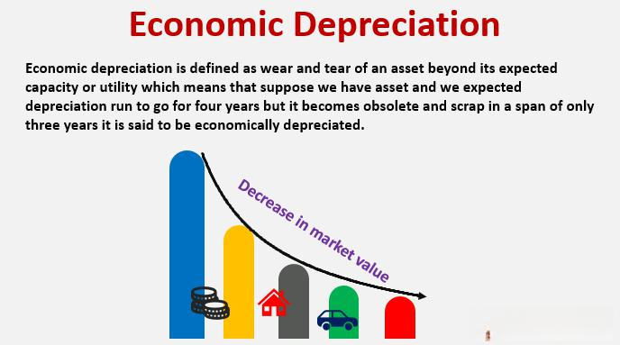

Depreciation plays a crucial role in the field of finance and accounting, representing the loss of value of assets over time. Recognizing the nuances of depreciation is essential not only for accurate financial reporting but also for strategic asset management. Two primary types of depreciation exist: economic and accounting depreciation, each having its unique attributes and implications.

Economic depreciation refers to the decline in an asset's market value, driven by various external economic factors. Such factors may include technological advancements, changes in consumer preferences, or shifts in market conditions. Unlike the more static accounting depreciation, economic depreciation provides a real-time reflection of the market realities impacting asset valuation. This form of depreciation becomes particularly significant in industries experiencing rapid technological change, where assets can quickly become obsolete, affecting their market value.



On the other hand, accounting depreciation involves the systematic allocation of an asset’s cost over its useful life. This method is integral for preparing financial statements, ensuring that an asset's expense is recognized consistently over time. Common methods include the straight-line method, declining balance method, and units of production method. By following these predetermined schedules, accounting depreciation aids businesses in aligning asset cost with revenue generation, facilitating both financial reporting and tax compliance.

In recent years, the integration of these depreciation concepts into algorithmic trading has emerged as a cutting-edge strategy within investment management. Algorithmic trading uses advanced algorithms to automate trading decisions based on predefined criteria, and incorporating depreciation models can enhance these strategies. By understanding how economic and accounting depreciation affect asset values, traders can optimize their decision-making frameworks, leading to improved trading efficiency and asset valuation.

This article will explore the differences between economic and accounting depreciation and their implications for algorithmic trading strategies. By integrating these financial concepts, market participants can better manage risk, optimize costs, and align their asset valuation strategies with current market conditions. The discussion aims to highlight the importance of comprehending depreciation in achieving long-term investment success in evolving financial markets.

## Table of Contents

## What Is Economic Depreciation?

Economic depreciation reflects the decrease in an asset's market value due to factors external to the asset itself. Unlike accounting depreciation, which is a systematic allocation of cost over an asset’s useful life, economic depreciation captures real-time fluctuations in value driven by environmental elements. This is particularly observable in the real estate sector, where property values are susceptible to changes in neighborhood quality or developmental projects nearby. For instance, the construction of a new factory or the development of infrastructure can alter the desirability of a location, thereby affecting real estate values.

Moreover, technological obsolescence is a significant [factor](/wiki/factor-investing) affecting economic depreciation. As technology evolves, older models or technologies may lose value as newer, more efficient alternatives become available. This decline in value is not predetermined but instead results from market dynamics, such as shifting consumer preferences and advancements in technology.

Market demand also plays a critical role in economic depreciation. When demand for a type of asset decreases, its market value can decline accordingly. For example, a drop in demand for coal due to rising environmental concerns and a shift toward renewable energy sources can lead to economic depreciation of coal mining equipment.

Mathematically, the concept of economic depreciation can be illustrated by considering the present value of future cash flows generated by the asset. If external factors reduce the expected future cash flows, the present value, and hence, the market value of the asset decreases. This can be expressed by the formula:

$$
V = \sum \frac{C_t}{(1 + r)^t}
$$

where $V$ is the present value of an asset, $C_t$ are the expected cash flows in period $t$, and $r$ is the discount rate. Economic changes affecting $C_t$ or $r$ will, therefore, impact $V$, representing the essence of economic depreciation.

In practical terms, economic depreciation provides a dynamic measure of asset value, offering investors and businesses a more accurate picture of the current worth of their investments compared to the static nature of accounting depreciation. This real-time valuation is crucial for making informed financial decisions, particularly in volatile markets.

## Understanding Accounting Depreciation

Accounting depreciation is a critical concept in financial reporting and tax accounting, representing the methodical allocation of an asset’s cost over its useful life. This ensures that the expense recognition of the asset correlates with the revenue it helps to generate, adhering to the matching principle in accounting. It provides a structured approach to allocate parts of the cost to each accounting period that benefits from the asset’s use.

### Methods of Accounting Depreciation

There are several common methods used to calculate accounting depreciation, each serving different business needs and asset characteristics:

1. **Straight-Line Method**: This is the simplest and most widely used method. It spreads the cost of the asset evenly across its useful life. The formula for calculating straight-line depreciation is:
$$
   \text{Depreciation Expense} = \frac{\text{Cost of Asset} - \text{Residual Value}}{\text{Useful Life}}

$$

   This method is most applicable when an asset's economic consumption is uniform over time.

2. **Declining Balance Method**: This approach accelerates depreciation in the earlier years of an asset's life. The most common variant is the Double Declining Balance (DDB) method, where the depreciation rate is twice that of the straight-line method. The formula is:
$$
   \text{Depreciation Expense} = \text{Book Value at Beginning of Year} \times \frac{2}{\text{Useful Life}}

$$

   This method reflects assets that lose value rapidly soon after acquisition.

3. **Units of Production Method**: This method allocates costs based on the asset's usage or output rather than time. The formula is:
$$
   \text{Depreciation Expense} = \left(\frac{\text{Cost of Asset} - \text{Residual Value}}{\text{Total Estimated Production}}\right) \times \text{Units Produced in Period}

$$

   It is best suited for machinery or equipment where wear and tear correlate closely with operational output.

### Purpose and Benefits

Accounting depreciation serves multiple purposes. It allows businesses to spread the cost of tangible assets, such as machinery or buildings, over their useful lives, making large expenditures easier to manage in financial statements. Moreover, it standardizes expense recognition, ensuring that costs are matched to the periods generating associated revenues.

Unlike economic depreciation, which can fluctuate with market conditions, accounting depreciation is consistent and predictable. This predictability is vital for financial reporting, enabling businesses to provide stakeholders with reliable performance metrics. It also has significant tax implications. By systematically recording depreciation, companies can reduce taxable income, deferring tax liabilities and potentially benefiting cash flow.

In summary, understanding and effectively applying accounting depreciation methods are essential for accurate financial reporting and strategic tax management. These structured methodologies help ensure that financial statements remain transparent, reliable, and compliant with accounting standards.

## Economic Depreciation vs. Accounting Depreciation

Economic depreciation and accounting depreciation serve different purposes in asset valuation and provide unique insights for financial and strategic decision-making. Economic depreciation reflects changes in an asset's market value, influenced by external factors like market conditions, technological advancements, and shifts in demand. This market-based perspective is particularly valuable during volatile market conditions, offering a real-time understanding of an asset's worth. For example, rapid technological obsolescence in the tech sector can impact asset value significantly, making economic depreciation crucial for assessing current and future asset valuations.

Conversely, accounting depreciation entails a systematic approach to distributing an asset's initial cost throughout its useful life. It relies on predefined schedules and methodologies, such as the straight-line method, declining balance, or units of production. This predictable framework is essential for consistent financial reporting and complies with regulatory standards, ensuring that assets are reflected accurately in financial statements over time. By doing so, accounting depreciation facilitates accurate income measurement and tax calculations.

Businesses often employ both economic and accounting depreciation to navigate asset management complexities and optimize investment strategies. While economic depreciation aids in understanding the fluctuations in asset value, accounting depreciation ensures financial reporting integrity and aids in long-term strategic financial planning. Combining insights from both allows businesses to make informed decisions, whether focusing on short-term market conditions or long-term asset management and compliance objectives.

## Implications for Asset Valuation

Accurate asset valuation necessitates a comprehensive understanding of both economic and accounting depreciation. Economic depreciation reflects the impact of external economic factors on the market value of an asset, providing a real-time assessment that is particularly critical for forward-looking investment decisions. For instance, in sectors that rapidly evolve such as technology, economic depreciation helps investors gauge anticipated returns by accounting for technological advancements that may render existing assets obsolete more quickly.

In contrast, accounting depreciation involves the systematic allocation of an asset's cost over its useful life, utilizing methods such as straight-line, declining balance, and units of production. These approaches ensure alignment between the asset's consumption and revenue generation, facilitating accurate financial reporting and tax calculations. The predictability of accounting depreciation enables firms to maintain consistent records, thereby meeting regulatory standards and aiding in long-term financial planning.

Both types of depreciation impact asset valuation distinctly but complementarily. Economic depreciation offers a dynamic perspective by adjusting for real-time market conditions, whereas accounting depreciation provides stable ground for financial documentation. The integration of these concepts allows for a more nuanced assessment of asset value, essential for making informed decisions in various economic climates.

## Algorithmic Trading and Depreciation

Algorithmic trading, a significant aspect of modern finance, relies heavily on the integration of advanced financial models, including depreciation models, to enhance decision-making processes. Depreciation, whether economic or accounting, plays a critical role in managing risks and optimizing costs within trading strategies.

**Impact of Depreciation on Risk Management and Cost Optimization**

In [algorithmic trading](/wiki/algorithmic-trading), risk management involves anticipating potential losses and devising strategies to mitigate them. Depreciation affects the perceived value and operational efficiency of the assets underlying certain financial instruments. For instance, a technology company's stock might experience economic depreciation due to rapid technological advancements leading to obsolescence. Recognizing this trend enables traders to adjust their risk assessments more accurately.

Cost optimization is another critical area where depreciation can offer significant insights. Accounting depreciation, which involves systematic cost allocation over an asset's useful life, helps trading algorithms forecast asset-related expenses and integrate them into pricing and trading decisions. Integration of these depreciation factors ensures that trading algorithms consider both short-term and long-term asset valuations, thereby enhancing cost-efficiency and profit margins.

**Informed Decision Making Through Depreciation Analysis**

Understanding asset depreciation aids traders in making informed buy or sell decisions. Algorithms can be structured to evaluate the impact of depreciation on asset value projections. For example, incorporating depreciation rates directly into valuation models allows algorithms to adjust their trading stances based on anticipated declines in asset value.

Here's an illustrative Python snippet modeling depreciation's impact on asset valuation:

```python
import numpy as np

# Define initial asset value and depreciation rate
initial_value = 1000
depreciation_rate = 0.1  # 10%

# Calculate value over 10 years
years = np.arange(1, 11)
depreciated_values = initial_value * (1 - depreciation_rate) ** years

print("Depreciated Asset Values over 10 Years:", depreciated_values)
```

This code snippet calculates the depreciated value of an asset over ten years using a simple geometric depreciation method, illustrating how algorithms can incorporate asset decline into trading predictions.

**Modeling Deprecation Effects in Algorithm Design**

Advanced algorithms model depreciation effects by integrating them into market movement predictions. For instance, a trading model can incorporate real-time data analytics to adjust for economic depreciation caused by market conditions such as changes in demand or technological shifts. By simulating various depreciation scenarios, algorithms can forecast market trends with improved accuracy, allowing traders to capitalize on emerging opportunities and avoid potential pitfalls.

Incorporating depreciation into algorithmic trading strategies enhances the ability to navigate the complexities of the financial markets. As market variables continuously evolve, leveraging depreciation models becomes essential in maximizing trading efficiency, ensuring that asset valuations accurately reflect prevalent economic conditions. This integration enables traders to remain competitive and achieve sustainable investment results.

## Case Studies in Algorithmic Trading

## Case Studies in Algorithmic Trading

### Case Study 1: Impact of Economic Depreciation on Technology Stocks Due to Rapid Tech Advancements

Economic depreciation significantly influences technology stocks, primarily driven by rapid technological advancements. As new technologies emerge, older technology becomes obsolete more quickly, decreasing the market value of these assets. This situation was evident during several technological shifts, such as the transition from 4G to 5G networks and the continuous development of semiconductor technology.

For instance, consider a technology firm that heavily invests in a specific type of semiconductor used in manufacturing high-demand consumer electronics. With the advent of a more efficient semiconductor, the older technology becomes less desirable, thereby reducing its market value. This decline can be modeled using economic depreciation, which helps in forecasting the effect on stock value.

In algorithmic trading, understanding these depreciation effects is crucial. An algorithm can be designed to analyze economic and technological data to predict such shifts. Here's a simplified example using Python to model economic depreciation for tech stock valuation:

```python
import numpy as np

# Parameters
initial_value = 100000  # Initial value of the technology asset
depreciation_rate = 0.10  # Assumed annual economic depreciation rate

# Time period (in years)
years = np.arange(0, 10, 1)

# Calculate the asset value over time
asset_values = initial_value * (1 - depreciation_rate) ** years

print("Asset Values over Time:", asset_values)
```

This code snippet models an asset's declining value over ten years due to economic depreciation, helping traders adjust their strategies.

### Case Study 2: Evaluating Manufacturing Equipment for Depreciation Effects to Guide Trading Decisions

In manufacturing, equipment faces depreciation that affects its valuation and trading decisions. For example, consider a manufacturing firm that uses specialized machinery to produce automotive components. As new manufacturing technologies emerge, older equipment might no longer meet efficiency standards, leading to economic depreciation.

Accurate modeling of these depreciation effects is vital for traders. By understanding when the value of manufacturing equipment is likely to decrease, traders can make informed decisions on buying or selling relevant stocks. The declining value can be predicted using accounting depreciation methods such as the declining balance method, which may align closely with economic depreciation in this scenario.

Applying these models helps ensure the trading strategy considers asset obsolescence. Algorithmic trading systems can incorporate these models to optimize timing for entering or exiting trades related to manufacturing sector stocks.

These case studies underscore the importance of accurately modeling depreciation within trading algorithms. By incorporating both economic and accounting depreciation insights, traders can enhance their decision-making processes, optimizing investment timing and strategy in volatile markets.

## Tools and Techniques for Modeling Depreciation

Python, MATLAB, and R are essential tools for modeling depreciation in algorithmic trading, offering a range of functionalities for developing custom models and improving financial insights.

Python is a versatile programming language that is particularly useful due to its extensive libraries and resources. NumPy and Pandas are key libraries that facilitate data manipulation and numerical computations, making it easier to handle large datasets typically involved in financial analysis. NumPy offers support for arrays and mathematical functions, allowing for efficient computation of depreciation schedules using formulas such as:

$$
\text{Depreciation} = \frac{\text{Cost} - \text{Salvage Value}}{\text{Useful Life}}
$$

Pandas enhances data analysis by allowing for easy manipulation and analysis of structured data, which is critical for ensuring accurate representation of depreciation models in trading strategies. Python's flexibility also allows traders to rapidly test and implement depreciation models using historical data, leveraging [machine learning](/wiki/machine-learning) algorithms to optimize predictions about asset depreciation.

MATLAB, known for its powerful computational capabilities, is favored for complex financial modeling and analysis, especially when dealing with algorithmic trading strategies that require precision and robustness. MATLAB's Financial Toolbox provides built-in functions for time series analysis, economic forecasting, and asset allocation, which can be particularly useful when assessing depreciation impacts on asset valuation. For example, MATLAB's support for linear regression and optimization can be used to fine-tune depreciation models that account for fluctuating market conditions.

R is another robust tool widely used in statistical computing and data analysis. It excels in handling statistical tests and visualization, which can be useful when modeling the effects of depreciation on asset values. R's extensive package ecosystem, such as 'forecast' for time series analysis and 'ggplot2' for data visualization, allows users to model and visualize depreciation trends effectively. By creating custom models to simulate different depreciation scenarios, traders can evaluate their potential impact on asset pricing and strategy profitability.

Efficient use of these tools not only supports the creation of sophisticated depreciation models but also enhances overall trading performance by providing deeper financial insights. Through continuous modeling and refinement using Python, MATLAB, and R, algorithmic traders can better anticipate market movements, optimize their strategies, and achieve more accurate asset valuations.

## Conclusion

Integrating both economic and accounting depreciation into financial analysis can significantly enhance algorithmic trading strategies. These two facets of depreciation offer a comprehensive understanding of asset valuation, aligning it more closely with market realities. Economic depreciation provides insights into real-time value shifts driven by external economic factors, while accounting depreciation offers a structured approach to expense allocation over an asset's useful life. Together, they enable traders to analyze assets from both a market perspective and a systematic accounting framework.

For algorithmic trading, encompassing these depreciation concepts is crucial for effective risk management and cost efficiency. Understanding economic depreciation helps foresee potential shifts in asset value, driven by market [volatility](/wiki/volatility-trading-strategies) and external factors, allowing for more informed buy or sell decisions. Accounting depreciation, by contrast, ensures that trading algorithms maintain consistency in financial reporting, necessary for compliance and strategic planning.

As financial markets continue to evolve rapidly, staying informed and proficient in these depreciation concepts is vital for long-term investment success. Algorithmic traders can utilize advanced tools and technologies to model these depreciation effects, enhancing their predictions of market behaviors and ultimately optimizing their trading models. By doing so, they not only improve the accuracy of asset valuation but also bolster their strategies against market uncertainties. This holistic approach to financial analysis is integral to achieving sustained growth and a competitive edge in the fast-paced world of trading.

## References & Further Reading

[1]: ["Advances in Financial Machine Learning"](https://www.amazon.com/Advances-Financial-Machine-Learning-Marcos/dp/1119482089) by Marcos Lopez de Prado

[2]: ["Machine Learning for Algorithmic Trading"](https://github.com/stefan-jansen/machine-learning-for-trading) by Stefan Jansen

[3]: ["Quantitative Trading: How to Build Your Own Algorithmic Trading Business"](https://www.amazon.com/Quantitative-Trading-Build-Algorithmic-Business/dp/1119800064) by Ernest P. Chan

[4]: ["Asset Valuation"](https://corporatefinanceinstitute.com/resources/valuation/asset-valuation/) in "Valuation Handbook - U.S. Guide to Cost of Capital" edited by Roger J. Grabowski, James P. Harrington, and Carla Nunes

[5]: Smith, S. (2014). ["Accounting for Depreciation: An Examination of Recent Applications."](https://accountinginsights.org/depreciation-methods-and-their-financial-impact/) Journal of Financial Reporting, 34(2).