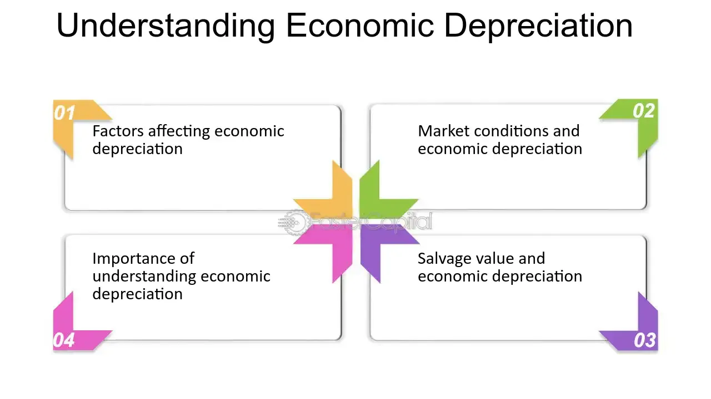

## Table of Contents

## What is economic depreciation?

Economic depreciation is the decrease in the value of an asset over time due to factors like wear and tear, obsolescence, or changes in market conditions. It's different from accounting depreciation, which is a method used to allocate the cost of an asset over its useful life for financial reporting purposes. Economic depreciation focuses on the actual market value of the asset, which can be influenced by external factors beyond just the asset's physical condition.

For example, a company might buy a piece of machinery for $100,000. Over time, as the machinery gets older and less efficient, its market value might drop to $60,000, even if the company has only accounted for $20,000 in depreciation on their books. This difference reflects economic depreciation, showing how the asset's value has declined in the real world, not just on paper. Understanding economic depreciation helps businesses make better decisions about when to replace or upgrade their assets to maintain efficiency and competitiveness.

## What is accounting depreciation?

Accounting depreciation is a way businesses spread out the cost of an asset over the time they use it. When a company buys something big, like a machine or a building, they don't count the whole cost right away. Instead, they divide the cost over several years. This helps show a more accurate picture of how much the asset is really costing the business each year.

There are different ways to figure out accounting depreciation, like the straight-line method or the declining balance method. The straight-line method means you divide the cost evenly over the asset's useful life. The declining balance method lets you take bigger deductions in the early years when the asset is newer. No matter which method is used, the goal is to match the expense of the asset with the income it helps generate, following rules set by accounting standards.

## How do economic depreciation and accounting depreciation differ?

Economic depreciation and accounting depreciation are two ways to look at how an asset loses value, but they do it differently. Economic depreciation is about the real-world value of an asset. It goes down because of things like wear and tear, new technology making the asset outdated, or changes in what people want in the market. For example, if you buy a car, its value might drop faster than you think because new models come out or because people start wanting electric cars instead of gas ones.

Accounting depreciation, on the other hand, is a way businesses keep track of an asset's cost over time on their financial statements. It's more about following rules and spreading out the cost of the asset evenly over its useful life. For instance, if a company buys a machine for $10,000 and expects to use it for 10 years, they might count $1,000 as an expense each year. This helps match the cost of the machine with the money it helps make, but it doesn't always show the real market value of the asset.

So, while economic depreciation focuses on what the asset is actually worth in the market, accounting depreciation is more about keeping the [books](/wiki/algo-trading-books) straight and following accounting rules. Both are important, but they give different information that businesses use for different purposes.

## Why is it important to understand both types of depreciation?

Understanding both types of depreciation is crucial for businesses because they help in making smart decisions. Economic depreciation tells you what an asset is really worth in the market. This can help you decide when it's time to sell or replace an asset. For example, if your machine's market value drops a lot, it might be better to buy a new one that's more efficient or in demand. Knowing this can help your business stay competitive and save money in the long run.

Accounting depreciation, on the other hand, helps you keep your financial records straight. It spreads out the cost of an asset over time, which makes your financial statements look more accurate. This is important for paying the right amount of taxes and showing investors how your business is doing. By understanding accounting depreciation, you can plan your finances better and make sure you're following the rules. Both types of depreciation give you different but important information that helps run your business smoothly.

## Can you explain the concept of useful life in relation to both types of depreciation?

The useful life of an asset is how long it's expected to be useful for a business. In accounting depreciation, the useful life is really important because it's used to figure out how to spread out the cost of the asset over time. For example, if a company buys a computer that they think will last for 5 years, they'll divide the cost of the computer by 5 and count that amount as an expense each year. This helps match the cost of the computer with the money it helps make over those 5 years.

In economic depreciation, the useful life also matters, but it's more about how long the asset keeps its value in the market. If a piece of equipment starts losing value faster because new technology comes out, its useful life might be shorter than expected. This can affect when a business decides to sell or replace the asset. Understanding the useful life in economic terms helps businesses know when it's time to make a change to stay competitive and keep their costs down.

## How does economic depreciation affect the market value of an asset?

Economic depreciation is all about how much an asset loses value in the real world. It happens because of things like the asset getting old and worn out, new technology coming out that makes the old stuff less useful, or changes in what people want to buy. For example, if you have a truck, its value might go down faster if electric trucks become popular because people might not want gas trucks anymore. This means the truck is worth less in the market, even if it still works fine.

Knowing about economic depreciation helps businesses decide when to sell or replace their assets. If an asset's value is dropping fast, it might be a good idea to sell it before it loses even more value. This can help the business save money and stay competitive. For instance, if a company sees that their old machines are worth much less now because of new, better machines on the market, they might decide to buy new ones to keep up with the competition.

## What methods are commonly used to calculate accounting depreciation?

There are a few common ways to figure out accounting depreciation. The straight-line method is the simplest. You take the cost of the asset, subtract any value you think it will have at the end of its life (called salvage value), and then divide that by how many years you expect to use it. For example, if a machine costs $10,000 and you think it will be worth $2,000 at the end of 4 years, you'd count $2,000 as an expense each year (($10,000 - $2,000) / 4 = $2,000).

Another method is the declining balance method. This one lets you take bigger deductions in the early years when the asset is newer. You start with the asset's full cost and multiply it by a fixed rate, like 20% or 30%. Each year, you use the new, lower value to figure out the next year's depreciation. This means the amount you can count as an expense goes down over time. It's useful if you want to show more costs early on when the asset is more valuable.

There's also the units of production method, which ties depreciation to how much you use the asset. You figure out how many units the asset can produce over its life and then count a portion of the cost as an expense for each unit it makes. If a machine can make 100,000 units and costs $50,000, you'd count $0.50 as an expense for each unit produced ($50,000 / 100,000 = $0.50 per unit). This method is good for assets whose value depends more on how much they're used than just how old they are.

## How might economic depreciation be estimated in practice?

To estimate economic depreciation in practice, businesses often look at how much similar assets are selling for in the market. They might check prices of used equipment or vehicles to see how much value they've lost over time. This can give them a good idea of how much their own assets might be worth now. They also consider things like how much the asset has been used, if it's still in good shape, and if there are newer models that make it less valuable. For example, if a company's truck has driven a lot of miles and there are new, more efficient models out, it might be worth less than a similar truck that's been driven less and is still seen as modern.

Another way to estimate economic depreciation is to use industry reports and data. These reports can tell businesses how fast certain types of assets usually lose value. Companies might also talk to experts or use special software that can predict how much an asset's value will go down based on past data and current market trends. By putting all this information together, a business can get a pretty good estimate of how much their assets have depreciated in the real world. This helps them decide when it's time to sell, replace, or keep using their assets.

## What are the tax implications of accounting depreciation?

Accounting depreciation can affect how much tax a business has to pay. When a company uses accounting depreciation, it spreads out the cost of an asset over time. This means they can count part of the cost as an expense each year. By doing this, they lower their taxable income for that year. If a company's taxable income goes down, they pay less in taxes. So, choosing the right method of depreciation can help a business save money on taxes.

Different methods of accounting depreciation can have different tax effects. For example, the declining balance method lets a business take bigger deductions in the early years. This can be good if they want to pay less tax right away. On the other hand, the straight-line method spreads the cost evenly over time, which might be better if they want a steady tax benefit each year. Businesses need to think about their tax situation and future plans when [picking](/wiki/asset-class-picking) a depreciation method. It's a way to manage their tax bill and keep more money in their pockets.

## How do changes in technology or market conditions impact economic depreciation?

Changes in technology can make an asset lose value faster. When new and better technology comes out, older stuff can seem outdated. For example, if a new type of computer comes out that is much faster and cheaper, the old computers won't be as valuable anymore. People and businesses will want the new technology, so the old ones will be worth less in the market. This is why companies need to keep an eye on what's new in technology to know when their assets might start losing value quickly.

Market conditions also play a big role in economic depreciation. If what people want to buy changes, it can affect how much an asset is worth. For instance, if there's a big shift towards electric cars, gas cars might not be as popular anymore. This means their value will go down because fewer people want to buy them. Businesses need to watch market trends to see if their assets are still in demand or if they should think about selling or replacing them before they lose too much value.

## Can you discuss the role of residual value in both economic and accounting depreciation?

Residual value, also known as salvage value, is what an asset is worth at the end of its useful life. In accounting depreciation, this value is really important because it helps figure out how much to count as an expense each year. When you use the straight-line method, you take the cost of the asset, subtract the residual value, and then divide by the number of years you'll use it. This way, you spread out the cost over time but stop counting depreciation once the asset reaches its residual value. Knowing the residual value helps businesses plan their finances better and make sure they're not counting too much as an expense.

In economic depreciation, the residual value is also key but it's more about what the asset is actually worth in the market at the end of its life. If the market changes or new technology comes out, the residual value can be different from what was expected. For example, if a company thought a machine would be worth $5,000 at the end of its life but new machines make it less valuable, its real residual value might be much lower. Understanding this helps businesses decide when to sell or replace assets to get the best value and stay competitive.

## How do international accounting standards treat economic and accounting depreciation differently?

International accounting standards, like those set by the International Accounting Standards Board (IASB), mainly focus on accounting depreciation. They have rules for how businesses should spread out the cost of their assets over time. For example, they might use the straight-line method or the declining balance method to make sure the financial statements show the right expenses each year. These standards help keep things consistent across different countries so everyone can understand a company's financial health. But these rules are mostly about keeping the books straight and don't directly deal with how much an asset is really worth in the market.

Economic depreciation, on the other hand, is about the real-world value of an asset and isn't covered by international accounting standards in the same way. These standards don't tell businesses how to figure out how much their assets are losing value in the market. Instead, companies need to look at things like market trends, how much the asset has been used, and changes in technology to estimate economic depreciation. This information can help them make smart decisions about when to sell or replace assets, but it's not something that shows up directly in their financial statements under international accounting rules.

## What is economic depreciation?

Economic depreciation reflects the decrease in an asset's market value due to factors external to the asset itself. Unlike accounting depreciation, which is a systematic allocation of cost over an asset’s useful life, economic depreciation captures real-time fluctuations in value driven by environmental elements. This is particularly observable in the real estate sector, where property values are susceptible to changes in neighborhood quality or developmental projects nearby. For instance, the construction of a new factory or the development of infrastructure can alter the desirability of a location, thereby affecting real estate values.

Moreover, technological obsolescence is a significant [factor](/wiki/factor-investing) affecting economic depreciation. As technology evolves, older models or technologies may lose value as newer, more efficient alternatives become available. This decline in value is not predetermined but instead results from market dynamics, such as shifting consumer preferences and advancements in technology.

Market demand also plays a critical role in economic depreciation. When demand for a type of asset decreases, its market value can decline accordingly. For example, a drop in demand for coal due to rising environmental concerns and a shift toward renewable energy sources can lead to economic depreciation of coal mining equipment.

Mathematically, the concept of economic depreciation can be illustrated by considering the present value of future cash flows generated by the asset. If external factors reduce the expected future cash flows, the present value, and hence, the market value of the asset decreases. This can be expressed by the formula:

$$
V = \sum \frac{C_t}{(1 + r)^t}
$$

where $V$ is the present value of an asset, $C_t$ are the expected cash flows in period $t$, and $r$ is the discount rate. Economic changes affecting $C_t$ or $r$ will, therefore, impact $V$, representing the essence of economic depreciation.

In practical terms, economic depreciation provides a dynamic measure of asset value, offering investors and businesses a more accurate picture of the current worth of their investments compared to the static nature of accounting depreciation. This real-time valuation is crucial for making informed financial decisions, particularly in volatile markets.

## What is Understanding Accounting Depreciation?

Accounting depreciation is a critical concept in financial reporting and tax accounting, representing the methodical allocation of an asset’s cost over its useful life. This ensures that the expense recognition of the asset correlates with the revenue it helps to generate, adhering to the matching principle in accounting. It provides a structured approach to allocate parts of the cost to each accounting period that benefits from the asset’s use.

### Methods of Accounting Depreciation

There are several common methods used to calculate accounting depreciation, each serving different business needs and asset characteristics:

1. **Straight-Line Method**: This is the simplest and most widely used method. It spreads the cost of the asset evenly across its useful life. The formula for calculating straight-line depreciation is:
$$
   \text{Depreciation Expense} = \frac{\text{Cost of Asset} - \text{Residual Value}}{\text{Useful Life}}

$$

   This method is most applicable when an asset's economic consumption is uniform over time.

2. **Declining Balance Method**: This approach accelerates depreciation in the earlier years of an asset's life. The most common variant is the Double Declining Balance (DDB) method, where the depreciation rate is twice that of the straight-line method. The formula is:
$$
   \text{Depreciation Expense} = \text{Book Value at Beginning of Year} \times \frac{2}{\text{Useful Life}}

$$

   This method reflects assets that lose value rapidly soon after acquisition.

3. **Units of Production Method**: This method allocates costs based on the asset's usage or output rather than time. The formula is:
$$
   \text{Depreciation Expense} = \left(\frac{\text{Cost of Asset} - \text{Residual Value}}{\text{Total Estimated Production}}\right) \times \text{Units Produced in Period}

$$

   It is best suited for machinery or equipment where wear and tear correlate closely with operational output.

### Purpose and Benefits

Accounting depreciation serves multiple purposes. It allows businesses to spread the cost of tangible assets, such as machinery or buildings, over their useful lives, making large expenditures easier to manage in financial statements. Moreover, it standardizes expense recognition, ensuring that costs are matched to the periods generating associated revenues.

Unlike economic depreciation, which can fluctuate with market conditions, accounting depreciation is consistent and predictable. This predictability is vital for financial reporting, enabling businesses to provide stakeholders with reliable performance metrics. It also has significant tax implications. By systematically recording depreciation, companies can reduce taxable income, deferring tax liabilities and potentially benefiting cash flow.

In summary, understanding and effectively applying accounting depreciation methods are essential for accurate financial reporting and strategic tax management. These structured methodologies help ensure that financial statements remain transparent, reliable, and compliant with accounting standards.

## What are the tools and techniques for modeling depreciation?

Python, MATLAB, and R are essential tools for modeling depreciation in [algorithmic trading](/wiki/algorithmic-trading), offering a range of functionalities for developing custom models and improving financial insights.

Python is a versatile programming language that is particularly useful due to its extensive libraries and resources. NumPy and Pandas are key libraries that facilitate data manipulation and numerical computations, making it easier to handle large datasets typically involved in financial analysis. NumPy offers support for arrays and mathematical functions, allowing for efficient computation of depreciation schedules using formulas such as:

$$
\text{Depreciation} = \frac{\text{Cost} - \text{Salvage Value}}{\text{Useful Life}}
$$

Pandas enhances data analysis by allowing for easy manipulation and analysis of structured data, which is critical for ensuring accurate representation of depreciation models in trading strategies. Python's flexibility also allows traders to rapidly test and implement depreciation models using historical data, leveraging [machine learning](/wiki/machine-learning) algorithms to optimize predictions about asset depreciation.

MATLAB, known for its powerful computational capabilities, is favored for complex financial modeling and analysis, especially when dealing with algorithmic trading strategies that require precision and robustness. MATLAB's Financial Toolbox provides built-in functions for time series analysis, economic forecasting, and asset allocation, which can be particularly useful when assessing depreciation impacts on asset valuation. For example, MATLAB's support for linear regression and optimization can be used to fine-tune depreciation models that account for fluctuating market conditions.

R is another robust tool widely used in statistical computing and data analysis. It excels in handling statistical tests and visualization, which can be useful when modeling the effects of depreciation on asset values. R's extensive package ecosystem, such as 'forecast' for time series analysis and 'ggplot2' for data visualization, allows users to model and visualize depreciation trends effectively. By creating custom models to simulate different depreciation scenarios, traders can evaluate their potential impact on asset pricing and strategy profitability.

Efficient use of these tools not only supports the creation of sophisticated depreciation models but also enhances overall trading performance by providing deeper financial insights. Through continuous modeling and refinement using Python, MATLAB, and R, algorithmic traders can better anticipate market movements, optimize their strategies, and achieve more accurate asset valuations.

## References & Further Reading

[1]: ["Advances in Financial Machine Learning"](https://www.amazon.com/Advances-Financial-Machine-Learning-Marcos/dp/1119482089) by Marcos Lopez de Prado

[2]: ["Machine Learning for Algorithmic Trading"](https://github.com/stefan-jansen/machine-learning-for-trading) by Stefan Jansen

[3]: ["Quantitative Trading: How to Build Your Own Algorithmic Trading Business"](https://www.amazon.com/Quantitative-Trading-Build-Algorithmic-Business/dp/1119800064) by Ernest P. Chan

[4]: ["Asset Valuation"](https://corporatefinanceinstitute.com/resources/valuation/asset-valuation/) in "Valuation Handbook - U.S. Guide to Cost of Capital" edited by Roger J. Grabowski, James P. Harrington, and Carla Nunes

[5]: Smith, S. (2014). ["Accounting for Depreciation: An Examination of Recent Applications."](https://accountinginsights.org/depreciation-methods-and-their-financial-impact/) Journal of Financial Reporting, 34(2).