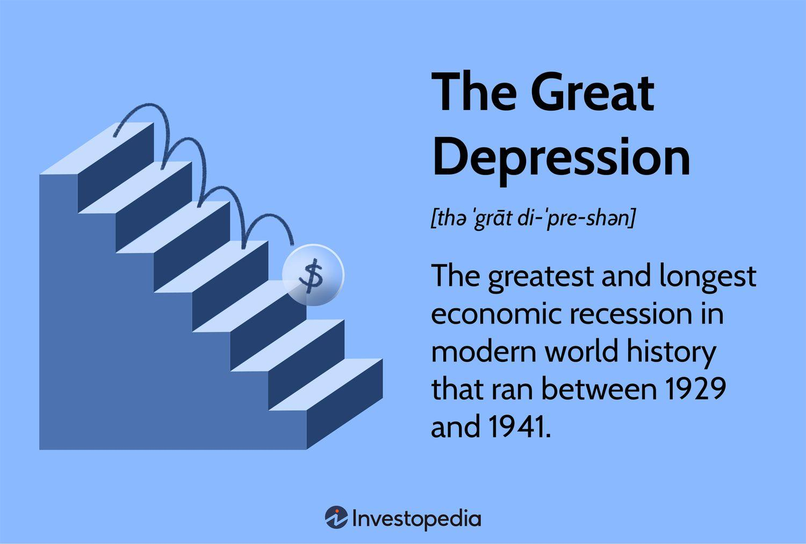

The global economy functions through cycles of expansion and contraction, commonly referred to as business cycles. These cycles are characterized by alternating phases of economic growth, where indicators such as GDP, employment, and consumer spending rise, and economic contraction or downturns, where these indicators fall. Understanding these cycles is crucial for investors, businesses, and policymakers, as they influence economic strategies and policy-making processes.

This article explores the concepts of recession, economic downturn, and economic depression, highlighting their distinct characteristics and impacts on the global economy. A recession is generally recognized as a significant decline in economic activity across the economy, lasting more than a few months and can be identified by reductions in GDP, income, employment, industrial production, and sales. Conversely, an economic depression is a more severe and prolonged downturn, often accompanied by a substantial decline in economic output and elevated unemployment.



A significant aspect of this exploration involves examining how algorithmic trading, commonly known as algo trading, interacts with these various economic phases. Algo trading utilizes complex algorithms to automate trading decisions, enabling financial markets to respond swiftly to changing conditions. During periods of economic stress, the role of algo trading becomes particularly pronounced, as these algorithms can either stabilize or exacerbate market volatility depending on their design and the conditions under which they operate.

Historical instances, such as the Great Depression and the Great Recession, provide context for understanding these economic patterns and the ramifications of financial instability. Additionally, the article investigates the causes behind these economic cycles and downturns, incorporating factors such as financial crises, high inflation, and unexpected global events.

By scrutinizing the interplay between economic cycles and algorithmic trading, this article aims to offer insights into the complexities of modern financial markets and the potential avenues for mitigating future economic crises. This understanding is vital for developing robust financial strategies and policies that can better withstand the inevitable fluctuations of the global economy.

## Table of Contents

## Understanding Recessions and Depressions

A recession is identified by a notable decline in economic activity, persisting for more than a few months. This decline is typically visible across critical economic indicators such as Gross Domestic Product (GDP), income, employment, industrial production, and sales. The National Bureau of Economic Research (NBER) is widely recognized for officially declaring recessions in the United States, and it looks for a broad spectrum of economic data to make such determinations.

In contrast, a depression signifies a much more severe economic downturn. It is characterized by an extended period of economic decline, accompanied by a significant drop in economic output and very high rates of unemployment. The distinction between a recession and a depression is partly a matter of the duration and depth of the economic decline. While recessions are relatively common in the economic cycle and often last between six months to a year, depressions are rare and can last for several years.

Historically, the Great Depression of the 1930s stands out as the most severe economic depression in modern history. Originating in the United States following the stock market crash of 1929, its impact was felt globally and led to widespread economic hardship that persisted for over a decade. Unemployment soared, production plummeted, and deflation became rampant, fundamentally challenging economic policies and theories of the time. The lessons learned from the Great Depression have influenced economic policy-making and the management of economic downturns to this day.

## Economic Downturns: Causes and Indicators

Economic downturns are periods characterized by a decline in economic activity, evident across multiple sectors within an economy. These downturns can be precipitated by a variety of factors, ranging from financial crises to geopolitical events. Financial crises, such as the 2008 collapse, typically involve the drastic devaluation of assets and a freezing up of [liquidity](/wiki/liquidity-risk-premium) in financial markets, leading to economic contraction. High inflation also poses a significant risk, eroding purchasing power and straining economic growth. Furthermore, major disruptions like wars and pandemics can halt production, disrupt supply chains, and lead to widespread economic instability. A loss of consumer confidence often compounds these issues, as decreased consumer spending can further decelerate economic progress.

Assessing economic downturns involves analyzing several key indicators that signal declining economic health. Gross Domestic Product (GDP) is foremost among these indicators; a sustained drop in GDP is one of the clearest signs of an economic downturn. Rising unemployment rates offer another critical measure, as layoffs and job losses often accompany declines in business revenue and production. Consumer spending, a vital driver of economic activity, typically contracts during downturns as individuals and households cut back on expenditure amid uncertainty. Lastly, indices measuring consumer sentiment, such as the Consumer Confidence Index (CCI), provide insight into the public’s economic outlook; negative sentiment often signals potential reduced spending and investment.

Monitoring these indicators is essential for economists and policymakers, as it allows for the anticipation of future downturns and the formulation of strategic responses to mitigate adverse effects. By keeping a close eye on economic data and trends, governments and financial institutions can implement measures, such as monetary policy adjustments and fiscal stimulus, to stabilize the economy and cushion the impact on affected populations.

## The Role of Algorithmic Trading During Economic Downturns

Algorithmic trading, commonly known as algo trading, employs sophisticated algorithms to automate buying and selling in financial markets, making decisions based on a set of predefined rules and real-time market data. This technology-driven method of executing trades has significantly altered the landscape of financial markets, enabling faster and often more efficient trading processes. However, during economic downturns, the role of algo trading becomes a subject of intense scrutiny due to its capacity to either stabilize or destabilize markets.

During economic downturns, market [volatility](/wiki/volatility-trading-strategies) tends to increase as traders and institutions react to uncertain economic conditions. Algorithmic trading systems, particularly those designed for high-frequency trading ([HFT](/wiki/high-frequency-trading-strategies)), can process vast amounts of information rapidly and execute trades in fractions of a second. This rapid decision-making capability can contribute to market stability by providing liquidity—when there are enough buyers and sellers, prices can adjust smoothly to new information, reducing the chances of erratic price swings.

However, the same characteristics that enable algo trading to stabilize markets can also exacerbate volatility. Algorithms are programmed to respond to market signals promptly, and during periods of high uncertainty, these signals can often be noisy and ambiguous. This can lead to scenarios where algorithms interpret sharp price movements as trends, triggering a cascade of algorithmic trades that amplify market movements, a phenomenon known as a "flash crash." For instance, the infamous Flash Crash of May 6, 2010, saw the Dow Jones Industrial Average plunge about 1,000 points within minutes, partially attributed to aggressive [algorithmic trading](/wiki/algorithmic-trading) strategies.

The challenge of managing risk and exploiting market inefficiencies becomes more pronounced during volatile periods. Algorithms are not inherently equipped to process qualitative data, such as political developments or changes in consumer sentiment, which can heavily influence market movements during downturns. This limitation often necessitates adjustments in algorithmic strategies to incorporate more advanced forms of data analysis and [machine learning](/wiki/machine-learning) techniques.

To illustrate, let's consider a simplified Python example of how a moving average crossover algorithm might behave during a downturn:

```python
import numpy as np
import pandas as pd

# Simulated stock price data
np.random.seed(0)
price_data = np.cumsum(np.random.randn(1000)) + 100

# Calculate short- and long-term moving averages
short_window = 40
long_window = 100

short_mavg = pd.Series(price_data).rolling(window=short_window).mean()
long_mavg = pd.Series(price_data).rolling(window=long_window).mean()

# Generate trading signals
signals = np.where(short_mavg > long_mavg, 1, 0)  # Buy signal = 1, Sell signal = 0

# Plotting can be done to visualize but is omitted here for brevity
```

In the above code, a simple moving average crossover strategy generates a buy signal when the short-term moving average exceeds the long-term moving average. During downturns, this simplistic approach might generate false signals due to the higher noise levels. More complex algorithms would incorporate additional risk management rules and utilize machine learning to better interpret and act upon volatile market conditions.

In conclusion, while algorithmic trading has the potential to enhance market efficiency and liquidity, its effectiveness during economic downturns is contingent upon the robustness of the underlying algorithms. Continuous improvement in algorithm design, including the integration of advanced analytics and machine learning, is essential to navigate and potentially mitigate the intricate dynamics of volatile economic environments.

## Historical Context: The Great Depression and Great Recession

The Great Depression, spanning from 1929 to 1939, stands as the most severe economic depression in modern history. It was characterized by a catastrophic collapse in both financial and real sectors, resulting in widespread unemployment and severe economic hardship. The origin of the Great Depression is commonly linked to the stock market crash of October 1929, which wiped out billions of dollars of wealth and shattered investor confidence. This financial catastrophe was exacerbated by a series of banking failures, with the collapse of nearly half of the American banks by 1933. The lack of effective governmental policies and the adherence to the gold standard further aggravated the economic conditions, leading to a protracted period of deflation and reduced industrial output [1].

The Great Recession of 2007-2009, while not as long-lasting as the Great Depression, posed significant challenges to the global economy. It was primarily triggered by the bursting of the housing bubble in the United States, where excessive lending and speculative investment practices led to a crisis in the subprime mortgage market. This real estate collapse soon spiraled into a global financial crisis, marked by severe disruptions in the banking sector and major financial institutions such as Lehman Brothers declaring bankruptcy. Unlike during the Great Depression, governments and central banks responded with a series of aggressive policy interventions, including bailouts and quantitative easing, to stabilize the financial systems and restore economic growth [2].

Both the Great Depression and the Great Recession highlight the vulnerabilities inherent in financial systems and emphasize the need for robust economic policies. The crises underscored the critical importance of maintaining sound regulatory frameworks to prevent excessive risk-taking and protect the integrity of financial markets. Additionally, these historical events have driven the evolution of economic policies emphasizing crisis prevention and the prompt intervention necessary to mitigate systemic risks. The lessons learned have been instrumental in shaping modern financial regulations aimed at bolstering economic resilience and safeguarding against future downturns.

[1] Temin, P. (1976). Did Monetary Forces Cause the Great Depression?. W.W. Norton & Company.  
[2] Reinhart, C. M., & Rogoff, K. S. (2009). This Time is Different: Eight Centuries of Financial Folly. Princeton University Press.

## Can Algorithmic Trading Predict Economic Downturns?

Advancements in [artificial intelligence](/wiki/ai-artificial-intelligence) (AI) and machine learning have significantly bolstered the capacity of algorithms to process and analyze vast amounts of data to detect early warning signs of economic instability. These technologies excel at identifying patterns and trends that might otherwise be imperceptible in large datasets. Machine learning models, particularly those based on supervised learning, utilize historical economic data to make predictions by training on past examples where economic downturns have occurred.

Despite these advancements, predicting economic downturns with high accuracy remains challenging. One primary reason is the inherent complexity and unpredictability of human behavior, which often drives market dynamics. Economic environments are influenced by a myriad of factors, including geopolitical events, shifts in consumer confidence, and even natural disasters, all of which can be difficult to quantify and model comprehensively.

Moreover, economic systems are characterized by a high degree of nonlinearity and interdependence, making it difficult for any one algorithm or model to capture all relevant variables. For example, models might use indicators like GDP growth rates, unemployment [statistics](/wiki/bayesian-statistics), and consumer confidence indices to estimate economic health, but these only represent part of the picture.

Current research aims to enhance the predictive capabilities of these algorithms by integrating more sophisticated models and techniques. For instance, algorithms are being designed to incorporate unsupervised learning mechanisms to detect anomalies without prior knowledge of what constitutes a downturn. Additionally, natural language processing (NLP) is increasingly employed to analyze sentiment from news articles and social media, which can provide real-time insights into market sentiment.

Mathematically, these efforts can be represented using functions that predict a downturn based on input features, $X$, such as $\text{P}(Y = \text{downturn} | X)$, where sophisticated models might use techniques like gradient boosting or deep neural networks. Python libraries like Scikit-learn and TensorFlow offer tools to implement such models.

While the current capabilities of algorithmic trading and predictive modeling are formidable, the unpredictability inherent in economic activities poses a significant challenge. Future developments will likely focus on refining these models, incorporating real-time data processing, and improving interaction with human decision-makers to ensure predictions translate into effective risk management strategies. As a result, while algorithmic predictions can aid in economic forecasting, human oversight remains essential to navigate the uncertainties of economic downturns effectively.

## The Future of Algo Trading in Economic Depressions

As technology continues to evolve, the future of algorithmic trading in managing economic depressions looks increasingly promising. Algorithmic trading, or algo trading, utilizes sophisticated algorithms to automate decision-making processes in financial markets. Its role is expected to expand significantly, owing to advancements in computing power, artificial intelligence (AI), and machine learning.

**Enhanced Risk Assessment:** Algos have the potential to provide more accurate risk assessments, which are crucial during economic depressions. By analyzing an extensive range of data points rapidly, algorithms can identify patterns and correlations that may signify emerging risks or opportunities. For instance, machine learning models can be trained to recognize early indicators of market stress or downturns by examining historical and real-time data. This capability enables traders and financial institutions to make informed decisions promptly, thereby potentially mitigating some impacts of an economic downturn.

**Quick Response to Market Changes:** Another advantage of algo trading is its ability to respond swiftly to market changes. During periods of economic instability, markets can become highly volatile, with prices fluctuating rapidly. Algorithms, particularly those designed for high-frequency trading (HFT), can execute trades in milliseconds, far quicker than human traders. This speed allows for the exploitation of short-lived market inefficiencies and can help stabilize markets by providing liquidity. For example, an algorithm might be programmed to buy undervalued assets during a market dip, which supports asset prices and contributes to market liquidity.

**Integration with Economic Forecasting Tools:** The integration of algo trading with economic forecasting tools represents a promising area for enhancing financial resilience. By combining predictive analytics with trading algorithms, it is possible to develop systems that not only trade but also anticipate economic conditions. This involves leveraging AI models that forecast macroeconomic trends, which can be incorporated into trading strategies. For example, if an economic model predicts a recessionary trend, an algorithm can adjust trading strategies accordingly, perhaps by shifting investments to more resilient sectors or hedging against potential losses.

**Technological Synergies:** The future of algo trading will also benefit from synergies with other technological advancements, such as blockchain for secure transactions and enhanced data transparency, and quantum computing for even more powerful data processing capabilities. These technologies could further refine the accuracy and speed of algorithmic decisions, offering a competitive edge during economic challenges.

In conclusion, as technology continues to advance, the integration and evolution of algorithmic trading systems are poised to play a vital role in navigating and potentially mitigating the impacts of economic depressions. The focus on improved risk assessments, rapid market responses, and predictive integration with economic models will make algo trading a crucial component of financial strategy in the years to come.

## Conclusion

Understanding the dynamics of recessions, economic downturns, and depressions is crucial for effective financial strategy and policy development. These economic phases influence investment decisions, business strategies, and government policies, necessitating a comprehensive understanding to predict and navigate potential risks. Economic contractions, characterized by reduced economic activity, can have widespread implications affecting industries, employment, and consumer confidence. Recognizing the warning signs and causes of such downturns allows stakeholders to make informed decisions to minimize adverse impacts.

Algorithmic trading (algo trading) has emerged as a significant tool in modern financial markets, offering potential benefits in terms of efficiency and risk management. By automating transactions and exploiting market inefficiencies, algo trading enhances market liquidity and reduces transaction costs. However, during severe economic conditions like recessions or depressions, the rapid nature of algo trading poses challenges. High-frequency trading, a subset of algo trading, can exacerbate market volatility, leading to potential systemic risks. Moreover, the reliance on historical data and predetermined criteria might limit the effectiveness of algorithms in unprecedented economic conditions.

Continued innovation in financial technology and policy adaptation are key to mitigating future economic crises. As advancements in artificial intelligence and machine learning progress, the capability of algorithms to analyze large datasets and recognize patterns improves. This technological evolution can enhance the predictive power of algo trading, aiding in early detection of economic instabilities. Furthermore, integrating these advancements with robust regulatory frameworks and adaptive economic policies can strengthen financial resilience. Balancing technological innovation with prudent oversight is essential to harness the benefits of algo trading while minimizing associated risks during economic downturns.

## References & Further Reading

[1]: Temin, P. (1976). [Did Monetary Forces Cause the Great Depression?](https://www.jstor.org/stable/40719458?newaccount=true) W.W. Norton & Company.

[2]: Reinhart, C. M., & Rogoff, K. S. (2009). [This Time is Different: Eight Centuries of Financial Folly](https://www.nber.org/system/files/working_papers/w13882/w13882.pdf). Princeton University Press.

[3]: Bergstra, J., Bardenet, R., Bengio, Y., & Kégl, B. (2011). ["Algorithms for Hyper-Parameter Optimization."](https://proceedings.neurips.cc/paper/2011/file/86e8f7ab32cfd12577bc2619bc635690-Paper.pdf) Advances in Neural Information Processing Systems 24.

[4]: Lopez de Prado, M. (2018). [Advances in Financial Machine Learning](https://www.amazon.com/Advances-Financial-Machine-Learning-Marcos/dp/1119482089). Wiley.

[5]: Aronson, D. R. (2007). [Evidence-Based Technical Analysis: Applying the Scientific Method and Statistical Inference to Trading Signals](https://onlinelibrary.wiley.com/doi/book/10.1002/9781118268315). Wiley.

[6]: Jansen, S. (2020). [Machine Learning for Algorithmic Trading](https://github.com/stefan-jansen/machine-learning-for-trading). Packt Publishing.

[7]: Chan, E. P. (2008). [Quantitative Trading: How to Build Your Own Algorithmic Trading Business](https://github.com/ftvision/quant_trading_echan_book). Wiley.