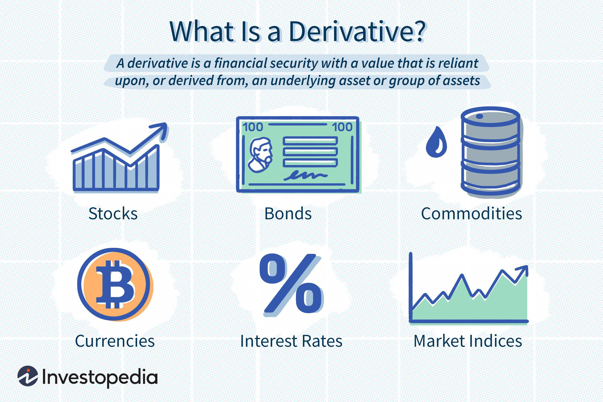

## Table of Contents

## What are economic derivatives?

Economic derivatives are financial instruments whose value is based on the expected performance of an underlying economic indicator, like inflation rates, GDP growth, or unemployment rates. They allow investors to bet on the future direction of these economic indicators without having to directly invest in the actual assets or markets that these indicators represent. For example, instead of buying stocks or bonds, an investor might buy a derivative that pays out if the inflation rate goes up, allowing them to profit from their prediction about inflation.

These instruments are useful for businesses and investors who want to hedge against economic risks or speculate on future economic conditions. For instance, a company might use an economic derivative to protect itself against the risk of rising interest rates that could increase their borrowing costs. On the other hand, speculators might use these derivatives to try and make a profit by correctly guessing the direction of economic trends. Overall, economic derivatives provide a way to manage economic uncertainty and can be an important tool in financial planning and risk management.

## How do economic derivatives function as financial instruments?

Economic derivatives work as financial tools that let people bet on how well certain parts of the economy will do in the future. They are based on things like how fast the economy is growing, how high inflation will be, or how many people are out of work. Instead of buying actual things like stocks or bonds, someone can buy an economic derivative that will give them money if their guess about the economy is right. For example, if someone thinks inflation will go up, they can buy a derivative that pays out more if inflation does indeed rise.

These derivatives are useful for companies and investors who want to protect themselves from bad economic changes or try to make money by guessing right about the economy. A company might use an economic derivative to guard against the risk of higher interest rates that could make borrowing money more expensive. On the other hand, someone who likes to take risks might use these derivatives to try to make a profit by correctly predicting economic trends. In this way, economic derivatives help people manage the uncertainty of the economy and can be an important part of planning and managing risks.

## What are the main types of economic derivatives?

There are a few main types of economic derivatives that people use. The first type is called an inflation-linked derivative. This kind of derivative is based on how much prices are expected to go up in the future. For example, if someone thinks that prices will rise a lot, they might buy an inflation-linked derivative that pays out more money if inflation does go up. Companies often use these to protect themselves from the risk of higher costs due to inflation.

Another type is called a GDP-linked derivative. This one is based on how well the whole economy is doing, measured by something called Gross Domestic Product (GDP). If someone believes the economy will grow a lot, they might buy a GDP-linked derivative that pays out more if the GDP growth is high. This can be useful for investors who want to make money if the economy does well, or for companies that want to protect themselves if the economy does not grow as expected.

The last main type is an unemployment rate derivative. This derivative is based on how many people are out of work. If someone thinks that unemployment will go down, they might buy an unemployment rate derivative that pays out more if the unemployment rate does indeed drop. This can be helpful for businesses that want to manage the risk of having fewer customers if unemployment goes up, or for investors who want to bet on the job market.

## What is the purpose of using economic derivatives?

Economic derivatives are used mainly for two reasons: to protect against risks and to make money by guessing right about the economy. Companies and investors use them to guard against things like rising prices, slower economic growth, or more people being out of work. For example, if a company thinks that interest rates will go up and make borrowing more expensive, they can use an economic derivative to protect themselves from that risk. This way, they can keep their costs under control even if the economy changes in a bad way.

On the other hand, some people use economic derivatives to try and make money by predicting what will happen to the economy. If someone believes that inflation will go up, they might buy a derivative that pays out more if inflation does rise. This can be a way to make a profit without having to buy actual things like stocks or bonds. In short, economic derivatives help people manage the uncertainty of the economy and can be a useful tool for both protecting against risks and trying to make money.

## How are economic derivatives priced?

Economic derivatives are priced based on what people think will happen to the economy in the future. If lots of people think that inflation will go up, the price of an inflation-linked derivative will go up too. This is because more people want to buy it, hoping to make money if inflation does rise. The price also depends on things like how much time is left before the derivative pays out and how sure people are about their guesses. If there's a lot of time left and people are not very sure about what will happen, the price might be lower because it's riskier.

The pricing of economic derivatives also uses special math models. These models look at past data and current information to guess what might happen to things like GDP growth or unemployment rates. The models take into account how much the economy might change and how likely those changes are. If the models show that the economy is likely to change a lot, the price of the derivative might be higher because it's riskier. This helps people decide if the price of the derivative is a good deal or not, based on their own guesses about the economy.

## What are the risks associated with trading economic derivatives?

Trading economic derivatives can be risky because they depend on guesses about the future of the economy. If someone guesses wrong about things like inflation or GDP growth, they could lose money. For example, if someone buys a derivative thinking inflation will go up but it actually goes down, they won't get the payout they were hoping for. This can be a big problem, especially if they bet a lot of money on their guess. Also, economic derivatives can be hard to understand and predict because the economy can change a lot and in unexpected ways.

Another risk is that economic derivatives can be very volatile. This means their prices can go up and down a lot in a short time. If the market suddenly changes its mind about what will happen to the economy, the value of the derivative can drop quickly. This can lead to big losses if someone needs to sell the derivative at a bad time. Additionally, using economic derivatives to protect against risks doesn't always work perfectly. Sometimes, the derivative might not cover all the risks a company faces, leaving them still exposed to economic changes.

## Can you explain the role of economic derivatives in hedging?

Economic derivatives help companies and investors protect themselves from bad economic changes. This is called hedging. For example, if a company thinks that inflation will go up and make their costs higher, they can buy an inflation-linked derivative. This derivative will pay out more money if inflation does go up, which can help the company cover the extra costs. By doing this, the company can feel safer about their future costs, even if the economy changes in a way they don't like.

Hedging with economic derivatives is not perfect, though. Sometimes, the derivative might not cover all the risks a company faces. For example, if a company uses a GDP-linked derivative to protect against a slowdown in the economy, but the slowdown is worse than they expected, the derivative might not pay out enough to cover all their losses. Still, using economic derivatives for hedging can be a good way to manage some of the uncertainty about the future of the economy.

## How do economic derivatives impact the broader economy?

Economic derivatives can have a big effect on the whole economy. They help people and companies guess what will happen to things like inflation or how fast the economy is growing. This can make the economy more stable because people can protect themselves from bad changes. For example, if lots of companies use derivatives to guard against higher interest rates, they might feel safer about borrowing money. This can help keep the economy moving, even if things get tough.

But economic derivatives can also cause problems. If too many people guess wrong about the economy, it can lead to big losses and even make the economy worse. For example, if lots of investors think inflation will go up but it doesn't, they could lose a lot of money. This could make them spend less, which could slow down the economy. So, while economic derivatives can help manage risks, they can also add to the ups and downs of the economy if not used carefully.

## What are some real-world examples of economic derivatives?

One real-world example of an economic derivative is an inflation swap. This is when two parties agree to exchange payments based on inflation rates. One party might pay a fixed rate, while the other pays a rate that changes with inflation. Companies use inflation swaps to protect themselves from the risk of rising prices. For example, a company that makes long-term contracts might use an inflation swap to make sure their costs don't go up too much if inflation rises.

Another example is a GDP-linked bond. This is a bond where the interest payments or the amount paid back at the end depends on how well the economy is doing. If the economy grows a lot, the bond pays more. Countries like Argentina have used GDP-linked bonds to manage their debt. If their economy does well, they pay more on the bond, but if it doesn't, they pay less. This can help them borrow money more easily because investors feel safer knowing their returns could go up if the economy grows.

## How do regulatory frameworks affect the trading of economic derivatives?

Regulatory frameworks play a big role in how people trade economic derivatives. Governments and financial watchdogs set rules to make sure that trading these derivatives is safe and fair. For example, they might require companies to report their trades, so everyone can see what's going on in the market. This helps prevent big problems like fraud or too much risk-taking. Also, regulators might set limits on how much someone can bet on economic derivatives to stop the market from getting too crazy.

These rules can affect how much people want to trade economic derivatives. If the rules are too strict, some people might not want to trade them because it's too hard or expensive to follow all the regulations. On the other hand, good rules can make people feel safer about trading economic derivatives. They know that the market is being watched, and this can make them more likely to trade. So, while regulations can make trading economic derivatives more complicated, they also help keep the market stable and trustworthy.

## What advanced strategies can be employed in trading economic derivatives?

One advanced strategy in trading economic derivatives is called spread trading. This is when someone buys one derivative and sells another at the same time. The idea is to make money from the difference between the two derivatives. For example, if someone thinks that inflation will go up more than the market expects, they might buy an inflation-linked derivative and sell a GDP-linked derivative. If inflation does go up a lot and GDP doesn't grow as much, they can make money from the difference. This strategy can help reduce risk because it's not just about guessing one thing right, but about guessing the difference between two things.

Another strategy is called delta hedging. This is when someone uses economic derivatives to protect themselves from small changes in the economy. They do this by buying or selling more derivatives as the economy changes. For example, if someone has bought an inflation-linked derivative and inflation starts to go up, they might sell some of it to lock in their profits. This way, they can still make money if inflation keeps going up, but they won't lose as much if it suddenly goes down. Delta hedging can be complicated, but it's a good way to manage risk and make the most of economic changes.

## How do economic derivatives interact with monetary policy and interest rates?

Economic derivatives can affect how central banks set monetary policy and interest rates. When lots of people trade economic derivatives, it can give central banks a good idea of what people think will happen to the economy. For example, if many people are buying inflation-linked derivatives, it might mean they think inflation will go up. This can make central banks more likely to raise interest rates to try to keep inflation under control. On the other hand, if people are buying derivatives that bet on slower economic growth, central banks might decide to lower interest rates to help the economy grow faster.

Interest rates also affect the value of economic derivatives. When interest rates go up, the cost of borrowing money goes up too. This can make economic derivatives that are based on things like inflation or GDP growth less valuable because people might not want to take as many risks. For example, if interest rates rise, the value of an inflation-linked derivative might go down because people think inflation will be harder to control. So, economic derivatives and interest rates are closely linked, and changes in one can have a big impact on the other.

## What is Understanding Economic Derivatives?

Economic derivatives are specialized financial contracts designed to hedge or speculate on the outcomes of economic indicators such as Gross Domestic Product (GDP), unemployment rates, inflation, and others. These instruments are typically traded over-the-counter (OTC) and offer unique opportunities for both risk management and speculative activities.

### Mechanics of Economic Derivatives

Economic derivatives function similarly to traditional financial derivatives but are based on macroeconomic indicators. The payoff of these derivatives depends on the realization of specified economic outcomes. A typical contract might, for example, offer a payout if the actual unemployment rate falls below a predetermined threshold on a specific release date. These contracts are structured as binary options, digital options, or more complex forms, such as swaps or forwards, depending on the needs of the parties involved.

Mathematically, an economic derivative with a binary payoff can be expressed as:

$$
\text{Payoff} = 
  \begin{cases} 
   P & \text{if } X < K \\
   0 & \text{otherwise}
  \end{cases}
$$

where $P$ is the payout amount, $X$ is the actual value of the economic indicator, and $K$ is the threshold or strike level.

### Historical Background

The concept of economic derivatives emerged in the early 2000s, introduced by financial institutions like Goldman Sachs and Deutsche Bank. The initial motivation was to create products that could allow businesses, investors, and speculators to take positions on economic events without dealing in the underlying assets directly. Despite initial interest, trading volumes have been limited, partly due to the complexity of pricing such derivatives and the challenge of [liquidity](/wiki/liquidity-risk-premium).

### Impact on Financial Markets

Economic derivatives have had a subtle but significant impact on financial markets by providing additional data points for economic forecasts and expectations. They offer insights into market sentiment regarding future economic conditions. For example, if many traders purchase contracts betting on a lower unemployment rate, this may indicate optimism about economic growth.

Moreover, these derivatives can influence the actual reported outcomes. Market participants, such as hedge funds and other institutional investors, may adjust their portfolios based on anticipated economic announcements, thus indirectly affecting asset prices.

### Benefits in Risk Mitigation and Speculation

For businesses and investors, economic derivatives offer a means of hedging exposures to undesirable economic conditions. A company anticipating a downturn may use these contracts to partially offset the financial risk of reduced consumer spending. Similarly, financial institutions can hedge against inflationary risks that might adversely affect their [interest rate](/wiki/interest-rate-trading-strategies)-sensitive assets.

From a speculative perspective, economic derivatives allow participants to profit from correct predictions about economic indicators. Those businesses with specific economic insights can utilize economic derivatives to leverage their forecasts without engaging in more traditional financial markets, such as equity or bond markets.

In conclusion, economic derivatives represent a sophisticated layer within financial markets, offering nuanced opportunities for both risk management and speculation. Despite their complexity and current limited use, they reflect the ongoing innovation within financial markets to address ever-evolving economic challenges and opportunities.

## What is the Framework of Monetary Economics?

Monetary economics focuses on the management of money, credit, and financial systems within an economy, analyzing how these elements influence economic behavior and performance. Central to this field is understanding how monetary policy is implemented by central banks to achieve macroeconomic objectives such as price stability, full employment, and economic growth.

Central banks utilize a variety of monetary policy tools to control economic variables. One primary tool is the adjustment of interest rates, which can influence economic activity by altering the cost of borrowing. For instance, lowering interest rates generally encourages borrowing and investment, fostering economic growth. Conversely, increasing rates can cool an overheated economy and help manage inflationary pressures. The relationship between interest rates and economic activity can be represented by the basic equation: 

$$
I = \frac{\Delta C}{\Delta Y}
$$

where $I$ stands for interest, $\Delta C$ depicts the change in consumption, and $\Delta Y$ denotes the change in income.

Another crucial aspect of monetary policy is controlling the money supply. Central banks may increase the money supply during periods of economic sluggishness to stimulate spending, or they might reduce it to curb inflation during times of rapid growth. Understanding the money supply levels and their effects incorporates analysis from the Quantity Theory of Money, expressed as:

$$
MV = PQ
$$

where $M$ is the money supply, $V$ is the velocity of money, $P$ is the price level, and $Q$ is the quantity of goods and services produced.

Inflation management is equally significant in monetary economics. Central banks aim to maintain inflation at a target level, usually around 2% in many developed economies, to provide a stable price environment conducive to investment and spending. Failure to control inflation results in decreased purchasing power and economic instability, making inflation targeting a key focus area.

Monetary policies are also forward-looking, anticipating how current actions will unfold over economic cycles. This predictive nature requires analyzing multiple economic indicators, models, and historical data to forecast outcomes and market reactions, emphasizing the importance of such economic insights in making informed investment decisions.

Comprehending these monetary tools allows investors and decision-makers to anticipate market behavior, adjust portfolios, and prepare for economic shifts, ensuring strategic responses to fluctuating market conditions.

## References & Further Reading

[1]: Modigliani, F., & Miller, M. H. (1958). ["The Cost of Capital, Corporation Finance and the Theory of Investment."](https://www.aeaweb.org/aer/top20/48.3.261-297.pdf) The American Economic Review, 48(3), 261-297.

[2]: Financial Crisis Inquiry Commission. (2011). ["The Financial Crisis Inquiry Report."](https://www.govinfo.gov/app/details/GPO-FCIC/) 

[3]: Chen, S., & Cheng, M. A. (2018). ["Algorithmic and High-Frequency Trading."](https://www.researchgate.net/publication/378548435_Algorithmic_Trading_and_AI_A_Review_of_Strategies_and_Market_Impact) In Artificial Intelligence in Asset Management.

[4]: De Prado, M. L. (2018). ["Advances in Financial Machine Learning."](https://www.amazon.com/Advances-Financial-Machine-Learning-Marcos/dp/1119482089) Wiley.

[5]: Oliver, M. (2011). ["Understanding Economic Derivatives."](https://www.supermoney.com/encyclopedia/derivative-economics-2) SSRN Electronic Journal.

[6]: Chacko, G., & Viceira, L. M. (2005). ["Dynamic Consumption and Portfolio Choice with Stochastic Volatility in Incomplete Markets."](https://pages.stern.nyu.edu/~dbackus/GE_asset_pricing/ChackoViceira%20RFS%2005.pdf) Journal of Financial and Quantitative Analysis, 40(2), 205-239.