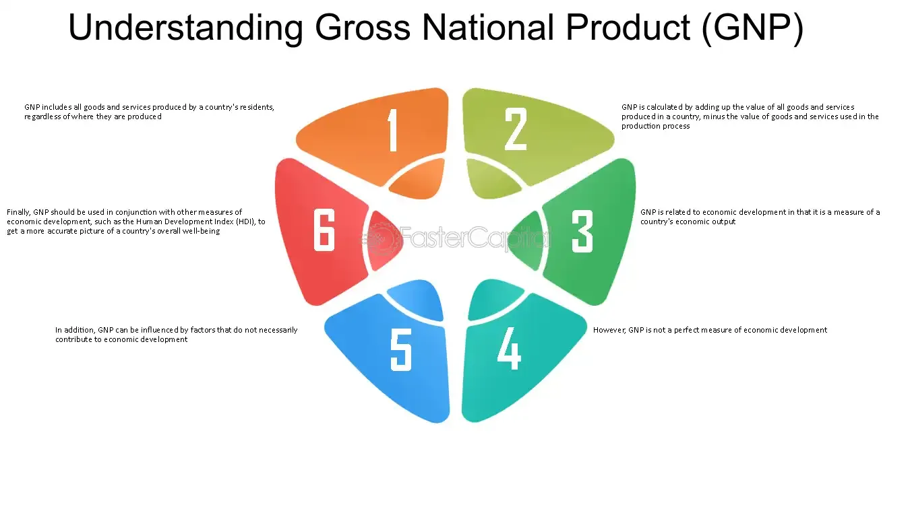

## Table of Contents

## What is Gross National Product (GNP)?

Gross National Product, or GNP, is the total value of all goods and services produced by a country's citizens and businesses, no matter where they are in the world. It includes the income earned by a country's residents from overseas investments, minus the income earned within the country by foreigners. GNP helps to show how a country's economy is doing by looking at the wealth its people are making everywhere.

GNP is different from Gross Domestic Product, or GDP, which only counts the value of goods and services produced within a country's borders. So, if a company from the United States makes cars in Mexico, those cars would be included in the U.S. GNP but not in the U.S. GDP. Understanding GNP can help governments and economists see the bigger picture of a nation's economic health and make better decisions about policies and investments.

## How is GNP different from Gross Domestic Product (GDP)?

GNP and GDP are both ways to measure how well a country's economy is doing, but they look at different things. GNP stands for Gross National Product. It adds up all the money made by a country's people and businesses, no matter where they are in the world. So, if someone from the United States owns a factory in another country, the money that factory makes is part of the U.S. GNP.

On the other hand, GDP stands for Gross Domestic Product. It only counts the money made from goods and services produced inside a country's borders. So, if a factory in the United States is owned by someone from another country, the money that factory makes is part of the U.S. GDP, but not part of the other country's GNP.

In simple terms, GNP is about the money a country's citizens make anywhere in the world, while GDP is about the money made within the country, no matter who makes it. Both are important, but they give us slightly different pictures of an economy's health.

## Why is GNP used as a measure of economic development?

GNP is used as a measure of economic development because it shows how much money a country's people and businesses are making all around the world. This is important because it tells us about the total wealth that a country's citizens are creating, no matter where they are. For example, if a lot of people from a country are working in other countries and sending money back home, this can make the country's GNP higher. This helps show how well the country is doing economically, not just at home but everywhere.

Another reason GNP is useful is that it can help governments and economists understand the overall health of their economy. By looking at GNP, they can see if their citizens are doing well in the global market. This can help them make better decisions about things like taxes, spending on public services, and investments in businesses. Even though GNP doesn't tell the whole story of a country's economy, it's a helpful tool for seeing the bigger picture of economic development.

## What are the components that make up GNP?

GNP is made up of several parts that help us understand where a country's money comes from. The first part is the total value of all goods and services produced within the country's borders, which is similar to GDP. This includes things like cars made in factories, food grown on farms, and services like haircuts or doctor visits. But GNP goes further by also including money earned by a country's people and businesses from other countries. For example, if a company from the United States makes money in Japan, that money is added to the U.S. GNP.

The second part of GNP involves subtracting the money earned within the country by foreigners. If a company from another country makes money in the United States, that money is not included in the U.S. GNP. So, GNP takes the total income from within the country and adds the income from abroad by its citizens, then subtracts the income earned by foreigners within the country. This way, GNP gives a complete picture of the wealth created by a country's people, no matter where they are in the world.

## How is GNP calculated?

GNP is calculated by adding up all the money made from goods and services produced within a country, plus the money made by its citizens and businesses from other countries. For example, if a company from the United States makes cars in Mexico, the money from those cars is added to the U.S. GNP. But then, you have to subtract the money made by foreigners within the country. So, if a company from Japan makes money in the United States, that money is taken away from the U.S. GNP.

In simple terms, you start with the total income from within the country, which is similar to GDP. Then, you add the income that the country's citizens and businesses earn from other countries. Finally, you subtract the income earned by foreigners inside the country. This way, GNP shows the total wealth created by a country's people, no matter where they are in the world.

## Can you explain the concept of GNP per capita and its significance?

GNP per capita is a way to measure how much money each person in a country makes on average. It is calculated by taking the total GNP of a country and dividing it by the number of people living there. This gives us an idea of the average wealth of each person, which can help us understand how well-off the people in a country are.

Knowing GNP per capita is important because it helps us compare the economic well-being of different countries. If one country has a higher GNP per capita than another, it usually means that people in the first country are, on average, wealthier. This can be useful for governments and organizations to make decisions about where to focus their efforts to help people and improve living standards.

## What are the limitations of using GNP to measure economic development?

GNP is a useful way to measure how well a country's economy is doing, but it has some limits. One big problem is that GNP doesn't tell us about how the money is shared among the people. A country might have a high GNP, but if only a few rich people are making most of the money, the average person might not be doing well. So, GNP doesn't show us things like poverty or inequality.

Another limit of GNP is that it doesn't include things that don't have a price tag, like the environment or people's happiness. If a country cuts down a lot of trees to make money, its GNP might go up, but the damage to the environment isn't counted. Also, GNP doesn't measure how happy or healthy people are, which are important parts of a country's development.

Because of these limits, economists and governments often use other measures along with GNP to get a fuller picture of a country's development. They might look at things like the Human Development Index, which includes health and education, or the Genuine Progress Indicator, which tries to account for environmental and social factors. This way, they can understand not just how much money a country is making, but also how well its people are living.

## How does GNP growth relate to economic development?

GNP growth is often seen as a sign of economic development because it shows that a country's people and businesses are making more money. When GNP goes up, it means more goods and services are being produced and sold, which can lead to more jobs and higher incomes for people. This can help improve living standards, as people have more money to spend on things they need and want, like food, housing, and education.

However, GNP growth doesn't tell the whole story of economic development. It doesn't show how the money is shared among people, so a country might have high GNP growth but still have a lot of poor people. Also, GNP growth doesn't include things like the health of the environment or how happy people are, which are important for true development. So, while GNP growth is a helpful measure, it's important to look at other factors to understand how well a country is really doing.

## What role do international transactions play in GNP?

International transactions play a big role in GNP because they help us see the total wealth made by a country's people and businesses all over the world. When people from a country work or own businesses in other countries, the money they make there is added to the country's GNP. For example, if a company from the United States makes cars in Mexico, the money from those cars is part of the U.S. GNP. This way, GNP shows not just what's happening inside the country, but also how well its people are doing everywhere.

On the other hand, GNP also takes away the money made by foreigners inside the country. If a company from Japan makes money in the United States, that money is not included in the U.S. GNP. This helps to give a clear picture of the wealth created by the country's own people, no matter where they are. So, international transactions are important because they help us understand the true economic health of a country by looking at the bigger picture.

## How can GNP be adjusted for inflation, and why is this important?

GNP can be adjusted for inflation by using a measure called "real GNP." To do this, economists take the current GNP and use a price index, like the Consumer Price Index (CPI), to remove the effects of inflation. This means they look at how prices have changed over time and adjust the GNP numbers to show what they would be if prices hadn't gone up. This way, real GNP shows the true growth of the economy, not just the increase in prices.

Adjusting GNP for inflation is important because it helps us see the real changes in the economy. If we just look at the regular GNP, it might go up because prices are higher, not because more goods and services are being made. By using real GNP, we can understand if the economy is actually growing or if it's just that things cost more. This helps governments and businesses make better decisions about the future.

## What are some alternative or complementary measures to GNP for assessing economic development?

Besides GNP, there are other ways to measure how well a country is doing economically. One popular measure is the Gross Domestic Product (GDP), which looks at the total value of all goods and services made within a country's borders. GDP is useful because it shows what's happening inside the country, but it doesn't account for money made by citizens abroad. Another measure is the Human Development Index (HDI), which looks at not just money, but also health and education. HDI gives a fuller picture of how people are living, not just how much money they're making.

Another important measure is the Genuine Progress Indicator (GPI), which tries to account for things that GNP doesn't, like the environment and people's happiness. GPI adds in the value of things like volunteer work and subtracts costs like pollution and crime. This way, it shows a more complete view of a country's well-being. Lastly, the Gini coefficient is used to measure how evenly money is shared among people. A high Gini coefficient means there's a lot of inequality, while a low one means money is spread more evenly. Using these measures together helps us understand different parts of economic development.

## How do economists use GNP data to inform policy decisions?

Economists use GNP data to help governments make good choices about money and laws. When they see that GNP is growing, it might mean that the country's people are making more money, so the government might decide to spend more on things like schools and hospitals. But if GNP is not growing or is going down, the government might need to make changes, like lowering taxes or helping businesses to create more jobs. By looking at GNP, economists can tell if the country's economy is doing well or if it needs help.

GNP also helps economists see how a country is doing compared to other countries. If a country's GNP is growing faster than other countries, it might mean that its people are doing better in the global market. This can help the government decide where to invest money to keep that growth going. On the other hand, if GNP is growing slowly, the government might look for ways to help its people make more money abroad, like by making trade deals or helping businesses expand to other countries. So, GNP data gives important clues about what the government should do to help the economy grow.

## References & Further Reading

[1]: Cobham, D. (2001). ["The Measurement of National Economic Performance."](https://www.sciencedirect.com/science/article/pii/S0921800907004119) Journal of Economic Perspectives, 15(1), 47-68.

[2]: Pardo, R. (2008). ["The Evaluation and Optimization of Trading Strategies."](https://onlinelibrary.wiley.com/doi/book/10.1002/9781119196969) Wiley Trading Series.

[3]: Kearns, M., & Nevmyvaka, Y. (2013). ["Machine Learning for Market Microstructure and High Frequency Trading."](https://www.cis.upenn.edu/~mkearns/papers/KearnsNevmyvakaHFTRiskBooks.pdf) In: High-Frequency Trading: New Realities for Traders, Markets, and Regulators.

[4]: Campbell, J., Lo, A., & MacKinlay, A. (1996). ["The Econometrics of Financial Markets."](https://www.semanticscholar.org/paper/THE-ECONOMETRICS-OF-FINANCIAL-MARKETS-Campbell-Lo/6924fa669cb30c223b5d0148cbacd17f77b57a0f) Princeton University Press.

[5]: Aizenman, J. (1994). ["Monetary and Real Shocks, Productive Capacity and Exchange Rate Regimes."](https://www.jstor.org/stable/2555031) Economica, 61(241), 38-58.