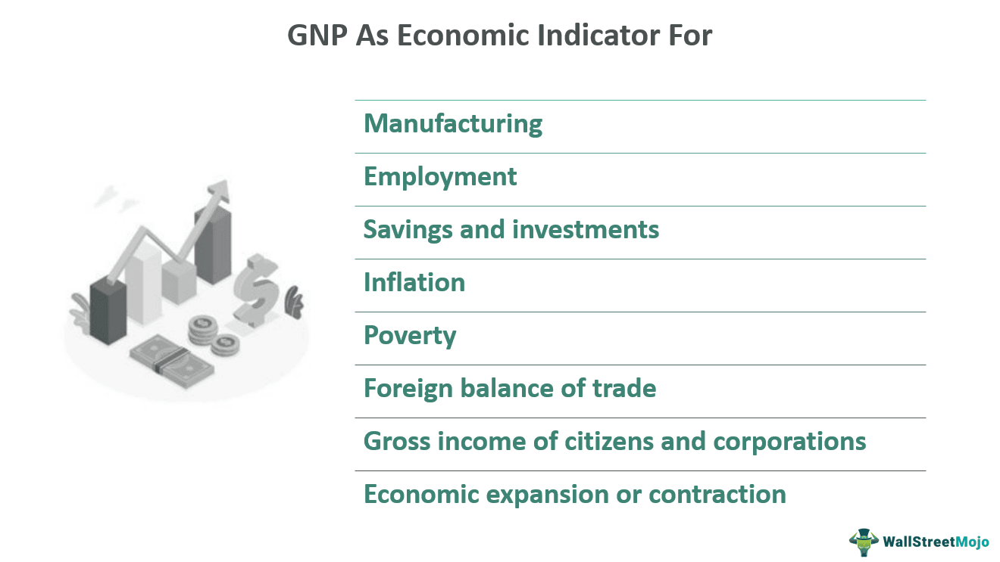

The intricate relationship between economic development, Gross National Product (GNP), and the national economy forms the backbone of modern financial analysis. Economic development is intrinsically linked to GNP, which quantifies the total economic output produced by a nation's residents, regardless of whether the production occurs within the country's borders. This measurement provides invaluable insights into the economic performance and living standards of a nation.

In conjunction with GNP, the national economy represents the sum of all economic activities within a country. These activities, encompassing production, consumption, and investment, collectively dictate a nation's economic standing on the global stage. Understanding the interconnectedness of these components is crucial, as they collectively drive economic development by enhancing a nation's economic health, competitiveness, and overall well-being.

Algorithmic trading, also known as algo trading, has emerged as a transformative force within this complex economic framework. By employing sophisticated algorithms to automate trading processes, it impacts liquidity, volatility, and efficiency within financial markets. This technological advancement not only influences traditional economic variables like GNP and the national economy but also introduces new dynamics that can significantly alter the landscape of modern economies.

For investors and policymakers, understanding these intertwined dynamics is fundamental to effectively navigating today’s economic environments. The ability to grasp how algo trading affects economic development and national economic performance can empower stakeholders to make informed decisions. This strategic insight is essential to driving growth and promoting sustainable economic prosperity in an increasingly digital and algorithm-driven world.

In this article, we will explore the definitions, implications, and interconnectedness of GNP and the national economy in supporting economic development. Additionally, the role of algo trading in shaping these crucial economic variables will be examined. By dissecting these elements, the comprehensive insights provided can assist investors and policymakers in tailoring strategies to optimize economic outcomes in a rapidly evolving financial landscape.

## Table of Contents

## Understanding Economic Development

Economic development is a multidimensional concept that reflects a nation's progress, encompassing enhancements in living standards, economic vitality, and competitive positioning in the global marketplace. It is a fundamental measure of a country's ability to improve the well-being of its citizens and is indicative of an economy's health and productivity.

### Key Indicators of Economic Development

Economic development is gauged using various indicators that provide insights into a nation's economic health. These indicators typically include Gross National Product (GNP) per capita, life expectancy, literacy rates, and employment levels. High GNP per capita often suggests a prosperous economy, while improvements in health and education are indicative of enhanced quality of life. Employment levels reveal labor market efficiency and the economy's ability to provide jobs.

### The Role of Education, Technology, Infrastructure, and Innovation

Crucial to economic growth are the elements of education, technology, infrastructure, and innovation. Education equips the workforce with skills needed to adapt to changing job requirements, fueling productivity and innovation. Technology increases the efficiency of production processes and opens up new markets and industries, driving economic expansion. Infrastructure, such as transportation and communication networks, facilitates trade and mobility, reducing costs and enhancing connectivity. Innovation generates new products and services, thereby creating additional revenue streams and enhancing competitive advantage.

### Challenges and Opportunities in a Globalized Context

In the context of globalization, both developing and developed nations face unique challenges and opportunities. Developing countries often grapple with issues such as insufficient infrastructure, limited access to education, and political instability. However, globalization offers these economies access to international markets and investments, potentially leading to rapid economic growth.

Developed nations, while benefiting from robust infrastructure and advanced technology, face challenges such as economic saturation and aging populations. They must innovate continually and adapt to changing global markets to maintain economic growth. Globalization facilitates technological transfer and collaborative innovation, providing opportunities to address these challenges.

### Economic Development and Policy Interventions

Economic development is a critical benchmark for assessing the effectiveness of policy interventions. Governments implement policies to stimulate economic growth, improve education, and develop infrastructure. Policies are evaluated based on their ability to enhance economic indicators and contribute to sustainable development. Effective policy-making requires a comprehensive understanding of economic development as it pertains to improving citizens' quality of life and the nation's economic welfare.

Economic development, therefore, forms the crux of strategic planning for both national governments and international organizations, aiming to foster environments conducive to growth and prosperity. By harnessing education, technology, infrastructure, and innovation, nations can enhance their economic trajectories and better navigate the challenges posed by globalization.

## Gross National Product (GNP): A Major Economic Indicator

Gross National Product (GNP) serves as a critical metric for evaluating a nation's economic performance, encapsulating the total economic output generated by a country's residents both domestically and internationally. It provides valuable insights into the economic activities beyond national borders, capturing the income generated by residents' foreign assets.

GNP's significance as an economic indicator lies in its comprehensive nature, which offers a broader perspective than Gross Domestic Product (GDP). While GDP focuses on the production within a country's borders, GNP accounts for net income flows from abroad, thus providing a more inclusive view of a nation's economic health. The distinction between these two metrics is vital in economic analysis. GDP is often a more accurate reflection of domestic economic activities, whereas GNP includes international economic interactions, offering insights into the global business reach of a country's residents.

Adjusting GNP for currency fluctuations and inflation is a nuanced task that aims to provide an accurate economic picture. Since GNP includes international earnings, variations in exchange rates can significantly impact its value. Economists utilize constant pricing and purchasing power parity (PPP) adjustments to mitigate the effects of currency [volatility](/wiki/volatility-trading-strategies), ensuring that GNP assessments remain stable over time and comparable across countries. Similarly, inflation adjustments, often represented by using a deflator, allow GNP to be expressed in real terms, thus reflecting true economic growth devoid of price level changes.

Despite its comprehensive nature, GNP is not without limitations. One notable limitation is its potential to overstate economic output when substantial income flows from abroad are involved. This can lead to misleading comparisons between countries with differing levels of foreign asset holdings and income generation. In modern economic policies, these limitations are addressed by integrating complementary indicators and analyses, such as Gross National Income (GNI) and net national product (NNP), which offer additional dimensions of economic performance and sustainability.

GNP remains a fundamental tool in economic policy and planning, aiding governments and policymakers in crafting strategies that accommodate both domestic and international economic engagements. By understanding its role and limitations, decision-makers can better navigate the complexities of global economic dynamics.

## The National Economy: Dynamics and Challenges

The national economy is a complex network characterized by the interaction of various elements such as production, consumption, and investment. These components collectively influence a country's economic health and its position in the global arena. Production forms the backbone of a nation's economic activity, encompassing goods and services generated within the country. This component is vital, as it reflects the country's capability to produce a broad range of products and services efficiently. Consumption, another crucial element, represents the economic activity related to the utilization of these goods and services by individuals, businesses, and the government. The level of consumption is often used to gauge economic well-being, as it indicates consumer confidence and spending capacity. Investment, the third cornerstone, involves allocating resources to generate future profit and growth, often seen through infrastructure developments and business expansions.

National economies encounter various challenges, notably inflation, unemployment, and fiscal deficits, which hinder economic stability and growth. Inflation denotes the sustained increase in the general price levels of goods and services, eroding purchasing power and affecting consumption patterns. Strategies to manage inflation typically include monetary policies such as adjusting interest rates or controlling the money supply. Unemployment, the condition where individuals capable and willing to work are unable to find employment, poses another significant challenge. Reducing unemployment often requires targeted policies aimed at job creation, skill development, and fostering industries with high labor absorption capacity.

Fiscal deficits, the situation where a government's total expenditures surpass the revenue it generates excluding debt, require strategic financial management. Addressing fiscal deficits includes methods such as rationalizing government spending, enhancing revenue collection through improved taxation, and promoting economic activities that enhance taxable income bases.

Nations devise strategies for sustainable economic growth and stability by implementing sound domestic policies, such as promoting education, encouraging innovation, and ensuring regulatory environments conducive to business. Effective economic policy frameworks often emphasize diversification to reduce dependency on volatile sectors and enhance resilience to global economic shifts.

The national economy is significantly influenced by the interplay between domestic policies and international economic trends. Globalization and international trade policies can impact domestic economic activities, requiring nations to adapt their strategies to maintain competitive advantages. For instance, a shift in international demand for exports or changes in global supply chains can directly influence national production and investment strategies.

By navigating these dynamics skillfully, nations aim to ensure a stable economic environment that fosters growth and enhances global competitiveness. Understanding and strategically responding to both domestic and international economic trends is essential for policymakers aiming to support robust and resilient national economies.

## Algorithmic Trading: Revolutionizing Financial Markets

Algorithmic trading, commonly referred to as algo trading, leverages the power of advanced algorithmic systems to automate trading activities, thereby securing a competitive advantage in financial markets. The influence of algo trading on market [liquidity](/wiki/liquidity-risk-premium), volatility, and efficiency is profound and multifaceted.

### Impact on Liquidity, Volatility, and Efficiency

Algo trading has significantly enhanced liquidity in financial markets by enabling the execution of large orders with minimal impact on market prices. This is achieved through sophisticated algorithms that break up large orders into smaller pieces, executing them over time. Improved liquidity often leads to more stable markets, as participants can enter and [exit](/wiki/exit-strategy) positions with relative ease.

Volatility, on the other hand, presents a more nuanced picture. While algo trading can dampen volatility by providing liquidity, during periods of market stress or rapid information dissemination, it may exacerbate volatility through rapid sequence trading and unexpected algorithm interactions. The precision and speed at which algorithmic trades are executed enhance overall efficiency, enabling markets to better reflect available information.

### Advantages and Risks

The primary advantages of [algorithmic trading](/wiki/algorithmic-trading) include speed, precision, and the ability to swiftly respond to market changes. Algorithms can process complex data sets and execute trades in fractions of a second, far surpassing human capabilities. This speed ensures timely exploitation of [arbitrage](/wiki/arbitrage) opportunities and contributes to tighter bid-ask spreads.

However, the same attributes that confer these advantages also introduce risks. Speed and automation can lead to unintended market impacts, such as the 2010 Flash Crash, which was partly attributed to algorithmic trading. Market manipulation concerns arise when algorithms are deliberately used to create price distortions. Moreover, the reliance on complex algorithms increases the risk of systemic failures due to coding errors or unforeseen algorithmic interactions.

### Regulatory Environment

The regulatory landscape for algorithmic trading has evolved to address these risks. Regulatory bodies, such as the Securities and Exchange Commission (SEC) and the European Securities and Markets Authority (ESMA), have implemented measures to enhance transparency and stability. These include the requirement for market participants to have risk management systems in place, and the imposition of circuit breakers to halt trading during extreme market conditions. The regulations aim to ensure that algo trading is conducted in a manner that promotes fair and orderly markets.

### Case Studies

Numerous case studies highlight the successful implementation of algorithmic trading. For instance, Renaissance Technologies, known for its Medallion Fund, has achieved remarkable returns through sophisticated algo trading strategies. By harnessing vast amounts of data and employing complex mathematical models, the fund has consistently outperformed traditional managers. Another example is the application of high-frequency trading ([HFT](/wiki/high-frequency-trading-strategies)) by firms like Virtu Financial, which have showcased the potential of algorithms to achieve profitability across various market conditions.

In conclusion, algorithmic trading represents a significant evolution in financial markets, offering enhanced liquidity, efficiency, and trading capabilities. Despite its inherent risks and the complexities of its regulation, its potential to transform market dynamics and investor strategies is considerable, making it an indispensable element of modern financial market ecosystems.

## The Interconnection Between Economic Development, GNP, and Algo Trading

Algorithmic trading, often referred to as algo trading, leverages computational technology to execute trades using pre-programmed instructions. This approach to trading can significantly influence both Gross National Product (GNP) and broader economic development.

Technological advancements in algorithmic trading have redefined decision-making processes in financial markets. The ability to process substantial datasets quickly allows for high-frequency trades, enhancing market efficiency and liquidity. These attributes are critical in maintaining a stable and predictable economic environment. Furthermore, algorithmic trading reduces transaction costs through automation, leading to broader financial market participation and stimulating economic growth.

Analyzing how algo trading can contribute to economic stability involves examining the precision and speed of trade executions. This capability can mitigate market volatility, as a greater number of traders can respond to market information swiftly, evening out demand and supply imbalances. As a result, the stabilization of financial markets can facilitate more reliable forecasting of economic indicators, including GNP. A more predictable GNP allows policymakers to make informed decisions about monetary and fiscal policies. For instance, consistent economic metrics can inform adjustments in interest rates or taxation, fostering further economic stability and development.

Policymakers and investors also benefit from the data analytics and predictive modeling capabilities integral to algo trading. By utilizing sophisticated algorithms, they can glean insights from historical and real-time data, crafting strategies that capitalize on emerging market trends. These insights are invaluable in developing policies that support sustainable economic growth. Moreover, countries adopting advanced trading technologies often see macroeconomic improvements, such as increased foreign investments, which directly augment national economies and, indirectly, GNP.

As advanced trading systems are integrated within national and global economies, their effects extend beyond immediate financial markets to long-term economic development. The automation and efficiency provided by algo trading can act as facilitators for economic expansion, aligning with broader economic goals and potentially uplifting GNP.

In conclusion, the symbiosis between algorithmic trading and economic components such as GNP underscores the transformative potential of technological innovation. The journey towards optimizing economic outcomes requires a nuanced understanding of these interactions, thus empowering stakeholders to harness these tools effectively.

## Conclusion

In conclusion, the interconnectedness of economic development, Gross National Product (GNP), and algorithmic trading (algo trading) plays a critical role in shaping modern economies. This article highlighted the key insights and trends within these domains, emphasizing the necessity of informed policymaking as an adaptive strategy to maximize the efficacy of these economic components. By understanding and leveraging their interdependencies, stakeholders can devise strategic approaches that promote economic stability and growth in the digital finance era.

Algo trading has emerged as a transformative element in financial markets, providing enhanced speed, accuracy, and market efficiency. However, it also presents challenges relating to market manipulation and regulatory oversight. As such, it is crucial for policymakers to develop comprehensive frameworks that address these issues while fostering innovation.

The integration of algo trading with economic indicators like GNP offers promising potential to enhance decision-making processes for investors and policymakers. Adopting advanced trading technologies can further contribute to economic development by creating more efficient and liquid markets, thereby stimulating growth.

Future trends suggest that as technology continues to evolve, there will be increased opportunities to refine and optimize these economic interactions. Therefore, ongoing research and innovation are vital to adapt to the dynamic economic landscape.

Ultimately, a deep understanding of these interconnections can empower stakeholders to drive sustainable economic growth and prosperity. By harnessing the synergies between economic development, GNP, and algo trading, nations can aspire to achieve greater economic resilience and advancement in an increasingly digital world.

## References & Further Reading

[1]: Cobham, D. (2001). ["The Measurement of National Economic Performance."](https://www.sciencedirect.com/science/article/pii/S0921800907004119) Journal of Economic Perspectives, 15(1), 47-68.

[2]: Pardo, R. (2008). ["The Evaluation and Optimization of Trading Strategies."](https://onlinelibrary.wiley.com/doi/book/10.1002/9781119196969) Wiley Trading Series.

[3]: Kearns, M., & Nevmyvaka, Y. (2013). ["Machine Learning for Market Microstructure and High Frequency Trading."](https://www.cis.upenn.edu/~mkearns/papers/KearnsNevmyvakaHFTRiskBooks.pdf) In: High-Frequency Trading: New Realities for Traders, Markets, and Regulators.

[4]: Campbell, J., Lo, A., & MacKinlay, A. (1996). ["The Econometrics of Financial Markets."](https://www.semanticscholar.org/paper/THE-ECONOMETRICS-OF-FINANCIAL-MARKETS-Campbell-Lo/6924fa669cb30c223b5d0148cbacd17f77b57a0f) Princeton University Press.

[5]: Aizenman, J. (1994). ["Monetary and Real Shocks, Productive Capacity and Exchange Rate Regimes."](https://www.jstor.org/stable/2555031) Economica, 61(241), 38-58.