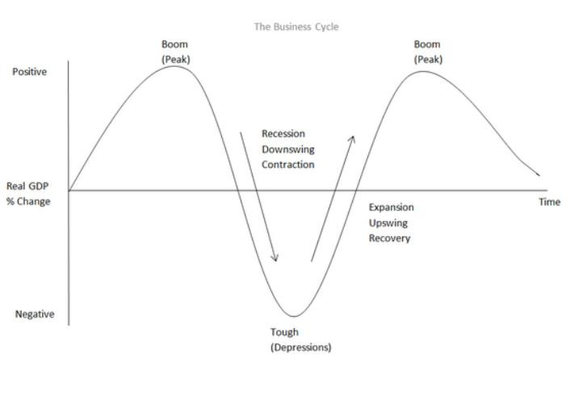

## Table of Contents

## What is an economic downswing?

An economic downswing, often called a recession, is a time when the economy of a country slows down. During this period, people might buy less, businesses might sell less, and it can be harder for people to find jobs. This slowdown can affect everyone from big companies to small families, making it tougher for them to make money or spend on things they want or need.

The reasons for an economic downswing can be many. It might start with a big event like a financial crisis, or it could be because people suddenly start saving more and spending less. When this happens, businesses might have to cut costs, which can mean laying off workers or reducing hours. This, in turn, makes people even more cautious about spending, creating a cycle that can be hard to break until something changes to boost the economy again.

## What are the common causes of an economic downswing?

Economic downswings can happen for a few main reasons. One big reason is when people and businesses start to feel unsure about the future. This might happen after a big event like a stock market crash or a financial crisis. When people are worried, they tend to spend less money. If everyone is spending less, businesses sell less, which can lead them to cut jobs or close down. This creates a cycle where less spending leads to less income, which leads to even less spending.

Another reason for an economic downswing is when there are big changes in the world, like a rise in oil prices or a natural disaster. These changes can make things more expensive or disrupt how goods are made and moved around. If it costs more to make things, businesses might have to raise prices, which can make people buy less. Also, if a disaster hits, it can stop production and hurt the economy in that area or even spread to other places.

Sometimes, economic downswings can also be caused by problems in the financial system, like when banks lend too much money and people can't pay it back. This can lead to a crisis where banks fail or stop lending, making it hard for businesses to get the money they need to grow or even keep running. When the financial system is in trouble, it can drag down the whole economy, leading to a downswing.

## How can an economic downswing be identified?

An economic downswing can be spotted by looking at a few key signs. One big sign is when the Gross Domestic Product (GDP) of a country starts to shrink for two quarters in a row. GDP is like a scorecard for the whole economy, showing how much all the goods and services produced in a country are worth. When it goes down, it means the economy is getting smaller, not bigger. Another sign is when unemployment goes up. If more people are out of work, it means businesses are not doing as well and might be cutting jobs to save money.

Another way to tell if an economic downswing is happening is by watching how much people are spending. If people are buying less stuff, it can be a sign that they're worried about the future and want to save their money instead of spending it. You can also look at the stock market. When the stock market goes down a lot, it can mean that investors are worried about the economy and are selling their stocks. All these signs together can help people figure out if the economy is in a downswing.

## What are the typical impacts of an economic downswing on businesses?

When an economic downswing happens, businesses often feel it right away. They might see fewer people coming into their stores or buying their products online. This drop in sales can make it hard for businesses to make enough money to pay for things like rent, supplies, and salaries. To save money, businesses might have to lay off workers or cut back on hours. This can make things even worse because when people lose their jobs, they have less money to spend, which can lead to even fewer sales for businesses.

Over time, an economic downswing can also make it harder for businesses to get loans from banks. Banks might be more careful about lending money because they're worried about the economy too. Without loans, businesses can't grow or even keep running smoothly. Some businesses might have to close down if they can't make ends meet. All these changes can make it a tough time for businesses big and small, as they try to survive until the economy starts to get better.

## How does an economic downswing affect employment rates?

An economic downswing usually makes the employment rate go up. This means more people are out of work. When businesses are selling less because people are spending less money, they need fewer workers. So, to save money, businesses might lay off workers or cut back on hours. This can lead to a lot of people losing their jobs, making it harder for everyone to find work.

When more people are out of work, they have less money to spend. This can make the economic downswing even worse because when people spend less, businesses sell even less, and might need to cut more jobs. It can turn into a cycle where high unemployment keeps the economy down. It's a tough time for everyone looking for a job because there are more people looking than there are jobs available.

## What measures can governments take to mitigate the effects of an economic downswing?

Governments can help during an economic downswing by spending more money on things like building roads or fixing schools. This is called fiscal policy. When the government spends more, it can help businesses by giving them more work to do. This can lead to more jobs and more money in people's pockets. Governments might also cut taxes or give people more money to spend, which can help get the economy moving again.

Another way governments can help is by changing interest rates. This is called monetary policy. If the central bank lowers interest rates, it can be cheaper for businesses and people to borrow money. When borrowing is cheaper, businesses might be more likely to start new projects or expand, which can create more jobs. Also, people might spend more if they can borrow money more easily, which can help businesses sell more and get the economy going again.

These actions can help soften the blow of an economic downswing, but they need to be done carefully. If the government spends too much or if interest rates are too low for too long, it can cause other problems down the road. So, it's important for governments to find the right balance to help the economy recover without causing new issues.

## How do economic downswings influence consumer behavior?

When an economic downswing happens, people often start to change how they spend their money. They might feel worried about the future and decide to save more instead of buying things they want. This means they might shop less, eat out less, or hold off on big purchases like cars or houses. People might also look for cheaper options, like buying store brands instead of name brands, or shopping at discount stores. All these changes can make the economic downswing worse because when people spend less, businesses sell less and might have to cut jobs.

Over time, as the downswing continues, people might become even more careful with their money. They might start to fix things instead of buying new ones, or share resources with friends and family to save money. For example, instead of each person buying their own tools, they might share a set. This shift in behavior can help people get through tough times, but it also means the economy stays slow until people feel safe enough to start spending more again. When confidence comes back, and people start buying more, it can help the economy recover and start growing again.

## What are the differences between a recession and a depression in the context of an economic downswing?

A recession and a depression are both types of economic downswings, but they are different in how bad they are and how long they last. A recession is when the economy slows down for a while, usually a few months to a year or two. During a recession, people might lose their jobs, businesses might sell less, and it can be harder to get loans. But, recessions are usually not as bad as depressions, and the economy can bounce back after some time.

A depression, on the other hand, is much worse and lasts a lot longer, often years. It's a really deep and long-lasting economic downswing where a lot of people are out of work, businesses struggle a lot, and it's very hard to get the economy going again. Depressions are rare, but when they happen, they can change the way people live and work for a long time. The last big depression in the United States was in the 1930s, and it took a lot of effort from the government and society to recover from it.

## How can businesses prepare for and survive an economic downswing?

Businesses can get ready for an economic downswing by saving money when times are good. This means not spending too much on things they don't need and keeping some money in the bank for tough times. They can also try to keep their costs low, like finding cheaper ways to make their products or get them to customers. Another good idea is to have different ways to make money, so if one part of their business slows down, they can still make money from other parts. For example, a restaurant might start selling food to go or offer cooking classes to make extra money.

When an economic downswing hits, businesses need to be smart about how they spend their money. They might have to cut back on some things, like hiring new people or spending on big projects. But they should also think about how to keep their customers happy, maybe by offering sales or special deals. Staying in touch with customers and letting them know that the business is still there for them can help keep them coming back. Businesses that can adapt to the new situation and find ways to keep making money, even if it's less than before, are more likely to survive until the economy gets better.

## What role do interest rates play during an economic downswing?

Interest rates are a big deal during an economic downswing. When the economy slows down, the central bank might decide to lower interest rates. This makes it cheaper for people and businesses to borrow money. When borrowing is cheaper, businesses might feel more comfortable starting new projects or expanding, which can create jobs. People might also be more likely to spend money, like buying a new house or car, because they can get loans more easily. All this spending can help the economy start growing again.

But, interest rates can't fix everything. If the economy is really bad, just lowering interest rates might not be enough. People and businesses might still be too worried to borrow money, even if it's cheaper. Also, if interest rates are kept too low for too long, it can cause other problems, like making people borrow too much money. So, the central bank has to be careful and use interest rates along with other tools to help the economy recover from a downswing.

## How do global economic downswings differ from regional ones?

A global economic downswing affects many countries all over the world at the same time. It can start with a big problem in one country, like a financial crisis, and then spread to other countries because they all trade with each other. When one big economy slows down, it can make other countries slow down too because they sell things to that country or get money from it. This can make the downswing even worse because when everyone is struggling, it's harder for any one country to get better. Global downswings can be really tough because they affect so many people and businesses everywhere.

A regional economic downswing, on the other hand, only affects a smaller area, like one country or a group of nearby countries. It might happen because of a problem that only affects that area, like a natural disaster or a big change in the local economy. When a downswing is just in one region, other parts of the world might not feel it as much. This can make it easier for the affected region to get help from other countries or to recover faster because the rest of the world is still doing okay. But, if the region is really important to the global economy, like having a lot of trade or resources, then even a regional downswing can have effects that spread further.

## What advanced economic indicators should experts monitor to predict an economic downswing?

Experts should keep an eye on a few important economic indicators to predict an economic downswing. One key indicator is the yield curve, which shows the difference between short-term and long-term interest rates. When the yield curve starts to flatten or even invert, it can be a sign that investors are worried about the future and expect slower growth. Another important indicator is the Purchasing Managers' Index (PMI), which measures how much new business activity there is in manufacturing and services. If the PMI starts to drop below 50, it means the economy might be slowing down because businesses are not getting as many new orders.

Another useful indicator is consumer confidence, which shows how people feel about their financial future. When consumer confidence goes down, people might start to spend less money, which can lead to a downswing. Experts also watch leading economic indicators like stock market performance and housing starts. If the stock market starts to fall a lot, it can mean investors are worried about the economy. And if fewer new homes are being built, it can be a sign that people are not feeling confident enough to make big purchases. By watching these indicators, experts can get early warnings about an economic downswing and take steps to prepare.

## References & Further Reading

[1]: Bergstra, J., Bardenet, R., Bengio, Y., & Kégl, B. (2011). ["Algorithms for Hyper-Parameter Optimization."](https://dl.acm.org/doi/10.5555/2986459.2986743) Advances in Neural Information Processing Systems 24.

[2]: ["Advances in Financial Machine Learning"](https://www.amazon.com/Advances-Financial-Machine-Learning-Marcos/dp/1119482089) by Marcos Lopez de Prado

[3]: ["Evidence-Based Technical Analysis: Applying the Scientific Method and Statistical Inference to Trading Signals"](https://www.amazon.com/Evidence-Based-Technical-Analysis-Scientific-Statistical/dp/0470008741) by David Aronson

[4]: ["Machine Learning for Algorithmic Trading"](https://github.com/stefan-jansen/machine-learning-for-trading) by Stefan Jansen

[5]: ["Quantitative Trading: How to Build Your Own Algorithmic Trading Business"](https://www.amazon.com/Quantitative-Trading-Build-Algorithmic-Business/dp/1119800064) by Ernest P. Chan