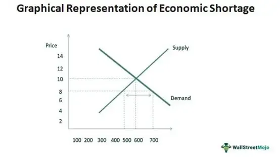

The global economy operates on cycles that include phases of growth followed by contractions, commonly referred to as recessions. A recession is identified by continuous declines in key economic indicators such as Gross Domestic Product (GDP), employment rates, and overall economic activity. During these periods of economic downturn, market dynamics can shift rapidly, affecting all financial sectors.

Algorithmic trading has become a cornerstone of modern financial markets, especially in periods marked by economic instability. This technology-driven trading method automates decision-making processes using pre-defined algorithms. These algorithms are capable of analyzing market data in real-time, executing trades at speeds and scales unattainable by human traders. In the context of a recession, algorithmic trading assumes significant importance. Not only does it provide critical liquidity to the markets, but it also may reduce transaction costs by optimizing trade execution strategies and mitigating market impact.



This article focuses on exploring the interplay between recessions and algorithmic trading, highlighting the mechanisms through which they interact during times of economic decline. Understanding this relationship is essential for traders and investors aiming to navigate the complexities of financial markets during turbulent times.

## Table of Contents

## Understanding Recessions and Economic Downturns

A recession is characterized by a significant decline in economic activity, occurring across the broader economy and lasting for several months or more. This decline can manifest through various measurable economic indicators. One widely recognized indicator is the Gross Domestic Product (GDP), which represents the total market value of all goods and services produced within a country. During a recession, GDP typically declines for two consecutive quarters, reflecting reduced economic output and activity.

Another crucial indicator of a recession is rising unemployment rates. As economic activity slows, businesses may reduce their workforce to cut costs, leading to increased unemployment. High unemployment rates not only diminish consumer spending power but also reduce overall consumer confidence, further exacerbating economic decline.

Falling retail sales also signify a recessionary period, as consumers often restrict spending amid economic uncertainty. This reduction in spending impacts businesses' revenues and profitability, prompting further economic contraction. A drop in retail sales is frequently observed as consumers prioritize savings over expenditure and delay significant purchases due to uncertain financial prospects.

Recessions typically stem from a combination of factors, each contributing to the decline in economic activity. Consumer confidence plays a pivotal role — when individuals and businesses lose confidence in the economic future, they tend to reduce spending and investment. This downturn in spending affects every layer of the economy, from manufacturing and services to retail sectors.

Inflation is another [factor](/wiki/factor-investing) that can contribute to recessions. While moderate inflation is normal in a growing economy, excessive inflation erodes purchasing power, leading to decreased consumer spending. High inflation rates can prompt central banks to increase interest rates, which raises borrowing costs and further restrains economic activity.

Declining investments also characterize recessions. Uncertainty about economic conditions and future profitability can lead businesses to cut back on capital expenditures, such as purchasing new equipment or expanding facilities. Reduced investment stalls economic growth, affecting employment and productivity in the long term.

Understanding these indicators and causes allows economists and policymakers to make informed decisions to mitigate the effects of recessions, aiming to restore stability and growth to the economy.

## Algorithmic Trading in the Face of Economic Challenges

Algorithmic trading utilizes sophisticated algorithms to automate trading decisions, enabling a rapid response to fluctuations in the market. This automated approach is especially beneficial during economic downturns, where traditional trading methods may face significant challenges. By deploying [algorithmic trading](/wiki/algorithmic-trading) strategies, traders can enhance [liquidity](/wiki/liquidity-risk-premium) in markets that might otherwise experience stagnation. As a result, transaction costs are reduced, which can be crucial in situations where every basis point counts.

One of the primary advantages of algorithmic trading during economic challenges is its ability to quickly process and analyze large volumes of data. This capability allows traders to respond to market signals almost instantaneously, fostering efficiency even amidst heightened uncertainty. Algorithms can dynamically adjust to market conditions by executing pre-programmed rules or leveraging [machine learning](/wiki/machine-learning) models that continuously learn from the market environment.

However, while algorithmic trading can provide substantial benefits, it is not without its potential drawbacks. One significant concern is the contribution to market [volatility](/wiki/volatility-trading-strategies). During market declines, algorithms may engage in high-frequency trading that exacerbates price swings, leading to flash crashes or rapid recoveries that do not reflect underlying economic realities. Therefore, managing the risk associated with such volatility is a critical task for traders utilizing these systems.

To effectively leverage algorithmic trading against economic indicators, traders need to incorporate robust models that align closely with the prevailing economic environment. For instance, when key recession indicators suggest a contracting economy, algorithms can adjust their strategies by favoring safe-haven assets or implementing hedging mechanisms.

Python is one popular tool for implementing such trading algorithms, offering libraries like NumPy and Pandas for data manipulation and analysis. Below is an example of a simple moving average crossover strategy, often used in algorithmic trading to identify buy and sell signals:

```python
import pandas as pd

# Example data: market price data
data = {'market_price': [100, 102, 101, 105, 107, 110, 108, 107, 111, 112]}
df = pd.DataFrame(data)

# Calculate short and long moving averages
short_window = 3
long_window = 5
df['short_mavg'] = df['market_price'].rolling(window=short_window, min_periods=1).mean()
df['long_mavg'] = df['market_price'].rolling(window=long_window, min_periods=1).mean()

# Identify buy/sell signals based on moving average crossovers
df['signal'] = 0  # Default signal: 0
df['signal'][short_window:] = \
    ((df['short_mavg'][short_window:] > df['long_mavg'][short_window:]).astype(int) -
     (df['short_mavg'][short_window:] < df['long_mavg'][short_window:]).astype(int))

print(df)
```

This script demonstrates how a simple algorithmic trading strategy might be coded to respond to changing market conditions. By enhancing these models with real-time economic data and sentiment analysis, traders can create adaptive strategies that mitigate risks associated with economic downturns and optimize their performance amidst financial uncertainty. As the landscape of algorithmic trading continues to evolve, integrating these advanced techniques will be vital in navigating future economic challenges while maintaining market stability.

## Recession Indicators and Their Predictive Value

Economic downturns are complex phenomena that do not occur without preceding warning signs. Key indicators commonly associated with impending recessions include inverted yield curves, rising unemployment rates, and declining corporate earnings. Understanding these indicators is vital for formulating effective trading and investment strategies, particularly for algorithmic trading platforms that rely on data-driven decision-making.

An inverted yield curve is one of the most reliable predictors of economic recessions. It occurs when short-term interest rates surpass long-term rates, indicating a shift in investor confidence. Typically, under normal circumstances, longer-term bonds offer higher yields to compensate for risks associated with time. An inverted yield curve suggests that investors anticipate future economic weakness or recession, causing them to seek long-term securities despite lower yields. Historically, an inverted yield curve has preceded many recessions, making it a critical element for predictive models.

Unemployment rates also serve as a crucial indicator of economic health. Rising unemployment rates suggest that companies are reducing their workforce in response to declining economic activity, potentially leading to reduced consumer spending and, subsequently, a recession. Tracking changes in unemployment rate trends helps algorithmic trading systems adjust strategies well before economic downturns materialize fully.

Corporate earnings provide another significant clue regarding economic health. During times of economic strength, robust corporate earnings reflect consumer and business confidence. Conversely, a decline in corporate earnings signifies waning demand and can suggest that a recession is on the horizon. By monitoring quarterly corporate earnings reports, algorithmic models can gauge the broader economic sentiment and adjust trading strategies to mitigate risks.

Algorithmic trading systems utilize these recession indicators to enhance their predictive capabilities. Advanced algorithms incorporate real-time data analytics to continuously monitor these economic factors, react to changing conditions, and optimize trading strategies. By integrating these indicators within their models, trading algorithms can identify potential downturns more accurately and implement strategies such as hedging or reallocating assets to safer classes.

Python code can be used to implement basic monitoring of these indicators. For example, to check for an inverted yield curve, one could retrieve data on yields from financial databases and calculate the difference between long-term and short-term rates:

```python
import pandas as pd

# Sample yield data
data = {'short_term_yield': [2.5, 2.6, 2.7],
        'long_term_yield': [2.8, 2.7, 2.6]}

df = pd.DataFrame(data)

# Function to detect yield curve inversion
def check_inverted_yield(df):
    df['yield_difference'] = df['long_term_yield'] - df['short_term_yield']
    inverted = df['yield_difference'] < 0
    return inverted.any()

is_inverted = check_inverted_yield(df)
print(f"Yield curve inverted: {is_inverted}")
```

Combining this kind of data analysis with real-time unemployment and corporate earnings monitoring allows trading algorithms to adapt proactively to potential recessionary signals. Such methodologies emphasize the importance of leveraging technological advancements to navigate economic challenges, illustrating the critical role algorithmic trading plays in contemporary market environments.

## Historical Context: Lessons from Past Economic Downturns

The Great Depression and the Great Recession stand out as pivotal historical events that provide valuable insights into the nature of economic downturns and the necessary measures for recovery. Both events highlight the substantial impact of economic contractions on global markets and underscore the critical importance of sound financial policies and practices.

The Great Depression, which began with the stock market crash of 1929, led to a worldwide economic contraction that persisted throughout the 1930s. This period was marked by significant declines in industrial production, mass unemployment, deflation, and severe disruption to global trade. A key lesson from this era was the detrimental effect of insufficient government intervention and the failure of monetary policies to stabilize the economy quickly. It wasn't until the introduction of expansive fiscal policies and reforms—partly initiated by the New Deal in the United States—that the path to recovery was laid. The implementation of regulatory measures such as the Glass-Steagall Act was crucial in restoring confidence in the banking sector by separating investment and commercial banking activities.

The Great Recession of 2007-2009, triggered by the collapse of the housing market and the subsequent financial crisis, illustrated the dangers of excessive speculation and inadequate regulatory oversight. It affected economies globally, leading to significant declines in GDP, heightened volatility in financial markets, and severe job losses. Unlike during the Great Depression, governments and central banks around the world rapidly responded with aggressive monetary policy measures, including [interest rate](/wiki/interest-rate-trading-strategies) cuts and quantitative easing, along with fiscal stimulus packages to stabilize financial systems and stimulate economic activity.

Algorithmic trading played a vital role during the Great Recession by providing liquidity to the markets and maintaining pricing efficiency despite high levels of volatility. These trading systems enabled rapid adjustment to market dynamics, although their contribution to market volatility has been a subject of contention. The crisis underscored the necessity for robust risk management frameworks and the integration of advanced analytics to detect systemic risks early.

Evaluating these historical downturns emphasizes the significance of adaptive policy-making and the integration of technological advancements, such as algorithmic trading, within financial systems. These elements are critical to mitigating the adverse effects of future economic challenges and ensuring smoother recovery trajectories. The lessons from past recessions encourage a continuous evolution of financial strategies, leveraging technological progress to enhance economic resilience and stability.

## Enhancing Algorithmic Trading for Future Economic Challenges

Advancements in [artificial intelligence](/wiki/ai-artificial-intelligence) (AI) and machine learning (ML) have greatly enhanced the capabilities of algorithmic trading systems, enabling them to process vast amounts of data and execute trades with remarkable precision. These technologies allow for the development of sophisticated trading algorithms capable of analyzing patterns and predicting market movements more accurately than traditional methods.

Incorporating real-time data analysis into algorithmic trading systems is crucial for maintaining a competitive edge. Real-time data streams allow algorithms to swiftly adjust to market fluctuations, enhancing their ability to make informed trading decisions. Machine learning models, such as neural networks, can be trained to recognize complex patterns within these data streams, enabling them to predict future price movements or market trends. Sentiment analysis, which involves processing and interpreting large volumes of news articles, social media posts, and financial reports, also adds a valuable dimension to trading strategies. By analyzing investors' sentiments, algorithms can gauge market mood and anticipate price changes prompted by shifts in investor confidence.

One promising approach to leveraging these enhancements is the implementation of [reinforcement learning](/wiki/reinforcement-learning) techniques in trading algorithms. Reinforcement learning provides a framework where algorithms can iteratively improve their trading strategies by learning from previous successes and failures. This adaptive learning process is particularly beneficial during periods of economic instability, such as recessions, where market conditions can be unpredictable and volatile. 

```
import pandas as pd
import numpy as np
from sklearn.preprocessing import MinMaxScaler
from sklearn.model_selection import train_test_split
from keras.models import Sequential
from keras.layers import Dense, LSTM

# Example: Building an LSTM model for stock price prediction

# Load and preprocess data
data = pd.read_csv('stock_prices.csv')
data = data[['Close']].values
scaler = MinMaxScaler(feature_range=(0, 1))
scaled_data = scaler.fit_transform(data)

# Prepare training and testing datasets
def create_dataset(data, time_step=1):
    X, Y = [], []
    for i in range(len(data) - time_step - 1):
        a = data[i:(i + time_step), 0]
        X.append(a)
        Y.append(data[i + time_step, 0])
    return np.array(X), np.array(Y)

time_step = 60
X, Y = create_dataset(scaled_data, time_step)
X = X.reshape((X.shape[0], X.shape[1], 1))

X_train, X_test, Y_train, Y_test = train_test_split(X, Y, test_size=0.2, random_state=42)

# Build LSTM model
model = Sequential()
model.add(LSTM(50, return_sequences=True, input_shape=(X_train.shape[1], 1)))
model.add(LSTM(50, return_sequences=False))
model.add(Dense(25))
model.add(Dense(1))

# Compile and train the model
model.compile(optimizer='adam', loss='mean_squared_error')
model.fit(X_train, Y_train, batch_size=1, epochs=1)

# Predict and visualize
predictions = model.predict(X_test)
predictions = scaler.inverse_transform(predictions)
```

Future trends in algorithmic trading emphasize the integration of economic forecasting and maintaining market stability during downturns. Economic forecasting models can offer insights into forthcoming macroeconomic changes, such as shifts in supply and demand or alterations in fiscal policies, allowing trading systems to preemptively adjust strategies. By aligning trading algorithms with broader economic indicators, firms can mitigate risk and capitalize on opportunities arising from macroeconomic trends.

Additionally, ensuring market stability is a growing concern in the continuous development of algorithmic trading. The potential for algorithms to contribute to volatility highlights the need for rigorous risk management protocols and circuit breakers. Advanced risk assessment techniques can prevent excessive price swings and protect financial markets from systemic disruptions, ultimately fostering a more resilient trading environment.

This strategic integration of AI, machine learning, and economic insights represents a transformative step forward, equipping traders with the tools necessary to navigate future economic challenges with greater confidence and precision.

## Conclusion

Recessions and economic downturns exert a profound influence on global markets, compelling the adoption of adaptive financial strategies. In these challenging environments, algorithmic trading emerges as both a boon and a potential source of volatility. With its ability to process vast amounts of data at high speeds, algorithmic trading can enhance liquidity and efficiency in financial markets, offering a crucial tool during times of economic uncertainty. However, this technology also presents challenges, including the possibility of exacerbating market volatility through rapid, automated decision-making.

To capitalize on the opportunities presented by algorithmic trading during economic downturns, continuous innovation and adaptation in trading strategies are essential. Traders must refine their algorithms to respond effectively to the dynamic conditions of recessions, such as shifts in liquidity, volatility, and market sentiment. This requires a deep understanding of economic indicators like GDP contraction, unemployment spikes, and corporate earnings declines, which signal potential downturns.

By leveraging technology, traders can better anticipate and respond to these indicators. Machine learning and artificial intelligence can enhance predictive capabilities by analyzing historical data and identifying patterns indicative of economic stress. Real-time data analysis enables traders to adapt their strategies promptly, aligning with the rapidly changing market conditions characteristic of recessions.

In conclusion, the intricate relationship between recessions and algorithmic trading underscores the need for traders to keep pace with technological advancements while maintaining a nuanced understanding of economic indicators. Through strategic adaptation and technology integration, traders can navigate the complexities of economic declines, turning potential challenges into opportunities for enduring success in volatile financial landscapes.

## References & Further Reading

[1]: Bergstra, J., Bardenet, R., Bengio, Y., & Kégl, B. (2011). ["Algorithms for Hyper-Parameter Optimization."](https://dl.acm.org/doi/10.5555/2986459.2986743) Advances in Neural Information Processing Systems 24.

[2]: ["Advances in Financial Machine Learning"](https://www.amazon.com/Advances-Financial-Machine-Learning-Marcos/dp/1119482089) by Marcos Lopez de Prado

[3]: ["Evidence-Based Technical Analysis: Applying the Scientific Method and Statistical Inference to Trading Signals"](https://www.amazon.com/Evidence-Based-Technical-Analysis-Scientific-Statistical/dp/0470008741) by David Aronson

[4]: ["Machine Learning for Algorithmic Trading"](https://github.com/stefan-jansen/machine-learning-for-trading) by Stefan Jansen

[5]: ["Quantitative Trading: How to Build Your Own Algorithmic Trading Business"](https://www.amazon.com/Quantitative-Trading-Build-Algorithmic-Business/dp/1119800064) by Ernest P. Chan