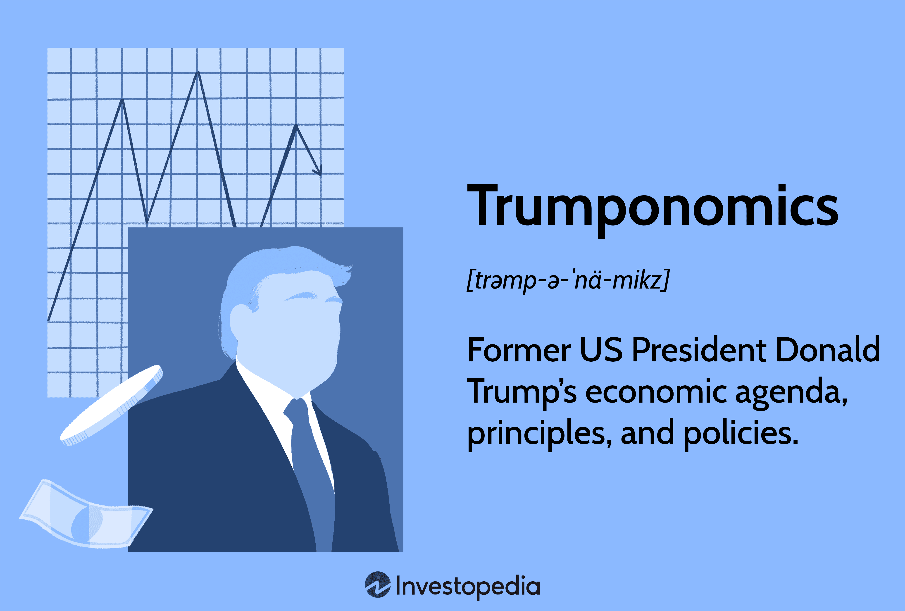

This article examines the economic implications of Donald Trump's presidency on the United States economy, with a particular emphasis on algorithmic trading. Throughout Trump's tenure from January 2017 to January 2021, a range of economic policies significantly impacted the national and global markets. By focusing on both achievements and controversies, this article provides a detailed analysis of how Trump's economic strategies shaped the business and trading environment.

Key elements of Trump's economic legacy include his administration's trade wars, tax reforms, and deregulation efforts. These policies, marked by aggressive tariffs and corporate tax cuts, were intended to boost domestic growth and transform international trade relations. However, they also ushered in market volatility and geopolitical uncertainty, significantly influencing financial markets and trading strategies.

Algorithmic trading, which relies on computer algorithms to execute trades based on market data and trends, especially responded to these policy shifts. Trump's economic policies often resulted in sudden market fluctuations, presenting both challenges and opportunities for algorithmic traders. Traders and financial institutions adapted their strategies to leverage the resulting market conditions, enhancing the performance of their trading algorithms amidst the shifting economic landscape.

This comprehensive overview seeks to illuminate the intricate relationship between political policy decisions during Trump's presidency and their broader economic outcomes, especially concerning algorithmic trading. By understanding these interconnected dynamics, readers can gain insights into the consequences of fiscal policy on market performance and the evolving nature of modern trading strategies.

## Table of Contents

## Economic Achievements Under Trump

During Donald Trump's presidency, the United States experienced notable economic achievements, especially before the onset of the COVID-19 pandemic. A significant factor contributing to this economic robustness was the passing of the Tax Cuts and Jobs Act in 2017. This legislation led to substantial reductions in corporate tax rates, dropping from 35% to 21%, which aimed to stimulate business investments and foster economic growth. The tax cuts were intended to enhance the competitiveness of American corporations on a global scale and incentivize the repatriation of profits held overseas.

Another hallmark of Trump's economic achievements was the performance of the stock markets, which reached record highs during his term. This bullish market environment reflected strong investor confidence and contributed to a healthy economic sentiment across the nation. The S&P 500, one of the key indicators of market health, saw substantial gains, breaking several all-time high records during this period. Factors contributing to this performance included the expectation of sustained corporate earnings growth supported by the tax reforms and a favorable regulatory environment.

In terms of employment, the Trump administration sustained the [momentum](/wiki/momentum) of job creation inherited from previous years, leading to historically low unemployment rates. According to the Bureau of Labor Statistics, the unemployment rate fell to 3.5% in 2019, marking a 50-year low. This decline in unemployment was accompanied by job growth across various sectors, bolstering economic confidence and spending power among consumers.

Algorithmic trading, which relies on mathematical models and historical data to make trading decisions, was significantly influenced by these economic conditions. The bullish market that characterized much of Trump's presidency provided fertile ground for [algorithmic trading](/wiki/algorithmic-trading) strategies. The reduction in corporate taxes and subsequent growth in corporate earnings created numerous opportunities for algorithms to capitalize on market trends. Algorithms benefited from increased market volumes and [volatility](/wiki/volatility-trading-strategies), allowing for enhanced high-frequency trading strategies and better execution of [arbitrage](/wiki/arbitrage) opportunities.

Overall, the economic achievements under Trump's presidency were marked by tax reforms, record stock market performance, and low unemployment rates. These factors combined facilitated a conducive environment for economic activities and advancements in algorithmic trading strategies. These achievements underscored the interconnectedness of fiscal policy decisions and market dynamics, influencing trading practices and economic outcomes.

## Challenges and Controversies

Trade wars, especially with China, were central to Donald Trump’s economic strategy and had significant implications for global commerce. Trump’s administration imposed tariffs on approximately $360 billion of Chinese goods, which led to retaliatory actions and heightened tensions between the two largest global economies. This policy aimed to address trade imbalances and protect American industries but resulted in increased costs for businesses and consumers, occasionally negating the intended benefits.

The economic landscape during Trump's term changed dramatically with the onset of the COVID-19 pandemic. The pandemic-induced recession sharply contrasted with the economic gains made earlier in his presidency. In 2020, the U.S. economy contracted by 3.5%, marking the worst decline since the Great Depression. The disruptions caused to global supply chains and domestic industries had a profound impact on businesses and the workforce.

Another major concern during Trump's presidency was the increasing national debt and annual budget deficits, which escalated due to both tax cuts and increased government spending, including significant COVID-19 relief packages. By the end of Trump's term, the national debt had increased by roughly $7.8 trillion, reaching over $27 trillion, raising concerns about long-term fiscal sustainability and the burden on future generations.

Trump's tariff strategy faced criticism for its limited effectiveness in achieving long-term benefits for American industry. Industry leaders argued that while tariffs offered temporary relief, they did not lead to comprehensive policy solutions for structural issues such as innovation, competitiveness, and workforce development. Instead, they often led to increased production costs and retaliatory tariffs on American exports.

Algorithmic traders had to navigate the increased market volatility caused by trade policy uncertainties. The unexpected nature of trade announcements and retaliatory measures required traders to adapt strategies quickly. Algorithmic trading systems, which rely on rapid decision-making and pattern recognition, had to incorporate additional variables related to geopolitical risks and policy changes to maintain performance. This environment provided opportunities for high-frequency trading, which capitalizes on short-term market fluctuations, yet also posed challenges in predicting market directions due to unpredictable political influences. 

Overall, Trump's economic policies introduced both opportunities and challenges for market participants, highlighting the intertwined nature of geopolitical events and financial markets.

## Impact of Trade Wars on Algorithmic Trading

Trade wars during Donald Trump's presidency introduced substantial volatility into global financial markets. This volatility became a critical focus for algorithmic traders, who rely on speed, precision, and data-driven strategies to capitalize on market fluctuations.

Firstly, algorithmic strategies needed to adapt to sudden market shifts prompted by tariff announcements and other trade policy developments. These abrupt changes could quickly alter asset prices, creating opportunities and risks that algorithmic trading systems had to handle dynamically. This required enhancements in real-time data analysis and fast execution capabilities to maintain competitiveness.

High-frequency trading ([HFT](/wiki/high-frequency-trading-strategies)) particularly benefitted from the increased market instability. HFT firms leverage their superior technology and infrastructure to execute trades on the millisecond scale, allowing them to profit from the quick oscillations in price triggered by geopolitical events. The rapid responses to news, such as tariff impositions or trade negotiations, provide fertile ground for these traders.

Moreover, algorithmic traders adjusted their models to exploit arbitrage opportunities that arose due to mismatches in asset pricing caused by trade tensions. These arbitrage opportunities could take multiple forms, including temporal, statistical, and spatial arbitrage. Models enhanced with [machine learning](/wiki/machine-learning) algorithms allowed traders to identify and act on these opportunities more effectively.

For instance, consider a simplified model where an algorithm detects pricing inefficiencies between two correlated assets $A$ and $B$ due to different responses to a trade announcement. The algorithm uses a pricing equation:

$$
\text{Price of A} = \alpha \times \text{Price of B} + \beta + \epsilon
$$

where $\alpha$ and $\beta$ are coefficients learned from historical data, and $\epsilon$ is the error term. When the observed price of $A$ differs significantly from the predicted price, the algorithm triggers trades to exploit the discrepancy, assuming reversion to the mean.

Additionally, trade policy uncertainties necessitated the evolution of data-driven trading models to incorporate geopolitical risk factors more prominently. Predictive analytics, enhanced by machine learning, enabled algorithms to [factor](/wiki/factor-investing) in broader economic indicators and political dynamics. Trading algorithms began to use natural language processing (NLP) techniques to parse news articles, financial reports, and social media for sentiment analysis, further refining their risk assessment models.

In conclusion, the trade wars under Trump's administration created a fertile environment for algorithmic trading to advance its methodologies. By adjusting strategies to the challenges and opportunities posed by market volatility, algorithmic traders continued to evolve, developing more sophisticated models and technologies that will likely have enduring impacts on financial markets.

## Algorithmic Trading in the Era of Deregulation

Deregulation during Donald Trump's presidency potentially reduced barriers for financial institutions, leading to notable shifts in trading volumes and activities. This environment allowed algorithmic trading firms to experience growth, as fewer regulatory constraints generally mean increased opportunities for market entry and participation. The administration's focus on deregulation extended to various sectors, including notable rollbacks in environmental regulations. Such changes influenced the energy sector's trading dynamics, providing new venues for algorithmic trading strategies focusing on commodities like oil, natural gas, and other energy resources.

The easing of regulatory frameworks provided algorithmic trading models access to a wider variety of data inputs and variables, especially those related to environmental impacts and regulatory alterations. These evolving datasets allowed traders to refine algorithms to consider environmental factors, adapting strategies to exploit new market conditions effectively. As deregulation efforts led to fluctuations in sector-specific regulations, algorithmic trading systems needed to accommodate these changes, integrating real-time data analytics to anticipate shifts in policy and market conditions.

Moreover, the nuanced effects of deregulation necessitated continuous adaptation of trading algorithms. The landscape required intricate modeling to manage risks associated with sudden regulatory changes, ensuring that trading strategies remained resilient against potential market shocks. Algorithms needed to be more adaptive, incorporating machine learning and [artificial intelligence](/wiki/ai-artificial-intelligence) to predict outcomes and optimize performance amidst an evolving regulatory backdrop.

The combination of reduced barriers and sector-specific changes reshaped the algorithmic trading landscape, presenting both opportunities and challenges for trading firms. As regulations shifted, algorithmic models had to evolve, demonstrating the critical importance of flexibility and innovative adaptation in maintaining competitive advantage in financial markets influenced by political and regulatory dynamics.

## Comparative Analysis With Past Administrations

Donald Trump's economic policies marked a significant departure from those of Barack Obama, characterized primarily by a focus on tax cuts and protectionism. This divergence is evident through various economic indicators and the overall impact on algorithmic trading strategies, which had to adapt to changing market conditions.

Under Trump's presidency, the Tax Cuts and Jobs Act of 2017 reduced the corporate tax rate from 35% to 21%, aimed at stimulating economic growth by incentivizing businesses to invest domestically. In contrast, Obama’s administration was marked by policies such as the American Recovery and Reinvestment Act, which emphasized fiscal stimulus and regulatory oversight—particularly in the wake of the 2008 financial crisis. The tax policy under Trump was a key differentiator, intended to bolster corporate profits and influence market behavior differently than the regulatory approach of his predecessor.

Economic indicators such as GDP growth and unemployment rates provide quantitative measures of the varying impacts between the two administrations. Trump's term initially saw robust economic growth and declining unemployment, continuing trends from the latter years of the Obama administration. However, the economic downturn induced by the COVID-19 pandemic in 2020 reversed many of these gains, leading to a rise in unemployment and negative GDP growth. By contrast, Obama inherited a contracting economy and high unemployment rates, which gradually improved over his presidency.

When comparing market performance during Trump's tenure to the economic legacies of Bill Clinton and George W. Bush, differing approaches to fiscal policy become apparent. The Clinton years were marked by economic expansion and budget surpluses, attributed to both technology-driven growth and fiscal restraint. Bush, however, dealt with the aftermath of the dot-com bubble and the onset of the 2008 financial crisis, which required significant fiscal interventions. Trump's focus on tax cuts parallels Bush's initial tax relief policies, but protectionist trade measures introduced volatility absent in prior administrations.

Algorithmic trading, inherently adaptable and resilient, showcased its capacity to withstand these varying economic policies across presidential tenures. During Trump's presidency, algorithmic traders capitalized on favorable tax environments and managed risks associated with increased market volatility due to trade tensions. These trading systems, reliant on data-driven strategies, were forced to integrate new variables such as geopolitical risks introduced by Trump's policies, contrasting with the more stable policy period under Obama.

Ultimately, the fiscal and trade policies enacted during different administrations underscore the varying trading environments faced by algorithmic traders. While Obama's regulatory measures provided a stable framework, Trump's tenure challenged these systems with abrupt policy shifts, necessitating a continuous evolution of algorithmic methodologies. The contrast highlights how presidential policy choices shape not only economic landscapes but also influence the adaptation mechanisms within financial markets.

## Conclusion: Long-Term Economic Impacts

Trump's presidency left an intricate legacy on the United States economy with significant ramifications for trading practices, particularly in algorithmic trading. The policies implemented during his tenure have been observed to produce both immediate benefits and longer-term fiscal challenges.

The most apparent short-term gain was the substantial growth in stock markets, driven by investor optimism and tax policies that favored corporations, such as the Tax Cuts and Jobs Act. This created an environment where algorithmic trading systems thrived, taking advantage of the bullish trends and increased trading volumes. On the contrary, Trump’s trade policies, notably the trade wars, introduced volatility and uncertainty which necessitated swift adaptability from algorithmic trading models. The frequent shifts in U.S. trade stance required traders to continually adjust their strategies to mitigate risks and exploit opportunities presented by fluid market conditions.

The long-term fiscal challenges posed by Trump's presidency, however, revolve around the increased national debt and budget deficits, which may affect future economic stability. These challenges could impact market confidence and influence the macroeconomic factors that algorithmic trading models depend upon, requiring more sophisticated algorithms capable of forecasting and adjusting to potential long-term economic downturns.

As future administrations address Trump's economic policies, they will inevitably shape trading strategies on a global scale. This ongoing transformation emphasizes the crucial role of adapting technological innovations in trading to align with shifting political landscapes.

In summary, the intersection of Trump's political policies and advancements in financial technology illustrates how closely interrelated political decision-making and trading mechanisms are in the modern era. The continuous evolution of markets demands that algorithmic trading not only adapt to immediate changes but also anticipate and incorporate potential long-term economic shifts.

## References & Further Reading

[1]: Bergstra, J., Bardenet, R., Bengio, Y., & Kégl, B. (2011). ["Algorithms for Hyper-Parameter Optimization."](https://proceedings.neurips.cc/paper/2011/file/86e8f7ab32cfd12577bc2619bc635690-Paper.pdf) Advances in Neural Information Processing Systems 24.

[2]: ["Advances in Financial Machine Learning"](https://www.amazon.com/Advances-Financial-Machine-Learning-Marcos/dp/1119482089) by Marcos Lopez de Prado

[3]: ["Evidence-Based Technical Analysis: Applying the Scientific Method and Statistical Inference to Trading Signals"](https://www.amazon.com/Evidence-Based-Technical-Analysis-Scientific-Statistical/dp/0470008741) by David Aronson

[4]: ["Machine Learning for Algorithmic Trading"](https://github.com/PacktPublishing/Machine-Learning-for-Algorithmic-Trading-Second-Edition) by Stefan Jansen

[5]: ["Quantitative Trading: How to Build Your Own Algorithmic Trading Business"](https://books.google.com/books/about/Quantitative_Trading.html?id=j70yEAAAQBAJ) by Ernest P. Chan