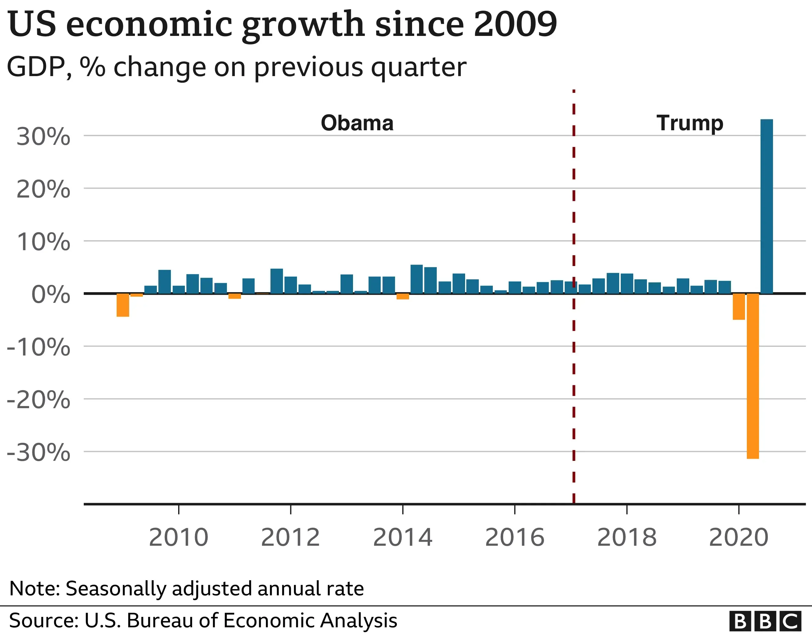

## Table of Contents

## What were the main economic policies introduced by Donald Trump during his presidency?

During his presidency, Donald Trump introduced several economic policies aimed at boosting the economy and supporting American businesses. One of his key policies was the Tax Cuts and Jobs Act of 2017, which lowered the corporate tax rate from 35% to 21%. This was intended to make American companies more competitive globally and encourage them to invest more in the U.S. Additionally, the act reduced individual income tax rates, which was meant to put more money in people's pockets and stimulate spending.

Another significant policy was Trump's focus on deregulation. He believed that too many regulations were holding businesses back, so he worked to reduce them across various industries. This included rolling back environmental regulations, financial regulations, and others that he saw as burdensome. Trump also pursued a policy of protectionism, imposing tariffs on many imported goods, especially from China. He argued that these tariffs would protect American industries and jobs from unfair competition. However, these tariffs also led to increased costs for some American businesses and consumers.

## How did Trump's tax cuts affect the U.S. economy?

Trump's tax cuts had a big effect on the U.S. economy. The Tax Cuts and Jobs Act of 2017 made the corporate tax rate go down from 35% to 21%. This meant that businesses had more money to spend. Many companies used this extra money to buy new equipment, expand their businesses, and even give bonuses to their employees. The tax cuts also lowered the amount of taxes that people had to pay on their income. This gave people more money to spend, which helped the economy grow. In the years after the tax cuts, the U.S. economy did grow, and unemployment went down.

However, the tax cuts also had some problems. They made the federal budget deficit grow bigger because the government was taking in less money in taxes. Some people worried that the tax cuts mostly helped rich people and big businesses, and didn't help regular people as much. Also, some businesses used the extra money to buy back their own stock instead of investing in new projects or raising wages. So, while the tax cuts did help the economy grow, they also led to bigger budget deficits and didn't help everyone equally.

## What impact did the trade policies, such as tariffs on China, have on the U.S. economy?

Trump's trade policies, especially the tariffs on China, had a mixed impact on the U.S. economy. The tariffs were meant to protect American businesses and jobs by making imported goods from China more expensive. This was supposed to encourage people to buy American-made products instead. Some industries, like steel and aluminum, did benefit from these tariffs because they faced less competition from cheaper imports. However, the tariffs also made some things more expensive for American businesses and consumers. For example, many companies that used parts from China had to pay more for those parts, which could lead to higher prices for their products.

The trade war with China also caused some uncertainty in the economy. Businesses were not sure if the tariffs would stay or change, so they sometimes held back on making big investments or expanding. This uncertainty could slow down economic growth. Additionally, China responded to the U.S. tariffs by putting tariffs on American goods, which hurt some U.S. farmers and other exporters. The trade war did lead to some negotiations and a Phase One trade deal in 2020, but the overall impact on the U.S. economy was a bit of a mixed bag. While some sectors benefited, others faced higher costs and uncertainty.

## How did the deregulation efforts under Trump influence economic growth?

Trump's deregulation efforts were meant to help the economy grow by making it easier for businesses to operate. He rolled back many rules that he thought were too strict or slowed businesses down. For example, he made changes to environmental rules and banking regulations. By doing this, he hoped businesses would feel more free to invest and grow, which could lead to more jobs and a stronger economy. Some businesses did benefit from these changes and were able to expand more easily.

However, not everyone agreed that deregulation was good for the economy. Some people worried that less regulation could lead to problems, like more pollution or risky behavior in the financial sector. They thought that these risks could hurt the economy in the long run. Also, while some businesses did well, it wasn't clear if deregulation helped everyone equally. So, while Trump's deregulation efforts did help some parts of the economy grow, the overall impact was a bit mixed and depended on which industry you looked at.

## What was the effect of Trump's economic policies on employment and unemployment rates?

Trump's economic policies had a positive effect on employment and unemployment rates during his time as president. The Tax Cuts and Jobs Act of 2017 gave businesses more money to spend, which led to more hiring. Many companies used the extra money to expand and create new jobs. As a result, the unemployment rate went down a lot. By the end of Trump's term, the unemployment rate was at a very low level, which meant that more people who wanted jobs were able to find them. This was good news for many Americans who were looking for work.

However, the effects of these policies were not the same for everyone. While many people found jobs, some industries did better than others. For example, the tariffs on China helped some businesses but hurt others, like farmers who sold their products to China. Also, not all the new jobs were high-paying or long-lasting. Some people got jobs that didn't pay well or were only temporary. So, while Trump's policies did help lower unemployment and create jobs, the benefits were not spread out evenly across all workers and industries.

## How did the stock market perform during Trump's presidency?

During Donald Trump's presidency, the stock market did really well for a lot of the time. When he first became president, the stock market started to go up. People thought his policies, like tax cuts and less regulation, would help businesses make more money. The stock market kept going up for a few years, and it hit record highs. This made a lot of people who owned stocks happy because their investments were worth more.

However, the stock market did not go up all the time. In 2020, the stock market had a big drop because of the COVID-19 pandemic. A lot of businesses had to close, and people were worried about the economy. But the stock market started to go back up later in 2020. By the end of Trump's term, the stock market was higher than when he started, but it had been a bumpy ride. So, while the stock market did well overall during Trump's presidency, it was not always smooth.

## What were the changes in GDP growth rates during Trump's term?

During Donald Trump's time as president, the GDP growth rates went up and down. When he first started, the GDP growth rate was around 2%. Then, after his tax cuts and other policies, the GDP growth rate went up. In 2018 and 2019, the GDP grew by about 3% each year. This was higher than the years before Trump became president. People thought his policies helped the economy grow faster.

However, things changed in 2020 because of the COVID-19 pandemic. The economy got hit hard, and the GDP growth rate dropped a lot. In the second quarter of 2020, the GDP actually shrank by about 31%. This was a big drop, and it showed how bad the pandemic was for the economy. But, later in 2020, the economy started to get better. By the end of Trump's term, the GDP was growing again, but it was still lower than the years before the pandemic.

## How did Trump's policies affect income inequality in the U.S.?

Trump's policies had a mixed effect on income inequality in the U.S. The Tax Cuts and Jobs Act of 2017 lowered taxes for everyone, but it gave bigger tax cuts to rich people and big businesses. This meant that the rich got to keep more of their money, which made the gap between the rich and everyone else bigger. Some people got bonuses or raises because of the tax cuts, but not everyone saw their income go up a lot. So, the tax cuts helped the economy grow, but they also made income inequality worse.

On the other hand, Trump's policies did help create more jobs, and unemployment went down a lot. More people were able to find work, which is good for reducing income inequality. But not all the new jobs paid well or were long-lasting. Some people got jobs that didn't pay enough to make a big difference in their lives. Also, the tariffs on China helped some businesses but hurt others, like farmers. This meant that some people made more money, while others made less. Overall, Trump's policies had some good effects on employment, but they did not do much to reduce income inequality.

## What were the long-term economic implications of Trump's fiscal policies?

Trump's fiscal policies, like the big tax cuts and more spending, had some long-term effects on the U.S. economy. One big thing was that the federal budget deficit got a lot bigger. When you cut taxes and spend more money, but don't bring in as much money, you end up with a bigger deficit. This can be a problem because it means the government has to borrow more money. Over time, this can make it harder for the government to pay for important things like schools and roads. It can also make it harder to respond to emergencies, like a recession or another big problem.

Another long-term effect is that income inequality got worse. The tax cuts helped the rich more than everyone else, so the gap between the rich and the rest of the people got bigger. This can cause problems because when a few people have most of the money, it can make it harder for everyone else to get ahead. Also, some of the economic growth from Trump's policies might not last. The tax cuts helped the economy grow for a while, but they didn't fix some of the bigger problems, like how to make sure everyone has a good job and can afford to live. So, while Trump's policies did help the economy in some ways, they also created some challenges that will need to be dealt with in the future.

## How did global economic perceptions of the U.S. change under Trump's administration?

During Donald Trump's time as president, people around the world started to see the U.S. economy differently. Trump's policies, like big tax cuts and putting tariffs on other countries, made some people think the U.S. was trying to be more competitive and protect its own businesses. This made some countries worried because they thought the U.S. was not playing fair in global trade. But it also made some investors happy because they thought the U.S. was doing things to help its economy grow.

However, Trump's way of doing things also made some people unsure about the U.S. economy. He liked to change his mind a lot and would sometimes say things that made other countries not trust the U.S. as much. This uncertainty could make businesses think twice about investing in the U.S. or trading with it. So, while some parts of the world saw the U.S. economy as strong and growing, others saw it as unpredictable and harder to work with.

## What were the economic consequences of Trump's approach to international alliances and agreements?

Trump's approach to international alliances and agreements had a big impact on the U.S. economy. He pulled out of some big deals, like the Trans-Pacific Partnership (TPP) and the Paris Climate Agreement. He thought these deals were not good for the U.S. and that they put too many rules on American businesses. By leaving these agreements, Trump hoped to make better deals for the U.S. But, this also made some countries not trust the U.S. as much. They started to think the U.S. was not a reliable partner, which could make it harder for American businesses to sell their stuff in other countries.

Another thing Trump did was put tariffs on other countries, especially China. He thought this would protect American jobs and make the U.S. economy stronger. But, it also made some things more expensive for American businesses and people. Other countries put tariffs on U.S. goods too, which hurt some American farmers and other people who sold stuff overseas. So, while Trump's approach helped some parts of the economy, it also caused problems for others. It made the world economy more uncertain and could have made it harder for the U.S. to work with other countries in the future.

## How did Trump's economic policies compare to those of his predecessors in terms of effectiveness and sustainability?

Trump's economic policies were different from those of his predecessors in some big ways. He focused on cutting taxes a lot, especially for businesses, and he tried to get rid of many rules that he thought were holding businesses back. Compared to Barack Obama, who focused more on helping people recover from the 2008 financial crisis and on making new rules to protect the economy, Trump's approach was more about letting businesses do what they wanted. His tax cuts did help the economy grow faster for a while, and unemployment went down a lot. But, some people think these policies were not as good for everyone as Obama's, because they helped rich people and big businesses more than regular people.

In terms of sustainability, Trump's policies had some problems. The big tax cuts made the federal budget deficit grow a lot, which means the government had to borrow more money. This could be a problem for the future because it makes it harder for the government to pay for important things. Also, Trump's policies made income inequality worse, which can cause problems in the long run. Compared to his predecessors like George W. Bush, who also cut taxes but not as much, or Bill Clinton, who focused on balancing the budget, Trump's approach might not be as sustainable. While it helped the economy in the short term, it left some big challenges for the future.

## What is the impact of trade wars on algorithmic trading?

Trade wars during Donald Trump's presidency introduced substantial [volatility](/wiki/volatility-trading-strategies) into global financial markets. This volatility became a critical focus for algorithmic traders, who rely on speed, precision, and data-driven strategies to capitalize on market fluctuations.

Firstly, algorithmic strategies needed to adapt to sudden market shifts prompted by tariff announcements and other trade policy developments. These abrupt changes could quickly alter asset prices, creating opportunities and risks that [algorithmic trading](/wiki/algorithmic-trading) systems had to handle dynamically. This required enhancements in real-time data analysis and fast execution capabilities to maintain competitiveness.

High-frequency trading ([HFT](/wiki/high-frequency-trading-strategies)) particularly benefitted from the increased market instability. HFT firms leverage their superior technology and infrastructure to execute trades on the millisecond scale, allowing them to profit from the quick oscillations in price triggered by geopolitical events. The rapid responses to news, such as tariff impositions or trade negotiations, provide fertile ground for these traders.

Moreover, algorithmic traders adjusted their models to exploit [arbitrage](/wiki/arbitrage) opportunities that arose due to mismatches in asset pricing caused by trade tensions. These arbitrage opportunities could take multiple forms, including temporal, statistical, and spatial arbitrage. Models enhanced with [machine learning](/wiki/machine-learning) algorithms allowed traders to identify and act on these opportunities more effectively.

For instance, consider a simplified model where an algorithm detects pricing inefficiencies between two correlated assets $A$ and $B$ due to different responses to a trade announcement. The algorithm uses a pricing equation:

$$
\text{Price of A} = \alpha \times \text{Price of B} + \beta + \epsilon
$$

where $\alpha$ and $\beta$ are coefficients learned from historical data, and $\epsilon$ is the error term. When the observed price of $A$ differs significantly from the predicted price, the algorithm triggers trades to exploit the discrepancy, assuming reversion to the mean.

Additionally, trade policy uncertainties necessitated the evolution of data-driven trading models to incorporate geopolitical risk factors more prominently. Predictive analytics, enhanced by machine learning, enabled algorithms to [factor](/wiki/factor-investing) in broader economic indicators and political dynamics. Trading algorithms began to use natural language processing (NLP) techniques to parse news articles, financial reports, and social media for sentiment analysis, further refining their risk assessment models.

In conclusion, the trade wars under Trump's administration created a fertile environment for algorithmic trading to advance its methodologies. By adjusting strategies to the challenges and opportunities posed by market volatility, algorithmic traders continued to evolve, developing more sophisticated models and technologies that will likely have enduring impacts on financial markets.

## References & Further Reading

[1]: Bergstra, J., Bardenet, R., Bengio, Y., & Kégl, B. (2011). ["Algorithms for Hyper-Parameter Optimization."](https://proceedings.neurips.cc/paper/2011/file/86e8f7ab32cfd12577bc2619bc635690-Paper.pdf) Advances in Neural Information Processing Systems 24.

[2]: ["Advances in Financial Machine Learning"](https://www.amazon.com/Advances-Financial-Machine-Learning-Marcos/dp/1119482089) by Marcos Lopez de Prado

[3]: ["Evidence-Based Technical Analysis: Applying the Scientific Method and Statistical Inference to Trading Signals"](https://www.amazon.com/Evidence-Based-Technical-Analysis-Scientific-Statistical/dp/0470008741) by David Aronson

[4]: ["Machine Learning for Algorithmic Trading"](https://github.com/PacktPublishing/Machine-Learning-for-Algorithmic-Trading-Second-Edition) by Stefan Jansen

[5]: ["Quantitative Trading: How to Build Your Own Algorithmic Trading Business"](https://books.google.com/books/about/Quantitative_Trading.html?id=j70yEAAAQBAJ) by Ernest P. Chan