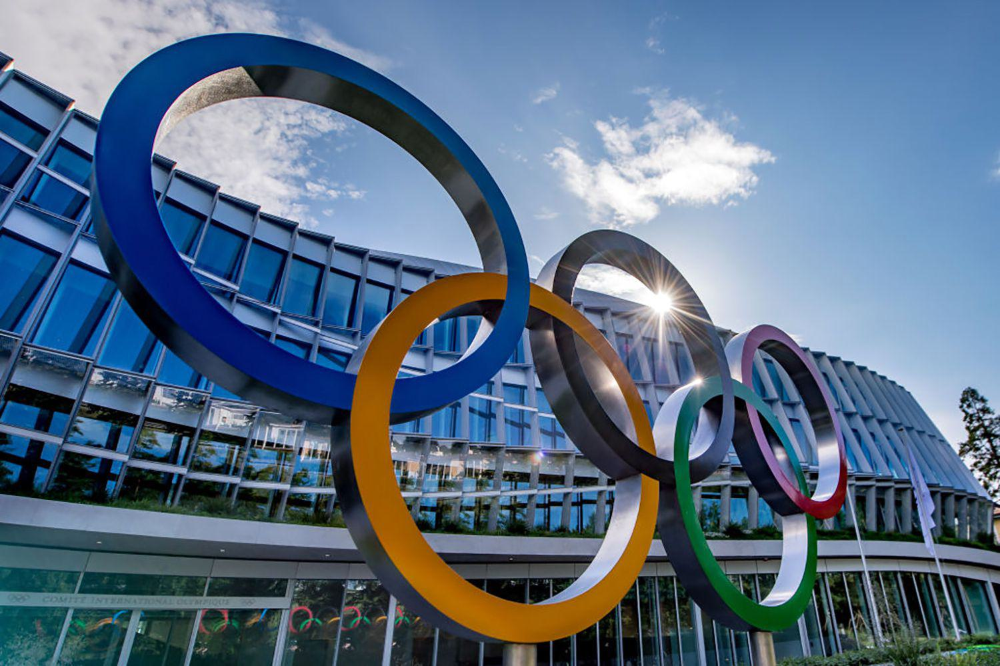

The Olympics is one of the most prestigious sporting events globally, consistently drawing massive international attention and substantial financial investment. As athletes from across the globe compete, host cities showcase their cultural heritage and, in turn, experience a unique opportunity to enhance their global standing. The promise of such recognition often motivates cities to vie for the role of host, despite the complex economic landscape that accompanies the event.

Hosting the Olympics can be perceived as a potential economic advantage, offering prospects for urban development and increased tourism. Proponents argue that the games stimulate job creation, lead to infrastructure improvements, and generate substantial economic activity. Such factors are often seen as catalysts for long-term economic revitalization, potentially offsetting the enormous costs incurred during the preparation and execution of the event. 



However, despite such prospects, the financial responsibilities and risks associated with hosting are formidable. Historical instances show that the anticipated economic benefits can be overshadowed by immense costs and unmet financial expectations. Overruns in construction budgets, underutilized infrastructures post-event, and pressures on local services are common challenges faced by host cities. Essentially, the economic impact of hosting the Olympics is a complex mix of potential short-term gains and long-term financial obligations, making the decision to bid for the games a substantial gamble for any city.

Moreover, the intersection of the Olympics with financial markets introduces unique dynamics, particularly with the growing influence of algorithmic trading strategies. This fusion underscores how global sporting events can resonate beyond athletes and spectators, rippling through to affect market behaviors and investor strategies. Consequently, understanding these dynamics is crucial for cities contemplating a future bid, as financial and planning strategies must be meticulously crafted to mitigate the inherent risks and financial exposures associated with hosting the world's grandest athletic stage.

## Table of Contents

## The Economic Impact of Hosting the Olympics

Hosting the Olympics represents a significant economic undertaking, with cities often required to invest heavily in infrastructure and logistics. The preparation for the Games typically involves constructing or upgrading sports facilities, expanding public transportation networks, and enhancing other urban infrastructure. These efforts aim not only to meet the demands of the event but also to leave a lasting legacy that benefits the host city. However, the economic outcomes of hosting the Olympics can vary widely, with some cities managing to leverage the event for substantial economic returns, while others grapple with financial challenges long after the Games have concluded.

For example, Paris, London, and Rio de Janeiro—cities that have hosted the Olympics—have experienced diverse economic impacts post-Olympics. The London 2012 Olympics are often cited as a success story, with the city benefiting from increased tourism and significant development in the East London area. The strategic planning and efficient use of resources allowed London to generate positive economic effects, although it was not without its financial burdens. Reports suggested that the UK government aimed to ensure sustainable economic benefits through job creation and increased tourism [1]. 

Conversely, the 2016 Rio de Janeiro Olympics highlighted the potential for negative economic consequences. Amid political turmoil and economic recession in Brazil, Rio's hosting led to substantial debt, with infrastructure projects either abandoned or underutilized post-Games. The anticipated economic boost from tourism and international investment did not fully materialize, leaving the city with economic and social challenges [2]. Infrastructure deteriorated, and maintenance costs became a burden on the city's finances, demonstrating the risks associated with hosting such a large-scale event in a volatile economic climate.

The Paris 2024 Olympics are positioning themselves differently by aiming to reduce spending and prioritizing sustainability. Paris intends to utilize existing facilities extensively to avoid the financial pitfalls experienced by other host cities [3]. This approach is expected to mitigate the legacy of debt seen in cities like Rio de Janeiro while still facilitating employment opportunities and promoting tourism. Nevertheless, whether these initiatives will translate into favorable economic outcomes remains to be seen.

Overall, while hosting the Olympics can create jobs and boost tourism, these benefits are often offset by the enormous financial costs and potential long-term debt. Host cities must carefully assess the financial viability and legacy benefits associated with hosting the Games to ensure a balance between short-term gains and long-term economic stability.

[1] Gold, J. R., & Gold, M. M. (2016). "Olympic Cities: City Agendas, Planning, and the World's Games, 1896–2020." Routledge.
[2] Zimbalist, A. (2015). "Circus Maximus: The Economic Gamble Behind Hosting the Olympics and the World Cup." Brookings Institution Press.
[3] International Olympic Committee. "Paris 2024: Putting Sustainability First." Olympics.com.

## Cost Analysis of Previous Olympics

Hosting the Olympics is an endeavor that frequently results in costs surpassing initial budgets. Historical data from recent Olympic Games provides insight into this financial trend. The 2012 London Olympics serves as a prime example, where the projected cost of £2.4 billion ultimately ballooned to approximately £8.77 billion, with public funding compensating for much of the shortfall. Factors contributing to this escalation included security expenditures and infrastructure enhancements, such as the development of the Olympic Park and transport improvements ([House of Commons Library, 2021](https://commonslibrary.parliament.uk/research-briefings/sn06202/)).

Similarly, the 2016 Rio Olympics faced financial challenges, with costs initially estimated at $3 billion soaring to over $13 billion by the event's completion. The city's economic downturn and political instability further exacerbated the budgetary oversights. Infrastructure investment, although intended to improve urban mobility and public spaces, strained Rio's fiscal capacity and contributed to its enduring economic woes ([Zimbalist, 2017](https://www.brookings.edu/wp-content/uploads/2017/01/global-122116-brautigam-the-rio-de-janeiro-olympics-the-path-to-responsible-public-expenditures.pdf)).

Such budget overruns are not uncommon and reflect a broader pattern of inflated hosting costs. The investments typically include construction of sports venues, athletes' villages, and extensive public infrastructure projects. These expenditures, while improving local facilities, often result in financial imbalances if the infrastructure lacks post-Olympics utility. In the absence of sustainable long-term plans, cities may face underutilized venues, known as "white elephants," leading to maintenance expenses without corresponding revenue streams.

Analysis of past Olympics exemplifies the economic risks linked to hosting such large-scale sporting events. The necessity of balancing immediate infrastructure needs with future utility underscores the importance of comprehensive financial strategies to minimize lingering fiscal burdens.

## Advantages and Disadvantages of Hosting

Hosting the Olympics can create significant advantages. One primary benefit is the global recognition that the host city and nation receive. This international exposure can lead to increased foreign investment and enhanced reputation on a world stage. Cities also use the opportunity to improve and expand infrastructure, including transportation systems and sports facilities, which can have lasting benefits for residents. The influx of tourists during the event presents local businesses with substantial revenue opportunities, potentially boosting the economy and promoting the host city as a travel destination long after the games have concluded. 

However, hosting the Olympics comes with notable disadvantages. Financially, the burden is immense as cities often face billions of dollars in expenditures, which can exacerbate public debt and strain municipal budgets. Moreover, hosting the Olympics can lead to the displacement of communities to make way for new sporting arenas and facilities. This displacement often leads to social tensions and loss of local heritage sites. Additionally, there is a risk of developing 'white elephant' projects—venues and infrastructures that are underutilized following the closing ceremony. These facilities can become financially unsustainable, contributing to long-term economic challenges. The balance of these advantages and disadvantages requires careful consideration and strategic planning by cities contemplating an Olympic bid.

## Algorithmic Trading During the Olympics

The Olympics has the potential to significantly influence global financial markets, creating an environment ripe for [algorithmic trading](/wiki/algorithmic-trading) strategies. This influence arises from the convergence of increased economic activity, shifts in investor sentiment, and the spotlight on host countries. During the Olympics, traders can capitalize on these conditions by tailoring their algorithms to benefit from the market's response to the event.

Algorithmic trading, which involves using automated and pre-programmed trading instructions to execute orders in financial markets, becomes particularly effective during the Olympics. The markets can experience heightened [volatility](/wiki/volatility-trading-strategies) due to factors such as fluctuations in currency values, changes in stock prices of companies involved in sponsorships, and broader economic indicators influenced by the games. For instance, the influx of tourists and the corresponding increase in consumption can lead to temporary boosts in the host country's GDP, impacting its currency and market indices.

Understanding market trends during such events is essential for optimizing trading algorithms. This involves analyzing historical data from previous Olympics to identify patterns that may suggest potential market movements. Machine learning models, such as time series analysis, can be employed to predict these movements. The use of Python in algorithmic trading, for instance, is popular due to libraries like NumPy, Pandas, and Scikit-learn, which facilitate data analysis and predictive modeling.

```python
import pandas as pd
import numpy as np
from sklearn.linear_model import LinearRegression

# Example code to analyze stock price movements during the Olympics
def analyze_olympic_impact(stock_data, olympic_dates):
    stock_data['Olympic'] = stock_data['Date'].apply(lambda x: 1 if x in olympic_dates else 0)
    X = stock_data[['Olympic']]
    y = stock_data['StockPrice']

    # Linear regression model to understand the impact
    model = LinearRegression().fit(X, y)
    impact_score = model.coef_[0]
    return impact_score

# Sample stock data and Olympic dates
stock_data = pd.DataFrame({
    'Date': pd.date_range(start='2020-07-01', end='2020-08-30'),
    'StockPrice': np.random.randint(100, 200, size=61)
})
olympic_dates = pd.date_range(start='2020-07-23', end='2020-08-08')
impact = analyze_olympic_impact(stock_data, olympic_dates)
print(f"Impact of the Olympics on stock prices: {impact}")
```

Additionally, algorithmic trading strategies can exploit the economic ripple effect of the Olympics beyond just the host country. Global corporations engaged in the event often see stock price fluctuations, which can be anticipated and traded upon. For example, companies involved in the construction, hospitality, and merchandise sectors might experience significant price movements, reflecting the increased demand for their services and products during the event.

In conclusion, the Olympics offers a unique opportunity for traders employing algorithmic strategies. By leveraging historical data, predictive models, and real-time market analysis, traders can optimize their algorithms to respond effectively to the economic dynamics introduced by the games. This approach not only enables capturing short-term gains but also aids in long-term investment decision-making when considering the Olympics' broader economic impacts.

## Debt and Financial Burdens Post-Olympics

The long-term financial impact of hosting the Olympics often includes substantial debt from the creation and maintenance of Olympic facilities. A notable example is the Montreal 1976 Olympics, where the city faced extensive debt that took decades to repay. The construction of Montreal's Olympic Stadium, colloquially known as the "Big O," was one of the primary contributors to this financial burden. Originally estimated to cost $250 million CAD, the final expense skyrocketed to approximate $1.6 billion CAD. This overrun led to the imposition of a special tobacco tax which took 30 years to clear the debt fully. The situation highlighted the risks associated with underestimating costs and overreliance on projected revenues from such mega-events.

The financial challenges extend beyond construction. The maintenance of these large, often specialized facilities can impose a continuous burden on municipal budgets. Without consistent utilization, these venues can transform into 'white elephants,' facilities that are costly to maintain relative to the benefits they provide. Cities must consider how these infrastructures will be used post-Olympics to ensure they do not become financial liabilities.

To avert economic disaster, host cities can adopt several strategies. Effective financial planning is paramount, involving accurate cost assessments and revenue projections. Cities are encouraged to leverage existing infrastructure where possible, significantly reducing the need for costly new builds. Critically analyzing needs and making adaptive use of temporary and modular structures can offer cost-effective alternatives.

Moreover, adopting a realistic approach to the potential economic benefits is crucial. Historical trends demonstrate that although the Olympics can boost tourism and local businesses, the economic ripple effect is often overestimated. To balance prospective outcomes, maintaining financial flexibility and having contingency plans are advisable.

In the contemporary landscape, hosts are advised to [factor](/wiki/factor-investing) in sustainability, ensuring that facilities serve the community beyond the Olympics. Integrating community needs and engaging in transparent decision-making processes can enhance public support and mitigate financial risks. 

Future Olympic host cities are increasingly required to provide legacy plans that detail the long-term utilization of Olympics-related investments, ensuring these do not become obsolete, thereby safeguarding economic interests and leveraging the event as a stimulus for sustainable development.

## Case Studies of Economic Outcomes

### Montreal 1976: An Instance of Prolonged Debt and Historical Cautionary Tale

The 1976 Montreal Olympics serve as a cautionary tale in the context of prolonged economic burdens faced by host cities. Originally budgeted at approximately CAD 120 million, the costs escalated dramatically to over CAD 1.5 billion [^1]. The primary driver of this budgetary overrun was the construction of the Olympic Stadium, which alone cost CAD 770 million due to architectural complexities and labor strikes [^2]. Financed through loans, Montreal's debt lingered for decades, finally being paid off in 2006, thirty years after the games [^3]. 

This extended financial burden led to increased scrutiny over the cost-benefit dynamics of hosting the Olympics. Unforeseen expenses and inadequate planning are cited as key factors contributing to this fiscal debacle. While infrastructural developments brought temporary jobs, the long-term economic benefits did not materialize as hoped. The "Big O" stadium stands as a symbol of financial mismanagement associated with large sporting events.

### Rio 2016: Infrastructure Investments and Lingering Socio-Economic Challenges

The 2016 Rio Olympics illustrate the complex balance between urban development and enduring socio-economic challenges. The games demanded significant investments, including USD 13.1 billion spent on infrastructure, such as public transportation improvements and a new port area [^4]. While these developments were anticipated to boost the local economy, many projects resulted in cost overruns and inadequate utilization post-Olympics.

One of the primary concerns was the displacement of local communities, with approximately 77,000 people evicted to make way for Olympic facilities [^5]. Post-Olympics, the city faced difficulties maintaining the new infrastructure due to financial constraints and political instability. Additionally, the anticipated surge in tourism did not meet expectations, in part due to the prevailing economic recession in Brazil.

While Rio aimed to showcase its growth on a global stage and attract foreign investment, the long-term economic gains have been uneven. The legacy of Rio 2016 underscores the necessity of addressing socio-economic disparities and planning for sustainable post-event scenarios.

### Tokyo 2020 (2021): Pivot to Sustainability Amid Pandemic-Induced Financial Pressures

Tokyo 2020, postponed to 2021 due to the COVID-19 pandemic, presented unique challenges and prompted a strategic pivot towards sustainability. The initial budget of USD 7.3 billion ballooned to USD 15.4 billion, partially due to the costs associated with the delay and pandemic-related measures [^6]. In response, Tokyo focused on sustainability, employing 100% renewable energy for the games and using recycled materials to construct the Olympic medals [^7].

Despite the absence of international spectators, the Tokyo Olympics sought to ensure long-term economic benefits through legacy planning. This included using existing infrastructure and promoting future tourism. The games also accelerated technological advancements and public transportation improvements, elements crucial for future economic growth.

Tokyo’s approach highlighted adaptive strategies to mitigate unforeseen financial pressures, establishing a framework for incorporating sustainability and economic resilience in future Olympic planning.

---

[^1]: MacAloon, J. J. (1996). The Breeding of “Heirs Apparent” for the International Olympic Committee: Elites in World Society. _Sociological Perspectives_, 39(3), 337-361.
[^2]: Whitson, D., & Horne, J. (2006). Underestimated costs and overestimated benefits? Comparing the outcomes of sports mega-events in Canada and Japan. _Sociological Review_, 54(2_suppl), 71-89.
[^3]: Mills, H. (2006). Montreal finishes paying for 1976 Olympic Games. CBC News. Retrieved from https://www.cbc.ca/news/canada/montreal-finishes-paying-for-1976-olympic-games-1.620259
[^4]: Zimbalist, A. (2017). Rio 2016: Olympic Myths, Hard Realities. Brookings Institution Press.
[^5]: Rolnik, R. (2016). Urban Warfare: Housing Under the Empire of Finance. Verso Books.
[^6]: Tokyo 2020 Organising Committee. (2021). The report on the Tokyo 2020 games. Retrieved from https://tokyo2020.org/en/
[^7]: Tokyo Organising Committee of the Olympic and Paralympic Games. (2019). Tokyo 2020 medal project: Towards an innovative future for all. Retrieved from https://olympics.com/tokyo-2020/en/

## Future Prospects: Paris 2024 and Beyond

Paris, the host city for the 2024 Olympics, is prioritizing a significant reduction in spending by leveraging existing infrastructure. This approach aligns with the International Olympic Committee's (IOC) reforms, which advocate for more sustainable and economically viable hosting strategies. The reforms, part of the IOC's Olympic Agenda 2020, are structured around maximizing the use of existing venues and infrastructure to reduce the environmental and financial burden associated with building new facilities from scratch.

The decision to utilize existing structures is influenced by the economic lessons drawn from previous games, where host cities faced substantial financial burdens due to constructing extensive new facilities. For instance, the substantial debts accrued by Montreal in 1976, which took decades to repay, serve as cautionary reminders. In response, the Olympic Agenda 2020 promotes cost-effective planning through its "New Norm" initiative, encouraging host cities to adapt existing structures rather than building anew. This approach not only mitigates financial strain but also minimizes environmental impact, ensuring facilities are appropriately sized for future use beyond the games.

Paris 2024's strategy includes the use of existing world-class venues such as the Stade de France, which will host the athletics events, and the Accor Arena for gymnastics. By choosing this path, Paris aims to curtail the economic pitfalls experienced by past host cities, thereby setting a precedent for future events. This approach underscores a shift toward sustainability that future host cities, like Los Angeles in 2028 and Brisbane in 2032, are likely to emulate.

Moreover, the Paris 2024 organizers have pledged to deliver the first climate-positive Olympics, a landmark in the movement towards environmentally responsible games. This commitment involves offsetting more carbon emissions than the event will produce, a challenging target that reflects the integrated environmental policies threading through the planning process.

The shift in focus to sustainable development and prudent financial management will likely transform the landscape of Olympic hosting. By learning from historical economic outcomes, future hosts are expected to strike a balance between achieving lasting legacies and maintaining economic viability. This strategic transformation ensures that the economic impact of the Olympics will align more closely with the long-term benefits envisioned by host cities and the global community.

## Conclusion

Hosting the Olympics presents both opportunities and risks with significant economic implications. On one hand, the event serves as a global platform for host cities to enhance international recognition, improve infrastructure, and stimulate tourism, potentially leading to economic growth. On the other hand, the immense financial outlay required for infrastructure development, event logistics, and the risk of underutilized facilities post-Olympics can lead to considerable debt and financial strain.

Thorough preparation and strategic financial planning are crucial in mitigating these potential downsides. By employing careful budget management and prioritizing sustainable development projects, host cities can better align their investments with long-term urban planning goals. For example, leveraging existing infrastructure rather than constructing entirely new facilities can significantly reduce costs and curtail the risk of "white elephant" projects—those that are costly to maintain and offer limited post-Games utility.

Additionally, cities can maximize economic outcomes by implementing strategies to enhance tourism and cultural exchange during the Olympics, ensuring that the economic benefits extend beyond the event itself. Engaging local communities and fostering public-private partnerships may also distribute financial responsibilities and benefits more equitably, averting the concentration of debt loads.

Understanding these dynamics can guide cities in making informed decisions about bidding for future Olympic Games. By learning from past experiences and tailoring their approach to the unique economic landscape, future host cities can harness the Olympic opportunity to achieve sustainable economic development and minimize associated risks. These considerations are essential for cities to balance the short-term excitement and global spotlight with long-term fiscal responsibility and community well-being.

## References & Further Reading

[1]: Gold, J. R., & Gold, M. M. (2016). ["Olympic Cities: City Agendas, Planning, and the World's Games, 1896–2020."](https://www.taylorfrancis.com/books/edit/10.4324/9781315735887/olympic-cities-john-gold-margaret-gold) Routledge.

[2]: Zimbalist, A. (2015). ["Circus Maximus: The Economic Gamble Behind Hosting the Olympics and the World Cup."](https://www.jstor.org/stable/10.7864/j.ctt1287brp) Brookings Institution Press.

[3]: House of Commons Library. (2021). ["The budget and economics of the 2012 Olympics."](https://commonslibrary.parliament.uk/research-briefings/cbp-9154/)

[4]: Mills, H. (2006). ["Montreal finishes paying for 1976 Olympic Games."](https://www.cbc.ca/news/canada/montreal/olympic-stadium-legacy-40th-anniversary-1.3676147) CBC News.

[5]: Zimbalist, A. (2017). ["Rio 2016: Olympic Myths, Hard Realities."](https://www.brookings.edu/wp-content/uploads/2017/04/chapter-one_-rio-2016_-9780815732464.pdf) Brookings Institution Press.

[6]: Tokyo Organising Committee of the Olympic and Paralympic Games. (2019). ["Tokyo 2020 Medal Project: Towards an Innovative Future for All."](https://library.olympics.com/Default/doc/SYRACUSE/2954165/tokyo-2020-official-report-the-tokyo-organising-committee-of-the-olympic-and-paralympic-games) 

[7]: MacAloon, J. J. (1996). "The Breeding of “Heirs Apparent” for the International Olympic Committee: Elites in World Society." Sociological Perspectives, 39(3), 337-361.

[8]: Whitson, D., & Horne, J. (2006). "Underestimated costs and overestimated benefits? Comparing the outcomes of sports mega-events in Canada and Japan." Sociological Review, 54(2_suppl), 71-89.