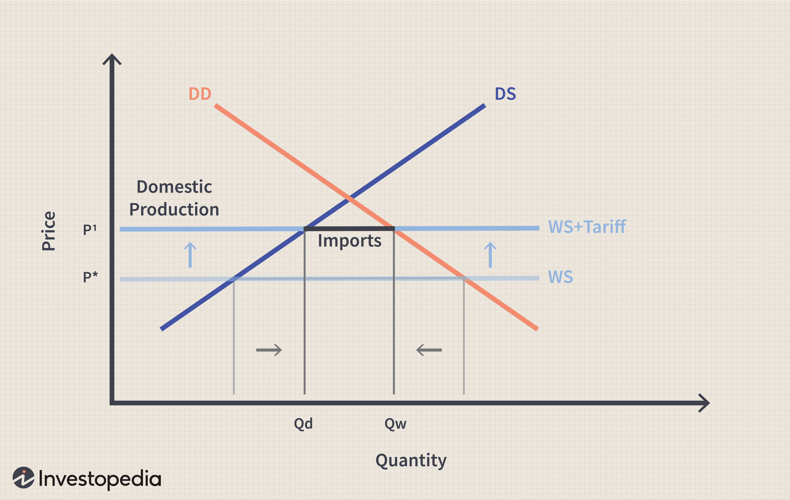

Exporting and importing are fundamental aspects of international trade. Exporting refers to the practice of selling goods and services produced in one country to buyers in another. It plays a critical role in enhancing a nation's economic growth by contributing to its Gross Domestic Product (GDP), generating employment, and increasing foreign exchange reserves. Importing, conversely, involves purchasing goods and services from abroad to meet domestic demand, foster consumer choice, and stimulate competitive market dynamics.

The economic impact of global trade encompasses the various ways through which exporting and importing activities affect national economies and the global economy at large. This includes effects on employment, production efficiency, and the balance of trade. Understanding these impacts is crucial as they dictate trade policies and influence economic strategies at both national and international levels. Economic impact is often assessed using metrics such as GDP growth, trade balance, and employment rates.

Algorithmic trading is a technology-driven process that utilizes complex algorithms to execute trades at high speeds and volumes, often without human intervention. This technology is increasingly prevalent in financial markets due to its ability to enhance trading efficiency, reduce transaction costs, and enable precise market predictions. In the context of global trade, algorithmic trading impacts both exporting and importing activities by optimizing currency exchanges, risk management, and market analysis.

The interaction between exporting, importing, and algorithmic trading is reshaping the landscape of global trade. On one hand, algorithmic trading facilitates more cost-effective and efficient cross-border transactions. On the other, it introduces challenges related to regulatory oversight and market stability. Understanding these cause-and-effect relationships is essential for stakeholders involved in policy-making, trade negotiations, and economic strategy development.

The objective of this article is to analyze these interrelationships, examining how each element influences the others and identifying key factors that drive changes in international trade dynamics. Through this analysis, we aim to highlight the opportunities and challenges that arise from integrating technological advancements like algorithmic trading into global trade processes. This understanding will provide insights into the evolving nature of international trade and the potential future trajectory influenced by these interactions.

## Table of Contents

## The Role of Exporting in the Global Economy

Exporting is a fundamental component of global trade, serving as a primary engine for economic growth and development. By enabling countries to sell goods and services beyond their borders, exporting enhances a nation's economic output and strengthens its Gross Domestic Product (GDP). The role of exports in boosting GDP is well-documented; when a country exports more than it imports, it experiences a positive trade balance, contributing to GDP growth. According to economic theory, GDP can be computed using the formula: 

$$
\text{GDP} = C + I + G + (X - M)
$$

where $C$ stands for consumption, $I$ for investment, $G$ for government spending, and $(X - M)$ represents net exports (exports minus imports). A rise in exports ($X$) bolsters GDP, enhancing overall economic health.

Key industries, including manufacturing, agriculture, and technology, rely heavily on exporting to sustain and grow their operations. For instance, the automotive industry in Germany and Japan serves global markets through exports, which have propelled these nations to hold substantial market shares internationally. Similarly, agricultural exports, such as grain from the United States and Australia, support local economies by providing income for farmers and creating employment opportunities in related sectors.

Exporters face an array of challenges in the modern economic climate, including fluctuating foreign exchange rates, trade barriers, and intense international competition. For example, currency [volatility](/wiki/volatility-trading-strategies) can affect pricing strategies and profitability. Political tensions and protectionist policies, such as tariffs and quotas, can restrict market access, affect supply chains, and increase operational costs. Additionally, evolving consumer preferences demand innovation and adaptation from exporters to maintain a competitive edge.

Governments play a pivotal role in supporting export sectors and enhancing competitiveness on the global stage. Policies aimed at boosting exports include negotiating favorable trade agreements, offering financial incentives such as tax credits and grants, and providing export financing and guarantees through institutions like export-import banks. Moreover, infrastructure development, such as ports and logistics networks, facilitates efficient goods movement, further enabling export growth.

Efforts to enhance exporting provide multifaceted benefits, including increased employment, foreign exchange earnings, and technological advancements. Engaging in international trade activities also pushes domestic industries to innovate and improve quality standards to meet global demands. Through robust policies and strategic economic diplomacy, countries can navigate the challenges of exporting and harness its potential to drive national prosperity.

## Understanding the Importing Process

Importing is a critical component of global trade and plays a significant role in a nation's economic development. By facilitating access to a broader array of goods and services that may not be domestically available, importing enhances consumer choice and contributes to diverse market offerings. This variety can stimulate competition and innovation within domestic markets, encouraging local industries to improve their products and services. Moreover, importing essential raw materials and technology can bolster domestic production capabilities, thus supporting industrial growth and economic progress.

The impact of importing on domestic markets and industries is multifaceted. On one hand, it provides consumers with a wider selection of goods, often at more competitive prices, which can lead to increased consumer satisfaction and purchasing power. On the other hand, the presence of imported goods can present challenges for domestic producers who may struggle to compete with foreign competitors, especially when it comes to cost and quality. This dynamic can lead to a shift in industry focus within a country, pushing some sectors to innovate or specialize, while others might contract or transform.

Importing also significantly affects consumer choices. As global supply chains become more sophisticated, consumers gain access to a plethora of international products, ranging from everyday essentials to luxury items. This access can influence consumer preferences and demand, fostering a more globally integrated marketplace where national boundaries become less pertinent in determining product availability.

Import taxes and tariffs are vital economic tools impacting the importing process. Governments impose these levies both to generate revenue and to protect domestic industries from foreign competition. Import taxes can increase the cost of imported goods, potentially reducing their consumption in favor of locally produced alternatives. However, high tariffs can also lead to higher prices for consumers and limited product availability, which might negatively affect overall economic welfare. The delicate balance of protecting domestic industries while fostering open trade is a persistent challenge for policymakers.

To maintain trade equilibrium, nations strive to balance their import and export activities. Trade equilibrium is essential for a stable economy, where the value of imports matches that of exports, reducing trade deficits. A trade imbalance, where imports significantly exceed exports, can lead to economic challenges such as increased national debt and weakened currency value. Therefore, countries implement various strategies, including trade agreements and export incentives, to promote balanced trade. Maintaining this balance not only sustains economic stability but also supports stronger international relationships and ensures long-term economic growth.

 to Algorithmic Trading

Algorithmic trading refers to the use of computer programs and algorithms to execute trades in financial markets. These algorithms make decisions based on predetermined criteria, such as timing, price, or quantity. The main functions of [algorithmic trading](/wiki/algorithmic-trading) include order execution, [arbitrage](/wiki/arbitrage), and the optimization of market-making strategies, all aimed at increasing efficiency and reducing transaction costs.

The technology behind algorithmic trading primarily relies on computer-based algorithms that process vast amounts of market data in real-time. These algorithms utilize statistical and mathematical models to assess market conditions and identify trading opportunities. Machine learning techniques are increasingly being integrated to enhance the predictive capabilities of these systems, allowing for the analysis of complex patterns and market trends.

The prevalence of algorithmic trading in financial markets has increased significantly over recent years. It accounts for a large proportion of trading [volume](/wiki/volume-trading-strategy) in equity and foreign exchange markets. The automation and speed provided by algorithmic trading systems enable market participants to process information and execute trades faster than conventional manual methods, contributing to their widespread adoption.

Algorithmic trading offers several key benefits that enhance market efficiency. These include increased transaction speed and accuracy, reduced market impact through the optimal timing of large orders, and the ability to exploit short-lived trading opportunities. Additionally, it facilitates continuous market [liquidity](/wiki/liquidity-risk-premium) and tighter spreads, which can lead to a more stable and efficient market environment.

However, algorithmic trading also poses potential risks. Key concerns include the amplification of market volatility caused by algorithmic errors or unexpected interactions between algorithms, leading to events such as flash crashes. There is also the risk of market manipulation, where traders might design algorithms to exploit tiny price movements, influencing market integrity. Furthermore, the reliance on complex algorithms and technology raises concerns about systemic risk and cybersecurity vulnerabilities within financial markets.

In conclusion, while algorithmic trading significantly enhances the efficiency of financial markets, it necessitates careful oversight and regulation to mitigate its associated risks. As the technological landscape evolves, the industry must adapt to ensure the continued stability and integrity of trading environments.

## Algorithmic Trading and Its Influence on Exporting

Algorithmic trading, a method that utilizes computer algorithms to automate trading decisions, significantly influences the dynamics of exporting activities. By enhancing the efficiency of currency trading, it directly impacts export pricing, thereby affecting the competitive positioning of exporters in the global market. The advanced data analysis capabilities inherent in algorithmic systems enable precise market predictions, providing exporters with critical insights to optimize their strategies.

A major contribution of algorithmic trading to exporting is its ability to streamline currency trading. Currency exchange rates are pivotal in determining export prices. With algorithms that can process vast amounts of market data at high speeds, traders can predict and react to currency fluctuations more accurately, securing favorable exchange rates for exports. For instance, if an exporter knows that a currency is about to depreciate against the U.S. dollar, algorithmic trading systems can initiate [forex](/wiki/forex-system) trades quickly to lock in current rates, preserving profit margins.

Moreover, the predictive power of algorithmic trading offers significant advantages in market forecasting. Algorithms analyze historical market data combined with real-time information to identify trends and patterns that may not be discernible through traditional methods. This capability allows exporters to anticipate demand shifts and adjust their production and distribution strategies accordingly. For example, if an algorithm detects emerging demand for electronic components in Asia, an exporter can swiftly mobilize resources to capitalize on this opportunity, thereby maximizing revenue.

In terms of managing export risks, algorithmic trading plays a vital role by enabling exporters to hedge against potential market uncertainties. Through sophisticated mathematical models, algorithms can devise optimal hedging strategies that minimize the risks associated with price volatility and economic fluctuations. This risk management capability is especially crucial for exporters dealing with commodities and other goods subject to significant price swings.

Countries that have embraced algorithmic trading in their export processes often experience enhanced efficiencies and competitive advantages. For instance, in Singapore, a global trading hub known for its advanced financial infrastructure, exporters leverage algorithmic trading to navigate complex financial markets and currency exchanges efficiently. The integration of these technologies has enabled Singapore to sustain its competitive edge in the international trade arena.

Similarly, Israel has also benefited from adopting algorithmic trading, particularly in its high-tech and agricultural export sectors. Israeli companies utilize algorithmic solutions to optimize trade execution, reduce transaction costs, and manage currency risks, contributing to the robust performance of its exports.

In conclusion, algorithmic trading profoundly impacts exporting by improving currency trading efficiency, enhancing market prediction capabilities, and managing export risks effectively. By leveraging these technological advancements, countries can strengthen their export activities and achieve significant economic benefits.

## The Impact of Algorithmic Trading on Importing Activities

Algorithmic trading has significantly transformed the importing activities by optimizing processes, enhancing cost-effectiveness, and refining supply chain management. By leveraging advanced algorithms, companies can automate and streamline trading operations, reducing manual intervention and increasing efficiency. This technological advancement has a profound impact on import activities, thereby shaping procurement strategies and influencing global market competitiveness.

One of the primary ways algorithmic trading optimizes importing is by automating currency exchange transactions. Fluctuations in currency rates can affect the cost of imported goods. With algorithmic trading, importers can execute currency trades instantaneously when favorable rates appear, minimizing costs. This real-time execution is possible through pre-set algorithms that continuously monitor foreign exchange markets. 

Cost-effectiveness for importers is another significant benefit of algorithmic trading. By automating complex calculations and enabling rapid decision-making, importers can reduce transaction costs and labor expenses associated with traditional trading methods. This automation leads to a reduction in human error and a decrease in the costs related to manual processing of transactions. 

In supply chain management, algorithmic trading plays a crucial role by providing predictive analytics and data-driven insights. These capabilities help companies foresee potential disruptions and adjust their import strategies accordingly. For instance, algorithms can analyze vast datasets to predict weather patterns, geopolitical tensions, or other factors that could impact shipping routes and timelines, enabling importers to reroute or adjust orders proactively.

Algorithmic trading influences procurement strategies by offering insights into market trends and pricing. Importers can use algorithms to analyze historical data, identify patterns, and forecast future price movements. This analytical capability allows companies to make informed procurement decisions, securing the best prices and terms for their imports. The ability to predict and act on market trends gives importers a competitive edge.

Global market competitiveness is significantly affected by the integration of algorithmic trading in importing activities. Companies that adopt algorithmic trading can respond more swiftly to market changes, maintain supply chain agility, and optimize their procurement strategies. This enhances their ability to compete in international markets by ensuring cost efficiency and supply chain reliability. Additionally, as more companies adopt algorithmic trading, there is a pressure on other market participants to follow suit to remain competitive, promoting broader industry innovation.

Overall, the use of algorithmic trading in importing not only optimizes internal processes but also enhances a company’s competitive abilities on a global scale. This integration promotes efficiency, agility, and strategic decision-making, underscoring the vital role of technology in modern trade dynamics.

## Economic Implications of Integrating Algorithmic Trading in Global Trade

The integration of algorithmic trading in global trade presents extensive macroeconomic effects, shaping the dynamics of exporting and importing activities. Algorithmic trading employs complex algorithms to automate the execution of transactions at high speeds, affecting global trade by optimizing trading efficiency, reducing latency, and enhancing market liquidity.

### Potential for Reducing Trade Barriers and Improving Trade Flows

Algorithmic trading holds the potential to mitigate trade barriers and enhance trade flows. By utilizing advanced algorithms, trading systems can quickly identify arbitrage opportunities and discrepancies in currency exchange rates across different markets. This capability allows traders to capitalize on these opportunities, fostering more efficient pricing mechanisms in international markets. Consequently, this reduces price discrepancies and trade barriers that typically arise from currency volatility. Additionally, improved market efficiency encourages greater participation in global trade by minimizing transaction costs and enhancing price discovery processes.

### Enhancing International Economic Relations and Trade Agreements

Algorithmic trading can play a pivotal role in improving international economic relations and fostering more robust trade agreements. By providing greater transparency and predictability in financial markets, algorithmic trading fosters trust between trading partners and governments. This trust is critical in forming and maintaining international trade agreements, as it reduces uncertainty and enhances the reliability of cross-border transactions. Moreover, algorithmic trading can facilitate real-time data sharing and analysis, aiding policymakers in monitoring trade flows and implementing evidence-based regulatory frameworks that support international trade.

### Regulatory and Ethical Challenges

Despite its benefits, algorithmic trading raises several regulatory and ethical challenges that nations must address. The rapid execution of trades and the volume of transactions driven by algorithmic systems can lead to market instability and flash crashes, as witnessed in previous instances like the 2010 Flash Crash. Regulators must devise methods to safeguard market integrity and protect investors from systemic risks posed by algorithmic trading. This includes implementing circuit breakers, enhancing oversight, and ensuring ethical standards in algorithm development and deployment.

The ethical considerations of algorithmic trading also pertain to issues of fairness and transparency. As algorithms become more sophisticated, there is an increased risk of creating systems that inadvertently favor certain participants over others, potentially leading to inequality and reduced market competitiveness.

### Future Trends in Algorithmic Trading Shaping Global Trade

Looking ahead, algorithmic trading is likely to continue evolving and influencing global exports and imports. The integration of [artificial intelligence](/wiki/ai-artificial-intelligence) (AI) and [machine learning](/wiki/machine-learning) in algorithmic trading systems promises enhanced predictive capabilities and more adaptive trading strategies. These advancements will allow for more accurate forecasting of market trends, better risk management, and more efficient allocation of resources in international trade.

Moreover, as more countries digitize their financial systems, algorithmic trading will become increasingly entrenched in emerging markets, contributing to their integration into the global economy. This expansion may lead to more balanced global trade relationships, as countries previously on the periphery become more competitive players in international markets.

In conclusion, while algorithmic trading offers numerous opportunities to optimize global trade processes, it also introduces challenges that require careful regulatory oversight and ethical consideration. The future of international trade in a technologically advanced landscape will depend on the ability of governments and financial institutions to harness the benefits while mitigating the associated risks.

## Conclusion

The culmination of insights on exporting, importing, and algorithmic trading underscores their intertwined roles in shaping global trade dynamics. Exporting remains a pillar of economic growth, significantly contributing to a nation's GDP and fostering industrial sectors essential for international competitiveness. Importing complements this by facilitating access to diverse goods and services, driving innovation, and offering consumers greater choice. Both exporting and importing are crucial in balancing trade relations and ensuring economic stability.

Algorithmic trading has emerged as a transformative force in this landscape, optimizing processes and enhancing market efficiencies. Its integration into currency trading and risk management has made exporting and importing more robust against volatile market conditions. Furthermore, by leveraging data analysis capabilities, algorithmic trading allows countries and corporations to predict market trends and adjust strategies accordingly.

The economic impacts of these elements reflect a broader movement towards a seamlessly integrated global market. The advancements in algorithmic trading technology represent opportunities for reducing trade barriers and facilitating smoother international transactions. However, this also invites scrutiny regarding regulatory frameworks and ethical standards, highlighting a critical area for policy development.

To stay ahead, it is imperative to adapt continuously to these technological advancements. Future research should focus on the regulatory implications of algorithmic trading, its potential effects on employment within trading industries, and the broader socio-economic outcomes it heralds.

As technology continues to evolve, international trade dynamics will likely become increasingly sophisticated and interconnected. Recognizing and harnessing these trends will be vital for nations seeking to maximize their economic potential in the 21st century. This synthesis of exporting, importing, and algorithmic trading paves the way for a future where technology and trade coalesce to drive global economic prosperity.

## References & Further Reading

[1]: Krugman, P. R., Obstfeld, M., & Melitz, M. J. (2018). ["International Economics: Theory and Policy,"](https://www.pearson.com/se/Nordics-Higher-Education/subject-catalogue/economics/International-Economics-Theory-and-Policy-Krugman.html) 11th Edition. Pearson.

[2]: Lopez de Prado, M. (2018). ["Advances in Financial Machine Learning."](https://www.amazon.com/Advances-Financial-Machine-Learning-Marcos/dp/1119482089) Wiley.

[3]: Benos, E., & Sagade, S. (2016). ["High-frequency trading behaviour and its impact on market quality: Evidence from the UK equity market."](https://papers.ssrn.com/sol3/Delivery.cfm/SSRN_ID2730600_code1386219.pdf?abstractid=2184302&mirid=3) Bank of England.

[4]: Chan, E. P. (2008). ["Quantitative Trading: How to Build Your Own Algorithmic Trading Business."](https://github.com/ftvision/quant_trading_echan_book) Wiley.

[5]: Tarullo, D. K. (2014). ["A Tiered Approach to Regulation of Low-High-Frequency Market Activities and Algorithmic Trading."](https://www.federalreserve.gov/newsevents/speech/tarullo20141107a.htm) Brookings Institution.

[6]: Aronson, D. R. (2007). ["Evidence-Based Technical Analysis: Applying the Scientific Method and Statistical Inference to Trading Signals."](https://onlinelibrary.wiley.com/doi/book/10.1002/9781118268315) Wiley.

[7]: Jansen, S. (2020). ["Machine Learning for Algorithmic Trading."](https://github.com/stefan-jansen/machine-learning-for-trading) Packt Publishing.