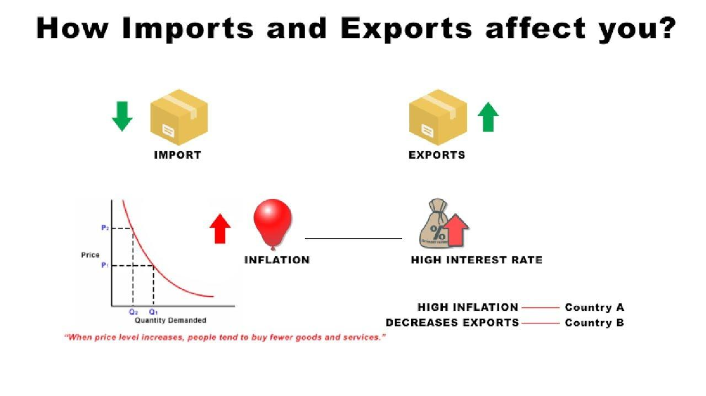

## Table of Contents

## What is the basic definition of importing and exporting?

Importing means bringing goods or services into a country from another country. When a country imports, it buys things from other countries. For example, if a store in the United States sells bananas from Ecuador, the United States is importing bananas.

Exporting is the opposite of importing. It means sending goods or services from one country to another country. When a country exports, it sells things to other countries. For example, if a factory in Japan makes cars and sends them to Canada, Japan is exporting cars to Canada.

## How do imports and exports affect a country's economy?

Imports and exports can have a big impact on a country's economy. When a country exports a lot, it earns money from other countries. This can help the country's economy grow because more money is coming in. For example, if a country is good at making cars and sells a lot of cars to other countries, the money it earns can be used to build more factories or improve roads. This can create more jobs and make people in the country richer.

On the other hand, when a country imports a lot, it spends money to buy things from other countries. If a country imports more than it exports, it can lead to a trade deficit. This means the country is spending more money than it is earning from selling its own products. A big trade deficit can make a country's currency weaker and might slow down the economy. But imports can also be good because they give people more choices and can keep prices lower.

In summary, a balance between imports and exports is important for a healthy economy. A country that exports more than it imports can see its economy grow, while a country that imports more than it exports might face economic challenges. But having some imports is also important because it helps keep the economy diverse and competitive.

## What is the balance of trade and how is it calculated?

The balance of trade is the difference between a country's exports and imports. It shows whether a country is selling more to other countries than it is buying from them. If a country exports more than it imports, it has a trade surplus. This means the country is earning more money from other countries than it is spending. If a country imports more than it exports, it has a trade deficit. This means the country is spending more money on foreign goods than it is earning from selling its own goods.

To calculate the balance of trade, you subtract the total value of imports from the total value of exports over a certain period, usually a year. If the result is positive, the country has a trade surplus. If the result is negative, the country has a trade deficit. For example, if a country exports goods worth $500 billion and imports goods worth $400 billion in a year, its balance of trade would be $100 billion, showing a trade surplus.

## What are the economic benefits of exporting goods?

Exporting goods can help a country's economy grow. When a country sells its products to other countries, it earns money. This money can be used to build new factories, improve roads, and create more jobs. More jobs mean more people have money to spend, which can make the whole economy stronger. For example, if a country is good at making cars and sells a lot of cars to other countries, the money it earns can help the country grow and become richer.

Exporting can also help a country's businesses become more competitive. When companies sell their products in other countries, they have to make sure their products are good enough to compete with products from all over the world. This can lead to better quality products and lower prices. It can also help companies grow and become more successful. For example, a small company that starts exporting might grow into a big company that sells its products all over the world.

## What are the potential drawbacks of importing goods for a domestic economy?

Importing goods can sometimes hurt a country's economy. When a country buys a lot of things from other countries, it spends money that could have been used to buy things made at home. This can make it hard for local businesses to grow and create jobs. If people keep buying things from other countries, local companies might have to close down because they can't compete. This can lead to fewer jobs and a weaker economy.

Another problem with importing a lot is that it can lead to a trade deficit. A trade deficit happens when a country spends more money on imports than it earns from exports. This can make the country's currency weaker and might slow down the economy. If the trade deficit is big, it can also make it harder for the country to pay for the things it needs. So, while importing can give people more choices and keep prices lower, it can also create problems for the domestic economy if it's not balanced with enough exports.

## How do tariffs and trade barriers influence importing and exporting?

Tariffs and trade barriers are tools that countries use to control what comes in and goes out. Tariffs are like taxes that a country puts on things coming from other countries. When a country adds a tariff, it makes imported goods more expensive. This can make people buy more things made at home instead of buying from other countries. It can help protect local businesses and jobs. But it can also make things more expensive for people to buy and might make other countries mad, leading to less trade overall.

Trade barriers are rules or limits that a country sets to stop or slow down imports and exports. They can be things like quotas, which limit how much of something can come into the country, or rules that make it hard for foreign companies to sell their products. Trade barriers can help protect local industries by making it harder for foreign companies to compete. But they can also lead to less trade and fewer choices for people. If countries use a lot of trade barriers, it can make it harder for everyone to trade and can slow down the global economy.

## What role do exchange rates play in international trade?

Exchange rates are important in international trade because they affect how much it costs to buy and sell things between countries. The exchange rate is the price of one country's money compared to another country's money. If a country's currency gets stronger, it means it can buy more of another country's money. This makes imports cheaper because the country can buy more foreign goods with the same amount of money. But it also makes exports more expensive for other countries to buy, which can hurt the country's exporters.

On the other hand, if a country's currency gets weaker, it means it can buy less of another country's money. This makes imports more expensive because the country needs more of its own money to buy the same amount of foreign goods. But it makes exports cheaper for other countries to buy, which can help the country's exporters sell more. So, changes in exchange rates can have a big impact on how much a country imports and exports, and this can affect the whole economy.

## How does globalization impact the economic effects of importing and exporting?

Globalization makes the world more connected, and this changes how importing and exporting affect a country's economy. When countries trade more easily because of globalization, they can buy and sell more things from other countries. This can help a country's economy grow because it can sell its products to more people around the world. For example, a small business in one country can now sell its products in many other countries, which can create more jobs and make the economy stronger. But globalization also means more competition, so local businesses have to work harder to keep up with companies from other countries.

At the same time, globalization can make importing easier and cheaper. This can be good because it gives people more choices and can keep prices low. But it can also hurt local businesses if people start buying more things from other countries. If a country imports a lot more than it exports, it can lead to a trade deficit, which might slow down the economy. So, while globalization can help a country's economy grow by making it easier to trade, it also brings new challenges that countries need to manage carefully.

## What are the long-term economic implications of a trade deficit or surplus?

A long-term trade deficit means a country is buying more things from other countries than it is selling. This can lead to problems over time. The country might have less money to spend on important things like building new roads or schools. It can also make the country's money weaker, which means it costs more to buy things from other countries. If the trade deficit keeps growing, it can slow down the whole economy and make it harder for the country to pay its debts. But, if the country can borrow money easily and use it to invest in things that help the economy grow, like new technology or education, a trade deficit might not be as bad.

On the other hand, a long-term trade surplus means a country is selling more things to other countries than it is buying. This can be good because it brings more money into the country. The extra money can be used to build new factories, create jobs, and make the economy stronger. But having a big trade surplus can also cause problems. Other countries might get upset and put up trade barriers to stop the country from selling so much. This can lead to less trade overall and might hurt the country's economy in the long run. So, while a trade surplus can help a country grow, it's important to keep trade balanced to avoid problems with other countries.

## How do import and export policies affect domestic industries and employment?

Import and export policies can have a big impact on domestic industries and jobs. When a country puts high tariffs or trade barriers on imports, it can protect local businesses. This means people might buy more things made at home, which can help local companies grow and create more jobs. For example, if a country puts a tax on imported cars, people might buy more cars made in their own country. This can help the car factories at home stay open and hire more workers. But if these policies make things too expensive, it can hurt the economy because people might not buy as much.

On the other hand, if a country makes it easier to import things, it can be good for some industries but bad for others. Cheaper imports can help businesses that use these goods to make their own products. For example, a company that makes clothes might buy cheaper fabric from another country, which can help them make more clothes and hire more people. But it can hurt industries that make the same things at home. If people start buying more imported clothes, the local clothing factories might have to close down, which can lead to fewer jobs. So, import and export policies need to be balanced to help the whole economy grow and keep people working.

## What advanced economic theories explain the dynamics of international trade?

One important theory that helps explain international trade is called the comparative advantage theory. This theory says that countries should focus on making things they are really good at and trade with other countries for things they are not so good at making. For example, if a country can grow a lot of bananas but not many apples, it should grow bananas and trade them for apples from another country that is better at growing apples. This can make both countries richer because they are using their resources in the best way possible. By trading, they can have more of everything than if they tried to make everything themselves.

Another theory is called the Heckscher-Ohlin model. This theory says that countries should export things that use the resources they have a lot of, and import things that use resources they don't have much of. For example, a country with a lot of workers but not much land might be good at making clothes and should export them. It could then import food from a country that has a lot of land but fewer workers. This helps both countries use their resources better and can lead to more trade and a stronger global economy. Both these theories show how countries can work together to make everyone better off by focusing on what they do best and trading with each other.

## How can countries use strategic importing and exporting to enhance their economic position on the global stage?

Countries can use strategic importing and exporting to improve their place in the world economy by focusing on what they are good at making and trading with other countries. For example, a country might be really good at making cars. By selling a lot of cars to other countries, it can earn money and use that money to make its economy stronger. At the same time, the country can buy things it is not so good at making from other countries. This way, the country can have more of everything and help its businesses grow. It's like a team where everyone does what they do best and helps each other out.

Another way countries can use importing and exporting to their advantage is by making smart trade deals. These deals can help a country sell more of its products to other countries without too many taxes or rules getting in the way. For example, a country might make a deal to sell its fruit to another country without paying a lot of tariffs. This can help the fruit farmers at home make more money and create more jobs. But countries need to be careful not to import too much more than they export, because that can lead to problems like a trade deficit. By balancing what they import and export, countries can keep their economies strong and grow their place in the world.

## What is the Role of Exporting in the Global Economy?

Exporting is a fundamental component of global trade, serving as a primary engine for economic growth and development. By enabling countries to sell goods and services beyond their borders, exporting enhances a nation's economic output and strengthens its Gross Domestic Product (GDP). The role of exports in boosting GDP is well-documented; when a country exports more than it imports, it experiences a positive trade balance, contributing to GDP growth. According to economic theory, GDP can be computed using the formula: 

$$
\text{GDP} = C + I + G + (X - M)
$$

where $C$ stands for consumption, $I$ for investment, $G$ for government spending, and $(X - M)$ represents net exports (exports minus imports). A rise in exports ($X$) bolsters GDP, enhancing overall economic health.

Key industries, including manufacturing, agriculture, and technology, rely heavily on exporting to sustain and grow their operations. For instance, the automotive industry in Germany and Japan serves global markets through exports, which have propelled these nations to hold substantial market shares internationally. Similarly, agricultural exports, such as grain from the United States and Australia, support local economies by providing income for farmers and creating employment opportunities in related sectors.

Exporters face an array of challenges in the modern economic climate, including fluctuating foreign exchange rates, trade barriers, and intense international competition. For example, currency [volatility](/wiki/volatility-trading-strategies) can affect pricing strategies and profitability. Political tensions and protectionist policies, such as tariffs and quotas, can restrict market access, affect supply chains, and increase operational costs. Additionally, evolving consumer preferences demand innovation and adaptation from exporters to maintain a competitive edge.

Governments play a pivotal role in supporting export sectors and enhancing competitiveness on the global stage. Policies aimed at boosting exports include negotiating favorable trade agreements, offering financial incentives such as tax credits and grants, and providing export financing and guarantees through institutions like export-import banks. Moreover, infrastructure development, such as ports and logistics networks, facilitates efficient goods movement, further enabling export growth.

Efforts to enhance exporting provide multifaceted benefits, including increased employment, foreign exchange earnings, and technological advancements. Engaging in international trade activities also pushes domestic industries to innovate and improve quality standards to meet global demands. Through robust policies and strategic economic diplomacy, countries can navigate the challenges of exporting and harness its potential to drive national prosperity.

## References & Further Reading

[1]: Krugman, P. R., Obstfeld, M., & Melitz, M. J. (2018). ["International Economics: Theory and Policy,"](https://www.pearson.com/se/Nordics-Higher-Education/subject-catalogue/economics/International-Economics-Theory-and-Policy-Krugman.html) 11th Edition. Pearson.

[2]: Lopez de Prado, M. (2018). ["Advances in Financial Machine Learning."](https://www.amazon.com/Advances-Financial-Machine-Learning-Marcos/dp/1119482089) Wiley.

[3]: Benos, E., & Sagade, S. (2016). ["High-frequency trading behaviour and its impact on market quality: Evidence from the UK equity market."](https://papers.ssrn.com/sol3/Delivery.cfm/SSRN_ID2730600_code1386219.pdf?abstractid=2184302&mirid=3) Bank of England.

[4]: Chan, E. P. (2008). ["Quantitative Trading: How to Build Your Own Algorithmic Trading Business."](https://github.com/ftvision/quant_trading_echan_book) Wiley.

[5]: Tarullo, D. K. (2014). ["A Tiered Approach to Regulation of Low-High-Frequency Market Activities and Algorithmic Trading."](https://www.federalreserve.gov/newsevents/speech/tarullo20141107a.htm) Brookings Institution.

[6]: Aronson, D. R. (2007). ["Evidence-Based Technical Analysis: Applying the Scientific Method and Statistical Inference to Trading Signals."](https://onlinelibrary.wiley.com/doi/book/10.1002/9781118268315) Wiley.

[7]: Jansen, S. (2020). ["Machine Learning for Algorithmic Trading."](https://github.com/stefan-jansen/machine-learning-for-trading) Packt Publishing.