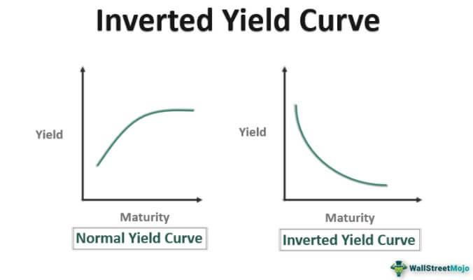

The bond market is an essential pillar of the global financial ecosystem, playing a pivotal role in shaping economic activity and providing critical insights into future economic conditions. Bonds, essentially fixed-income securities, are utilized by governments, municipalities, and corporations to finance their operations and projects. The dynamics of the bond market are closely watched by investors, analysts, and policymakers because they reflect broader economic trends. One of the most closely observed phenomena within this market is the inverted yield curve.

An inverted yield curve, characterized by higher short-term interest rates than long-term rates, is often regarded as a forewarning of economic downturns. Historically, the inversion of the yield curve has garnered attention due to its notable correlation with impending recessions. It signals a shift in investor sentiment and suggests concerns over future economic stability. This occurrence holds significant implications not just for the economy but also for various market participants, including banks, investors, and policymakers.

In this article, we will examine the concept of the inverted yield curve, its potential impact on economic conditions, and its influence on the bond market. Additionally, we will explore how algorithmic trading strategies are employed to navigate the complexities introduced by an inverted yield curve. By understanding these interconnected elements, investors can make more informed decisions in a rapidly changing financial landscape.

## Table of Contents

## Understanding the Yield Curve

The yield curve is a fundamental tool in the financial markets, providing a visual representation of the relationship between interest rates and the time to maturity for a group of bonds that possess the same credit quality. Typically, this graphical depiction illustrates an upward sloping curve. This usual pattern indicates that bonds with longer maturities generally offer higher interest rates, or yields, compared to those with shorter maturities. The principal reason behind this shape lies in the concept of risk and return. Longer-term bonds are exposed to greater risks over their lifespan, such as inflation risk, interest rate risk, and the uncertainty regarding future market conditions. As a result, investors demand higher yields as compensation for assuming these additional risks.

Mathematically, the yield of a bond can be expressed using the yield to maturity (YTM) formula, which accounts for the bond's coupon payments, face value, price, and time to maturity. While the actual formula for YTM involves solving a complex equation, simplified versions are often used for basic calculations.

Economic conditions, however, can lead to deviations from the typical upward-sloping structure of the yield curve. One such deviation is the inverted yield curve, a situation where short-term interest rates become higher than long-term rates. An inverted yield curve is an anomaly that tends to draw considerable attention as it has historically been associated with periods of economic uncertainty or recession. This inversion occurs when investors anticipate a downturn in the economy, leading them to seek the relative safety of longer-term investments. Consequently, this increased demand for long-term bonds raises their prices and lowers their yields, inverting the traditional yield curve slope.

Understanding these dynamics is crucial for investors and policymakers alike, as the yield curve serves not only as an indicator of the bond market's current state but also as a prognosticator of future economic conditions.

## What is an Inverted Yield Curve?

An inverted yield curve occurs in the bond market when short-term interest rates surpass those of long-term rates. This inversion of the typical yield curve is regarded as a strong economic signal, often perceived as a harbinger of a forthcoming recession. Historically, inverted yield curves have preceded economic downturns, making them a critical indicator for investors and policymakers.

The mechanics of an inverted yield curve involve investor behavior and expectations related to economic uncertainty. When investors anticipate future economic instability, they often seek the safety of long-term securities. This increased demand pushes up the prices of these securities, leading to a reduction in their yields. Simultaneously, if short-term interest rates remain stable or increase due to central bank policies or other factors, the result is an inversion where short-term rates are higher than long-term rates.

The mathematical expression of an inverted yield curve can be described simply as:
$$
YTMs < YTMi
$$
where $YTMs$ represents the yield to maturity of short-term bonds, and $YTMi$ represents the yield to maturity of longer-term bonds.

An inverted yield curve essentially reflects a cautious market sentiment, as investors prioritize capital preservation and future security over immediate returns. This investor behavior underscores a collective belief that economic conditions are likely to worsen, prompting a shift in investment preferences towards longer-term, ostensibly safer instruments. 

In summary, the inverted yield curve is an anomaly in typical bond market conditions, historically tied to forecasts of economic recessions, driven primarily by investor shifts toward the relative safety of long-term debt amidst expectations of economic turbulence.

## Economic Impact of an Inverted Yield Curve

The inverted yield curve is often perceived as an indicator of upcoming economic challenges, with its implications being far-reaching. When short-term interest rates surpass long-term rates, it typically signals that investors expect economic conditions to worsen, potentially leading to a slowdown or recession. The yield curve inversion can tighten financial conditions, as banks, which traditionally rely on the spread between short-term borrowing and long-term lending to generate profits, find lending less lucrative. Consequently, these institutions might tighten credit availability, leading to stricter borrowing conditions and potentially higher borrowing costs, both of which can deter investment and business expansion.

For consumers, an inverted yield curve can translate into higher interest rates on loans, such as mortgages and auto loans, resulting in a squeeze on disposable income and overall consumption. When household budgets tighten, consumer spending—a critical driver of economic growth—may decline, exacerbating the slowdown.

Historically, there has been a notable correlation between inverted yield curves and subsequent recessions. For instance, the yield curve inverted before every U.S. recession in the post-World War II era, making it a reliable, though not infallible, economic predictor. Researchers and policymakers pay close attention to this phenomenon, analyzing it for early signals of economic distress, which can inform measures to mitigate adverse impacts on the economy.

## Impact on the Bond Market

In the bond market, the phenomenon of an inverted yield curve presents a notable shift in investor preferences and market dynamics. Typically, investors favor long-term bonds due to their higher yields compared to short-term bonds, reflecting the compensation for increased risk and time commitment. However, when the yield curve inverts, this relationship is disrupted, as short-term interest rates surpass those of long-term bonds. This inversion diminishes the attractiveness of holding long-term bonds because their yield advantage is reduced or eliminated. 

For fixed-income investors, such conditions prompt a reassessment of investment strategies. The diminished attractiveness of long-term bonds often results in a pivot towards shorter maturities or alternative investment vehicles that provide better risk-adjusted returns. Options may include money market instruments, which are less sensitive to [interest rate](/wiki/interest-rate-trading-strategies) fluctuations and offer more competitive yields under inversion conditions. In seeking these alternatives, investors often aim to optimize their portfolios by balancing expected returns with acceptable risk levels.

The increased demand for long-term securities, driven by investors seeking safe havens amid economic uncertainty, can lead to higher prices for these securities. The price increase further compresses long-term yields, exacerbating the inversion and potentially complicating portfolio management strategies. Investors may face challenges in achieving desired yield targets and maintaining a balanced portfolio, necessitating advanced risk management techniques and a nuanced understanding of market signals.

In this environment, some investors might employ strategies such as barbell or bullet strategies, which help in managing duration risk. The barbell strategy entails holding a mix of short- and long-term bonds, while the bullet strategy focuses on bonds with maturities concentrated around a specific date to minimize exposure to interest rate [volatility](/wiki/volatility-trading-strategies). 

Overall, the inverted yield curve's impact on the bond market underscores the importance of adaptive investment approaches, highlighting the intricate interplay between interest rate expectations, market psychology, and bond pricing dynamics.

## Algorithmic Trading in the Context of an Inverted Yield Curve

Algorithmic trading has become integral to modern financial markets, enabling traders to operate with increased efficiency and precision, especially during periods of heightened volatility, such as when an inverted yield curve occurs. This involves deploying algorithms that can parse vast datasets to identify [arbitrage](/wiki/arbitrage) opportunities, execute trades, and manage risks swiftly, often in microseconds. The presence of an inverted yield curve presents both challenges and opportunities for algorithmic traders. 

One key challenge is the increased uncertainty and risk associated with the potential for economic downturns indicated by an inverted yield curve. Traders must configure algorithms to react to fast-changing information and execute strategies that can adapt to unexpected shifts in interest rates or bond prices. Machine learning and [artificial intelligence](/wiki/ai-artificial-intelligence) techniques are often employed to improve risk assessment and adapt trading strategies dynamically. These advanced data analytics capabilities allow traders to differentiate between market noise and significant economic signals, improving the precision of their trading decisions.

Algorithmic trading systems also exploit the inefficiencies that may arise from a yield curve inversion. For instance, they can engage in yield curve arbitrage, where the goal is to capitalize on discrepancies between expected and actual interest rates across different maturities. By leveraging statistical and mathematical models, these algorithms can identify such discrepancies and execute trades that benefit from the normalization of the yield curve over time. 

Furthermore, technology plays a crucial role in enhancing [algorithmic trading](/wiki/algorithmic-trading) during such periods. High-frequency trading ([HFT](/wiki/high-frequency-trading-strategies)) systems, reliant on low-latency networks and cutting-edge computing power, are particularly adept at seizing fleeting arbitrage opportunities that appear during the volatile conditions accompanying an inverted yield curve. These systems rely on data-driven decision-making processes, utilizing historical and real-time data to generate predictive models. 

The computational prowess of algorithmic trading systems—combined with their ability to process information at speeds far beyond human capabilities—ensures that traders remain competitive, even during complex economic situations like an inverted yield curve. As technological advancements continue, the effectiveness and adaptability of algorithmic trading in navigating such market conditions will likely grow, enhancing its role in the global bond market landscape.

## Conclusion

The inverted yield curve serves as a powerful economic indicator that warrants close scrutiny by investors and policymakers alike. Historically, its emergence has been linked to economic downturns, making it a critical signal in assessing future economic trajectories. The inversion impacts consumer behavior and investment strategies, influencing how individuals and institutions allocate resources. For example, as borrowing costs rise, consumer spending may decline, leading to a contraction in overall economic activity. 

Investment strategies are particularly sensitive to yield curve dynamics. In the bond market, traditional approaches are disrupted as the allure of long-term bonds diminishes with reduced yield premiums. Investors might shift their focus to shorter maturities or alternative asset classes that offer more attractive risk-adjusted returns. The ability to accurately interpret yield curve shifts and respond with agility is crucial for maintaining financial health and optimizing portfolios.

Algorithmic trading plays a significant role in navigating the complexities introduced by an inverted yield curve. Algorithms, leveraging advanced data analytics and technology, enable traders to execute on opportunities that arise due to market inefficiencies. These tools allow for rapid analysis and decision-making, helping to manage risks and exploit arbitrage prospects that surface during periods of yield curve inversion. A robust understanding of yield curve dynamics, combined with the strategic application of algorithmic trading, can empower investors to effectively mitigate adverse impacts and capitalize on evolving market conditions.

Adapting to changing yield curve configurations is vital for prudent strategic decision-making, particularly in volatile economic landscapes. By maintaining a proactive stance and integrating sophisticated analytical techniques, market participants can better navigate challenges, ultimately positioning themselves advantageously in the face of economic uncertainty.

## References & Further Reading

[1]: Estrella, A., & Mishkin, F. S. (1996). ["The Yield Curve as a Predictor of U.S. Recessions."](https://www.newyorkfed.org/medialibrary/media/research/current_issues/ci2-7.pdf) Current Issues in Economics and Finance, 2(7).

[2]: Lopez de Prado, M. (2018). ["Advances in Financial Machine Learning."](https://books.google.com/books/about/Advances_in_Financial_Machine_Learning.html?id=oU9KDwAAQBAJ) Wiley.

[3]: Jansen, S. (2020). ["Machine Learning for Algorithmic Trading."](https://github.com/stefan-jansen/machine-learning-for-trading) Packt Publishing.

[4]: Chan, E. P. (2008). ["Quantitative Trading: How to Build Your Own Algorithmic Trading Business."](https://github.com/ftvision/quant_trading_echan_book) Wiley.

[5]: Aronson, D. (2006). ["Evidence-Based Technical Analysis: Applying the Scientific Method and Statistical Inference to Trading Signals."](https://www.amazon.com/Evidence-Based-Technical-Analysis-Scientific-Statistical/dp/0470008741) Wiley.

[6]: FRED, Federal Reserve Bank of St. Louis. ["U.S. Treasury Yield Curve."](https://fred.stlouisfed.org/series/DGS10/)