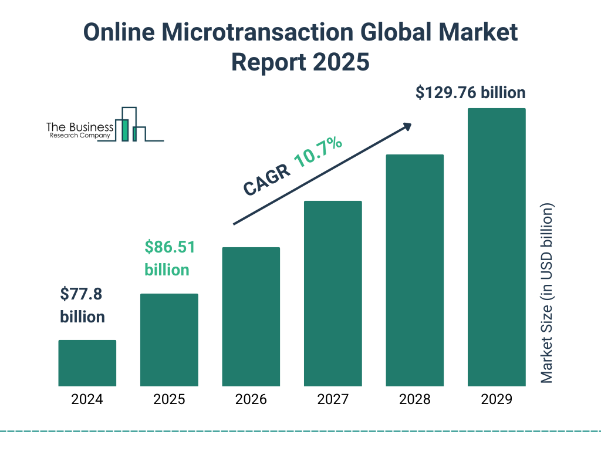

The gaming industry has transformed drastically over the years, evolving from a niche entertainment medium into a formidable economic powerhouse. This evolution is largely attributed to the rise of microtransactions, a business model where players engage in small financial transactions to access virtual goods within games. Originally popularized in free-to-play games, microtransactions have since become integral to the industry's economic fabric, influencing both revenue streams and player interactions. 

Microtransactions have reshaped how games generate revenue, shifting from the traditional one-time purchase model to a more dynamic, continuous engagement framework. This allows developers to sustain income over extended periods, offering cosmetic items, in-game currencies, and exclusive content packages as purchasable options. This model, exemplified by games like Fortnite and League of Legends, not only drives significant financial gains but also enhances player engagement by offering personalization and increased gameplay options.

Beyond gaming, the influence of microtransactions extends into economic sectors like algorithmic trading. Both microtransactions and algorithmic trading employ advanced data analytics and technology-driven strategies to optimize revenue generation and enhance consumer interaction. By analyzing player behaviors and preferences, game developers can tailor content offerings, similar to how financial algorithms optimize trading strategies.

However, the lucrative nature of microtransactions is not without controversy. Industry critics argue that these models encourage 'pay-to-win' dynamics and raise ethical concerns over potentially exploitative practices, such as those associated with loot boxes. As the gaming industry continues to innovate, it must address these challenges, balancing profitability with ethical and sustainable business practices.

In this article, we will examine how microtransactions impact gaming economics, explore parallels with other industries, particularly algorithmic trading, and assess their broader implications on the gaming ecosystem.

## Table of Contents

## Understanding Microtransactions

Microtransactions are defined as small-scale financial transactions conducted within video games, primarily allowing players to purchase virtual items or benefits. This monetization method is particularly prevalent in free-to-play (F2P) games. Unlike traditional gaming models, where revenue is generated through upfront purchase costs, F2P games provide initial access at no cost, making microtransactions a crucial revenue stream.

In the F2P model, microtransactions serve as the primary means of monetizing gameplay, enabling developers to generate income while maintaining a larger player base. This model relies on converting a percentage of players into paying customers, often termed "whales," who account for a significant portion of revenue.

The variety of items available through microtransactions can be broadly categorized into three main types:

1. **Cosmetic Items**: These include skins, outfits, and accessories that alter the visual appearance of characters or in-game elements. Importantly, these items usually do not affect gameplay, allowing developers to offer desirable customizations without disrupting game balance.

2. **In-Game Currency**: Players can purchase virtual currency using real money, which can then be spent within the game's ecosystem. This currency provides a versatile option for acquiring various in-game items or benefits, often streamlining the user's ability to benefit from game content without excessive time investment.

3. **Exclusive Content Packages**: These packages may contain unique or limited-time items, such as new levels, special abilities, or rare collectibles. This approach incentivizes purchases through the appeal of exclusivity and time-limited availability, fostering a sense of urgency and desirability.

Overall, microtransactions represent an integral component of modern gaming economics, facilitating a shift towards ongoing monetization rather than one-time purchase revenue models. These transactions not only support developers financially but also enhance player engagement by continually offering new and appealing content.

## Economic Impact on the Gaming Industry

Microtransactions have fundamentally transformed the financial landscape of the gaming industry by shifting traditional revenue models. Initially, video game developers relied heavily on a one-time purchase format, where consumers would buy a game outright, yielding a singular revenue event per customer. However, the advent of microtransactions has introduced an alternative model characterized by continual revenue streams, which is especially evident in free-to-play games.

Games such as "Fortnite" and "League of Legends" exemplify the successful implementation of microtransactions, collectively generating billions of dollars in revenue. One of the critical aspects of this shift is the use of in-game purchases, which include cosmetic items, battle passes, and special edition content that enhance the gaming experience without affecting core gameplay mechanics. This strategy not only incentivizes players to spend money but also extends the lifecycle of a game by providing regular updates and content.

Fortnite, developed by Epic Games, offers its players the ability to purchase V-Bucks, a virtual currency utilized within the game to acquire character skins, emotes, and various cosmetic items. Similarly, Riot Games' "League of Legends" employs a system where players can invest in Riot Points (RP) to unlock champions and skins, augmenting individual expression and engagement in the game. By continually updating their offerings and maintaining a deep connection with their player base, these games have established dynamic ecosystems that encourage repeated transactions.

The microtransaction model’s impact on long-term profitability is significant, as it allows developers to monetize user engagement over time. This contrasts sharply with the traditional model, where post-purchase monetization opportunities were limited. By leveraging microtransactions, developers can achieve a steady revenue stream as players invest continuously in virtual goods.

Moreover, this approach has set a new standard within the industry, influencing a wide array of games striving to replicate such success. Player engagement is bolstered not only by the allure of new content but by the perceived value of personalization within the virtual world—a [factor](/wiki/factor-investing) that heavily influences purchasing decisions. These interactions can be quantitatively analyzed using metrics such as Average Revenue Per User (ARPU) and Customer Lifetime Value (CLV), which can predict economic performance and guide strategic decisions for content updates and marketing efforts.

For example, calculating ARPU can provide insights into how effectively a game monetizes its active player base:

$$

\text{ARPU} = \frac{\text{Total Revenue}}{\text{Number of Active Users}} 
$$

This new revenue model not only enhances profitability but also paves the way for innovative marketing strategies and player-centric content creation. As the industry continues to evolve, the sustained use and development of microtransactions are likely to remain a cornerstone of economic strategy within the gaming sector.

## Algorithmic Trading: A Parallel in Economics

Examining microtransactions through the lens of [algorithmic trading](/wiki/algorithmic-trading) reveals significant parallels in technology-driven revenue strategies. Both systems rely on advanced data analytics to improve engagement and increase profits. In microtransactions, developers study player behavior to optimize in-game purchases, while algorithmic trading uses historical data to make financial transactions at optimal prices.

Data analytics is central to this comparison, as both sectors use consumer behavior data for strategic decision-making. In gaming, developers gather insights from user interactions to tailor microtransaction offerings, making them more alluring to specific player segments. Algorithmic trading employs similar tactics by analyzing market data to predict price movements and execute trades that capitalize on these trends.

The technological framework supporting microtransactions and algorithmic trading also emphasizes efficiency and maximizing returns. In gaming, this involves maintaining infrastructure that can process in-game purchases seamlessly and securely. Algorithmic trading systems utilize sophisticated algorithms to execute trades rapidly, responding to market fluctuations in real-time. For instance, high-frequency trading ([HFT](/wiki/high-frequency-trading-strategies)) involves executing thousands of orders in fractions of a second, leveraging speed to gain an edge over competitors.

Moreover, both sectors prioritize automating processes to streamline operations and improve profitability. Automated systems reduce human errors and allow for continuous operations, offering economic advantages similar to those found in algorithmic trading. Python, often used in both game development and trading algorithms, provides robust libraries for automation and data analysis.

The comparison between microtransactions and algorithmic trading underscores how integrating data-driven decision-making and automation can enhance efficiency and profitability, marking a significant intersection of gaming economics with broader economic practices.

## Challenges and Controversies

Microtransactions have significantly influenced the gaming industry, yet they are fraught with challenges and controversies. A primary criticism is the creation of a "pay-to-win" culture, where players can purchase advantages or content that provide significant in-game benefits, thus compromising the fairness and competitive integrity of the game. This system can lead to an environment where skill and effort are overshadowed by financial investment, potentially alienating players who choose not to or cannot afford to engage in these transactions.

Loot boxes, a popular form of microtransaction, have sparked particular controversy due to their similarity to gambling mechanics. These virtual items offer randomized rewards, enticing players to spend money without guaranteed outcomes. This unpredictability has drawn parallels to gambling, leading to concerns about susceptibility to compulsive spending behaviors, especially among younger audiences. Various studies suggest that the psychological mechanisms utilized by loot boxes can foster addictive behaviors, akin to those found in gambling ([Zendle & Cairns, 2018](https://www.repository.cam.ac.uk/handle/1810/274983)).

Game developers thus face the complex task of balancing revenue generation with ethical considerations. Implementing microtransactions responsibly involves providing value without exploiting players. For instance, many successful games have shifted towards offering non-intrusive enhancements, like aesthetic customizations, which do not impact gameplay balance. Such models aim to maintain fair competition while allowing players the freedom to personalize their gaming experience.

Furthermore, regulatory bodies worldwide are scrutinizing these practices. Countries like Belgium and the Netherlands have already taken legislative steps to ban or regulate loot boxes, interpreting them as a form of gambling. As a result, developers must navigate varying legal landscapes, adapting their monetization strategies to comply with regional regulations. The evolving legal framework necessitates continuous innovation in developing monetization models that respect player trust and comply with ethical and legal standards.

By focusing on transparency, fairness, and player well-being, game companies can tackle these challenges effectively. This approach not only ensures compliance with potential regulations but also fosters a sustainable player-developer relationship based on mutual trust and respect.

## Case Studies: Successful Implementations

Games like Fortnite, League of Legends, and Counter-Strike: Global Offensive (CS:GO) serve as prime examples of how microtransactions can be successfully implemented in the gaming industry to generate substantial revenue while maintaining user engagement. The success of these games is primarily due to their strategic use of cosmetic and non-intrusive enhancements, which ensure that the core gameplay remains unaffected by financial transactions.

**Fortnite:** Epic Games' Fortnite has capitalized on microtransactions through the sale of cosmetic items such as skins, emotes, and customization options for characters and weapons. The game's Battle Pass system is a particularly successful microtransaction model, offering players the opportunity to unlock tiers of rewards through gameplay. This system encourages continued player engagement and retention without affecting competitive balance, as purchases are purely aesthetic. According to a report by SuperData Research, Fortnite generated $2.4 billion in revenue in 2018, making it the highest-earning free-to-play game that year.

**League of Legends:** Similarly, Riot Games’ League of Legends uses microtransactions to sell aesthetic upgrades. Players can purchase skins for their champions, ward skins, and other cosmetic items that personalize the gaming experience. These purchases do not grant any gameplay advantages, aligning with the industry’s focus on fairness and player satisfaction. League of Legends’ commitment to maintaining game balance while implementing microtransactions has been essential to its long-term success. In 2019, the game reportedly generated over $1.5 billion in revenue, driven largely by these microtransactions.

**Counter-Strike: Global Offensive (CS:GO):** Valve's CS:GO introduced the concept of weapon skins, known as "skins," which players can purchase, win, or trade. The game leverages a marketplace where players can trade these skins, some of which have gained significant value. The integration of loot boxes, where players earn or purchase keys to unlock random weapons or items, contributed to CS:GO's microtransaction success. Despite some controversy over the nature of loot boxes, the game's economy continues to thrive, highlighting the complex relationship between monetization practices and community engagement.

These case studies illustrate the effectiveness of incorporating microtransactions that enhance player identities and experiences without altering the competitive aspects of gameplay. The success lies in creating value through personalization and exclusivity, fostering a sense of community and continued interest among players. Understanding player preferences and offering cosmetic items as a means of self-expression have allowed these games to flourish economically while maintaining their player base.

## The Future of Gaming Economics

The future of gaming economics, particularly in microtransactions, is poised to undergo significant transformation. As the gaming industry continues to expand, developers and stakeholders must navigate a complex regulatory landscape. Emerging legislative actions, such as those seen in regions like the European Union and the United States, aim to address concerns around consumer protection and potentially exploitative practices, such as loot boxes and pay-to-win mechanics[^1^]. These regulations will likely shape how microtransactions are implemented, pushing developers to adopt more transparent and ethical frameworks.

Monetization models in the gaming industry are expected to evolve, drawing inspiration from both successful gaming practices and innovative strategies used in other sectors. For instance, subscription services such as Xbox Game Pass and PlayStation Now offer a different approach by providing access to a wide range of games for a fixed monthly fee, suggesting a shift toward value-based propositions rather than singular in-game purchases[^2^]. Similarly, models from the entertainment industry, like Netflix or Spotify, could inform the gaming sector by emphasizing content accessibility and sustained user engagement over time.

As developers face the task of innovating ethical monetization strategies, alignment with player values and regulatory standards will be crucial. This means prioritizing user experience and satisfaction, ensuring that monetization strategies do not compromise core gameplay or foster negative experiences. Developers may focus on non-intrusive ways to generate revenue, such as through cosmetics or optional content that enhances gameplay without giving paying players unfair advantages.

Machine learning and data analytics can play a substantial role in crafting these strategies. By analyzing player behavior, preferences, and spending habits, developers can create personalized and appealing offers that encourage voluntary purchases while respecting user agency. Moreover, leveraging these technologies can help balance monetization with a fair and enjoyable gaming experience, fostering long-term community trust and loyalty.

In conclusion, the future of microtransactions in gaming economics will be characterized by an increased focus on ethical practices, regulatory compliance, and player-centered monetization strategies. This evolutionary path holds the potential to redefine the economic structure of the gaming industry, ensuring sustainable growth and innovation while maintaining player trust and satisfaction.

[^1^]: European Parliament, "Resolution on Online Gaming," European Parliament, 2019.
[^2^]: SuperData, "State of the Subscription Games Market 2020," 2020.

## Conclusion

Microtransactions have become a cornerstone of the gaming industry's economic framework, transforming how revenue is generated and maintained over time. This model, while initially controversial, has proven to be highly lucrative, offering developers a continuous stream of income through small, frequent purchases made by players. However, this financial boon is accompanied by significant challenges that must be carefully navigated to ensure the long-term sustainability of this strategy.

Balancing the pursuit of profitability with the ethical considerations of fair gameplay and player satisfaction is a key challenge. The potential for microtransactions to create a "pay-to-win" environment leads to concerns about fairness and equality among players. Developers must design systems that monetize games without undermining the integrity of the gameplay experience. This requires a nuanced understanding of player behavior and preferences, ensuring that microtransactions enhance rather than detract from player engagement.

Furthermore, the interconnectedness of gaming economics with other sectors, notably algorithmic trading, suggests potential avenues for innovation. Both sectors share a reliance on data analytics and technology-driven strategies to optimize consumer engagement and maximize returns on investment. Insights from algorithmic trading could inform new methodologies for analyzing player data, leading to more personalized and adaptive monetization strategies.

The future of gaming economics will likely entail navigating regulatory landscapes that are increasingly scrutinizing microtransactions, particularly concerning issues like gambling and consumer protection. Developers must stay informed of legislative changes and proactively adapt their monetization models to align with evolving standards.

To remain competitive and sustainable, game developers are challenged to innovate monetization strategies that are not only profitable but also align with player values and expectations. This involves crafting experiences that are equitable, rewarding, and trustworthy, leveraging lessons from both the gaming industry and other economic sectors to drive growth and success. Understanding the broader economic implications and connections with other industries can inspire novel approaches that enhance both player experience and profitability.

## References & Further Reading

[1]: Zendle, D., & Cairns, P. (2018). ["Video game loot boxes are linked to problem gambling: Results of a large-scale survey."](https://journals.plos.org/plosone/article?id=10.1371/journal.pone.0206767) PLoS ONE, 13(11), e0206767. 

[2]: SuperData. (2020). ["State of the Subscription Games Market 2020."](https://www.digitalmusicnews.com/wp-content/uploads/2021/01/SuperData2020YearinReview.pdf)

[3]: European Parliament. (2019). ["Resolution on Online Gaming."](https://eur-lex.europa.eu/legal-content/EN/TXT/PDF/?uri=CELEX:52023IP0008)

[4]: ["The Economics of Microtransactions"](https://www.economicsonline.co.uk/definitions/the-rise-of-microtransactions-in-video-games.html/) - Game Developer (formerly Gamasutra)

[5]: Hamari, J., Alha, K., Järvelä, S., Kivikangas, J. M., Koivisto, J., & Mäyrä, F. (2017). ["Why do players buy in-game content? An empirical study on concrete purchase motivations."](https://www.sciencedirect.com/science/article/abs/pii/S0747563216307865) Computers in Human Behavior, 68, 538-546.