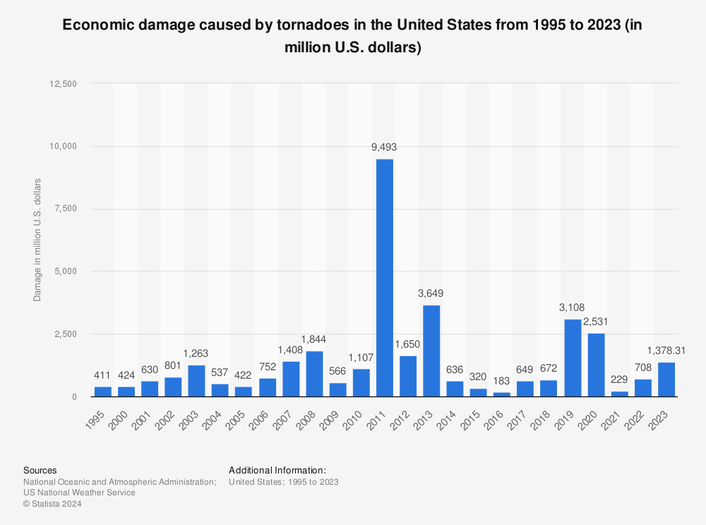

## Table of Contents

## What is a tornado and how does it form?

A tornado is a powerful and dangerous storm that looks like a spinning funnel of air. It can cause a lot of damage to buildings, trees, and cars. Tornadoes usually happen during thunderstorms and can be very scary.

Tornadoes form when warm, moist air meets cool, dry air. This creates a spinning column of air. If this spinning column touches the ground, it becomes a tornado. The spinning air can pick up speed and cause the tornado to grow stronger and more dangerous.

## How often do tornadoes occur and in which regions are they most common?

Tornadoes happen a lot in some places, but not so much in others. In the United States, there are about 1,200 tornadoes every year. This is more than any other country. Most tornadoes happen in the spring and summer months, but they can happen at any time of the year.

The place where tornadoes are most common is called "Tornado Alley." This is a big area in the middle of the United States that includes states like Texas, Oklahoma, Kansas, and Nebraska. These states see a lot of tornadoes because the weather there is just right for them to form. But tornadoes can happen in other places too, like the southeastern United States and even parts of Canada.

## What immediate economic impacts can a tornado have on a community?

When a tornado hits a community, it can cause a lot of damage to homes, businesses, and other buildings. This damage can lead to big costs for fixing and rebuilding. People might lose their homes and have to spend money on temporary places to live. Businesses might have to close, which means they lose money and their workers might not get paid. The community might also need to spend money on cleaning up the mess left behind by the tornado.

The economic impact of a tornado can also affect the whole area, not just the places that were directly hit. For example, if a big factory in the community is damaged, it might not be able to make things anymore. This can lead to fewer jobs and less money coming into the area. Also, if people are scared of more tornadoes, they might not want to visit or move to the community, which can hurt local businesses that depend on tourists or new residents.

## How do tornadoes affect local businesses and employment?

When a tornado hits, it can really hurt local businesses. If a business gets damaged, it might have to close for a while to fix things. This means the business loses money because it can't sell anything or offer services. Workers at the business might not get paid if the business is closed, which can be hard for them. Also, if the business is a big part of the community, like a factory, it might mean fewer jobs for everyone. This can make it tough for people to find work and earn money.

Tornadoes can also make it harder for new businesses to start up. People might be scared to invest in a place where tornadoes happen a lot. This means fewer new shops or restaurants might open, which can slow down the local economy. If people think a place is dangerous because of tornadoes, they might not want to visit or move there. This can hurt businesses that depend on tourists or new people coming to live in the area. Overall, tornadoes can make it hard for local businesses to do well and for people to find and keep jobs.

## What are the costs associated with tornado damage repair and rebuilding?

When a tornado hits, it can cost a lot of money to fix the damage. Homes, buildings, and roads can all get wrecked. People have to pay for things like new roofs, walls, and windows. Sometimes, whole buildings need to be torn down and built again from scratch. The cost of all this can add up fast. Insurance might help pay for some of it, but not always everything. So, people and businesses might have to spend a lot of their own money to get things back to normal.

The community also has to spend money to clean up after a tornado. This includes getting rid of broken trees, fixing power lines, and clearing roads. All these things cost money, and the local government has to pay for them. Sometimes, the government might get help from the state or the country to pay for the big clean-up. But even with help, the total cost of fixing everything after a tornado can be huge. It can take a long time and a lot of money to make the community look and work like it did before the tornado hit.

## How does tornado insurance work and what does it typically cover?

Tornado insurance is a special kind of insurance that helps people when their homes or businesses get damaged by a tornado. It's usually part of a bigger insurance plan called homeowners insurance or business insurance. When you have tornado insurance, you pay a little bit of money every month or year, called a premium. If a tornado damages your property, you can ask your insurance company for help. They will send someone to look at the damage and decide how much money they will give you to fix it.

Tornado insurance usually covers things like fixing your house if the roof gets blown off or walls get knocked down. It can also help pay for broken windows, damaged furniture, and other things inside your home. But it's important to know that not everything is covered. For example, some policies might not pay for fixing your yard or for the cost of living somewhere else while your home is being fixed. It's a good idea to read your insurance policy carefully so you know exactly what is covered and what isn't.

## What are the long-term economic effects of tornadoes on a region?

Tornadoes can have big effects on a region's economy for a long time. After a tornado, it takes a lot of money and time to fix everything. This means people and businesses might have less money to spend on other things. If a lot of businesses get damaged, they might not be able to open again, which can mean fewer jobs for people. This can make it hard for the whole area to grow and do well. Also, if people are scared that more tornadoes will happen, they might not want to move to or visit the area. This can hurt businesses that depend on new people or tourists.

Over time, the region might get help from the government or other places to rebuild. This can bring some money into the area, but it still takes a long time to get back to normal. The cost of fixing everything can make it hard for the region to spend money on other important things, like schools or roads. If the area keeps getting hit by tornadoes, it can be really tough for the economy to get better. People might decide to leave the area, which can make it even harder for businesses to stay open and for the region to grow.

## How do tornadoes impact agriculture and food production?

Tornadoes can really hurt farmers and the food they grow. When a tornado hits a farm, it can destroy crops like corn, wheat, and soybeans. It can also damage barns, equipment, and even kill animals like cows and chickens. This means farmers lose a lot of money because they can't sell their crops or animals. It also means less food is available for people to buy, which can make food prices go up.

Fixing everything after a tornado takes a long time and costs a lot of money. Farmers might have to wait until the next season to plant new crops, which means they don't make any money for a while. Sometimes, the land can be so damaged that it's hard to grow anything there for a few years. This can make it tough for the whole area because farms are a big part of the local economy. If a lot of farms get hit by tornadoes, it can affect the food supply for a whole region or even a country.

## What role do government and non-government organizations play in tornado recovery?

When a tornado hits, the government helps a lot with recovery. The government can give money to fix damaged homes and buildings. They can also send people to help clean up and make sure everyone is safe. Sometimes, the government works with other countries or states to get more help. They might also give money to people who lost their jobs because of the tornado. This help is important because it can make things better faster and help people get back to normal life.

Non-government organizations, like the Red Cross, also play a big role. These groups can give food, water, and a place to stay for people who lost their homes. They might also help with money or supplies to fix things. These organizations often work with the government to make sure help gets to the right places. Both the government and non-government groups are important because they help people when they need it the most after a tornado.

## How can economic forecasting models predict the impact of tornadoes?

Economic forecasting models can help predict how tornadoes might affect a region's economy. These models use information about past tornadoes and how they affected different places. They look at things like how much damage was done, how long it took to fix everything, and how it changed the local economy. By using this information, the models can guess what might happen if a tornado hits a certain area. They can predict things like how much it might cost to fix the damage, how many jobs might be lost, and how the local businesses might be affected.

These models are helpful because they let people and governments plan ahead. If they know a tornado might cause a lot of damage, they can start saving money or making plans to help people right away. For example, they might decide to have extra money ready to help fix homes or to give to people who lose their jobs. By using economic forecasting models, communities can be better prepared for the economic challenges that come with tornadoes and help their recovery go more smoothly.

## What are the differences in economic impact between urban and rural tornadoes?

When a tornado hits an urban area, it can cause a lot of damage to big buildings, homes, and businesses. This means a lot of money is needed to fix everything. In cities, there are usually more people and businesses, so the damage can affect a lot of people. For example, if a big office building gets damaged, many workers might lose their jobs. Also, the cost of fixing things in a city can be higher because everything is more expensive. But cities often have more resources and help from the government to recover faster.

In rural areas, tornadoes can hurt farms and the land where food is grown. This can mean less food for everyone and higher food prices. Farms might lose animals and crops, which is a big problem because it's hard to start over. It can take a long time for the land to be ready to grow food again. Rural areas might not have as much money or help to fix things, so recovery can be slower. But because there are fewer people and buildings, the total cost of damage might be less than in a city.

## How do global climate changes potentially influence the economic effects of tornadoes?

Global climate changes can make tornadoes happen more often or become stronger. When the weather gets warmer, it can make the air more unstable, which can lead to more thunderstorms and tornadoes. If tornadoes happen more often, they can cause more damage to homes, businesses, and farms. This means people and governments will have to spend more money to fix things and help people recover. It can also make it harder for the economy to grow because there's always the risk of another tornado causing more problems.

The economic effects of tornadoes can be even worse because of climate change. If tornadoes become stronger, they can destroy more things and cost a lot more money to fix. This can make it tough for people to get back on their feet, especially if they don't have enough insurance or help from the government. Also, if people know that tornadoes are happening more often because of climate change, they might not want to live or invest in places where tornadoes are common. This can hurt the local economy because fewer people are willing to start businesses or buy homes in those areas.

## References & Further Reading

[1]: Simmons, K.M., & Sutter, D. (2008). ["Tornado Damage and the Increased Frequency of Intense Tornadoes in Mobile Homes."](https://journals.ametsoc.org/view/journals/wcas/1/1/2009wcas1005_1.xml) Natural Hazards, 46(2), 245-260.

[2]: Chan, E.P. (2008). ["Quantitative Trading: How to Build Your Own Algorithmic Trading Business."](https://github.com/ftvision/quant_trading_echan_book) Wiley.

[3]: Jansen, S. (2020). ["Machine Learning for Algorithmic Trading: Predictive models to extract signals from market and alternative data."](https://github.com/stefan-jansen/machine-learning-for-trading) Packt Publishing.

[4]: Wen, W., Yang, S., & Chen, C. (2018). ["The Impact of Tornadoes on Local Economic Activity and the Influence of Disaster Relief."](https://scholar.google.com/citations?user=oSFVC3MAAAAJ&hl=en) Natural Hazards, 93, 891–912.

[5]: Lopez de Prado, M. (2018). ["Advances in Financial Machine Learning."](https://www.amazon.com/Advances-Financial-Machine-Learning-Marcos/dp/1119482089) Wiley.