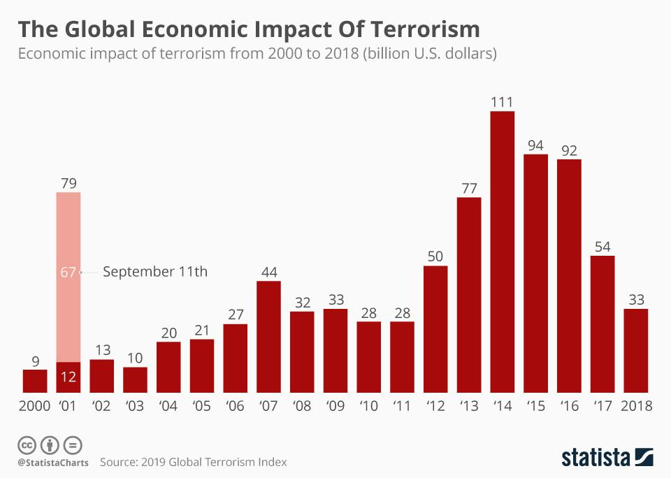

In today's rapidly evolving global landscape, economic systems face a multitude of challenges that significantly affect their stability and growth. These challenges arise from diverse sources, including technological advances, geopolitical shifts, and unexpected incidents like terrorism. Terrorism, in particular, exerts a profound dual impact on global markets, affecting both the direct economic activities and the indirect psychological perceptions that drive these markets. The unpredictability associated with terrorist actions can cause abrupt disruptions in trade, investment flows, and economic confidence, leading to potential volatility in financial markets worldwide.

Algorithmic trading, a method that utilizes computer algorithms to execute trades at high speeds and volumes, has become an integral component of modern finance. This trading approach leverages advanced mathematical models and statistical analyses to optimize trading strategies, offering benefits such as increased speed, efficiency, and accuracy in financial transactions. As financial markets are increasingly driven by algorithmic processes, the implications of their interactions with unforeseen events—such as terrorism—become a critical area for analysis.

There exists a potential connection between terrorism, economic dynamics, and algorithmic trading. Terrorist actions can trigger immediate and widespread reactions in global markets, compounded by the instantaneous nature of algorithmic trading. Algorithms are designed to react quickly to news and market conditions, which can lead to precipitous market movements when faced with geopolitical turmoil, including acts of terrorism. This interaction poses significant questions regarding market stability and highlights the need for robust risk management strategies in algorithmic trading systems.

The purpose of this article is to analyze the economic impacts of terrorism within the context of algorithmic trading. It investigates how terrorism influences market behavior when algorithmic trading systems are in play and assesses the broader implications for global financial stability. Through this analysis, the article aims to provide insights into the interconnectedness of terrorism, economic fluctuations, and financial technology, ultimately offering recommendations for policymakers and financial professionals to mitigate risks and enhance the resilience of global markets.

## Table of Contents

## Understanding Economic Impact of Terrorism

Terrorism exerts a profound influence on the global economy, manifesting through a range of direct and indirect consequences that ripple across various sectors, affect consumer and investor confidence, and alter patterns of international trade and investment.

Historically, major terrorist events have precipitated substantial economic repercussions. Notable among these are the attacks of September 11, 2001, in the United States, which resulted in immediate financial market disruptions, an intensified focus on security expenditures, and a shift in geopolitical dynamics. According to a study by the Global Research firm, the 9/11 attacks caused an estimated $60 billion in insurance losses, while the broader economic impact was assessed at over $500 billion in terms of GDP loss and increased costs related to combatting terrorism.

Direct economic costs of terrorism include destruction of infrastructure, loss of human capital, and the immediate impact on local businesses. For instance, the bombings in Bali in 2002 adversely affected Indonesia's tourism sector, a vital source of revenue for the country, leading to a significant downturn in economic activity in the region.

Indirect costs are pervasive and can be more detrimental in the long term. These include increased government spending on defense and security, which diverts resources from other productive sectors, and heightened risk premiums that elevate the cost of doing business. For example, increased insurance premiums and security-related expenses can stifle investment and innovation.

The psychological effects of terrorism also undermine economic stability by eroding consumer and investor confidence. Following a terrorist attack, there is often a decline in consumer spending and a shift towards conservative investment strategies. This behavioral change can slow economic growth and contribute to market [volatility](/wiki/volatility-trading-strategies). Empirical research suggests that markets typically overreact to terrorism-related news, driven by panic and uncertainty, leading to substantial short-term declines in stock prices and market indices.

Terrorism impacts international trade and investment by exacerbating risks associated with cross-border transactions and disrupting supply chains. For instance, the Madrid train bombings in 2004 led to increased scrutiny and regulations on European trade, affecting both import and export activities. Investors may shy away from countries deemed high-risk, resulting in decreased foreign direct investment and a potential decline in economic development opportunities.

Case studies illustrate disparate regional economic fallouts due to terrorism. In Kenya, the 2013 Westgate Mall attack significantly deterred tourist arrivals, a major economic driver, reducing GDP growth by approximately 0.5% according to the World Bank. Similarly, Pakistan has endured economic repercussions due to a persistent threat of terrorism, with estimated economic losses amounting to nearly $126 billion between 2001 and 2016, as reported by Pakistan's economic survey.

In summary, while the immediate effects of terrorism can be quantified in terms of direct costs and market responses, the broader and more sustained economic impacts are evident through long-term changes in policy, investment patterns, and market behaviors. These underscore the intricate and profound ways in which terrorism shapes economic landscapes globally.

## The Rise of Algorithmic Trading

Algorithmic trading, often termed as algo-trading, involves the use of computer programs and algorithms to execute trades in financial markets. These algorithms are designed to make decisions on the timing, price, and quantity of orders, processing vast amounts of market data with minimal human intervention. The advent of [algorithmic trading](/wiki/algorithmic-trading) has transformed financial markets, enhancing their efficiency and complexity.

### Explanation of Algorithmic Trading and Its Growing Prevalence

Initially introduced in the 1970s to facilitate institutional trading, algorithmic trading has witnessed exponential growth, particularly with advances in computational technologies and increased connectivity across global markets. By the early 2000s, algorithms had become an integral part of trading, driven by the adoption of electronic communication networks (ECNs) and direct market access (DMA), which provided faster and more transparent trading mechanisms. Today, algorithmic trading accounts for a significant portion of market transactions, particularly in developed economies where speed and precision are paramount.

### Benefits of Algorithmic Trading: Speed, Efficiency, and Accuracy

Algorithmic trading offers numerous benefits over traditional trading methods, primarily due to its speed, efficiency, and accuracy:

1. **Speed**: Algorithms can process complex quantitative models and execute trades within milliseconds, a process unattainable by human traders. This capability allows market participants to capitalize on transient market inefficiencies.

2. **Efficiency**: Algorithms can handle large volumes of orders simultaneously, improving market liquidity and narrowing bid-ask spreads. This volume capacity reduces transaction costs and enhances the overall efficiency of market operations.

3. **Accuracy**: Algorithms operate based on predefined criteria and models, reducing the likelihood of errors associated with human decision-making. This precision ensures that trades adhere strictly to the intended strategy without emotional bias.

### Challenges and Risks Associated with Algorithmic Trading

Despite its advantages, algorithmic trading poses several challenges and risks:

1. **Market Volatility**: Algorithms, if not properly calibrated, can exacerbate market volatility. Their rapid reaction to market signals can lead to situations where numerous algorithms simultaneously trigger trades, inducing sharp price movements.

2. **Systemic Risk**: The interconnectedness of algorithms across various platforms can magnify systemic risks. A failure or erroneous behavior in one algorithm can cascade, impacting broader market stability.

3. **Technical Issues**: Relying on complex software systems introduces risks of technical failures, including software bugs and hardware malfunctions, which can result in significant financial losses.

4. **Regulatory Challenges**: The opacity of algorithmic operations challenges regulators aiming to ensure market fairness and prevent market abuse, such as spoofing and layering.

### How Algorithmic Trading Has Reshaped Market Dynamics

Algorithmic trading has significantly reshaped market dynamics by introducing new trading strategies, enhancing [liquidity](/wiki/liquidity-risk-premium), and altering the roles of traditional market players. High-frequency trading ([HFT](/wiki/high-frequency-trading-strategies)), a subset of algorithmic trading, has emerged as a dominant force, characterized by executing numerous trades at incredibly high speeds. This strategy capitalizes on small price discrepancies, contributing significantly to market liquidity.

The dominance of algorithmic strategies has also shifted the competitive edge towards technological advancement, prompting firms to invest in faster and more sophisticated trading infrastructure. Moreover, the impact on market microstructure has been profound, with changes in order flow, transaction costs, and information dissemination patterns.

In summary, while algorithmic trading has brought about increased market efficiency and participation, it has also introduced complexities and risks requiring careful management and oversight. The evolution of algorithmic trading continues to shape the future landscape of financial markets, necessitating ongoing innovation in risk management and regulatory practices.

## Linking Terrorism and Algorithmic Trading

Terrorism can have profound impacts on algorithm-driven markets, influencing both asset prices and market stability. Algorithms, designed to process vast amounts of data at incredible speeds, react almost instantaneously to geopolitical news and terror events. These algorithms are equipped to parse news headlines, economic reports, and even social media feeds to detect patterns that might indicate market-moving events. This capability means they can interpret the implications of terrorism-related news and make automated trading decisions before human traders can even interpret the events themselves.

When terrorist attacks occur, they can trigger immediate responses from algorithmic systems. These algorithms utilize natural language processing (NLP) and sentiment analysis to evaluate the potential economic impact of terrorism on markets. For example, a negative sentiment detected in news articles following an attack may prompt algorithms to sell off assets perceived as risky, leading to swift and sometimes large-scale selloffs in the market.

Case studies demonstrate that such reactions can significantly affect market stability. One notable example is the market response to terrorist events such as the September 11 attacks. Although algorithmic trading was not as prevalent at that time, the event underscored how markets react to terrorism. Similar patterns have been observed in later incidents when algorithms were more involved, with rapid shifts in asset prices seen in response to such events. These reactions can create volatility that persists longer than the underlying economic fundamentals would suggest.

The potential for manipulation within algorithmic responses to terrorism is a concern. Sophisticated traders might attempt to exploit the predictable nature of algorithmic responses to market-moving news, deliberately seeding news articles or analysis with misleading information to trigger algorithmic trades. Such actions could exacerbate market volatility and create systemic risks, as financial markets increasingly rely on algorithmic trading systems.

The systemic risks arise from the interconnectedness of automated trading platforms. If many systems begin to sell assets simultaneously in response to terrorism-related news, it could lead to a cascading effect, amplifying market movements far beyond what would be justified by the fundamentals. This phenomenon is sometimes referred to as a "flash crash," where markets plummet and recover rapidly, as algorithms trigger massive sell and buy orders in quick succession.

To mitigate these risks, there must be robust safeguards and oversight within algorithmic trading systems. Risk management strategies, such as circuit breakers, can temporarily halt trading if extreme volatility is detected, providing a buffer against the cascading effects of automated trading decisions. Additionally, enhanced monitoring for potential manipulative activities and the ethical programming of algorithms to ensure their decisions align with genuine market conditions are critical to maintaining market stability in the face of terrorism and other disruptive events.

## Algorithmic Trading in Turbulent Economic Times

Algorithmic trading has become an integral component of modern financial markets, particularly during periods of economic volatility induced by occurrences like terrorism. The performance of algorithmic trading in such turbulent times manifests both strengths and weaknesses that influence market dynamics and regulatory perspectives.

During economic downturns prompted by terrorism, algorithmic trading systems showcase distinct performance characteristics. These systems, driven by pre-programmed rules and historical data, are designed to execute trades at high speeds, thus potentially capitalizing on market fluctuations. However, the rapid response to market conditions, which is generally advantageous, can also amplify volatility following unexpected geopolitical events. The ability of algorithms to process vast amounts of information swiftly can lead to a homogenized market reaction, where multiple systems execute similar strategies simultaneously, thereby exacerbating price swings.

A comparative analysis of human versus algorithmic trading under these conditions reveals critical insights. Human traders possess the capacity for nuanced judgment, which can be beneficial in mitigating errors caused by unforeseen events not accounted for by algorithms. Nevertheless, algorithmic systems excel in eliminating emotional biases, maintaining consistent performance even amidst panic conditions that often affect human traders. The objective nature of algorithmic decisions thus serves as both an advantage and a drawback, contingent on the market environment.

Algo traders employ several strategies to mitigate risks during periods marked by geopolitical uncertainty. One such strategy is the dynamic adjustment of algorithms to incorporate real-time data feeds that reflect current market sentiments. Additionally, diversification techniques are utilized, with algorithms programmed to distribute investments across different asset classes and geographies to reduce exposure to specific risks. Moreover, many firms enhance risk management by implementing circuit breakers and volatility filters within their algorithms, aiming to stabilize operations in suddenly volatile markets.

The prevalence of algorithmic trading during economically turbulent periods has significant implications for global financial policies and regulatory frameworks. Authorities are increasingly concerned about the potential for systemic risks precipitated by automated trading systems. The flash crash of 2010 and other similar events have underscored the need for stringent oversight and regulatory measures to ensure market stability. Regulators are urged to devise policies that balance innovation with market security, necessitating transparency from firms regarding their algorithmic strategies and the implementation of safeguards to prevent market manipulations.

In conclusion, while algorithmic trading provides substantial benefits in terms of speed and efficiency, its role during economically tumultuous times requires cautious management and regulatory scrutiny. The interplay between automated systems and human oversight, coupled with robust risk mitigation strategies, is pivotal in navigating the challenges presented by economic uncertainties in the modern financial landscape.

## Future Outlook and Policy Implications

Potential developments in algorithmic trading are increasingly intertwined with the evolving threat of terrorism. As geopolitical tensions and terrorist activities generate economic perturbations, algorithmic trading systems must adapt to these dynamics. The capability to process vast amounts of data in real-time positions algorithmic models to potentially anticipate or react to market anomalies. Future developments in algorithmic trading may include enhanced [machine learning](/wiki/machine-learning) algorithms capable of integrating unconventional data sources, such as social media and real-time news feeds, to predict market responses to terrorism-related events. These advancements, however, must also consider the unpredictability of such events, which can lead to heightened volatility and systemic risk.

The need for robust risk management frameworks becomes paramount as algorithmic trading interfaces with terrorism-induced market fluctuations. Traditional risk management techniques might fall short in addressing the rapid and often unforeseen consequences of terrorist activities on global markets. Therefore, algorithms must be designed with contingencies for extreme scenarios. Incorporating stress testing and scenario analysis for geopolitical shocks can help refine these frameworks. Additionally, embedding risk metrics such as Value at Risk (VaR) or Conditional Value at Risk (CVaR) within trading algorithms can quantify potential losses in volatile scenarios.

Public perceptions and the ethical implications of utilizing algorithms in volatile times involve significant considerations. While algorithmic trading promises efficiency and precision, public skepticism arises from potential manipulation and perceived lack of human oversight in sensitive situations. Transparency in algorithmic operations, particularly how they respond to real-world events, is crucial to gaining public trust. Ethical considerations also involve ensuring these systems do not exacerbate market instability during crises, instead providing liquidity and stability.

Policymakers face the challenge of balancing innovation and security within the algorithmic trading landscape. Encouraging technological advancement while safeguarding market integrity requires comprehensive regulatory frameworks. Recommendations for policymakers include promoting transparency in algorithmic strategies and mandating disclosures of algorithmic decision-making processes. International cooperation among regulatory bodies could establish standardized practices, ensuring algorithms operate within ethical and security thresholds globally. The development of regulatory sandboxes can enable the testing of new algorithmic strategies under controlled conditions, mitigating unintended consequences.

Final thoughts on the interconnectedness of terrorism, the economy, and algorithmic trading highlight an evolving landscape where security and innovation coexist. As financial markets grow more complex, understanding these interconnections is crucial for developing resilient economic systems. Policymakers, financial institutions, and technology developers must collaborate to harness the benefits of algorithmic trading while mitigating risks associated with terrorism and economic instability. This collaborative approach ensures sustainable economic growth, where technological advancements do not outpace regulatory and ethical norms.

## Conclusion

The interconnected nature of terrorism, economic activity, and algorithmic trading presents complex challenges that demand a vigilant and adaptive approach. The economic repercussions of terrorism can be profound, affecting not only the immediate victims but also global markets through indirect costs and shaken investor confidence. These effects underscore the necessity for comprehensive strategies that consider both direct impacts on specific sectors and broader psychological impacts on consumer behavior and international trade dynamics.

Algorithmic trading, a potent force in modern financial markets, offers both advantages and risks in these turbulent times. Its ability to react swiftly to geopolitical events highlights the dual role it plays in either stabilizing or destabilizing markets. While it provides speed and efficiency, the potential for manipulation and additional systemic risks cannot be ignored, especially when algorithms react to terrorism or other sudden geopolitical events. This calls for continuous refinement of algorithms to ensure they do not exacerbate volatility.

The convergence of terrorism and algorithm-driven markets necessitates an updated regulatory framework and risk management strategies to safeguard against unforeseen adverse effects. Policymakers must strike a balance between fostering innovation in algorithmic trading and ensuring financial security. Public perceptions and ethical considerations also play a critical role in shaping these regulations. The importance of a nuanced understanding of these interconnections is paramount for sustainable economic growth and market stability. Ultimately, as the global landscape evolves, staying vigilant and adaptable is key to overcoming the economic challenges posed by terrorism and technological advancements in finance.

## References & Further Reading

[1]: Frey, B. S., Luechinger, S. (2004). ["How do Institutions Affect Economic Performance?"](https://papers.ssrn.com/sol3/papers.cfm?abstract_id=599742) The World Economy.

[2]: Karolyi, G. A., & Martell, R. (2006). ["Terrorism and the Stock Market."](https://papers.ssrn.com/sol3/papers.cfm?abstract_id=823465) *Journal of Finance,* 61(4), 1527-1565.

[3]: Chen, A. H., & Siems, T. F. (2004). ["The Effects of Terrorism on Global Capital Markets."](https://www.sciencedirect.com/science/article/pii/S0176268003001022) *European Journal of Political Economy,* 20(2), 349-366.

[4]: Hendershott, T., Jones, C. M., & Menkveld, A. J. (2011). ["Does Algorithmic Trading Improve Liquidity?"](https://onlinelibrary.wiley.com/doi/full/10.1111/j.1540-6261.2010.01624.x) *Review of Financial Studies,* 79(1), 1-51.

[5]: Johnson, B., & Menkveld, A. J. (2014). ["High Frequency Trading: Economic Benefits and Risks."](https://www.annualreviews.org/content/journals/10.1146/annurev-financial-121415-033010) *In Institutional Investors: Mitigating Risks and Seizing Opportunities,* CFA Institute.

[6]: Aldrich, G. (2004). ["Economic Impacts of Terrorism – A Historical Perspective."](https://www.degruyter.com/document/doi/10.1515/peps-2020-0031/html?lang=en) *Studies in Conflict & Terrorism,* 27(12), 177-191.