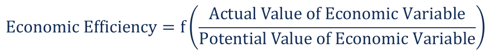

## Table of Contents

## What is economic efficiency?

Economic efficiency is about using resources in the best way possible. It means getting the most value out of what we have, like money, time, and materials. When an economy is efficient, it produces goods and services that people want without wasting anything. This helps everyone because it can lead to lower prices and more choices for consumers.

There are different types of economic efficiency, but one important kind is called allocative efficiency. This happens when the resources are used to make products that people really want and are willing to pay for. If a business makes something that nobody wants, it's not using resources efficiently. Another type is productive efficiency, which is when goods are produced at the lowest possible cost. When both types of efficiency are achieved, the economy works well and people can enjoy a higher standard of living.

## Why is economic efficiency important in economics?

Economic efficiency is important because it helps make the best use of limited resources. Imagine you have a small amount of money to spend. If you spend it wisely on things you really need, you'll be better off than if you waste it on things you don't need. In the same way, when an economy is efficient, it uses resources like labor, land, and capital to produce things that people want and need. This means more people can have what they need, and there's less waste.

Efficiency also helps to keep prices low and improve the quality of life for everyone. When businesses produce things efficiently, they can sell them at lower prices because they're not wasting money. This means people can buy more with the money they have. Plus, when resources are used well, there's more money and resources left over to invest in new ideas and technologies, which can make life even better. So, economic efficiency is key to making sure an economy works well and helps everyone.

## What are the different types of economic efficiency?

Economic efficiency comes in different forms, but two of the main types are allocative efficiency and productive efficiency. Allocative efficiency happens when resources are used to make products that people really want and are willing to pay for. It's like when you spend your money on things that make you happy and are useful to you. If a business makes something that nobody wants, it's not using resources efficiently. On the other hand, productive efficiency is when goods are produced at the lowest possible cost. This means a business is good at making things without wasting money or materials. When a company can make things cheaper, it can sell them for less, which is good for everyone.

Another type of economic efficiency is technical efficiency, which focuses on using the best technology and methods to produce goods and services. It's about doing things the smartest way possible. If a factory uses old machines that break down a lot, it's not technically efficient. But if it uses new, reliable machines, it can make more stuff in less time. Lastly, there's dynamic efficiency, which looks at how well an economy can keep improving over time. This is important because new ideas and technologies can make things better and cheaper. When an economy is dynamically efficient, it's always getting better and finding new ways to do things.

## How does allocative efficiency differ from productive efficiency?

Allocative efficiency is about making the right things. It happens when resources are used to produce goods and services that people really want and are willing to pay for. Think of it like this: if you have some money, you want to spend it on things that make you happy or that you need. If a business makes something that nobody wants, it's not using resources in the best way. So, allocative efficiency is all about matching what's produced with what people actually want.

On the other hand, productive efficiency is about making things in the best way possible. It happens when goods and services are produced at the lowest possible cost. Imagine you're baking cookies. If you can bake the same number of cookies using less flour and sugar, you're being productively efficient. Businesses that are productively efficient can save money on production costs, which can lead to lower prices for customers. So, while allocative efficiency focuses on what to produce, productive efficiency is all about how to produce it.

## What are the basic principles behind measuring economic efficiency?

Measuring economic efficiency involves looking at how well resources are used to meet people's needs and wants. One key principle is comparing the benefits people get from goods and services to the costs of making them. If the benefits are higher than the costs, then the economy is using resources efficiently. This is often done by looking at how much people are willing to pay for something compared to how much it costs to produce. If people are willing to pay a lot for something that's cheap to make, that's a sign of efficiency.

Another principle is about making sure that resources are used in the best way possible. This means checking if the economy is producing things at the lowest possible cost and if it's making the right mix of goods and services that people want. Economists use different tools and methods to measure this, like looking at production costs, market prices, and how resources are allocated across different industries. By doing this, they can see if the economy is working well or if there are areas where it could be more efficient.

## Can you explain the concept of Pareto efficiency?

Pareto efficiency is a way to think about how well an economy is using its resources. It's named after an Italian economist named Vilfredo Pareto. The basic idea is that an economy is Pareto efficient if you can't make one person better off without making someone else worse off. Imagine you have a pie to share with your friends. If you cut the pie in a way that you can give more to one friend without taking away from another, it's not Pareto efficient. But if any change you make to the pie slices means someone gets less, then the way you've shared the pie is Pareto efficient.

Pareto efficiency is important because it helps us understand if an economy is doing as well as it can. But it doesn't mean everyone is happy or has enough. It just means that the resources are being used in a way that any change would hurt someone. For example, in a rich country, the economy might be Pareto efficient, but there could still be people who are poor. So while Pareto efficiency is a useful idea for measuring how resources are used, it doesn't tell the whole story about fairness or everyone's well-being.

## What are some common formulas used to measure economic efficiency?

One common way to measure economic efficiency is by using the concept of cost-benefit analysis. This involves comparing the total costs of producing something to the total benefits people get from it. If the benefits are greater than the costs, the production is considered efficient. A simple formula for this is: Efficiency = Total Benefits - Total Costs. If the result is positive, it means the economy is using resources well. This method helps businesses and governments decide whether a project or a product is worth the investment.

Another way to measure economic efficiency is through the concept of marginal analysis. This looks at the additional benefits and costs of producing one more unit of a good or service. The formula often used here is: Marginal Benefit = Change in Total Benefit / Change in Quantity. If the marginal benefit of producing one more unit is greater than the marginal cost, it's efficient to produce that unit. This helps companies figure out the best level of production to maximize efficiency.

## How do economists calculate the efficiency of resource allocation?

Economists calculate the efficiency of resource allocation by looking at how well resources are used to produce things that people want. They often use something called cost-benefit analysis to do this. In cost-benefit analysis, economists compare the total benefits people get from a good or service to the total costs of making it. If the benefits are bigger than the costs, then the way resources are being used is considered efficient. For example, if building a new road costs $1 million but brings $2 million in benefits to the community, that's a sign of efficient resource allocation.

Another way economists measure efficiency is through marginal analysis. This method looks at the extra benefits and costs of making one more unit of something. If the extra benefit of making one more unit is more than the extra cost, then it's efficient to make that unit. For instance, if making one more car brings in $10,000 in revenue but only costs $8,000 to produce, it's efficient to make that car. By using these methods, economists can figure out if resources are being used in the best way possible to meet people's needs and wants.

## What role does the production possibility frontier play in measuring efficiency?

The production possibility frontier, often called the PPF, is a graph that shows all the possible combinations of two goods that an economy can produce with its resources. It's like a line that shows the limit of what an economy can do. When an economy is working on the PPF, it means it's using all its resources in the best way possible. This is called productive efficiency. If the economy is inside the PPF, it means it's not using all its resources, so it's not being as efficient as it could be.

The PPF also helps us see if an economy is being allocatively efficient. This happens when the economy is making the right mix of goods that people want. If the economy is on the PPF but making too much of one thing and not enough of another, it's not allocatively efficient. By looking at where the economy is on the PPF, economists can tell if resources are being used well to meet people's needs and wants. So, the PPF is a useful tool for measuring both productive and allocative efficiency.

## How can economic efficiency be improved in a market?

Economic efficiency can be improved in a market by making sure businesses produce things that people really want and do it in the cheapest way possible. One way to do this is by using technology better. If a business starts using new machines or software that helps them make things faster and cheaper, they can be more efficient. Another way is by getting rid of rules and laws that stop businesses from working well. If there are too many rules, it can make it hard for businesses to do their best. By making it easier for businesses to work, they can use their resources better.

Another important thing is making sure there's good competition in the market. When businesses have to compete with each other, they try harder to make better products and sell them for less. This makes the whole market more efficient because businesses have to use their resources in the best way possible to stay ahead. Also, helping people learn new skills and get better education can make the workforce more efficient. When people know more and can do their jobs better, the whole economy can work better. So, by focusing on technology, rules, competition, and education, a market can become more efficient.

## What are the limitations and criticisms of traditional efficiency measurement methods?

Traditional methods of measuring economic efficiency, like cost-benefit analysis and marginal analysis, have some problems. One big issue is that they often don't think about things that are hard to put a price on, like the environment or people's happiness. For example, if a factory pollutes a river, the cost of cleaning up the river might not be included in the cost-benefit analysis. This can make a project look more efficient than it really is. Also, these methods can be tricky because they rely on guesses about future costs and benefits, which can be wrong. If the guesses are off, the whole analysis can be off too.

Another criticism is that traditional efficiency measures don't always think about fairness. Just because something is efficient doesn't mean it's fair. For example, a policy might be efficient if it makes a few people very rich but leaves many others poor. Traditional methods might say this is good because the total benefits are high, but it doesn't help everyone. Also, these methods can be hard to use in real life because they need a lot of information that can be hard to get. If the information is wrong or missing, the results can be wrong too. So, while these methods are useful, they have limits and can miss important things.

## How do advanced econometric models enhance the measurement of economic efficiency?

Advanced econometric models help measure economic efficiency better by using fancy math and lots of data. These models can look at many different things at the same time, like how much people are willing to pay for something, how much it costs to make, and even things like how happy people are or how clean the environment is. By using all this information, these models can give a fuller picture of efficiency. They can also handle things that change over time, like how technology gets better or how people's wants change. This makes the measurements more accurate and useful for making decisions.

These models also let economists test different ideas and see what would happen if things were done differently. For example, they can look at what would happen if a new law was passed or if a company started using a new way to make things. By running these tests, economists can find the best ways to use resources and make the economy more efficient. Even though these models are complicated, they help make sure that the measurements of efficiency are as good as they can be, taking into account all the important things that traditional methods might miss.

## What is the understanding of efficiency in economics?

Efficiency in economics is fundamentally about the optimal use of resources to achieve desired outcomes. In this context, the basic efficiency formula—Output ÷ Input—serves as a crucial metric for assessing how well resources are being used to produce goods or services. This ratio is a cornerstone for evaluating performance and productivity across various economic activities.

The efficiency formula can be mathematically expressed as: 

$$
\text{Efficiency} = \frac{\text{Output}}{\text{Input}}
$$

This formula helps determine how much output is generated per unit of input, serving as a benchmark for comparing different production processes or economic entities. For instance, if a factory produces 200 units of a product using 50 units of input, its efficiency would be:

$$
\text{Efficiency} = \frac{200}{50} = 4
$$

This means four units of output are produced for every unit of input, highlighting the productivity level of the factory.

Economic efficiency can be categorized into two primary types: allocative efficiency and productive efficiency.

Allocative efficiency occurs when resources are distributed in a manner that maximizes total welfare. It ensures that resources are allocated where they are most valued and can generate the highest benefit. This point is achieved when the price of goods or services equals the marginal cost of production, indicating that consumer preferences are perfectly aligned with production capacities.

Productive efficiency, on the other hand, refers to the scenario where goods are produced at the lowest possible cost. This means that production occurs on the frontier of the production possibility curve, where it's impossible to produce more of one good without reducing the output of another. It's an indication that resources are utilized without any waste, maximizing the output from the available inputs.

Understanding these concepts is essential for optimizing resource use in any economic system. The pursuit of efficiency—whether through technological advancements, process improvements, or strategic decision-making—aims to enhance both allocative and productive efficiency, leading to overall economic prosperity and sustainability.

## What is the Efficiency Formula Explained?

The efficiency formula is integral for evaluating performance by calculating the ratio of useful output to total input, providing insight into how resources are utilized. Mathematically, efficiency ($E$) is represented as:

$$

E = \frac{\text{Output}}{\text{Input}} \times 100\% 
$$

This formula is widely applicable across diverse contexts. In manufacturing, for example, it is used to assess production efficiency by comparing actual production output to theoretical maximum output. Suppose a factory has a machine producing 80 units per hour while the maximum capacity is 100 units; the efficiency would be:

$$

E = \frac{80}{100} \times 100\% = 80\% 
$$

This figure indicates that the factory operates at 80% efficiency, highlighting potential areas for improvement. 

In service industries, the efficiency formula helps evaluate operational performance. Consider a call center where operators handle 120 calls daily, with a target of 150 calls. The efficiency can be calculated as:

$$

E = \frac{120}{150} \times 100\% = 80\% 
$$

Again, the 80% efficiency suggests room for enhancing resource allocation or processes to meet service targets.

Beyond production and services, efficiency ratios play a vital role in financial analysis. Metrics like Return on Assets (ROA) and Return on Equity (ROE) utilize the efficiency formula to determine how effectively companies deploy capital. For instance, ROA is calculated by dividing net income by total assets, translating financial performance into efficiency terms.

Python can be employed for automating efficiency calculations in scenarios involving large datasets. Below is a simple Python function demonstrating this application:

```python
def calculate_efficiency(output, input_value):
    try:
        efficiency = (output / input_value) * 100
        return f"Efficiency: {efficiency:.2f}%"
    except ZeroDivisionError:
        return "Input value cannot be zero."

# Example usage:
print(calculate_efficiency(80, 100))  # Output: Efficiency: 80.00%
```

This function provides a straightforward method to compute efficiency ratios, emphasizing the formula's versatility. By systematically analyzing input and output relationships across sectors, organizations can identify inefficiencies and make data-driven decisions to optimize performance.

## What are the impacts of efficiency on economic growth?

Efficiency profoundly impacts economic growth at both microeconomic and macroeconomic levels. By improving efficiency in sectors like manufacturing and finance, economies can achieve substantial gains in productivity, which in turn drives economic growth and enhances living standards. 

In manufacturing, efficiency improvements often result from streamlining production processes, optimizing resource allocation, and minimizing waste. For example, using the formula for production efficiency, which can be expressed as:

$$
\text{Production Efficiency} = \left( \frac{\text{Actual Output}}{\text{Maximum Possible Output}} \right) \times 100
$$

companies can quantitatively assess their performance and identify areas for enhancement. By maximizing output relative to the input, manufacturers can reduce costs and increase profitability, creating a more robust economic environment. A case study of lean manufacturing strategies, such as those implemented by Toyota through its Toyota Production System (TPS), reveals significant reductions in production times and inventory levels, contributing to cost reductions and increased market competitiveness. These improvements not only benefit the individual company but also bolster the overall manufacturing sector's contribution to economic growth.

In finance, efficiency manifests through more effective capital allocation and improved financial market operations. Algorithmic trading is a notable example where technological advancements have heightened trading efficiency by processing massive datasets at rapid speeds. This has led to reduced transaction costs and enhanced [liquidity](/wiki/liquidity-risk-premium) in the market, ultimately facilitating faster economic transactions and financial stability. For instance, high-frequency trading ([HFT](/wiki/high-frequency-trading-strategies)) firms leverage algorithmic strategies to capitalize on minute price fluctuations, thereby increasing market efficiency and ensuring that prices more accurately reflect available information. More efficient financial systems support productive investment by allocating resources to their most valuable uses, fostering economic growth.

Several empirical studies illustrate these transformative effects of efficiency improvements. For instance, a study on the impact of energy efficiency policies in the European Union demonstrated that improving energy efficiency not only reduces energy consumption but also leads to economic savings and job creation. The study found that every 1% improvement in energy efficiency could increase Gross Domestic Product (GDP) by approximately 0.3% while creating employment opportunities. This emphasizes the dual role of efficiency in driving economic expansion while promoting environmental sustainability.

Overall, improving efficiency in critical sectors like manufacturing and finance can substantially boost productivity, drive economic growth, and elevate living standards. By seizing opportunities to enhance operational performance and resource utilization, economies can pave the way for sustainable development and prosperity.

## References & Further Reading

[1]: Bergstra, J., Bardenet, R., Bengio, Y., & Kégl, B. (2011). ["Algorithms for Hyper-Parameter Optimization."](https://papers.nips.cc/paper/4443-algorithms-for-hyper-parameter-optimization) Advances in Neural Information Processing Systems 24.

[2]: ["Advances in Financial Machine Learning"](https://www.amazon.com/Advances-Financial-Machine-Learning-Marcos/dp/1119482089) by Marcos Lopez de Prado

[3]: ["Evidence-Based Technical Analysis: Applying the Scientific Method and Statistical Inference to Trading Signals"](https://www.amazon.com/Evidence-Based-Technical-Analysis-Scientific-Statistical/dp/0470008741) by David Aronson

[4]: ["Machine Learning for Algorithmic Trading"](https://github.com/stefan-jansen/machine-learning-for-trading) by Stefan Jansen

[5]: ["Quantitative Trading: How to Build Your Own Algorithmic Trading Business"](https://www.amazon.com/Quantitative-Trading-Build-Algorithmic-Business/dp/1119800064) by Ernest P. Chan