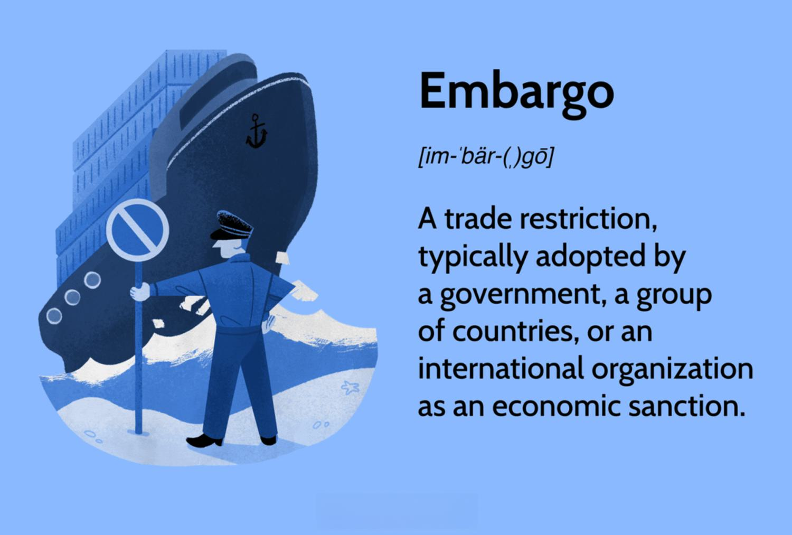

Trade restrictions, including economic embargoes, have been a longstanding tool in international relations, used to exert pressure on targeted countries in order to influence their policies or behaviors. These measures can range from the complete cessation of trade with a country to targeted restrictions on particular goods or services. While the primary intention of such restrictions is often political, the economic ramifications are complex and affect both the country imposing the embargo and the nation that is targeted.

For the targeted countries, the imposition of a trade embargo can result in severe economic consequences. These include inflation, a reduction in the availability of essential goods, and disruptions in the supply chain. Such conditions can lead to a decline in the quality of life for the population and may, paradoxically, also lead to increased internal pressure on governments or to a strengthening of resolve among certain political factions.



Conversely, countries that impose these embargoes may also experience economic drawbacks such as loss of trade revenue and potential inflationary pressures due to shifts in supply and demand dynamics within their own markets. Furthermore, these countries must weigh the diplomatic and political costs, as sustaining trade restrictions often requires substantial domestic and international political capital.

In this complex landscape, the rise of algorithmic trading has introduced new considerations into the financial markets. Algorithmic trading, which relies on the use of computer algorithms to execute trades at high speed and volume, requires a nuanced understanding of these economic dynamics to effectively respond to market changes induced by trade embargoes. Algorithms must be designed to quickly adapt to new market scenarios, incorporating geopolitical risks into their strategies to hedge against market volatility.

This article endeavors to explore the multifaceted economic effects of trade restrictions and strategize how algorithmic trading can be leveraged to navigate such market changes, offering both challenges and opportunities for stakeholders in a rapidly evolving global economic environment.

## Table of Contents

## Understanding Trade Embargoes

Trade embargoes are significant regulatory measures implemented by a country or group of countries to restrict or cease the trade of certain goods or services with one or more target nations. These restrictions are often imposed as part of broader foreign policy strategies aimed at pressuring target nations to alter specific policies or behaviors without engaging in military conflict. This approach allows countries to wield economic influence to achieve diplomatic ends.

Embargoes can vary in scope and severity, ranging from targeted prohibitions on individual goods or commodities to widespread bans affecting entire sectors of the economy. The scope is typically determined by the diplomatic objectives at stake and the international consensus on the issue being addressed. For example, embargoes may prohibit trade of military equipment, specific technology, or critical resources such as oil and gas.

Historically, embargoes have been employed to address a variety of international concerns, with notable examples including efforts to combat human rights abuses and prevent nuclear proliferation. Human rights-related embargoes, such as those imposed on apartheid-era South Africa, sought to isolate regimes viewed as violating fundamental rights and freedoms, thereby compelling them to change their practices. Similarly, embargoes aimed at countering nuclear proliferation, such as those targeting Iran, focus on restricting access to materials and technology that could contribute to the development of nuclear weapons.

The strategic use of trade embargoes underscores their role as a tool of coercive diplomacy, allowing countries to leverage economic relationships to influence geopolitical dynamics without resorting to direct military intervention.

## Economic Effects on the Targeted Country

Trade embargoes often impose severe economic challenges on targeted countries, leading to various detrimental effects. One of the primary consequences is inflation, which can result from disruptions in supply chains. When essential goods become scarce due to restricted trade, the prices of these goods tend to rise, contributing to inflationary pressures. In economic terms, when supply decreases and demand remains constant, the price equilibrium is disturbed, causing inflation.

For example, if $P$ represents the price level and $Q$ the quantity of goods available, an embargo can lead to a shift from $Q_1$ to $Q_2$ (where $Q_2 < Q_1$), resulting in an increase in price from $P_1$ to $P_2$. This can be expressed as:

$$
P_2 = P_1 \times \left( \frac{Q_1}{Q_2} \right)
$$

Such disruptions often lead to shortages of critical goods, adversely affecting the population's quality of life. Essential products like food, medicine, and energy may become less accessible, leading to increased hardship for the general populace. This can exacerbate poverty levels and reduce access to necessary healthcare and resources.

Economic isolation resulting from these trade restrictions may drive the targeted nation toward self-reliance or encourage the formation of new trade alliances. When isolated, a country might increase domestic production capabilities, an often costly and time-consuming transition. Alternatively, the country may seek new trading partners outside the purview of the embargo, possibly altering its geopolitical stance and regional relationships.

Politically, the repercussions of economic sanctions can be multifaceted. The government may face mounting pressure from the domestic population experiencing these hardships, potentially leading to policy changes or shifts in governance. Conversely, in some scenarios, the regime might experience an unintended bolstering of resolve as it adopts a nationalist stance, portraying the embargo as an external threat to sovereignty.

In conclusion, trade embargoes have complex and profound impacts on targeted countries, affecting their economic health, societal welfare, and political landscapes. Understanding these dynamics is crucial for comprehending the broader implications of international trade policies.

## Impact on the Imposing Country

Countries that impose trade embargoes on others often experience unintended economic consequences, which can manifest in several ways. One primary impact is the potential loss of trade revenue. When a nation restricts its own businesses from engaging with a foreign market, it could potentially forfeit substantial sales and profits from that market. This is especially true if the targeted nation is a significant trade partner. For example, if Country A exports a significant [volume](/wiki/volume-trading-strategy) of goods to Country B, an embargo could disrupt this trade flow, leading to a decline in overall trade revenues for Country A.

This disruption can have wider effects on domestic industries, particularly those closely tied to export markets. A sudden decrease in export demands can lead to surplus inventories, which in turn may cause production slowdowns or shutdowns. Consequently, the job market in the imposing country could suffer, as businesses may need to lay off employees or halt hiring in response to reduced market demand. This impact on employment can further cascade into broader economic instability, affecting consumer spending and growth prospects.

Moreover, implementing and maintaining trade embargoes requires significant political capital. Governments imposing such measures must ensure that they have both domestic political support and international backing. Domestically, there can be opposition from industries and labor groups adversely affected by the embargo, leading to political pressure to lift or ease restrictions. Internationally, the enforcing country may face diplomatic challenges, especially if allies or global institutions (e.g., World Trade Organization) view the embargo as unjust or harmful to global trade principles.

These factors underscore the complexity of trade restrictions as a policy tool. While they serve as mechanisms to exert pressure on targeted nations, the economic repercussions for imposing countries necessitate careful consideration of both short-term impacts and long-term strategic interests. Thus, countries must weigh the political objectives against the economic costs inherent in sustaining trade embargoes.

## Algorithmic Trading in the Face of Trade Restrictions

Algorithmic trading systems are essential tools for managing the complexities introduced by trade restrictions and embargoes. These systems are designed to rapidly analyze vast amounts of market data, enabling traders to make informed decisions in response to evolving conditions. As trade embargoes can lead to increased market [volatility](/wiki/volatility-trading-strategies) and uncertainty, algorithms provide a structured approach to navigate these challenges.

One of the primary advantages of [algorithmic trading](/wiki/algorithmic-trading) in the context of trade restrictions is its ability to quickly adapt to new market conditions. Algorithms can be configured to monitor news sources, social media, and other real-time data feeds to detect changes related to trade policies. This allows traders to adjust their positions and strategies promptly, minimizing potential losses and maximizing opportunities. For example, if a sudden announcement of an embargo on a particular commodity occurs, an algorithm could automatically adjust positions related to that commodity, protecting investments from adverse price movements.

Furthermore, algorithmic systems must incorporate geopolitical risk analysis to effectively hedge against the volatility induced by trade embargoes. Trade restrictions often result in significant geopolitical shifts, influencing global markets and currency exchange rates. By integrating geopolitical risk factors into their models, algorithms can better anticipate market reactions to political events. This might involve scenario analysis, where algorithms simulate various political outcomes and their potential market impacts, allowing traders to prepare for multiple contingencies.

Consider the following Python snippet, demonstrating a simplified algorithmic approach to adjusting trading strategies based on geopolitical events:

```python
import numpy as np

def adjust_strategy(event_impact):
    base_investment = 10000
    risk_multiplier = 1.5 if event_impact > 0.5 else 1.0

    # Adjust investment based on perceived risk
    adjusted_investment = base_investment * risk_multiplier
    return adjusted_investment

# Example: An event with high geopolitical risk impact
event_impact = np.random.rand()  # Simulate event impact likelihood
adjusted_investment = adjust_strategy(event_impact)
print(f"Adjusted Investment: ${adjusted_investment:.2f}")
```

In this example, `event_impact` represents the perceived impact of a geopolitical event on the market, modeled as a random variable between 0 and 1. The function `adjust_strategy` then adjusts the investment strategy based on the calculated impact, increasing exposure if the impact is deemed significant.

Algorithmic trading's ability to anticipate and respond to trade restrictions' market dynamics is further enhanced by [machine learning](/wiki/machine-learning) and advanced data analytics. These technologies enable algorithms to identify patterns and trends that might not be immediately obvious to human traders. As a result, traders can not only react to market changes promptly but also capitalize on emerging opportunities that result from shifts in trade policies.

In conclusion, algorithmic trading systems are invaluable for interpreting the market uncertainties induced by trade restrictions. By factoring in real-time data and geopolitical risks, these systems ensure that traders are well-equipped to handle the volatile nature of global economic shifts resulting from trade embargoes.

## Case Studies of Economic Embargoes

### Case Studies of Economic Embargoes

Economic embargoes have served as powerful political tools, profoundly influencing the socioeconomic fabric of targeted nations. An analysis of historical embargoes on countries like Cuba and Iran offers a window into their enduring economic ramifications.

#### The Cuban Embargo

The United States enforced an economic embargo against Cuba starting in 1960, following the Cuban Revolution and subsequent nationalization of American-owned properties. For over sixty years, this embargo, one of the most enduring in modern history, has significantly shaped Cuba's economy. The island nation faced persistent shortages of essential goods, ranging from medical supplies to technological equipment, hampering its development capabilities. Economically isolated, Cuba turned towards the Soviet Union until its collapse in 1991, which further exacerbated the nation's fiscal woes.

From a trade perspective, the embargo restricted Cuba's access to a potential market worth billions of dollars, curbing its foreign investment prospects. Within the country, this led to the adaptation of import substitution strategies, wherein the government sought to produce goods locally to alleviate shortages. However, these efforts were often hampered by technological deficiencies and limited access to raw materials. The enduring nature of the embargo underscores the substantial long-term economic impacts such trade restrictions can impose on a nation.

#### The Iranian Embargo

Iran has been subjected to various sanctions and embargoes by the international community, primarily due to concerns surrounding its nuclear program. Under these embargoes, Iran experienced significant economic impediments, including inflation, currency devaluation, and a sharp decline in oil exports, a mainstay of its economy. The banking sector was hit hard, as international transactions were heavily restricted.

The embargo on Iran exemplifies how such measures can lead to diversification within an economy, albeit under duress. Iran sought to reduce its dependency on oil exports by boosting local non-oil industries and increasing trade with specific countries, like China and India, which did not fully adhere to Western-imposed embargoes. However, these alterations in trade patterns meant Iran faced often unfavorable trade terms and increased costs associated with circumventing the embargo.

#### The Arab Oil Embargo of the 1970s

The Arab oil embargo of 1973 provides crucial insights into the global consequences of trade restrictions. Initiated by the Organization of Arab Petroleum Exporting Countries (OAPEC) as a geopolitical strategy, the embargo targeted nations supportive of Israel during the Yom Kippur War. This led to a significant reduction in oil supply, causing prices to quadruple and triggering a global energy crisis.

The immediate aftermath saw recessionary pressures in Western nations, highlighting their dependence on Middle Eastern oil. Economies suffered from inflation, unemployment, and a sluggish industrial sector due to escalating energy costs. The embargo accelerated efforts to diversify energy sources and sparked investments in alternative energies and more efficient technologies. The global oil market experienced a paradigm shift, emphasizing the interconnectedness of geopolitical decisions and economic stability.

Through these historical examples, the profound long-term economic impacts of embargoes become apparent. They not only reshape domestic economic policies but also influence global market dynamics. Understanding these case studies equips policymakers and financial analysts with the knowledge to anticipate potential shifts in trade patterns and economic landscapes.

## The Future of Trade Restrictions and Global Economics

As global tensions fluctuate, the landscape of trade restrictions is poised to undergo significant transformations. In an increasingly interconnected world, the enforcement and evasion of trade embargoes are likely to be reshaped by technological advancements. Among these innovations, blockchain technology and enhanced data analytics stand out as potentially transformative tools.

Blockchain technology offers a promising avenue for improving the transparency and traceability of international trade. By leveraging decentralized ledgers, countries may enhance their ability to enforce embargoes with more precision. Blockchain could enable the tracking of goods from origin to destination, ensuring that sanctioned products do not reach forbidden markets. This could reduce the possibility of smuggling and other illicit activities that undermine the effectiveness of trade restrictions. Conversely, blockchain's transparent nature may also facilitate the circumvention of embargoes by allowing non-compliant trading networks to form outside of state oversight.

Improved data analytics play a crucial role in understanding the broader economic impacts of trade restrictions, providing policymakers with insights into potential outcomes. By utilizing big data and machine learning algorithms, governments and businesses can forecast the effects of proposed embargoes on international supply chains and domestic economies. This predictive power enables more informed decision-making, allowing stakeholders to anticipate and mitigate negative consequences. Data analytics can also help identify new trade opportunities, allowing companies to adapt quickly to the shifting landscape caused by embargoes.

The future of algorithmic trading is closely interwoven with these geopolitical developments. Algorithmic trading systems will likely evolve to incorporate geopolitical analysis, fine-tuning their strategies to account for political risks. By integrating data from global news sources, government policies, and economic indicators, these systems can predict market movements with greater accuracy. This capability will enable traders to hedge against the volatility introduced by trade restrictions, offering a competitive edge in uncertain markets. 

Moreover, the automation of trading processes through algorithms allows for rapid adaptation to regulatory changes, minimizing potential losses. As political tensions lead to abrupt shifts in trade policies, algorithmic systems can swiftly adjust portfolios, capitalizing on emerging trends or avoiding potential pitfalls. Financial markets may also benefit from algorithms designed to simulate various scenarios, helping investors prepare for a range of geopolitical outcomes.

In summary, as technological advancements intersect with global economics, the dynamics of trade restrictions will evolve, presenting both challenges and opportunities. Blockchain and data analytics offer new ways to enforce and evade sanctions, while algorithmic trading stands poised to navigate the complexities introduced by geopolitical fluctuations. These developments require continuous vigilance from policymakers, traders, and businesses to adapt to an ever-changing world economic order.

## Conclusion

Trade restrictions, such as economic embargoes, [carry](/wiki/carry-trading) multifaceted economic impacts affecting both imposing and targeted nations. The resulting alterations in trade dynamics can lead to inflation, supply chain disruption, and revenue losses that ripple through economies. These economic shifts create challenges for financial markets, which must navigate the volatility introduced by such restrictions.

The fluctuating market conditions present not only risks but also opportunities for those who can adapt swiftly. Algorithmic trading, with its capacity to process vast amounts of data and adjust trading strategies in real time, serves as an indispensable tool in these circumstances. By leveraging advanced algorithms, traders can [factor](/wiki/factor-investing) in geopolitical risks and market uncertainties, making informed decisions that align with rapidly changing economic landscapes. For instance, an algorithm might incorporate sentiment analysis of geopolitical news to forecast market movements and adjust trade positions accordingly.

As global economic conditions continue to influence trade policies, stakeholders must maintain vigilance and adaptability. Technological advancements, such as machine learning techniques, could enhance the predictive capabilities of algorithmic trading systems. By employing models that can predict the impact of trade restrictions on market variables, these systems can better support strategic decision-making in volatile environments.

```python
import numpy as np
from sklearn.linear_model import LinearRegression

# Sample data: historical economic impact of trade restrictions
X = np.array([[1, 0.5], [2, 1.5], [3, 2.5], [4, 3.5]])  # Features: Risk factors
y = np.array([1.2, 2.3, 3.1, 4.5])  # Target: Market response

# Training a simple linear regression model
model = LinearRegression()
model.fit(X, y)

# Predicting future market impact given new trade restrictions
new_risk_factors = np.array([[5, 4.5]])
predicted_impact = model.predict(new_risk_factors)

print(f"Predicted market impact: {predicted_impact}")
```

Through strategic use of such models, traders and policymakers can better anticipate the consequences of trade restrictions, allowing for more balanced and informed economic strategies. Global economic conditions will continue to evolve, and the ability to adapt to these changes will remain critical for sustaining economic stability and growth.

## References & Further Reading

[1]: Bergstra, J., Bardenet, R., Bengio, Y., & Kégl, B. (2011). ["Algorithms for Hyper-Parameter Optimization."](https://dl.acm.org/doi/10.5555/2986459.2986743) Advances in Neural Information Processing Systems 24.

[2]: ["Advances in Financial Machine Learning"](https://www.amazon.com/Advances-Financial-Machine-Learning-Marcos/dp/1119482089) by Marcos Lopez de Prado

[3]: ["Evidence-Based Technical Analysis: Applying the Scientific Method and Statistical Inference to Trading Signals"](https://www.amazon.com/Evidence-Based-Technical-Analysis-Scientific-Statistical/dp/0470008741) by David Aronson

[4]: ["Machine Learning for Algorithmic Trading"](https://github.com/stefan-jansen/machine-learning-for-trading) by Stefan Jansen

[5]: ["Quantitative Trading: How to Build Your Own Algorithmic Trading Business"](https://www.amazon.com/Quantitative-Trading-Build-Algorithmic-Business/dp/1119800064) by Ernest P. Chan