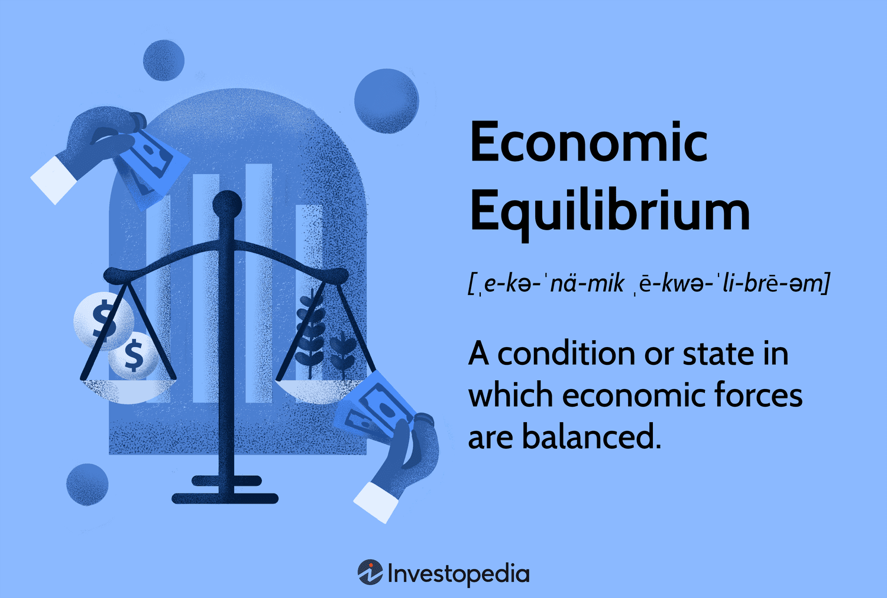

## Table of Contents

## What is economic equilibrium?

Economic equilibrium is a state where the supply of goods matches the demand for them. Imagine a seesaw that balances perfectly when the weight on both sides is equal. In the same way, economic equilibrium happens when the amount of a product that people want to buy is exactly the same as the amount that businesses want to sell. At this point, the price of the product is stable, and there's no pressure for it to go up or down.

This balance is important because it helps keep the economy running smoothly. If there's more demand than supply, prices will go up, and if there's more supply than demand, prices will go down. Economists use the concept of equilibrium to predict how changes in the market, like new technology or changes in consumer tastes, might affect prices and quantities of goods. Understanding economic equilibrium helps businesses decide how much to produce and helps policymakers make decisions that can keep the economy stable.

## How does economic equilibrium relate to supply and demand?

Economic equilibrium is closely tied to supply and demand. It's the point where the amount of a product that people want to buy (demand) is the same as the amount that businesses are willing to sell (supply). Think of it like a game of tug-of-war. When both teams pull with the same strength, the rope stays in the middle. In the same way, when supply and demand are equal, the market is in equilibrium, and the price stays steady.

When the balance between supply and demand shifts, it affects the equilibrium. If more people want to buy a product than what's available, demand goes up, and the price usually goes up too. This is like one team in the tug-of-war pulling harder, moving the rope towards them. On the other hand, if there's too much of a product and not enough buyers, supply is higher than demand, and prices tend to drop. This is like the other team pulling harder, moving the rope back. Economists study these shifts to understand how markets work and to predict future changes in prices and quantities.

## What are the different types of economic equilibrium?

There are a few main types of economic equilibrium that economists talk about. The first one is called "partial equilibrium." This looks at the balance between supply and demand for just one product or market, without thinking about how other markets might affect it. Imagine you're only looking at the apple market. Partial equilibrium would tell you about the price and amount of apples that would make the apple market balanced.

Another type is "general equilibrium." This is a bit more complicated because it looks at how all markets in the whole economy work together. It's like looking at not just the apple market, but also the orange market, the car market, and every other market all at once. General equilibrium tries to see how changes in one market, like a higher price for apples, might affect all the other markets too. This type of equilibrium helps economists understand the big picture of how the entire economy is balanced.

There's also "dynamic equilibrium," which takes into account changes over time. Instead of looking at a single moment, dynamic equilibrium looks at how supply and demand might shift and how the market adjusts to these changes. For example, if a new technology makes it cheaper to produce apples, the supply might increase over time, and dynamic equilibrium would show how the market finds a new balance as this happens.

## Can you explain partial equilibrium and general equilibrium?

Partial equilibrium is like focusing on a single piece of a puzzle. It looks at the balance between supply and demand for just one product or market, without worrying about how other markets might affect it. Imagine you're only thinking about the apple market. Partial equilibrium would tell you about the price and amount of apples that would make the apple market balanced. It's useful for understanding how changes in that specific market, like a new apple-picking machine, might change the price and quantity of apples.

General equilibrium is more like looking at the whole puzzle at once. It considers how all markets in the entire economy work together. It's not just about apples, but also about oranges, cars, and everything else. General equilibrium tries to see how a change in one market, like higher apple prices, might affect all the other markets too. This type of equilibrium helps economists understand the big picture of how the entire economy stays balanced. It's like trying to understand how pulling one string in a spider web might make the whole web move.

## What is the role of price in achieving economic equilibrium?

Price plays a big role in helping the market reach economic equilibrium. It's like a signal that tells people and businesses whether to buy more or produce more. When the price of something goes up, it usually means there's not enough of it to go around. People might decide to buy less because it's too expensive, or businesses might decide to make more because they can sell it for a higher price. This movement helps the market get back to a balance where the amount people want to buy matches the amount businesses want to sell.

On the other hand, when the price of something goes down, it often means there's too much of it. People might buy more because it's cheaper, and businesses might decide to make less because they're not making as much money. This adjustment also helps the market find its balance. So, prices are always moving, trying to find the sweet spot where supply and demand are equal, and that's how economic equilibrium is achieved.

## How do market forces adjust to reach equilibrium?

Market forces adjust to reach equilibrium through the push and pull of supply and demand. When there's more demand for a product than what's available, the price goes up. This higher price makes people think twice about buying, so they might buy less. At the same time, businesses see the higher price and decide to make more of the product because they can earn more money. As more of the product comes into the market, the supply increases until it matches the demand, and the price stops going up.

On the other hand, if there's too much of a product and not enough people want to buy it, the price goes down. When the price drops, people might decide to buy more because it's cheaper. Businesses, seeing that they're not making as much money, might decide to make less of the product. As the supply decreases, it eventually matches the demand, and the price stops going down. This back-and-forth movement of prices, supply, and demand keeps happening until the market finds its balance, which is the economic equilibrium.

## What are some real-world examples of economic equilibrium?

Imagine a farmer's market where people come to buy fresh fruits and vegetables. At the start of the day, there might be too many tomatoes and not enough buyers. The price of tomatoes might be high, but because there are so many, the sellers start lowering the price to sell them before they go bad. As the price goes down, more people decide to buy tomatoes, and soon, the amount of tomatoes people want to buy matches the amount the farmers have to sell. This is an example of economic equilibrium at the farmer's market.

Another example is the housing market. If there are a lot of houses for sale but not many people want to buy them, the price of houses might go down. People who were thinking about buying a house might see the lower prices and decide to buy. At the same time, some people who were planning to sell their houses might decide to wait until prices go up again. Eventually, the number of houses people want to buy will match the number of houses for sale, and the market will reach equilibrium.

## How do economists model economic equilibrium?

Economists use graphs and equations to show how economic equilibrium works. They draw a graph with two lines: one for supply and one for the demand. The supply line shows how much of a product businesses want to sell at different prices, and the demand line shows how much people want to buy at different prices. Where these two lines cross is the equilibrium point. At this point, the amount people want to buy is the same as the amount businesses want to sell, and the price stays steady.

To make these models, economists use math. They write equations for supply and demand. The supply equation might show that businesses want to sell more when the price is higher. The demand equation might show that people want to buy less when the price is higher. When economists solve these equations, they find the price and quantity where supply equals demand. This helps them predict what will happen in the market and how changes, like new technology or a new tax, might affect the equilibrium.

## What are the limitations of economic equilibrium models?

Economic equilibrium models help economists understand how markets work, but they have some limitations. One big problem is that they often assume that everyone in the market has all the information they need to make the best choices. In real life, people don't always know everything about prices and products. This can make the market behave differently than the models predict. Also, these models usually look at markets as if they are always calm and steady, but in the real world, markets can be chaotic and unpredictable.

Another limitation is that economic equilibrium models often don't consider how time affects the market. They might show what happens at one moment, but they don't always show how things change over days, months, or years. This can make it hard to predict long-term trends. Plus, these models can be too simple. They might not take into account all the different things that can affect supply and demand, like government policies, cultural changes, or unexpected events like natural disasters. So, while these models are useful, they don't capture everything that happens in the real world.

## How does government intervention affect economic equilibrium?

Government intervention can change economic equilibrium by setting rules and making policies that affect how much of something is made or sold and how much people want to buy. For example, if the government decides to put a tax on a product, like cigarettes, the price goes up. This can make people buy less because it's more expensive. At the same time, businesses might decide to make less because they're not making as much money after paying the tax. This changes where the supply and demand meet, moving the equilibrium to a new spot.

Another way the government can affect economic equilibrium is by giving subsidies, which are like payments to help businesses. If the government gives money to farmers to grow more corn, it can make the supply of corn go up. When there's more corn, the price might go down, and people might buy more. This also shifts the equilibrium to a new place. So, government actions can push and pull the market, making the balance between supply and demand different from what it would be without any intervention.

## What advanced theories exist about dynamic and stochastic equilibrium?

Dynamic equilibrium looks at how markets change over time, not just at one moment. It's like watching a video of the market instead of a single picture. Imagine a market where the price of a product keeps going up and down because new technology comes out or people's tastes change. Dynamic equilibrium tries to understand how these changes affect the balance between supply and demand over time. It helps economists see how the market might move from one equilibrium to another as things change. This is useful for predicting how the market will behave in the future and for making plans based on those predictions.

Stochastic equilibrium adds another layer by considering that some things in the market are unpredictable, like the weather or sudden changes in the economy. It's like trying to guess the future when you know some surprises might happen. Economists use math and probability to model these uncertainties. They look at how these unpredictable events might affect the supply and demand and how the market finds a new balance after these shocks. Stochastic equilibrium helps economists plan for different possible futures and understand how markets can stay stable even when surprises happen.

## How can economic equilibrium concepts be applied in policy-making and business strategy?

Economic equilibrium concepts can help policymakers make better rules and plans. They can use these ideas to understand how new laws or taxes might change what people buy and what businesses make. For example, if the government wants to raise money by taxing sugary drinks, they can use equilibrium models to guess how much less people will buy because of the higher price. This helps them decide if the tax will work and how it might affect other parts of the economy. By understanding how markets balance supply and demand, policymakers can make choices that help keep the economy stable and fair for everyone.

Businesses also use economic equilibrium to plan their strategies. They can look at how changes in the market, like new technology or changes in what people want, might affect the balance between what they make and what people buy. For example, if a company sees that people want more electric cars, they can use equilibrium models to decide how many to make and what price to set. This helps them make more money and stay competitive. By understanding how prices and quantities change to reach equilibrium, businesses can make smart choices about what to produce and how to sell it.

## What is Understanding Economic Equilibrium?

Economic equilibrium is a key principle in economics, denoting a state where market forces such as supply and demand are in perfect balance. In this condition, there is no inherent motivation for change, as the market is considered to be at rest. Equilibrium occurs when the quantity of a product supplied equals the quantity demanded, leading to stable prices.

This concept extends beyond individual goods and services, encompassing a range of economic variables such as prices, interest rates, and aggregate consumption. For example, an [interest rate](/wiki/interest-rate-trading-strategies) equilibrium would be achieved when the interest rate set by the market aligns with what borrowers are willing to pay and lenders expect to earn, thereby equalizing savings and investments.

The notion of economic equilibrium has its origins in the physical sciences, where it describes a state of balance between forces, such as velocity and pressure. In economics, this analogy translates to stability within economic systems, implying that any deviations from this balanced state are corrected by self-regulating mechanisms. For instance, if supply exceeds demand, prices tend to decrease, prompting an increase in demand and a decrease in supply until equilibrium is restored.

In practice, equilibrium is largely a theoretical construct since real-world markets are often influenced by external factors like government intervention, market speculation, and global events, which can cause shifts in supply and demand. However, the pursuit of equilibrium is crucial for economists and policymakers, as it drives efforts to stabilize economic conditions and facilitate efficient resource allocation.

To mathematically express economic equilibrium in a simple supply and demand model, consider the following:

1. Supply function: $Q_s = f(P)$, where $Q_s$ is the quantity supplied and $P$ is the price.
2. Demand function: $Q_d = g(P)$, where $Q_d$ is the quantity demanded.

Equilibrium is achieved when:

$$
Q_s = Q_d
$$

Solving for $P$ will give the equilibrium price, and substituting this back into the supply or demand function will yield the equilibrium quantity. 

Python can be used to illustrate this equilibrium concept through numerical modeling:

```python
import numpy as np
import matplotlib.pyplot as plt

# Define supply and demand functions
def supply(price):
    return 2 * price + 5

def demand(price):
    return 100 - 3 * price

# Equilibrium price and quantity
equilibrium_price = np.linspace(0, 30, 100)
equilibrium_quantity_supply = supply(equilibrium_price)
equilibrium_quantity_demand = demand(equilibrium_price)

# Plotting supply and demand curves and equilibrium
plt.plot(equilibrium_price, equilibrium_quantity_supply, label='Supply')
plt.plot(equilibrium_price, equilibrium_quantity_demand, label='Demand')
plt.xlabel('Price')
plt.ylabel('Quantity')
plt.axhline(0, color='black',linewidth=0.5)
plt.axvline(0, color='black',linewidth=0.5)
plt.title('Supply and Demand Equilibrium')
plt.legend()
plt.show()
```

The pursuit of economic equilibrium underpins many economic processes, driving markets toward balance despite the inherent turbulence of real economies. Understanding this concept is fundamental for analyzing economic stability and efficiency.

## What are the types of economic equilibrium?

Microeconomic equilibrium is achieved when the supply and demand curves for individual goods and services intersect, signifying that the market has reached a state where the quantity supplied equals the quantity demanded. This relationship is often represented through the equation:

$$
Q_d = Q_s
$$

where $Q_d$ is the quantity demanded and $Q_s$ is the quantity supplied. At this point, the market price stabilizes, and resources are allocated efficiently, reducing excess supply or demand.

Macroeconomic equilibrium, on the other hand, considers the entire economy, balancing aggregate supply and demand. This equilibrium is crucial for understanding overall economic performance, including factors such as inflation, unemployment, and GDP growth. It is depicted in models such as the Aggregate Demand-Aggregate Supply (AD-AS) model, where:

- Aggregate Demand ($AD$) is the total demand for all goods and services in an economy.
- Aggregate Supply ($AS$) is the total output of goods and services at various price levels.

Partial equilibrium analysis focuses on a singular market in isolation, evaluating the effects of economic changes on supply, demand, and pricing within that specific market. This approach assumes that other markets remain unaffected, allowing for a more granular analysis of market dynamics.

General equilibrium, however, considers the interconnections and simultaneous equilibria across multiple markets. It is a comprehensive framework that accounts for the interactions between various goods and services markets, arguably providing a more holistic view of economic activity. The General Equilibrium Model (GEM), initially designed by Léon Walras, is expressed through a series of equations that ensure all markets in the economy are in equilibrium simultaneously.

In the context of [algorithmic trading](/wiki/algorithmic-trading), strategies often rely on achieving equilibrium. Statistical [arbitrage](/wiki/arbitrage) involves identifying price inefficiencies between related markets or securities to gain profit as prices converge back to equilibrium. Mean reversion strategies are based on the hypothesis that prices, returns, or other financial metrics will eventually revert to their historical average or equilibrium level. These methods are implemented to anticipate market movements and optimize trading decisions.

By understanding microeconomic, macroeconomic, partial, and general equilibrium, traders and investors gain valuable insights into market behaviors. This knowledge is essential for anticipating market trends and making informed decisions, thereby navigating financial markets more effectively and strategically.

## References & Further Reading

[1]: Varian, H. R. (1992). ["Microeconomic Analysis"](https://archive.org/details/microeconomicana0000vari_g1b1). W. W. Norton & Company.

[2]: Fudenberg, D., & Tirole, J. (1991). ["Game Theory"](https://mitpress.mit.edu/9780262061414/game-theory/). MIT Press.

[3]: Walton, A. (1996). ["The Handbook of Fixed Income Securities"](https://books.google.com/books/about/The_Handbook_of_Fixed_Income_Securities.html?id=bsMsEAAAQBAJ). McGraw-Hill.

[4]: López de Prado, M. (2018). ["Advances in Financial Machine Learning"](https://www.amazon.com/Advances-Financial-Machine-Learning-Marcos/dp/1119482089). Wiley.

[5]: Jansen, S. (2020). ["Machine Learning for Algorithmic Trading"](https://github.com/stefan-jansen/machine-learning-for-trading). Packt Publishing.

[6]: Chan, E. P. (2008). ["Quantitative Trading: How to Build Your Own Algorithmic Trading Business"](https://github.com/ftvision/quant_trading_echan_book). Wiley.

[7]: Kreps, D. M. (1990). ["A Course in Microeconomic Theory"](https://www.jstor.org/stable/j.ctv12fw7z7). Princeton University Press.