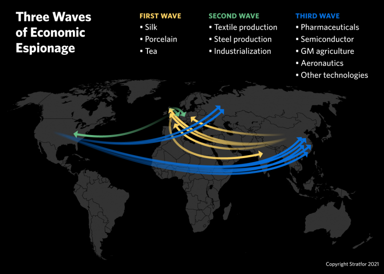

In today's hyper-competitive global marketplace, the protection of corporate information has acquired unprecedented importance. Businesses are increasingly under threat from economic espionage, industrial spying, and corporate theft, which are not just isolated acts of wrongdoing but represent systematic attempts to gain unfair advantage. These acts have become sophisticated, leveraging technology to exploit vulnerabilities within organizations.

The nature of economic espionage has changed with the advent of digital tools, enabling perpetrators to steal sensitive information such as trade secrets and intellectual property with minimal risk of detection. Various actors, often state-sponsored, engage in these unlawful activities to gain technological or economic leverage. Importantly, economic espionage is not merely a corporate risk but a national one, with financial implications stretching into the billions. For instance, the United States estimates annual losses ranging from $225 to $600 billion due to these activities.[^1]

Simultaneously, the rise of algorithmic trading has transformed financial markets. While algorithmic trading offers advantages in executing trades with high speed and volume, it also introduces new vulnerabilities. The protection of these algorithms has become paramount for maintaining a competitive edge.

This evolving landscape compels organizations to adopt sophisticated measures to protect their information assets. Understanding these complex threats forms the first step in bolstering defenses against corporate theft and preserving competitive integrity.

[^1]: Office of the National Counterintelligence Executive. (2011). "Foreign Spies Stealing US Economic Secrets in Cyberspace." Report to Congress on Foreign Economic Collection and Industrial Espionage, 2009-2011.

## Table of Contents

## Understanding Economic Espionage

Economic espionage refers to the illicit targeting and acquisition of sensitive corporate information, such as trade secrets and intellectual property, typically for commercial or financial gain. Such activities are frequently state-sponsored and aim to secure technological or economic benefits, often to boost national competitiveness at the expense of other countries. In essence, economic espionage acts as a tool for some states to bypass laborious research and development processes and achieve rapid industrial or technological progress. 

The magnitude of this threat is substantial, with its impact reverberating across global economies. For instance, in the United States alone, economic espionage is estimated to inflict losses ranging from $225 billion to $600 billion annually. These figures underscore the costly consequences of intellectual property theft and highlight the ongoing vulnerabilities in corporate security frameworks. 

Several high-profile incidents have illustrated the potential damage caused by economic espionage. Data breaches and unauthorized information disclosures have led not only to competitive disadvantages but also to significant financial and reputational harm for victimized corporations. The implications extend beyond individual companies, affecting broader economic stability and national security.

Addressing economic espionage requires a multifaceted approach involving stringent policy measures, international cooperation, and robust corporate defenses. As the methods employed in economic espionage evolve, keeping pace with sophisticated technology and techniques is crucial for effectively safeguarding sensitive information.

## Methods of Industrial Spying

Industrial spying, also known as corporate or economic espionage, constitutes a significant threat to businesses seeking to maintain a competitive edge. It encompasses a broad array of covert activities aimed at obtaining valuable industrial secrets without the authorization of the entity that owns them.

One of the quintessential methods employed in industrial spying is the recruitment of insiders who have access to sensitive company information. Such insiders, often employees or contractors, may be motivated by financial gain, dissatisfaction, or coercion. Recruitment typically involves offering bribes or other incentives to entice insiders to divulge trade secrets or proprietary technologies.

Another prevalent method is bribery. It includes offering monetary compensation or other benefits to individuals within an organization in exchange for confidential information. This can extend beyond employees to include vendors, suppliers, or external partners who have access to critical data.

Cyber-attacks have increasingly become a powerful tool for industrial spies. These attacks can take various forms, including phishing schemes, malware, and ransomware attacks aimed at infiltrating corporate networks. Cyber-attacks allow spies to extract vast quantities of data quickly and remotely, often without immediate detection. Given the anonymous nature of the internet, cyber-attacks can be orchestrated from anywhere in the world, making them a favored approach for industrial espionage.

Wiretapping, although more traditional, still finds relevance in industrial spying. It involves intercepting telephone or internet conversations to obtain confidential information. With technological advancement, modern wiretapping often leverages digital techniques, such as hacking into communication systems or exploiting existing vulnerabilities in network security.

A significant evolution in industrial spying methods is the sophisticated cyber intrusions facilitated by advancements in technology. These involve highly technical operations designed to bypass advanced security systems. Techniques such as exploiting zero-day vulnerabilities or employing Advanced Persistent Threats (APTs) allow spies to maintain a presence within an organization's digital infrastructure, continually siphoning off sensitive data over time. Such methods require substantial technical skill and resources, often hinting at state-sponsored involvement.

In conclusion, industrial spying employs a mix of traditional and modern techniques to obtain proprietary information covertly. As technology continues to evolve, so too do the methods of industrial spies, necessitating constant vigilance and adaptation in defense strategies by businesses seeking to protect their intellectual assets.

## The Role of Algorithmic Trading

Algorithmic trading, commonly referred to as 'algo trading', utilizes sophisticated algorithms to execute trades swiftly and in large volumes. These algorithms are designed to make decisions on various trading parameters such as timing, price, or quantity, and execute orders in the most efficient way possible. Algo trading has permeated the financial markets due to its ability to improve market [liquidity](/wiki/liquidity-risk-premium) and enhance trading efficiency.

With its advantages, [algorithmic trading](/wiki/algorithmic-trading) simultaneously presents new avenues for corporate theft. The algorithms and strategies that form the backbone of a firm's trading capabilities are highly sensitive and proprietary. Such intellectual assets, if compromised, can severely undermine a firm's competitive standing. Unauthorized access to these algorithms may allow competitors to reverse-engineer successful trading strategies, leading to unfair market advantages.

For instance, algorithms rely on extensive data inputs, including historical data, market conditions, and trending analysis, to forecast market movement. A breach of these data repositories can result in significant financial losses, not only due to theft but also through the loss of integrity and trust in the trading system. Additionally, the real-time nature of algo trading means that even momentary unauthorized access can lead to substantial unauthorized trading activities.

Thus, firms engaged in algorithmic trading must place a high priority on securing their trade secrets. This often involves adopting robust cybersecurity measures such as encryption, multi-[factor](/wiki/factor-investing) authentication, and network security to guard against cyber intrusions. Furthermore, internal security protocols, such as vetting employee access to sensitive information and rigorous audits, can help mitigate the risk of insider theft.

Collaboration with regulators to understand and implement best practices is also critical for firms to ensure both compliance and safeguarding of their sensitive algorithms. As financial markets become increasingly driven by these advanced technologies, protecting the intellectual properties that underlie algorithmic trading is essential for maintaining a competitive edge.

## Legal and Ethical Considerations

The Economic Espionage Act of 1996 (EEA) represents a pivotal legal instrument in the United States, criminalizing the misappropriation of trade secrets. With the increasing value of intellectual property in the corporate sphere, this legislation marked a major advance by providing federal authority to prosecute industrial espionage. This law addresses two primary offenses: economic espionage, motivated by foreign government support, and theft of trade secrets for commercial or economic advantage, irrespective of foreign involvement. Violations can result in significant fines and imprisonment, reflecting the severe impact such actions can have on economies and individual businesses.

Ethical considerations accompany the enforcement of this Act, particularly concerning profiling and biases in identifying potential offenders. Profiling in economic espionage prosecutions can lead to ethical dilemmas, especially when suspects are targeted based on nationality or ethnicity. This can foster an environment of discrimination and stigmatization, which counteracts the principles of justice and equity. Legal systems must ensure the avoidance of racial biases and uphold due process to maintain public confidence in the fairness of economic espionage investigations.

Organizations are advised to adhere to legal standards to not only evade legal pitfalls but also promote a culture of corporate governance and ethical business practices. Compliance does not merely involve conforming to the law; it encompasses the establishment of internal controls and policies that preempt potential ethical violations. Developing an ethical framework helps organizations address the complexities of cybersecurity, data privacy, and trade secret protection. Emphasizing transparency, accountability, and ethical decision-making within corporate governance frameworks can mitigate risks associated with economic espionage and enhance the organization's reputation.

In conclusion, understanding the legal and ethical landscapes concerning economic espionage is critical for companies seeking to protect their intellectual assets. The Economic Espionage Act of 1996 provides substantial legal recourse against trade secret misappropriation, while ethical vigilance ensures equitable treatment during its enforcement. By adopting rigorous legal compliance measures and fostering a strong ethical culture, organizations can strengthen their defenses against economic espionage and preserve their competitive advantage.

## Protective Measures

Companies must establish robust cybersecurity measures to protect their sensitive data effectively. With the increasing sophistication of cyber threats, implementing comprehensive security protocols is imperative. A multi-layered cybersecurity strategy can significantly diminish vulnerabilities. This involves deploying firewalls, anti-virus software, intrusion detection systems, and, crucially, encryption methods that ensure data remains secure even if intercepted. Additionally, regular updates and patches to IT systems help close security gaps, reducing the likelihood of exploitation by cyber threats.

Moreover, employee training is a vital component in safeguarding corporate information. Employees often serve as the first line of defense against cyber threats and insider risks. Comprehensive training programs should be designed to educate staff about recognizing and reporting suspicious activities. These programs can encompass a range of topics, from identifying phishing emails and understanding social engineering tactics to following secure password protocols and recognizing unauthorized access attempts. An informed employee base is less likely to fall victim to exploitation tactics that rely on human error or manipulation.

Equally important is the development of thorough policies regarding intellectual property and trade secret protection. These policies should clearly outline the classification of sensitive data, guidelines for access, and procedures for reporting breaches. Regular audits and risk assessments can help identify potential vulnerabilities, ensuring that protective measures evolve in line with emerging threats. It is also advisable for companies to establish a response plan for instances of data breaches or leaks. This plan should detail immediate steps for containment and recovery, alongside protocols for communicating the breach to stakeholders and authorities.

By integrating these protective measures, companies can better shield their valuable assets from economic espionage and corporate theft. High vigilance and continuous adaptation to the threat landscape are key in maintaining security and preserving competitive advantage.

## Conclusion

As industries increasingly integrate advanced technologies, the susceptibility to economic espionage and corporate theft similarly escalates. Businesses operating within this tech-driven landscape must maintain vigilance and adopt proactive strategies to ensure the security of their valuable information assets. 

The rise of digital innovations has made it essential for organizations to remain informed about emerging threats. By staying ahead of malicious actors and implementing robust security measures, companies can protect their intellectual property and trade secrets, thereby securing their position within the competitive market.

Understanding the various forms of economic espionage and industrial spying is crucial. Organizations must be prepared to counteract sophisticated techniques employed by cybercriminals, such as phishing attacks, advanced persistent threats (APTs), and social engineering. Moreover, developing a strong cybersecurity infrastructure is paramount in minimizing the risk of unauthorized access and data breaches.

To effectively safeguard against these threats, businesses should invest in comprehensive employee training programs to foster awareness and recognition of potential security risks. Encouraging a culture of security within the organization can significantly mitigate the likelihood of insider threats and unauthorized disclosures.

Furthermore, concretizing policies and procedures regarding the protection of trade secrets and intellectual property is imperative. Adhering to legal frameworks, such as the Economic Espionage Act of 1996, not only provides a structured approach to addressing incidents but also underscores the importance of maintaining ethical standards in business conduct.

In conclusion, as technological advancements continue to shape industry landscapes, the associated risks of economic espionage and corporate theft cannot be overlooked. It is incumbent upon businesses to adopt a forward-thinking approach, integrating both preventive and responsive measures, to effectively shield their valuable information and sustain their competitive edge.

## References & Further Reading

[1]: Office of the National Counterintelligence Executive. (2011). ["Foreign Spies Stealing US Economic Secrets in Cyberspace."](https://www.dni.gov/index.php/newsroom/reports-publications/reports-publications-2011/item/616-oncix-foreign-spies-stealing-us-economic-secrets-in-cyberspace) Report to Congress on Foreign Economic Collection and Industrial Espionage, 2009-2011.

[2]: Albrecht, C. C., Albrecht, W. S., & Dolan, S. (2007). ["Financial Fraud: The How and Why."](https://www.semanticscholar.org/paper/The-Role-of-Power-in-Financial-Statement-Fraud-Albrecht-Holland/f9c9655f6c51d48c0bbfdc8b8994dca210cca0c7) Journal of Business & Economics Research, 5(6), 35-40.

[3]: Lopez de Prado, M. (2018). ["Advances in Financial Machine Learning."](https://www.amazon.com/Advances-Financial-Machine-Learning-Marcos/dp/1119482089) John Wiley & Sons.

[4]: Harris, L. (2003). ["Trading & Exchanges: Market Microstructure for Practitioners."](https://www.amazon.com/Trading-Exchanges-Market-Microstructure-Practitioners/dp/0195144708) Oxford University Press.

[5]: Greenwald, B. C., & Kahn, J. (2005). ["Competition Demystified: A Radically Simplified Approach to Business Strategy."](https://www.amazon.com/Competition-Demystified-Radically-Simplified-Approach/dp/1591841801) Penguin.

[6]: The United States Department of Justice. (2016). ["Major Economic Espionage Cases."](https://www.justice.gov/usdoj-media/nsd/media/1046511/dl?inline) National Security Division.

[7]: Theohary, C. A., & Rollins, J. (2011). ["Cybersecurity: Current Legislation, Executive Branch Initiatives, and Options for Congress."](https://sgp.fas.org/crs/natsec/R40836.pdf) Congressional Research Service.