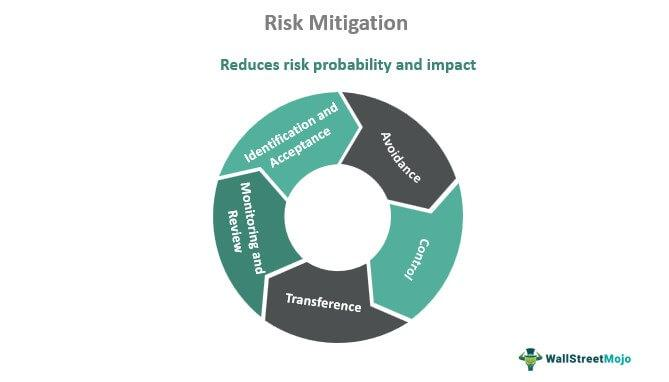

In today’s global economy, businesses are increasingly vulnerable to economic exposure and currency fluctuations. This vulnerability stems from the interconnectedness of global markets, where changes in one region can swiftly ripple through to affect businesses worldwide. Economic exposure, a form of foreign exchange risk, is a critical challenge for companies operating across borders, as it can significantly impact future cash flows and market value. As companies strive to manage these risks, the emergence of algorithmic trading presents both opportunities and challenges in the financial markets.

Algorithmic trading, which utilizes computer algorithms to automate trading processes, has become a pivotal element in modern finance. By analyzing extensive data sets and executing trades at high speeds, algorithmic trading can capitalize on market trends with precision. However, it also introduces complexities and risks that necessitate effective risk management strategies. Navigating the intersection of economic exposure and algorithmic trading involves employing mitigation strategies designed to stabilize financial outcomes in the face of currency volatility.



This article explores how businesses and traders can manage economic exposure by implementing robust risk management practices and strategies. These practices are vital for businesses seeking to safeguard their operations against currency fluctuations and for traders aiming to leverage algorithmic trading while minimizing potential risks. Understanding these concepts is crucial for businesses and traders aspiring to thrive in an unpredictable market landscape. By prioritizing risk management and adopting intelligent trading methodologies, stakeholders in the global financial arena can enhance their capacity to navigate challenges and seize opportunities effectively.

## Table of Contents

## Understanding Economic Exposure

Economic exposure, a critical aspect of foreign exchange risk, emerges from unexpected changes in currency values. This form of exposure can significantly influence a company's future cash flows and market value, presenting a formidable challenge for multinational corporations. Economic exposure differs from transaction or translation exposures as it impacts future cash flows rather than existing obligations or accounting entries. It is essential for companies, especially those with international operations, to understand and manage this exposure to mitigate potential financial risks effectively.

The mechanisms through which economic exposure arises are multifaceted. Primarily, it results from the impact of currency fluctuations on the competitive position of a firm. For example, a depreciation of the domestic currency may enhance a firm's competitiveness by making its exported goods cheaper for foreign buyers, potentially increasing market share and revenue. Conversely, a currency appreciation can make exports more expensive and less competitive, possibly reducing sales.

Even businesses focused on domestic markets are not immune. As globalization intensifies, input prices for raw materials, outsourced services, and capital goods, often denominated in foreign currencies, can introduce economic exposure. For instance, a U.S. company that sources components from Europe will face higher costs if the Euro strengthens against the Dollar, impacting its profit margins.

The critical need to manage economic exposure revolves around safeguarding profitability and market value. Businesses must employ strategies that align currency movements with corporate financial goals. Effective management of economic exposure ensures that firms maintain stable cash flows and market positioning, even amidst fluctuating exchange rates. Employing various financial instruments and operational hedges can aid in neutralizing these effects.

Understanding economic exposure is crucial for firms seeking to navigate the complexities of international trade and global finance. Effective management not only protects firms from potential financial setbacks but also positions them to capitalize on favorable currency movements, ultimately strengthening their competitive advantage in global markets.

## Mitigation Strategies for Economic Exposure

Businesses facing economic exposure due to currency fluctuations can employ a range of strategies to mitigate these risks. Among these strategies, operational and currency risk-mitigation tactics stand out as effective means to stabilize cash flows and maintain market value amidst volatile exchange rates.

**Operational Strategies**

Operational strategies aim to reduce a business's sensitivity to currency changes by engaging in practices that naturally hedge against these fluctuations. A common operational tactic is the diversification of production facilities. By establishing manufacturing plants in multiple countries, businesses can balance their production costs and revenues in various currencies, reducing dependency on any single currency. This geographic diversification diminishes the impact of currency [volatility](/wiki/volatility-trading-strategies) on overall financial performance.

Another operational strategy involves diversifying financing sources. Companies can secure funding in different currencies, aligning their debt obligations with the revenue streams received in those currencies. This alignment can create a natural hedge, helping manage exposure by ensuring that currency fluctuations have a balanced effect on both sides of the balance sheet.

**Currency Risk-Mitigation Strategies**

Currency risk-mitigation strategies directly address the challenges posed by currency fluctuations. Currency swaps are a prominent tool used to manage economic exposure. A currency swap involves exchanging a predetermined amount of cash flows in one currency for another between two parties. This financial instrument allows businesses to lock in exchange rates, effectively stabilizing their financial transactions and protecting against adverse currency movements.

Another approach involves matching currency flows. This strategy entails aligning a business's cash inflows and outflows in the same currency, thereby minimizing currency mismatch risks. For instance, a company with significant revenue in euros should aim to incur costs in euros as well. By doing so, it reduces the impact of currency exchange rate changes on overall profitability.

**Practical Applications**

The practical applications of these strategies can be seen in multinational corporations that operate in various regions. For example, a U.S.-based company with operations in Europe could maintain euro-denominated accounts to meet its local expenses. By internally aligning revenues and expenses, it lessens the necessity to convert currencies frequently, reducing exposure to exchange rate volatilities.

In conclusion, mitigating economic exposure requires a strategic combination of operational diversification and targeted financial instruments. By implementing a mix of these strategies, businesses can safeguard their financial health and ensure stability in an unpredictable global economy.

## Risk Management in Algorithmic Trading

Algorithmic trading utilizes sophisticated algorithms to identify and exploit market trends, enabling rapid execution of trades with minimal human intervention. However, this method of trading also introduces various risks that must be effectively managed to preserve trader capital and minimize exposure to market volatility.

Algorithmic trading is susceptible to several risks:

1. **Technical Risks**: These include software glitches, hardware failures, and connectivity issues that can disrupt trading processes. Algorithms rely on complex code and vast datasets, making them vulnerable to bugs and errors. A malfunctioning algorithm can lead to significant financial losses if trades are executed incorrectly or not at all.

2. **Market Risks**: These risks arise from adverse market movements that can impact the trading strategy. Algorithms are designed to pinpoint and follow trends; however, sudden market changes or anomalies can result in unanticipated losses. Market risk is compounded in high-frequency trading, where the rapid pace intensifies the consequences of adverse market shifts.

3. **Operational Risks**: These encompass issues related to the management of trading operations, including errors in order execution and failures in clearing and settlement processes. Operational risks can also stem from inadequate oversight of trading activities, leading to unintended exposure to regulatory penalties or financial losses.

4. **Behavioral Risks**: Although algorithmic trading reduces human intervention, it is not entirely immune to behavioral risks. These risks involve biases in algorithm design or implementation, where the underlying assumptions of the algorithm may not fully capture the complexities of the market environment.

Effective risk management protocols are essential in addressing these risks. Implementing robust technical measures, such as redundant systems and thorough testing of algorithms, can mitigate technical risks. Market risks might be managed through diversification strategies and by setting appropriate risk thresholds to limit the exposure of trades. Operational risks require strict compliance and monitoring frameworks to ensure trading activities align with regulatory and strategic objectives. As for behavioral risks, continual evaluation and recalibration of algorithmic models are necessary to ensure they remain relevant under different market conditions.

Advanced risk management in [algorithmic trading](/wiki/algorithmic-trading) may also involve employing techniques like real-time monitoring systems and automated risk assessment tools. These tools can dynamically adjust trading parameters to adapt to changing risk levels, helping to safeguard capital and reduce the likelihood of significant losses. 

Overall, conscientious management of these risks not only supports the stability of algorithmic trading operations but also heightens the potential for achieving consistent returns in increasingly volatile markets.

## Advanced Risk Management Techniques in Algo Trading

Algorithmic trading has significantly transformed the financial landscape by allowing traders to execute high-frequency transactions with precision and speed. However, it also introduces complex risk management challenges that require the use of advanced techniques to safeguard capital and enhance profitability. This section examines various sophisticated risk management strategies that algo traders can employ to navigate the volatile markets effectively.

### Stop-Loss Orders and Portfolio Diversification

One of the fundamental techniques in algorithmic trading for mitigating risk is the implementation of stop-loss orders. A stop-loss order automatically sells a security when it reaches a predetermined price, thereby limiting potential losses. For instance, if a security is purchased at $100, a trader might set a stop-loss at $90, ensuring that the maximum loss does not exceed 10%. This method is crucial for maintaining discipline and reducing the emotional impact of trading decisions.

In addition to stop-loss orders, portfolio diversification plays a critical role in risk management. By spreading investments across various asset classes or sectors, traders can reduce the impact of negative performance in any single investment. Diversification minimizes unsystematic risk, which is specific to individual assets, and is vital for achieving a balanced risk-return profile.

### Trailing Stops and Dynamic Position Sizing

Trailing stops are another powerful tool for risk management in algorithmic trading. Unlike fixed stop-loss orders, trailing stops adjust with the market price, locking in gains as prices move favorably. For example, if a trader sets a trailing stop 5% below the market price, and the price rises from $100 to $120, the stop-loss would automatically adjust upwards from $95 to $114, protecting profits while still allowing for further gains.

Dynamic position sizing is an advanced technique that adjusts the size of a trade based on current market conditions and risk tolerance. This approach can be implemented using various methods, such as the Kelly Criterion, which determines the optimal size for a position to maximize logarithmic utility. The formula for the Kelly Criterion is:

$$
f^* = \frac{bp - q}{b}
$$

where $f^*$ is the fraction of the capital to invest, $b$ is the odds received on the wager, $p$ is the probability of winning, and $q$ is the probability of losing. By strategically adjusting position sizes, traders can manage leverage and exposure, ensuring that risks are aligned with their trading objectives.

### Hedging Strategies and Quantitative Risk Techniques

Hedging strategies are essential in mitigating potential losses by taking an offsetting position in a related security. Options and futures are commonly used in algorithmic trading to hedge positions against adverse price movements. For example, a trader may use options to protect against a significant drop in the price of a stock while maintaining the potential for profit.

Quantitative risk techniques involve the application of mathematical models and statistical methods to measure and manage risk. Value at Risk (VaR) is a widely used quantitative measure that estimates the maximum potential loss over a specified period at a given confidence level. The formula for calculating VaR is:

$$
\text{VaR} = \mu - z \cdot \sigma
$$

where $\mu$ is the expected return, $z$ is the z-score corresponding to the desired confidence level, and $\sigma$ is the standard deviation of the portfolio's returns. By leveraging such quantitative techniques, traders can make informed decisions based on empirical data and statistical analysis.

In conclusion, advanced risk management techniques in algo trading, including stop-loss orders, portfolio diversification, trailing stops, dynamic position sizing, hedging strategies, and quantitative risk measures, are integral to navigating the complexities of financial markets. These strategies not only mitigate risks but also enhance the potential for achieving sustained profitability. Aspiring algo traders must understand and apply these methods to thrive in an increasingly competitive and unpredictable trading environment.

## Integrating Risk Management and Algorithmic Trading

Integrating comprehensive risk management into algorithmic trading strategies is essential for maintaining resilience and achieving sustained success in dynamic financial markets. Risk management helps traders mitigate potential losses while optimizing returns. One of the first steps in this integration involves identifying the types of risks associated with algorithmic trading, such as market, technical, operational, and behavioral risks. Each risk category requires specific strategies and tools to effectively minimize impact.

To focus on risk reduction, algorithmic traders can employ a variety of best practices and tools. Robust [backtesting](/wiki/backtesting) of trading algorithms is critical to ensure that strategies perform well under different historical market conditions. Using historical data, traders can simulate various scenarios to identify weaknesses in their strategies and make necessary adjustments prior to implementation. Here is a simple Python code snippet demonstrating how to backtest a trading strategy using historical data:

```python
import pandas as pd
import numpy as np

# Sample historical price data
data = pd.DataFrame({
    'Price': [100, 101, 102, 101, 98, 99, 97, 98, 100, 102]
})

# Define a simple trading strategy
def simple_moving_average_strategy(data, short_window=3, long_window=5):
    data['Short_MA'] = data['Price'].rolling(window=short_window).mean()
    data['Long_MA'] = data['Price'].rolling(window=long_window).mean()

    # Generate trading signals
    data['Signal'] = np.where(data['Short_MA'] > data['Long_MA'], 1, 0)  # Buy when short MA is higher

    # Calculate returns
    data['Returns'] = data['Price'].pct_change()
    data['Strategy_Returns'] = data['Returns'] * data['Signal'].shift(1)

    return data['Strategy_Returns'].cumsum()

# Run the backtest
cumulative_returns = simple_moving_average_strategy(data)
print(cumulative_returns)
```

Algorithmic traders also benefit from implementing dynamic position sizing and stop-loss orders to manage risk. Dynamic position sizing allows traders to adjust their position sizes based on predefined risk tolerance levels, ensuring that no single trade overly impacts the portfolio. Stop-loss orders automatically limit potential losses by selling a security when it reaches a specified price, thus protecting against adverse market moves.

Furthermore, incorporating hedging strategies can effectively balance potential losses. For example, traders might use options or futures contracts to hedge against unfavorable movements in the market.

Advanced quantitative risk techniques, such as Value at Risk (VaR) and Conditional Value at Risk (CVaR), provide additional layers of risk assessment by estimating potential portfolio losses and assessing extreme loss scenarios. These techniques enable traders to set risk limits and make informed decisions that align with their overall risk management objectives.

Finally, the integration of these risk management strategies with algorithmic trading is facilitated by the variety of available trading platforms and risk management tools. These platforms offer features such as real-time risk monitoring, automated execution of predefined risk measures, and comprehensive analytics to track performance and adjust strategies as needed.

By employing these best practices and tools, algorithmic traders can integrate effective risk management into their strategies, prioritizing risk reduction to achieve sustained success and maximize returns in the volatile financial markets.

## Conclusion

Effectively managing risk through robust risk mitigation strategies is essential for businesses and algo traders aiming to succeed in today's volatile financial markets. Both economic exposure and algorithmic trading involve inherent challenges that demand astute navigation. Economic exposure, primarily driven by currency fluctuations, can significantly impact cash flows and market valuations. Meanwhile, algorithmic trading introduces unique risks, including technical and market-driven uncertainties.

Understanding and implementing the strategies discussed in this article are crucial for businesses and traders striving to capitalize on market opportunities while managing risks. By employing techniques like operational diversification, currency risk management, and advanced algorithmic risk management strategies, entities can better protect their investments against unpredictable market forces.

Prioritizing risk management not only serves as a protective measure but also enhances the potential for market success. Building resilient systems that incorporate comprehensive risk strategies enables businesses and traders to adapt swiftly to changes. By making risk management a cornerstone of their operational and trading strategies, participants are better positioned to maximize returns and achieve sustained growth in the competitive landscape of global finance.

## References & Further Reading

[1]: Marcos Lopez de Prado. ["Advances in Financial Machine Learning"](https://www.amazon.com/Advances-Financial-Machine-Learning-Marcos/dp/1119482089). Wiley.

[2]: Stefan Jansen. ["Machine Learning for Algorithmic Trading"](https://github.com/stefan-jansen/machine-learning-for-trading). Packt Publishing.

[3]: Ernest P. Chan. ["Quantitative Trading: How to Build Your Own Algorithmic Trading Business"](https://www.amazon.com/Quantitative-Trading-Build-Algorithmic-Business/dp/0470284889). Wiley.

[4]: David Aronson. ["Evidence-Based Technical Analysis: Applying the Scientific Method and Statistical Inference to Trading Signals"](https://www.amazon.com/Evidence-Based-Technical-Analysis-Scientific-Statistical/dp/0470008741). Wiley.

[5]: John Y. Campbell, Andrew W. Lo, and A. Craig MacKinlay. ["The Econometrics of Financial Markets"](https://archive.org/details/econometricsoffi0000camp). Princeton University Press.

[6]: John Hull. ["Risk Management and Financial Institutions"](https://www.wiley.com/en-us/Risk+Management+and+Financial+Institutions%2C+6th+Edition-p-9781119932482). Wiley.