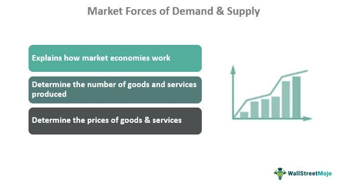

Algorithmic trading, a sophisticated method of executing trades through preprogrammed instructions, has dramatically impacted various sectors, with the consumer goods market experiencing significant transformations. The ability to automate trading decisions by processing vast amounts of data and executing orders at high speeds offers substantial advantages within this industry. Understanding the relationship between economic factors and consumer demand is essential for optimizing trading algorithms in the consumer goods sector, which relies heavily on accurately predicting market movements and consumer behavior.

In the consumer goods market, several economic drivers significantly influence trading decisions. These drivers include consumer income levels, employment rates, inflation, and overall consumer confidence—factors that play pivotal roles in shaping consumer demand. Algorithmic trading systems can efficiently analyze these parameters, adapting strategies to capitalize on market trends and economic changes. This capability provides traders with a competitive edge, allowing them to navigate the complexities of the market more effectively than traditional trading methods.



This article explores the primary economic drivers impacting consumer goods trading and how algorithmic trading leverages these variables to enhance performance. By mastering these economic dynamics, traders can position themselves advantageously in the rapidly changing world of consumer goods trading. The sections following will discuss specific economic influences, the pivotal role of algorithmic trading, and practical insights for maximizing returns through advanced trading strategies.

## Table of Contents

## Understanding Economic Factors Influencing Consumer Goods

Consumer goods demand is intricately linked to various economic indicators, influencing both consumer behavior and market dynamics. Understanding these economic factors is crucial for traders and businesses aiming to navigate and capitalize on shifts within the consumer goods sector.

**Inflation**: Inflation signifies the rate at which the general level of prices for goods and services rises, eroding purchasing power over time. When inflation rises, consumers often find that their purchasing power diminishes, leading to a decline in the quantity of goods they can afford. This can result in decreased demand for consumer goods, particularly non-essential items. Inflation also affects production costs, which, when passed on to consumers, might further temper consumer spending.

**Employment Rates**: The employment rate is a critical determinant of consumer purchasing ability. Higher employment rates often correlate with increased disposable income, as more individuals receive a steady income. Conversely, lower employment rates can restrict income levels, reducing aggregate demand for consumer goods. Companies must monitor employment statistics to anticipate shifts in consumer spending and adjust their inventory and pricing strategies accordingly.

**Consumer Confidence**: Consumer confidence indices measure optimism about the economy's future. High consumer confidence typically indicates that individuals feel secure about their jobs and personal financial prospects, which encourages spending. Conversely, low confidence can lead to reduced consumer spending as individuals opt to save more in anticipation of potential financial downturns. For businesses, understanding consumer confidence can inform marketing strategies and inventory management.

These economic parameters—inflation, employment rates, and consumer confidence—interact to shape the supply-demand dynamics in the consumer goods market. For instance, high employment rates coupled with low inflation might boost consumer confidence and spending, whereas high inflation with stagnant employment might dampen consumer enthusiasm for purchasing goods. Businesses that can adeptly interpret these indicators are better positioned to adjust their strategies, optimizing pricing, production, and marketing efforts to align with consumer demand trends.

In conclusion, grasping the impact of these economic factors on consumer goods demand is essential for developing effective trading strategies. By staying attuned to changes in inflation, employment, and consumer confidence, businesses and traders can more accurately forecast market conditions, thus enhancing their decision-making processes and profitability.

## The Role of Algorithmic Trading in Consumer Goods

Algorithmic trading in the consumer goods sector employs automated systems to execute trades with speed and precision by relying on predefined criteria. This capability is particularly beneficial when responding to shifts in economic factors, allowing traders to optimize their decisions efficiently. In this context, the automation of trading processes helps mitigate the risks associated with human error and emotional bias, leading to more rational decision-making.

These systems harness the power of advanced technologies, such as [machine learning](/wiki/machine-learning) and [artificial intelligence](/wiki/ai-artificial-intelligence), to analyze vast datasets. By processing significant amounts of market data, they identify patterns and predict future trends, adjusting trading strategies accordingly. This adaptability is crucial for staying competitive, particularly in fast-paced markets subject to frequent fluctuations.

Machine learning algorithms are at the core of this functionality. These algorithms can learn from historical market movements and adapt to new data inputs, improving their predictive accuracy over time. For instance, a basic Python implementation of a machine learning model for predicting consumer goods trends might involve the use of libraries such as Scikit-learn. Here is a simple example of using linear regression to predict future demand based on historical data:

```python
from sklearn.model_selection import train_test_split
from sklearn.linear_model import LinearRegression
import pandas as pd

# Load the dataset
data = pd.read_csv('consumer_goods_sales.csv')
X = data[['economic_indicator_1', 'economic_indicator_2', 'economic_indicator_3']]  # Features
y = data['demand']  # Target variable

# Split the data into training and testing sets
X_train, X_test, y_train, y_test = train_test_split(X, y, test_size=0.2, random_state=42)

# Initialize and train the linear regression model
model = LinearRegression()
model.fit(X_train, y_train)

# Make predictions
predictions = model.predict(X_test)
```

This illustration shows how [algorithmic trading](/wiki/algorithmic-trading) systems can employ machine learning to facilitate predictive analytics, thus enabling quick responses to market changes.

Furthermore, as these systems operate continuously in real time, they are capable of processing new information and adjusting trading strategies without manual intervention. This constant adaptation is valuable in environments where economic conditions can shift rapidly due to global events or market announcements.

In conclusion, algorithmic trading systems in the consumer goods market provide traders with a technological edge through their ability to process large volumes of data swiftly, reduce decision-making errors, and dynamically adjust to ongoing market developments. By leveraging these tools, traders enhance their ability to predict and capitalize on market opportunities.

## Key Economic Indicators for Consumer Goods Algo Trading

Traders must keenly observe economic indicators that have a direct impact on consumer goods trading. Understanding these indicators allows for more informed decision-making and can significantly enhance the effectiveness of algorithmic trading strategies.

**Gross Domestic Product (GDP) Growth Rates**  
GDP growth is a critical indicator of the overall economic health and has a substantial impact on consumer spending patterns. A growing GDP often correlates with increased consumer confidence and higher disposable incomes, leading to more expenditure on consumer goods. Conversely, a contracting GDP may signal economic downturns, causing consumers to prioritize essential goods over discretionary spending. For algo traders, monitoring GDP trends can provide insights into potential shifts in consumer behavior, enabling them to adjust strategies proactively.

**Interest Rates**  
Interest rates, set by central banks, play a pivotal role in determining borrowing costs. They influence consumer credit availability and consequently affect expenditure on goods. Lower interest rates typically reduce the cost of borrowing, encouraging consumers to spend more, particularly on high-value items such as appliances and cars. Conversely, higher rates can dampen spending. Algorithmic trading systems can integrate [interest rate](/wiki/interest-rate-trading-strategies) trends to predict consumer spending shifts, optimizing the timing and nature of trades.

**Commodity Prices**  
Commodity prices directly affect production costs and pricing strategies for consumer goods. For example, an increase in the price of oil can lead to higher transportation costs, impacting the final price of goods. Algo trading systems can be configured to monitor price fluctuations in key commodities, allowing traders to anticipate cost-driven price changes in consumer goods. Python scripts utilizing APIs for real-time commodity prices can be useful in updating trading algorithms promptly.

```python
import requests

def get_commodity_price(commodity):
    url = f"https://api.commodityprices.com/{commodity}"
    response = requests.get(url)
    data = response.json()
    return data['price']

oil_price = get_commodity_price('oil')
```

**Exchange Rates**  
Exchange rates impact the cost of imported goods and competitiveness of exported goods. A stronger domestic currency makes imports cheaper and exports less competitive in the international market. Conversely, a weaker currency has the opposite effect. For traders focusing on consumer goods, understanding these dynamics is crucial, particularly for multinational corporations engaged in global supply chains. Algo trading systems can include exchange rate data to forecast the impact on import-export strategies and make real-time trading decisions accordingly.

In conclusion, a thorough analysis of these economic indicators enables traders to refine their algorithmic strategies in the consumer goods market. By incorporating GDP growth rates, interest rates, commodity prices, and exchange rates into their models, traders can better predict market trends and optimize their trading performance.

## Strategies for Leveraging Algo Trading in Consumer Goods Market

Developing sophisticated trading algorithms that incorporate economic indicators is crucial for maximizing opportunities in the consumer goods market. These algorithms must be dynamic, capable of processing vast amounts of data, and responsive to changing market conditions. Below are key strategies for leveraging algorithmic trading in this sector:

1. **Continuous Data Monitoring and Real-Time Updates**  
   Successful algorithmic trading hinges on the ability to process and analyze data as it becomes available. By continuously monitoring economic indicators, such as inflation rates, employment [statistics](/wiki/bayesian-statistics), and consumer confidence indices, algorithms can stay ahead of market trends. Real-time updates allow algorithms to adjust trading strategies instantaneously, minimizing lag and enhancing decision-making precision.

   ```python
   # Example Python code for streaming real-time data and updating trading signals
   import pandas as pd
   from some_trading_library import get_real_time_data, update_trading_strategy

   def monitor_data():
       while True:
           data = get_real_time_data(some_market)
           update_trading_strategy(data)
   ```

2. **Risk Management Integration**  
   Incorporating risk management strategies within trading algorithms is essential to mitigate potential losses arising from market [volatility](/wiki/volatility-trading-strategies). These strategies might include setting stop-loss limits, diversifying trading positions, and adjusting leverage ratios dynamically based on market conditions. Implementing such safeguards helps protect capital and maintain long-term profitability.

   ```python
   # Risk management example
   def apply_risk_management(portfolio, market_data):
       for asset in portfolio:
           if market_data[asset]['volatility'] > threshold:
               portfolio[asset]['leverage'] = adjust_leverage(market_data[asset])
           if portfolio[asset]['loss'] > max_loss:
               execute_stop_loss(asset)
   ```

3. **Backtesting for Robustness and Reliability**  
   Before deploying algorithms in live markets, rigorous [backtesting](/wiki/backtesting) on historical data is imperative. This process evaluates how well trading strategies would have performed under past market conditions. It helps in identifying weaknesses in the algorithm, improving model reliability, and ensuring that it can withstand various market scenarios.

   ```python
   # Example backtesting process
   def backtest_strategy(strategy, historical_data):
       results = []
       for period in historical_data:
           result = strategy.execute(period)
           results.append(result)
       return analyze_results(results)
   ```

4. **Collaboration with Economists and Data Scientists**  
   To develop comprehensive algorithmic models, collaboration with economists and data scientists can be immensely beneficial. Economists bring insight into economic trends and indicators, while data scientists contribute expertise in statistical analysis and machine learning. This collaboration can lead to more nuanced models that integrate multiple perspectives and data sources, thereby improving trading outcomes.

By employing these strategies, traders can effectively harness the capabilities of algorithmic trading to navigate the consumer goods market, maximizing returns while managing risks efficiently.

## Challenges and Considerations

Algorithmic trading in the consumer goods sector faces several challenges and considerations that can significantly impact trading outcomes. One of the primary challenges is market noise and sudden economic shifts. Market noise refers to random price fluctuations that do not correspond to fundamental changes in value. These fluctuations can lead to inefficiencies in algorithmic trading systems, which may execute trades based on spurious signals. Moreover, sudden economic shifts, such as unexpected changes in interest rates or geopolitical events, can further exacerbate these challenges by creating volatile market conditions that algorithms may not be equipped to handle swiftly.

Ensuring the security and integrity of trading systems is of utmost importance to protect against cyber threats. The digital nature of algorithmic trading makes it susceptible to hacking attempts and data breaches. Implementing robust cybersecurity measures, such as encryption and multi-[factor](/wiki/factor-investing) authentication, is essential to safeguard trading platforms and sensitive financial data.

Regulatory compliance is another critical consideration. Financial markets are subject to complex regulations that vary across jurisdictions. Algorithmic trading systems must adhere to these legal frameworks to avoid penalties and ensure fair market practices. This includes complying with regulations related to transaction reporting, position limits, and order execution. Failure to comply with these regulations can result in significant legal and financial consequences.

Traders must also recognize the limitations of algorithms, particularly the potential over-reliance on historical data. While algorithms can analyze vast amounts of historical information to predict future trends, they may not account for unprecedented events or structural market changes. Overfitting to past data could lead to poor performance in live markets. Therefore, algorithms should be designed with a degree of flexibility to adapt to new information and changing market conditions.

Ethical considerations are important, especially concerning decision-making algorithms that impact market fairness. Algorithms should be developed and monitored to prevent manipulative practices, such as spoofing or quote stuffing, which can harm market integrity and disadvantage other traders. Furthermore, transparency in how algorithms make trading decisions can help address ethical concerns and promote trust among market participants.

In summary, addressing these challenges requires a combination of advanced technology, adherence to regulatory standards, and ethical practices to ensure the effective and responsible use of algorithmic trading in the consumer goods market.

## Conclusion

The fusion of economic knowledge and algorithmic trading is progressively transforming the consumer goods trading landscape. By harnessing key economic indicators such as GDP growth rates, interest rates, commodity prices, and exchange rates, traders can develop refined strategies that lead to enhanced profitability. These indicators provide critical insights into market dynamics, which algorithmic trading systems use to optimize decision-making processes.

Algorithmic trading introduces a systematic approach, capable of adapting to the fluctuations of an ever-changing economic environment. Automated systems can swiftly process and analyze vast datasets, allowing for real-time adjustments that maintain competitiveness. The reliance on machine learning and AI technologies ensures that these algorithms are not static; they continuously evolve by learning from market trends, reducing the traditional constraints of human bias and error.

As technological advancements continue to surge, the potential for further innovations in algorithmic trading and its interaction with the consumer goods market is immense. This includes the development of more sophisticated models that can anticipate market movements with greater accuracy, capitalizing on microeconomic trends and macroeconomic shifts. For stakeholders, remaining informed and adaptive is crucial to fully exploit this synergistic relationship. Continuous learning, monitoring of economic indicators, and collaboration with data scientists and economists can equip traders to navigate and excel in this intersection of technology and economics, unlocking new avenues for growth and success in the competitive trading arena.

## References & Further Reading

[1]: Bergstra, J., Bardenet, R., Bengio, Y., & Kégl, B. (2011). ["Algorithms for Hyper-Parameter Optimization."](https://papers.nips.cc/paper/4443-algorithms-for-hyper-parameter-optimization) Advances in Neural Information Processing Systems 24.

[2]: ["Advances in Financial Machine Learning"](https://www.amazon.com/Advances-Financial-Machine-Learning-Marcos/dp/1119482089) by Marcos Lopez de Prado

[3]: ["Evidence-Based Technical Analysis: Applying the Scientific Method and Statistical Inference to Trading Signals"](https://www.amazon.com/Evidence-Based-Technical-Analysis-Scientific-Statistical/dp/0470008741) by David Aronson

[4]: ["Machine Learning for Algorithmic Trading"](https://github.com/stefan-jansen/machine-learning-for-trading) by Stefan Jansen

[5]: ["Quantitative Trading: How to Build Your Own Algorithmic Trading Business"](https://www.amazon.com/Quantitative-Trading-Build-Algorithmic-Business/dp/1119800064) by Ernest P. Chan