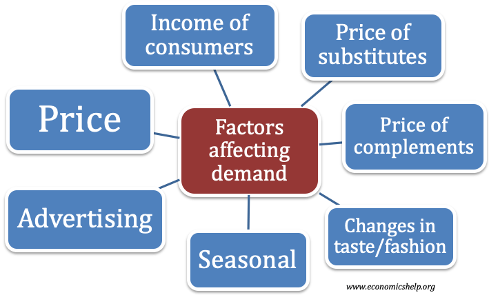

## Table of Contents

## What are consumer goods?

Consumer goods are products that people buy for their own use. These can be things like food, clothes, and electronics. People use these goods every day to meet their needs and wants. For example, when you buy a new phone or a pair of shoes, those are consumer goods.

There are different types of consumer goods. Some are used up quickly, like food and drinks. These are called fast-moving consumer goods. Others last longer, like furniture and cars. These are called durable goods. Understanding the difference helps businesses know how to sell these products to people.

## How does income level influence the demand for consumer goods?

Income level plays a big role in how much people can buy. When people have more money, they can afford to buy more things. This means the demand for consumer goods goes up. For example, if someone gets a raise at work, they might decide to buy a new TV or go out to eat more often. On the other hand, if people have less money, they might only buy what they really need, like food and basic clothes. So, when incomes are low, the demand for extra things, like fancy gadgets or vacations, goes down.

Different types of goods are affected differently by income changes. For things like food and basic clothes, even if people have less money, they still need to buy them. These are called necessity goods. But for luxury items, like expensive watches or designer bags, people only buy them when they have extra money. These are called luxury goods. So, when incomes go up, the demand for luxury goods increases a lot more than the demand for necessity goods. Understanding this helps businesses know what to sell and when.

## What role does price elasticity play in consumer goods demand?

Price elasticity tells us how much the demand for a product changes when its price changes. If a product is very elastic, it means that even a small change in price can make a big difference in how much people want to buy it. For example, if the price of a certain brand of cereal goes up a little bit, people might switch to a cheaper brand instead. This shows that the demand for that cereal is elastic.

On the other hand, if a product is inelastic, the demand doesn't change much even if the price goes up or down. Things like medicine or basic food items often have inelastic demand because people need them no matter what the price is. If the price of bread goes up, people might not be happy about it, but they will still buy it because they need it to eat. Understanding price elasticity helps businesses set the right prices for their products to keep people buying them.

## How do interest rates affect consumer spending on goods?

Interest rates can change how much people spend on consumer goods. When interest rates are low, borrowing money becomes cheaper. This means people might take out loans to buy things like cars or houses, or even use credit cards more often to buy other stuff. With low interest rates, people feel more confident about spending money because they know they won't have to pay back too much in interest. So, when interest rates go down, people usually buy more consumer goods.

On the other hand, when interest rates are high, borrowing money costs more. This makes people think twice before taking out loans or using credit cards. They might decide to save their money instead of spending it, or they might only buy the things they really need. High interest rates can make people feel less confident about their money, so they spend less on consumer goods. This is why businesses and economists pay close attention to interest rates—they can really change how much people are willing to spend.

## What is the impact of inflation on consumer goods demand?

Inflation means that prices of things go up over time. When inflation is high, people see the cost of goods like food, clothes, and electronics going up. This can make people feel like they have less money to spend because their dollars don't go as far. So, they might buy less of the things they want but don't need, like new gadgets or fancy clothes. This means the demand for these kinds of goods can go down when inflation is high.

But inflation doesn't affect all goods the same way. For things people really need, like food and basic clothes, people will still buy them even if prices go up. These are called necessities, and the demand for them doesn't change much even with inflation. On the other hand, for things people can live without, like luxury items, the demand can drop a lot because people start to think more about saving money instead of spending on extras. So, inflation can make people more careful about what they spend their money on.

## How does employment rate influence the demand for consumer goods?

The employment rate affects how much people buy because it changes how much money they have. When more people have jobs, they feel more confident about spending money. They can afford to buy things they want, like new clothes, gadgets, or even going out to eat. This means that when the employment rate is high, the demand for consumer goods goes up because more people have money to spend.

On the other hand, when the employment rate is low, fewer people have jobs and less money to spend. People might only buy what they really need, like food and basic clothes, and cut back on extra things. This means that when unemployment is high, the demand for consumer goods drops because people don't have as much money to spend on things they want but don't need. So, the employment rate is a big [factor](/wiki/factor-investing) in deciding how much people will buy.

## What effect do taxes have on consumer purchasing behavior?

Taxes can change how much people spend on things. When taxes go up, the price of things like food, clothes, and gadgets can go up too. This means people might not buy as much because everything costs more. For example, if there's a new tax on soda, people might drink less soda because it's more expensive now. So, higher taxes can make people think more about what they spend their money on and maybe buy less.

On the other hand, when taxes go down, things can get cheaper. This can make people feel like they have more money to spend. They might buy more stuff because it costs less. For example, if the tax on cars goes down, more people might decide to buy a new car. So, lower taxes can make people spend more on things they want or need. This shows that taxes can really change how much people buy and what they choose to spend their money on.

## How do consumer confidence levels affect demand for goods?

Consumer confidence is how people feel about the future of the economy. When people feel good about the economy, they think they will have money to spend later. This makes them more likely to buy things now. For example, if people think they will keep their jobs and maybe even get a raise, they might buy a new TV or go on a vacation. So, when consumer confidence is high, people buy more stuff, and the demand for goods goes up.

On the other hand, when people are worried about the economy, they might think they won't have as much money later. This makes them more careful about spending money now. They might only buy what they really need, like food and basic clothes, and save the rest. For example, if people are scared they might lose their jobs, they might not buy a new car or go out to eat as much. So, when consumer confidence is low, people buy less, and the demand for goods goes down.

## In what ways do demographic changes impact consumer goods markets?

Demographic changes, like people getting older or more people moving to a city, can change what kinds of things people buy. For example, if more babies are being born, there will be more demand for things like baby food, diapers, and strollers. On the other hand, if more people are getting older, there might be more demand for things like medicine, walking aids, and retirement homes. So, businesses need to pay attention to these changes to know what to sell and where to sell it.

Another way demographic changes affect consumer goods is through shifts in where people live. If more people move to cities, there might be more demand for small apartments and urban-friendly products like bikes or public transport passes. But if people move to the countryside, they might need more cars and bigger homes. Also, changes in the mix of different groups of people, like more immigrants coming to an area, can bring new tastes and needs. This means businesses might need to offer different kinds of food or products to match what these new customers want.

## How do global economic conditions influence local demand for consumer goods?

Global economic conditions can change how much people in a local area buy things. If the world economy is doing well, countries might trade more with each other. This can mean more jobs and more money for people in a local area. When people have more money, they buy more things like clothes, electronics, and even cars. So, good global economic conditions can make local demand for consumer goods go up because people feel more confident about spending money.

But if the world economy is not doing well, it can affect local areas too. If other countries are struggling, they might buy less from a local area. This can lead to fewer jobs and less money for people locally. When people have less money, they might only buy what they really need, like food and basic clothes, and cut back on extras. So, bad global economic conditions can make local demand for consumer goods go down because people are more careful about spending money.

## What advanced econometric models can be used to predict changes in consumer goods demand?

To predict changes in consumer goods demand, economists often use advanced econometric models like the Vector Autoregression (VAR) model. This model looks at how different things, like income, interest rates, and employment, affect each other over time. By studying past data, the VAR model can help predict how changes in these factors might change what people buy in the future. For example, if the model sees that when interest rates go down, people tend to buy more cars, it can predict that if interest rates drop again, car sales might go up.

Another useful model is the Autoregressive Integrated Moving Average (ARIMA) model. This model is good at predicting how demand for things like food or electronics might change based on past trends. It looks at how demand has gone up or down in the past and uses that information to guess what might happen next. For instance, if the ARIMA model sees that demand for smartphones has been growing steadily over the last few years, it might predict that this trend will continue, helping businesses plan how many phones to make and sell.

## How do government policies and regulations shape consumer goods demand at a macroeconomic level?

Government policies and regulations can change how much people buy things. For example, if the government gives people money through programs like unemployment benefits or tax refunds, people might have more money to spend. This can make them buy more things like clothes, electronics, or even go out to eat more often. On the other hand, if the government raises taxes or makes new rules that make things more expensive, like adding a tax on sugary drinks, people might buy less of those things because they cost more. So, what the government does can really affect how much people spend on goods.

Also, government policies can affect how easy it is for people to borrow money. If the government makes it easier to get loans or lowers interest rates, people might decide to buy big things like houses or cars because borrowing money is cheaper. But if the government makes borrowing harder or raises interest rates, people might not want to take out loans and will spend less on big purchases. This shows that government actions can change what people feel they can afford and how much they are willing to spend on different kinds of goods.

## References & Further Reading

[1]: Bergstra, J., Bardenet, R., Bengio, Y., & Kégl, B. (2011). ["Algorithms for Hyper-Parameter Optimization."](https://papers.nips.cc/paper/4443-algorithms-for-hyper-parameter-optimization) Advances in Neural Information Processing Systems 24.

[2]: ["Advances in Financial Machine Learning"](https://www.amazon.com/Advances-Financial-Machine-Learning-Marcos/dp/1119482089) by Marcos Lopez de Prado

[3]: ["Evidence-Based Technical Analysis: Applying the Scientific Method and Statistical Inference to Trading Signals"](https://www.amazon.com/Evidence-Based-Technical-Analysis-Scientific-Statistical/dp/0470008741) by David Aronson

[4]: ["Machine Learning for Algorithmic Trading"](https://github.com/stefan-jansen/machine-learning-for-trading) by Stefan Jansen

[5]: ["Quantitative Trading: How to Build Your Own Algorithmic Trading Business"](https://www.amazon.com/Quantitative-Trading-Build-Algorithmic-Business/dp/1119800064) by Ernest P. Chan