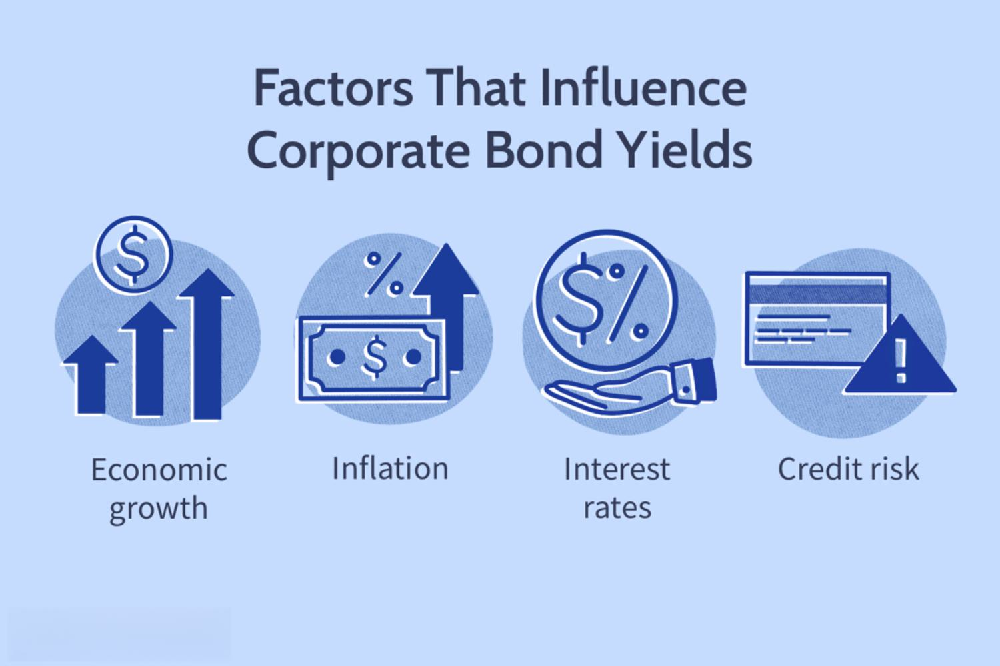

## Table of Contents

## What is a corporate bond?

A corporate bond is a type of loan that a company gets from investors. When a company needs money, it can borrow from people who want to invest their money. In return, the company promises to pay back the money with interest over a certain period of time. This interest is like a reward for the investors for lending their money to the company.

Corporate bonds are different from stocks because they don't give ownership in the company. Instead, they are more like an IOU. The company has to make regular interest payments and return the full amount of the bond when it matures. If the company does well, it can pay back the bond easily. But if it struggles, it might have a hard time making those payments. This makes corporate bonds a bit riskier than safer investments like government bonds, but they can also offer higher returns.

## What are bond yields and how are they calculated?

Bond yields tell you how much money you can earn from a bond each year. It's like the interest rate you get for lending your money to the company or government that issued the bond. The yield is usually shown as a percentage. If a bond has a high yield, it means you can earn more money from it, but it might also be riskier.

To calculate the yield, you need to know the bond's annual interest payment and its current price. You divide the annual interest payment by the bond's price and then multiply by 100 to get a percentage. For example, if a bond pays $50 a year and it costs $1,000, the yield would be (50 / 1,000) * 100 = 5%. Sometimes, the yield can change if the bond's price goes up or down in the market. This is because the interest payment stays the same, but the price you pay for the bond can change.

## How do interest rates influence corporate bond yields?

Interest rates and bond yields are closely connected. When interest rates go up, new bonds start offering higher interest payments to attract investors. This makes older bonds, which have lower interest payments, less attractive. To sell these older bonds, their prices have to go down. When the price of a bond goes down, its yield goes up because the annual interest payment is now a bigger part of the bond's lower price. So, when interest rates rise, bond yields usually go up too.

On the other hand, when interest rates go down, new bonds come with lower interest payments. This makes older bonds, which have higher interest payments, more attractive. To buy these older bonds, their prices have to go up. When the price of a bond goes up, its yield goes down because the annual interest payment is now a smaller part of the bond's higher price. So, when interest rates fall, bond yields usually go down too. This relationship between interest rates and bond yields is important for investors to understand because it helps them decide when to buy or sell bonds.

## What role does inflation play in affecting bond yields?

Inflation is when the prices of things go up over time. It can affect bond yields because it changes how much money is worth in the future. When inflation goes up, the money you get from a bond's interest payments might not buy as much as it used to. This makes bonds less attractive to investors because they want their money to keep its value. To make bonds more appealing, the bond's yield has to go up. This means the price of the bond goes down, so the interest payment becomes a bigger part of the bond's price.

On the other hand, when inflation goes down or stays low, the money from a bond's interest payments can buy more things in the future. This makes bonds more attractive to investors because their money keeps its value better. When bonds are more attractive, their prices go up, and their yields go down. So, inflation and bond yields have an opposite relationship: when inflation goes up, bond yields usually go up too, and when inflation goes down, bond yields usually go down.

## How does the credit rating of a corporation impact its bond yields?

A credit rating is like a report card for a company that tells investors how likely it is that the company will pay back its loans. When a company has a good credit rating, it means it's seen as reliable and less risky. Because of this, investors feel safer lending money to the company, so they don't need as much reward. This means the company can offer bonds with lower yields, which are still attractive to investors because of the low risk.

On the other hand, if a company has a bad credit rating, it's seen as more risky. Investors might worry that the company won't be able to pay back the money it borrows. To make up for this higher risk, the company has to offer higher yields on its bonds to attract investors. So, a company with a lower credit rating will have to pay more in interest to get people to buy its bonds, which means higher bond yields.

## What is the relationship between economic growth and corporate bond yields?

Economic growth can change how much investors want to put their money into corporate bonds. When the economy is growing fast, people might feel more confident and want to invest in things that could give them bigger rewards, like stocks. Because of this, they might not be as interested in the steady but smaller rewards from bonds. To make bonds more attractive, companies might have to offer higher yields. So, when the economy is doing well, corporate bond yields might go up because companies need to compete for investors' money.

On the other hand, when the economy is not doing so well, people might feel less confident and look for safer places to put their money. Bonds are seen as safer than stocks, so more people might want to buy them. When lots of people want to buy bonds, companies don't need to offer such high yields to attract investors. So, when the economy is struggling, corporate bond yields might go down because there's more demand for the safety that bonds provide.

## How do monetary policies of central banks affect corporate bond yields?

Central banks, like the Federal Reserve in the U.S., use monetary policies to control the amount of money in the economy. When they want to slow down the economy, they might raise interest rates. This makes borrowing more expensive for everyone, including companies. When companies have to pay more to borrow, they might have to offer higher yields on their bonds to attract investors. So, when central banks raise interest rates, corporate bond yields usually go up too.

On the other hand, when central banks want to help the economy grow, they might lower interest rates. This makes borrowing cheaper, and companies don't need to offer such high yields to get people to buy their bonds. When interest rates go down, corporate bond yields usually go down too. Central banks can also use other tools, like buying or selling bonds themselves, which can affect bond prices and yields. When they buy bonds, it can push bond prices up and yields down, and when they sell bonds, it can push bond prices down and yields up.

## What impact do fiscal policies have on corporate bond yields?

Fiscal policies are the ways that governments spend money and collect taxes. When the government spends more money, it can make the economy grow faster. This can make people feel more confident about investing in things like stocks, which might make them less interested in the steady but smaller rewards from bonds. To make bonds more attractive, companies might have to offer higher yields. So, when the government uses fiscal policies to boost the economy, corporate bond yields might go up because companies need to compete for investors' money.

On the other hand, if the government decides to spend less money or raise taxes, it can slow down the economy. When the economy is not doing so well, people might feel less confident and look for safer places to put their money. Bonds are seen as safer than stocks, so more people might want to buy them. When lots of people want to buy bonds, companies don't need to offer such high yields to attract investors. So, when the government uses fiscal policies to slow down the economy, corporate bond yields might go down because there's more demand for the safety that bonds provide.

## How do market liquidity conditions influence corporate bond yields?

Market [liquidity](/wiki/liquidity-risk-premium) means how easily you can buy or sell something without changing its price too much. When the market is very liquid, it's easy to trade bonds. Lots of people want to buy and sell them, so the prices stay steady. In this situation, companies don't need to offer very high yields to get people to buy their bonds because it's easy for investors to find buyers if they want to sell. So, when market liquidity is good, corporate bond yields might be lower because there's less risk for investors.

On the other hand, when market liquidity is low, it's harder to buy or sell bonds. Fewer people are trading, so if you want to sell your bond, you might have to lower the price a lot to find a buyer. This makes bonds riskier because it's harder to get your money back quickly. To make up for this risk, companies have to offer higher yields to attract investors. So, when market liquidity is poor, corporate bond yields might be higher because investors want more reward for taking on the extra risk.

## What are the effects of global economic factors on corporate bond yields?

Global economic factors can have a big impact on corporate bond yields. When the world economy is doing well, investors might feel confident and want to invest in things like stocks, which can offer bigger rewards. This can make them less interested in the steady but smaller rewards from bonds. To make bonds more attractive, companies might have to offer higher yields. Also, if other countries have high interest rates, investors might move their money there to get better returns, which can push up bond yields in their home country too.

On the other hand, if the world economy is struggling, investors might look for safer places to put their money. Bonds are seen as safer than stocks, so more people might want to buy them. This can push down bond yields because companies don't need to offer such high rewards to attract investors. Also, if other countries have low interest rates or are in a recession, investors might move their money back home, which can push down bond yields even more. So, global economic conditions can make bond yields go up or down depending on how they affect investors' confidence and where they want to put their money.

## How do investor sentiment and risk appetite affect corporate bond yields?

Investor sentiment and risk appetite can really change how much people want to buy corporate bonds. When investors feel good about the economy and are willing to take more risks, they might want to invest in things like stocks, which can give them bigger rewards. This makes them less interested in the steady but smaller rewards from bonds. To make their bonds more attractive, companies might have to offer higher yields. So, when investors are feeling confident and want to take risks, bond yields can go up because companies need to compete for their money.

On the other hand, when investors are worried about the economy or don't want to take as many risks, they might look for safer places to put their money. Bonds are seen as safer than stocks, so more people might want to buy them. When lots of people want to buy bonds, companies don't need to offer such high yields to attract investors. So, when investors are feeling nervous and want to play it safe, bond yields can go down because there's more demand for the safety that bonds provide.

## What advanced quantitative models are used to predict changes in corporate bond yields?

Advanced quantitative models used to predict changes in corporate bond yields often include things like regression analysis and [machine learning](/wiki/machine-learning). Regression analysis looks at how different things, like interest rates, inflation, and the company's credit rating, affect bond yields. It uses past data to see how these factors have changed bond yields before and makes guesses about how they might change them in the future. Machine learning takes this a step further by looking at lots of data and finding patterns that might be hard for people to see. It can learn from new data over time and get better at making predictions.

Another important model is the term structure model, which looks at how the length of time until a bond matures affects its yield. This model can help predict how changes in the economy or interest rates might affect bond yields differently depending on how long the bond will last. Some models also use something called a vector autoregression (VAR) model, which looks at how different economic factors affect each other and bond yields all at the same time. These models help investors and companies understand what might happen to bond yields and make better decisions about buying or selling bonds.

## What is the relationship between Credit Risk and Corporate Metrics?

Credit risk plays a critical role in determining the yields on corporate bonds. Investors demand higher yields for bonds issued by companies with greater credit risk, compensating for the increased possibility of default. This section explores how credit risk and corporate metrics impact bond yields, guiding investors in making informed decisions.

Credit ratings are a primary tool used by investors to assess the creditworthiness of corporate bond issuers. Agencies like Moody's, Fitch, and Standard & Poor's provide these ratings, which reflect the issuer's ability to meet its financial obligations. Higher credit ratings, indicating lower risk of default, are typically associated with lower bond yields. Conversely, bonds from issuers with lower ratings may command higher yields, as investors require compensation for the increased risk.

In addition to credit ratings, issuer-specific financial metrics significantly influence corporate bond yields. Key metrics include the interest coverage ratio and leverage ratios, among others. The interest coverage ratio, defined as:

$$
\text{Interest Coverage Ratio} = \frac{\text{EBIT}}{\text{Interest Expense}}
$$

where EBIT is Earnings Before Interest and Taxes, measures a company's ability to service its debt. A higher ratio suggests a greater ability to meet interest obligations, generally resulting in lower bond yields.

Leverage ratios, such as the debt-to-equity ratio, also provide insights into a company's financial structure. A high leverage ratio can signal potential financial distress, which may lead investors to demand higher yields to compensate for the elevated risk. These financial indicators necessitate thorough due diligence by investors, as they directly impact the perceived risk and expected returns of corporate bonds.

Investors must continually balance credit risk with potential yields to optimize their bond portfolios. This involves evaluating the trade-off between risk and return and understanding how changes in corporate metrics may affect bond valuations. By integrating credit ratings and issuer-specific financial data into their analyses, investors can better manage risk and enhance the profitability of their bond investments.

In conclusion, navigating credit risk and corporate metrics requires a sophisticated approach, leveraging both qualitative assessments and quantitative analyses. As these factors evolve, keeping abreast of changes in credit ratings and issuer financial health is paramount for investors aiming to maximize returns in the corporate bond market.

## References & Further Reading

[1]: Krishnamurthy, A., & Vissing-Jorgensen, A. (2012). ["The Aggregate Demand for Treasury Debt."](https://www.journals.uchicago.edu/doi/abs/10.1086/666526) Journal of Political Economy, 120(2), 233-267.

[2]: Duffie, D. (2010). ["Asset Price Dynamics with Slow-Moving Capital."](https://www.darrellduffie.com/uploads/1/4/8/0/148007615/duffieafapresidentialaddress2010.pdf) Review of Economic Studies, 77(2), 417-446.

[3]: ["Understanding Credit Ratings."](https://www.spglobal.com/ratings/en/about/understanding-credit-ratings) Moody’s Investors Service Report.

[4]: Ang, A., Bekaert, G., & Wei, M. (2008). ["The Term Structure of Real Rates and Expected Inflation."](https://www.jstor.org/stable/25094457) Journal of Finance, 63(2), 797-849.

[5]: Hurd, M., & Rohwedder, S. (2008). ["The Displacement Effect of Public Pensions on the Accumulation of Financial Assets."](https://www.ncbi.nlm.nih.gov/pmc/articles/PMC3630514/) Journal of Political Economy, 116(6), 785-826.