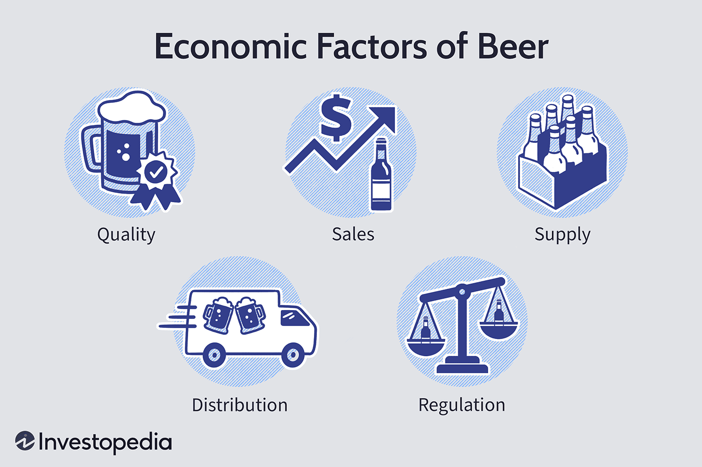

## Table of Contents

## What are the basic components that contribute to the cost of beer?

The cost of beer is influenced by several key factors. First, the ingredients play a big role. Beer is made from water, barley, hops, and yeast. The quality and type of these ingredients can change the price. For example, using special types of hops or barley can make the beer more expensive. Also, where the ingredients come from matters. If they need to be shipped from far away, this adds to the cost.

Another important part is the production process. Making beer involves brewing, fermenting, and packaging. Each step requires equipment and energy, which adds to the cost. The size of the brewery matters too. Small breweries might have higher costs because they can't buy ingredients in bulk like big breweries can. Finally, marketing and distribution costs also affect the price. Getting the beer to stores and advertising it adds more to the final cost of the beer.

## How do raw material prices affect beer prices?

Raw material prices have a big impact on how much beer costs. Beer is made from things like water, barley, hops, and yeast. If the prices of these things go up, then it costs more to make beer. For example, if there's a bad harvest for barley, the price of barley might go up. This means breweries have to pay more for their barley, and this extra cost can make the beer more expensive for customers.

Sometimes, the prices of raw materials can change because of things like weather or problems in the places where they grow. If there's a drought, it can hurt the crops and make the prices go up. Breweries might also choose to use special kinds of hops or barley that cost more. When they do this, they have to charge more for their beer to cover these higher costs. So, the price of beer can go up and down based on what's happening with the raw materials.

## What role do taxes play in the pricing of beer?

Taxes are a big part of what makes beer cost what it does. When beer is made and sold, the government adds taxes to it. These taxes can be different depending on where you live. For example, in some places, there might be a special tax just for beer, called an excise tax. This tax gets added to the price of the beer before it even leaves the brewery. So, when you buy a beer, part of what you're paying is going to the government.

These taxes can really change how much beer costs. If the taxes go up, the price of beer usually goes up too. Breweries have to pay these taxes, and they might raise the price of their beer to cover that cost. Sometimes, the taxes can be so high that they make beer a lot more expensive than it would be without them. So, next time you buy a beer, remember that part of the price is because of taxes.

## How does the cost of labor influence beer prices?

The cost of labor is a big part of how much beer costs. Making beer takes a lot of people to do different jobs. There are people who work in the brewery to make the beer, people who drive trucks to move the beer, and people who work in stores to sell the beer. If these workers get paid more, then it costs more to make and sell the beer. So, the price of beer might go up to cover these higher labor costs.

Sometimes, the cost of labor can change because of things like new laws or rules about how much people should get paid. If the government says that workers need to be paid more, then breweries have to pay more too. This can make the beer more expensive. Also, if it's hard to find good workers, breweries might have to pay even more to get people to work for them. All of these things can make the price of beer go up.

## What impact do transportation and distribution costs have on beer pricing?

Transportation and distribution costs are important when it comes to how much beer costs. When beer is made at a brewery, it needs to be moved to stores or bars where people can buy it. This moving part costs money. If the brewery is far away from where the beer is sold, it costs more to get the beer there. Also, if the beer needs to be kept cold during the trip, this adds to the cost too.

These costs can make the beer more expensive for people to buy. If the price of gas goes up, it costs more to drive the trucks that move the beer. Or if there are not enough trucks or drivers, the cost of moving the beer can go up too. Breweries might then raise the price of their beer to cover these extra costs. So, the next time you buy a beer, remember that part of what you're paying is for getting the beer from the brewery to you.

## How do economies of scale affect the price of beer?

Economies of scale are when big companies can make things cheaper because they make a lot of them. For beer, this means that big breweries can buy ingredients like barley and hops in big amounts. When they buy a lot at once, they can get a better price. They also have big machines that can make a lot of beer quickly. This makes the cost of making each beer go down. So, big breweries can sell their beer for less money than small breweries.

Small breweries don't make as much beer, so they can't buy ingredients in big amounts. This means they have to pay more for their barley and hops. They also might not have the big machines that big breweries have, so it takes them longer to make beer. This makes the cost of making each beer higher for small breweries. Because of this, small breweries often have to charge more for their beer than big breweries do.

## What is the influence of market competition on beer prices?

Market competition is when different companies try to sell their beer to people. When there are a lot of breweries selling beer, they all want to sell more than the others. To do this, they might lower their prices to make their beer cheaper than the others. This is good for people buying beer because they can get it for less money. But, if one brewery makes really good beer or has a special kind that people like a lot, they might not have to lower their prices. They can keep their prices the same because people will still buy their beer.

Sometimes, big breweries might have a lot of money to spend on things like ads on TV or in stores. This can make more people want to buy their beer, even if it's not the cheapest. Small breweries might not have as much money for ads, so they might have to keep their prices lower to get people to buy their beer. In the end, how much competition there is can make beer prices go up or down, depending on what the breweries do to try to sell more beer.

## How do government regulations and policies impact beer pricing?

Government regulations and policies can really change how much beer costs. One way they do this is through taxes. Governments might put special taxes on beer, like an excise tax, which makes the price go up before the beer even leaves the brewery. If these taxes go up, breweries have to charge more for their beer to cover the extra cost. Also, there are rules about how beer can be made and sold. If these rules change, it might cost more to follow them, and this can make beer more expensive too.

Another way government policies affect beer prices is through things like minimum wage laws. If the government says that workers need to be paid more, breweries have to pay their workers more money. This makes it cost more to make beer, so the price might go up. Also, there can be rules about how beer is labeled or how it's advertised. If these rules make it harder or more expensive to sell beer, this can also make the price go up. So, government rules and policies can have a big impact on how much beer costs.

## What role does branding and marketing play in determining beer prices?

Branding and marketing are important for how much beer costs. When a brewery spends a lot of money on ads on TV, in magazines, or online, they want people to know about their beer. This can make people think the beer is special or better than others. If a beer has a strong brand, people might be willing to pay more for it because they trust the name. So, the cost of making the brand well-known can make the beer more expensive.

Also, how a beer looks can change its price. If a brewery uses cool designs on their cans or bottles, it can make the beer seem more interesting. This kind of packaging can cost more money, and breweries might raise the price of the beer to cover these costs. In the end, how much a brewery spends on making their beer look good and getting people to know about it can make the beer cost more.

## How do fluctuations in currency exchange rates affect beer prices in the global market?

When the value of money changes between different countries, it can change how much beer costs around the world. If a country's money becomes worth less compared to another country's money, it might cost more for that country to buy things from other places. For example, if a brewery in the United States wants to buy hops from Germany, and the US dollar becomes worth less compared to the Euro, the hops will cost more in US dollars. This can make the beer more expensive because the brewery has to pay more for the hops.

On the other hand, if a country's money becomes worth more compared to another country's money, it might be cheaper for that country to buy things from other places. If the US dollar becomes worth more compared to the Euro, the same hops from Germany will cost less in US dollars. This can help the brewery save money, and they might be able to sell their beer for less. So, changes in how much different countries' money is worth can make beer prices go up or down in the global market.

## What are the effects of technological advancements in brewing on beer prices?

Technological advancements in brewing can help make beer cheaper. New machines and computers can make the brewing process faster and easier. For example, some new machines can make more beer at once, so breweries don't have to spend as much time and money making it. Also, technology can help breweries use less energy, which saves them money. When breweries save money, they can sometimes sell their beer for less.

But sometimes, new technology can make beer more expensive. If a brewery buys new machines, they have to pay a lot of money for them. They might raise the price of their beer to help pay for these new machines. Also, some new technology might be used to make special kinds of beer that cost more to make. So, while technology can help make beer cheaper in some ways, it can also make it more expensive in others.

## How do environmental factors and sustainability initiatives influence beer pricing?

Environmental factors like weather and water availability can change how much beer costs. If there's a drought or bad weather, it can hurt the crops that breweries need, like barley and hops. When these crops don't grow well, their prices go up, and breweries have to pay more for them. This can make the beer more expensive. Also, if water is hard to get, breweries might have to pay more for it, which can add to the cost of making beer.

Sustainability initiatives are when breweries try to be good to the environment. They might use less energy or find ways to make less waste. Doing these things can cost more money at first. Breweries might have to buy special equipment or change how they make beer to be more sustainable. But in the long run, these changes can save money. If a brewery uses less energy, their bills go down, and they might be able to sell their beer for less. So, while trying to be sustainable can make beer more expensive at first, it can help make it cheaper later on.

## Is beer a normal, inferior, or luxury good in the market?

Beer occupies a distinctive position within economic frameworks, as its classification can shift between normal, inferior, and luxury good based on market conditions and consumer preferences.

When people experience increases in income, the general trend is for the demand for beer to rise, thereby classifying it as a normal good. In economic terms, a normal good is characterized by a positive income elasticity of demand, which signifies that as disposable income increases, the quantity demanded for the good also increases. The elasticity can be understood through the formula:

$$
\text{Income Elasticity of Demand} = \frac{\%\Delta Q_d}{\%\Delta I}
$$

where $\%\Delta Q_d$ is the percentage change in quantity demanded and $\%\Delta I$ is the percentage change in income. For most beers, this elasticity is positive, indicating their status as normal goods within the market.

During economic downturns, however, consumers often shift their preferences toward more affordable beverages, categorizing beer as an inferior good. Inferior goods are characterized by a negative income elasticity of demand, suggesting that as income decreases, the demand for the good increases. Consumers seeking cost-effective options tend to forego premium-priced beers for cheaper alternatives, demonstrating beer's versatile classification.

In contrast, craft and specialty beers often occupy the luxury end of the market. These high-end products usually have a higher income elasticity of demand, reflecting that demand for such goods increases disproportionately with income growth. Unlike normal goods, luxury goods experience demand increases that exceed the rate of income increase. This phenomenon captures the unique consumer perception associated with craft beers, which are often valued for their distinct flavors, quality, and the status associated with their consumption.

Each segment of the beer market, from mass-market to specialty products, responds uniquely to economic cycles, influencing both pricing strategies and market positioning. Brewers and suppliers must adapt to these shifting consumer preferences to maintain a competitive edge in varying economic climates. The dual nature of beer as both a staple beverage and a luxury item further complicates the market dynamics, necessitating a nuanced understanding of economic principles to effectively navigate its complex landscape.

## How do economic conditions affect beer pricing?

The relationship between beer sales and economic recessions demonstrates a multifaceted interaction. In principle, one might anticipate that consumers would gravitate toward more affordable beer options during economic downturns due to reduced disposable income. However, empirical studies challenge this assumption, revealing that high-end craft beers can maintain or even increase their sales during such periods. 

This seeming paradox can be explained by considering shifts in consumer behavior and psychological factors. During recessions, consumers may seek affordable luxuries as a means of maintaining a semblance of normalcy or indulging in small treats, and craft beer often fits this niche. The willingness to spend on premium items can also be viewed through the lens of consumer segmentation, where individuals with stable or high incomes continue to patronize specialty beer markets despite broader economic challenges.

Economic conditions, such as changes in disposable income and evolving consumer preferences, play a crucial role in shaping beer market performances. Disposable income serves as a key determinant of beer sales. The direct relationship can be expressed through the basic elasticity of demand formula: 

$$

E_d = \frac{\% \text{ change in quantity demanded}}{\% \text{ change in income}} 
$$

In this context, if beer is considered a normal good, an increase in income would result in an increased demand. Conversely, if a segment of beer acts as an inferior good, demand may increase when incomes drop as consumers opt for cheaper alternatives.

Moreover, consumer preferences are continually evolving. Trends such as an increased focus on artisanal production, environmental consciousness, and unique flavor profiles have buoyed the craft beer segment. This trend can lead to varied demand dynamics irrespective of broader economic conditions. Therefore, while some market segments may falter during economic downturns, others may thrive, driven by loyal consumer bases and niche market appeal.

In conclusion, the beer market's response to economic conditions is not monolithic. It is shaped by a combination of disposable income variations and shifts in consumer preferences, making it necessary for breweries and stakeholders to adapt their strategies according to these dynamics to optimize pricing and sales.

## How does algorithmic trading impact beer pricing?

Automated trading algorithms are increasingly influencing the beer market, much like they have in various other commodities and financial markets. These algorithms leverage large datasets and employ sophisticated mathematical models to initiate and execute trades with minimal human intervention. They are particularly effective in responding swiftly to changes in economic indicators, input costs, and consumer demand patterns, all of which can significantly impact beer prices.

The core advantage of [algorithmic trading](/wiki/algorithmic-trading) lies in its ability to process vast amounts of data at high speed, identifying market trends and executing trades far more quickly than a human could. For instance, if an algorithm detects a rise in the cost of key inputs like barley or hops, it can predict potential price increases in beer products and adjust purchase strategies accordingly. Similarly, changes in consumer purchasing behavior, detected through sales data analytics, can prompt algorithms to make rapid adjustments that could stabilize or exploit pricing shifts.

These trading systems enhance market efficiencies by narrowing spreads and increasing [liquidity](/wiki/liquidity-risk-premium). However, they also introduce complexities. The speed and scale at which these algorithms operate can amplify market fluctuations, especially when multiple algorithms react simultaneously to economic changes. This could lead to increased [volatility](/wiki/volatility-trading-strategies) in beer prices, as concurrent automated actions might exacerbate both upward and downward trends. 

Furthermore, algorithmic trading can influence long-term pricing strategies as companies incorporate predictive analytics to forecast demand and optimize inventory management. By integrating predictive models, businesses could better align supply with anticipated consumption, potentially stabilizing prices over time.

In economic terms, if $P$ represents the price of beer, and demand ($D$) and cost of inputs ($C$) are key variables, algorithms adjust $P$ by analyzing trends in $D$ and $C$ to maintain equilibrium. Such models can be represented through simplified equations:

$$
P = f(D, C)
$$

Where $f$ is a function modified by algorithms using real-time data assessment. Here's a basic Python example illustrating this:

```python
def adjust_price(demand, input_costs):
    baseline_price = 5.0  # baseline price of beer
    price_adjustment_factor = 0.1  # sensitivity of price to demand and costs

    adjusted_price = baseline_price + price_adjustment_factor * (demand - input_costs)
    return adjusted_price

# Example usage:
demand_change = 1.5
input_costs_change = 1.0
new_price = adjust_price(demand_change, input_costs_change)
print(f"The adjusted beer price is: ${new_price:.2f}")
```

In conclusion, while algorithmic trading brings efficiency and a level of predictive capability to the beer market, it also requires careful management to mitigate potential volatility. Understanding these systems' potential impacts is crucial for stakeholders aiming to navigate the increasingly complex economics of beer pricing.

## What are Frequently Asked Questions?

### Frequently Asked Questions

**How do changes in input costs impact beer production expenses?**

Changes in input costs can significantly influence beer production expenses, as they directly affect the cost of raw materials like malted barley, hops, water, and yeast. For instance, fluctuations in agricultural yields can cause variability in barley and hop prices. An increase in these input prices typically results in higher production costs, which may be passed on to consumers in the form of increased beer prices. Fuel and energy costs also play a crucial role; rising energy prices lead to higher costs for brewing, packaging, and transportation. The formula for calculating production costs can be expressed as:

$$
\text{Total Production Cost} = \text{(Cost of Raw Materials)} + \text{(Labor Costs)} + \text{(Energy Costs)} + \text{(Packaging)} + \text{(Transportation)}
$$

**What impact do taxation and regulations have on the beer industry finances?**

Taxation and regulatory frameworks have profound impacts on the beer industry's financial health. Excise taxes, which are levied on alcoholic beverages, can contribute significantly to the cost of beer. According to the Alcohol and Tobacco Tax and Trade Bureau (TTB) in the United States, these taxes can differ at federal and state levels and influence the final retail price. In heavily taxed regions, breweries may face financial strain, potentially affecting their profitability and market strategies. Regulations such as the three-tier system in the U.S.—which divides the market into producers, distributors, and retailers—also introduce additional costs and logistical challenges that can influence pricing and operational efficiency.

**How do macroeconomic factors influence beer consumption patterns?**

Macroeconomic factors, including income levels, unemployment rates, and consumer confidence, significantly impact beer consumption patterns. During times of economic growth, rising disposable incomes often lead to increased demand for premium and specialty beers, as consumers are more willing to spend on luxury goods. Conversely, during economic downturns, consumers may shift toward purchasing lower-cost beer brands. Interest rates also play a role; high borrowing costs can reduce discretionary spending, impacting consumption. The elasticity of demand for beer can be represented by:

$$
E_d = \frac{\% \text{Change in Quantity Demanded}}{\% \text{Change in Income}}
$$

This elasticity varies across different segments, with luxury craft beers generally having higher income elasticity compared to mainstream beer brands.

**How do regulatory changes and consumer preferences impact the pricing strategies of breweries?**

Regulatory changes, such as alterations in tax laws or labeling requirements, can necessitate adjustments in pricing strategies to maintain profitability. Consumer preferences, particularly the increasing demand for craft and artisanal products, also influence pricing strategies. Breweries may adopt premium pricing for craft beers as these are perceived as higher-quality luxury goods. Additionally, with the growing focus on health, sustainability, and local sourcing, breweries might adjust their product offerings and pricing to align with these consumer values. Adapting to consumer preferences can involve investment in new product lines or marketing strategies, further impacting pricing decisions.

## References & Further Reading

[1]: Tremblay, V. J., & Tremblay, C. H. (2011). ["Recent Economic Developments in the Import and Craft Segments of the U.S. Brewing Industry."](https://academic.oup.com/book/1445/chapter/140823594) Journal of the Academy of Economics and Finance.

[2]: Ascher, W. L. (1979). ["The Forecasting Potential of Composite Elasticities in the Beer Industry."](https://www.amazon.com/Forecasting-Appraisal-Policy-Makers-William-Ascher/dp/0801822734) Social Studies of Science.

[3]: Krugman, P., & Wells, R. (2018). ["Microeconomics"](https://www.amazon.com/Microeconomics-Paul-Krugman/dp/1319245285). Worth Publishers. (Relevant for understanding economic principles like supply and demand).

[4]: MacIntosh, A., & Lawson, R. (1993). ["The Impact of Regulations on the Market Structure in the Brewing Industry."](https://www.mac-history.net/2021/02/10/history-apple-macintosh/) Economic Papers: A Journal of Economics and Policy.

[5]: Moore, S. A. (2008). ["The Emergence of the Beer Can: Consumer and Economic Factors."](https://throttledownkustoms.com/product/2008-2010-ford-super-duty-bumper/) Journal of the Royal Statistical Society.