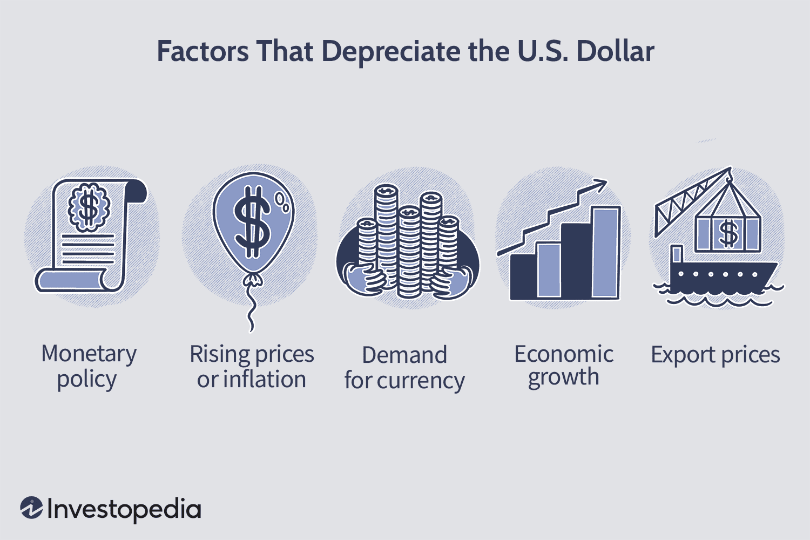

## Table of Contents

## What is currency depreciation?

Currency depreciation is when the value of a country's money goes down compared to other countries' money. This happens a lot in countries where the money is not as strong. When a country's currency depreciates, it means that you need more of that country's money to buy things from other countries. For example, if you used to buy a toy from another country for 100 of your country's dollars, and then your currency depreciates, you might need 120 dollars to buy the same toy.

This can affect a country's economy in different ways. On one hand, it can make things from other countries more expensive, which can be bad for people who like to buy things from abroad. On the other hand, it can make the country's own products cheaper for people in other countries to buy. This might help the country sell more of its own products to other countries. But, if the currency keeps going down a lot, it can make people lose trust in the country's money, which can cause even bigger problems.

## How does inflation affect currency depreciation?

Inflation can lead to currency depreciation. When a country has high inflation, the prices of things inside the country go up a lot. This means that the money in that country can buy less than before. If the inflation is much higher than in other countries, people might start to think that the country's money is not worth as much. This can make the value of the country's money go down compared to other countries' money.

When a country's currency depreciates because of inflation, it can make things from other countries more expensive. This is because you need more of your country's money to buy the same amount of another country's money. For example, if you used to buy a toy from another country for 100 of your country's dollars, and then your currency depreciates, you might need 120 dollars to buy the same toy. This can make people in the country feel like their money is not as strong, and it can affect how much they can buy from other countries.

## What role does interest rates play in currency depreciation?

Interest rates can have a big effect on whether a country's money goes down in value compared to other countries' money. When a country's central bank raises interest rates, it means that people can earn more money by saving or investing in that country. This can make more people want to put their money in that country, which can make the country's money go up in value. On the other hand, if the central bank lowers interest rates, it means that people can earn less money by saving or investing there. This might make people take their money out of the country, which can make the country's money go down in value.

The difference in interest rates between countries can also affect currency values. If one country has much higher interest rates than another, people might want to move their money to the country with higher rates to earn more. This can make the money of the country with higher interest rates go up in value, and the money of the country with lower interest rates go down in value. So, interest rates are an important part of why a country's money might depreciate or appreciate.

## How do trade balances impact currency depreciation?

Trade balances can affect whether a country's money goes up or down in value. A trade balance is the difference between what a country sells to other countries and what it buys from them. If a country sells more than it buys, it has a trade surplus. This can make its money go up in value because other countries need to use their money to buy the country's products. On the other hand, if a country buys more than it sells, it has a trade deficit. This can make its money go down in value because the country needs to use more of its money to buy things from other countries.

When a country has a trade deficit, it means it is spending more money on imports than it is [earning](/wiki/earning-announcement) from exports. This can lead to a higher demand for foreign money, which can cause the country's own money to depreciate. For example, if a country needs to buy a lot of oil from another country, it will need to use more of its own money to get the foreign money needed to pay for the oil. Over time, this can make the country's money less valuable compared to the money of the countries it is buying from.

## What is the effect of political stability on currency depreciation?

Political stability can have a big effect on whether a country's money goes up or down in value. When a country is politically stable, it means that the government is strong and there is not a lot of fighting or uncertainty. This can make people feel more confident about the country's future. When people feel confident, they are more likely to invest in the country and keep their money there. This can make the country's money go up in value because more people want it.

On the other hand, if a country is not politically stable, it can make people worried about the future. When there is a lot of fighting, protests, or changes in the government, people might think that the country's money could lose value. This can make them want to take their money out of the country and put it somewhere safer. When a lot of people do this, it can make the country's money go down in value, which is called currency depreciation.

## How do foreign investments influence currency depreciation?

Foreign investments can affect whether a country's money goes up or down in value. When people from other countries invest in a country, they usually need to buy that country's money to make their investments. This means there is more demand for the country's money, which can make it go up in value. For example, if a lot of people from other countries want to buy houses or start businesses in a country, they will need to exchange their money for the country's money. This can make the country's money stronger compared to other countries' money.

On the other hand, if foreign investors start to take their money out of a country, it can make the country's money go down in value. This can happen if people think the country is not a good place to invest anymore, maybe because of problems in the economy or politics. When investors pull their money out, they are selling the country's money to get their own money back. This can make the country's money weaker because there is less demand for it. So, foreign investments can play a big role in whether a country's money depreciates or not.

## What is the impact of government debt on currency depreciation?

When a country has a lot of government debt, it can make the country's money go down in value. This is because people might start to worry that the government will not be able to pay back all the money it owes. If people think the government might have trouble paying its debts, they might not want to keep their money in that country. This can make them sell the country's money and buy money from other countries instead, which makes the country's money weaker.

On the other hand, if the government debt is seen as not too risky, it might not affect the country's money as much. But if the debt keeps growing and people start to think it is a big problem, it can lead to less trust in the country's money. This can make the country's money go down in value compared to other countries' money, which is called currency depreciation. So, how much government debt affects currency depreciation depends a lot on what people think about the government's ability to handle its debts.

## How does economic growth rate relate to currency depreciation?

Economic growth rate can affect whether a country's money goes up or down in value. When a country's economy is growing fast, it means that businesses are doing well and people are making more money. This can make people from other countries want to invest in the country because they think they can make money there too. When more people want to invest, they need to buy the country's money, which can make it go up in value. So, a high economic growth rate can help keep a country's money strong and prevent it from going down in value.

On the other hand, if a country's economy is not growing much or is even shrinking, it can make the country's money go down in value. When the economy is not doing well, people might think it is not a good place to invest. This can make them take their money out of the country and sell the country's money to get their own money back. When a lot of people do this, it can make the country's money weaker compared to other countries' money. So, a low or negative economic growth rate can lead to currency depreciation.

## What are the effects of monetary policy on currency depreciation?

Monetary policy is what a country's central bank does to control the amount of money in the economy. It can affect whether a country's money goes up or down in value. When the central bank makes it harder to borrow money by raising interest rates, it can make the country's money go up in value. This is because people from other countries might want to invest in the country to get the higher interest rates. More demand for the country's money can make it stronger. But if the central bank makes it easier to borrow money by lowering interest rates, it can make the country's money go down in value. This is because people might take their money out of the country to find better places to invest, which can make the country's money weaker.

Another way monetary policy can affect currency depreciation is by controlling how much money is in the economy. If the central bank prints a lot of new money, it can lead to higher prices, which is called inflation. When there is a lot of inflation, the country's money can lose value compared to other countries' money. This is because people might not want to keep their money in a country where prices are going up a lot. On the other hand, if the central bank keeps the amount of money from growing too fast, it can help keep the country's money strong. So, how the central bank manages the money supply can have a big effect on whether the country's money goes up or down in value.

## How do exchange rate regimes affect currency depreciation?

Exchange rate regimes are the rules that countries use to decide how much their money is worth compared to other countries' money. There are different types of exchange rate regimes, and they can affect whether a country's money goes up or down in value. In a fixed exchange rate regime, a country's government or central bank tries to keep the value of its money the same compared to another country's money. This can prevent the country's money from going down in value too much, but it can be hard to keep up if the country's economy is not doing well. In a floating exchange rate regime, the value of a country's money can go up or down based on what people think about the country's economy. This can make the country's money go down in value if people are worried about the economy.

In a managed float exchange rate regime, the government or central bank lets the value of the country's money go up and down but also tries to control it a bit. This can help stop the country's money from going down in value too fast, but it can be hard to do well. Another type of exchange rate regime is a currency peg, where a country's money is tied to another country's money. If the country's economy is not doing as well as the country it is tied to, it can be hard to keep the peg, and if the peg breaks, the country's money can go down in value a lot. So, the type of exchange rate regime a country uses can have a big effect on whether its money goes up or down in value.

## What role do speculative attacks play in currency depreciation?

Speculative attacks happen when people think a country's money might lose value soon. They start selling the country's money to buy money from other countries. This makes the country's money go down in value even more because a lot of people are trying to get rid of it at the same time. It's like a big rush to the exits, where everyone wants to leave before the value drops too much. This can be a big problem for countries with fixed exchange rates, where the government tries to keep the money's value the same.

When a lot of people start selling a country's money, it can be hard for the government to stop the money from going down in value. The government might try to use its own money to buy back the country's money and keep its value up, but it can run out of money to do this. If the government can't stop the selling, the value of the country's money can fall a lot, which is called currency depreciation. So, speculative attacks can make a country's money lose value quickly and cause big problems for the country's economy.

## How do global economic conditions influence currency depreciation?

Global economic conditions can have a big effect on whether a country's money goes up or down in value. When the world economy is doing well, people might feel more confident about investing in different countries. This can make the money of countries with strong economies go up in value because more people want to buy it. But if the world economy is not doing well, people might be scared to invest in any country. They might take their money out of countries they think are risky, which can make those countries' money go down in value.

Another way global economic conditions can affect currency depreciation is through big events like financial crises. When there is a big problem in one part of the world, it can make people worried about the whole world economy. This can lead to a lot of selling of money from countries that people think are not safe. For example, during a global financial crisis, people might sell the money of countries with a lot of debt or weak economies, making those countries' money go down in value. So, what happens in the world economy can play a big role in whether a country's money depreciates or not.

## References & Further Reading

[1]: Bergstra, J., Bardenet, R., Bengio, Y., & Kégl, B. (2011). ["Algorithms for Hyper-Parameter Optimization."](https://dl.acm.org/doi/10.5555/2986459.2986743) Advances in Neural Information Processing Systems 24.

[2]: ["Advances in Financial Machine Learning"](https://www.amazon.com/Advances-Financial-Machine-Learning-Marcos/dp/1119482089) by Marcos Lopez de Prado

[3]: ["Evidence-Based Technical Analysis: Applying the Scientific Method and Statistical Inference to Trading Signals"](https://www.amazon.com/Evidence-Based-Technical-Analysis-Scientific-Statistical/dp/0470008741) by David Aronson

[4]: ["Machine Learning for Algorithmic Trading"](https://github.com/stefan-jansen/machine-learning-for-trading) by Stefan Jansen

[5]: ["Quantitative Trading: How to Build Your Own Algorithmic Trading Business"](https://github.com/LucindaYa/quant-resources/blob/master/Quantitative%20Trading%20How%20to%20Build%20Your%20Own%20Algorithmic%20Trading%20Business.pdf) by Ernest P. Chan