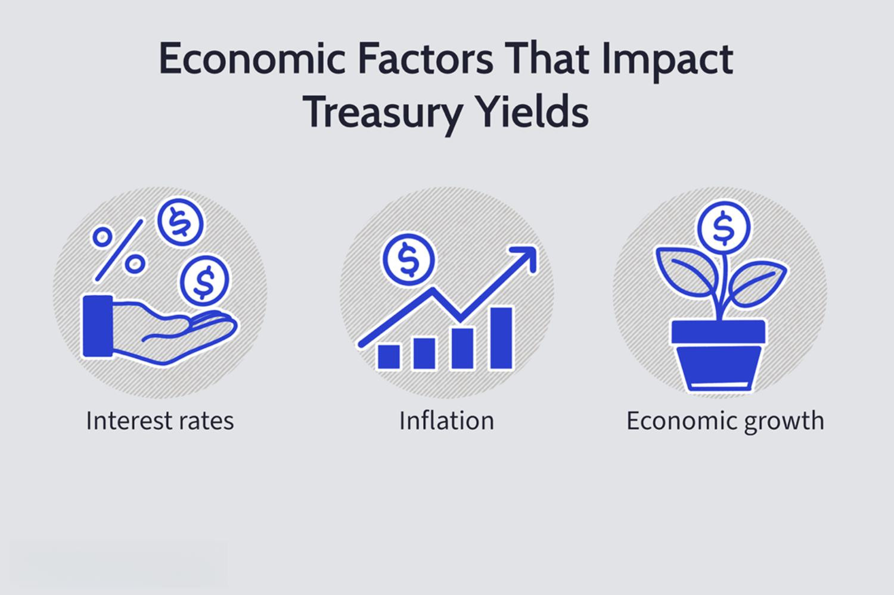

Understanding the intricate relationships between treasury yields, interest rates, and algorithmic trading is crucial for financial market participants and policymakers. These elements, each playing a significant role in the economic landscape, are interconnected in ways that influence market behavior, capital allocation, and broader economic decisions.

Treasury yields, which represent the returns on U.S. government debt securities, serve as key indicators of economic health and investor sentiment. They are directly impacted by changes in interest rates set by central banks, particularly the Federal Reserve. Interest rates, pivotal in controlling economic expansion and inflation, interact with treasury yields to form a complex feedback loop that affects everything from mortgage rates to business investment costs.

Algorithmic trading introduces another layer of complexity by using sophisticated computer algorithms to analyze vast amounts of financial data, including yield trends. This enables rapid decision-making, influencing liquidity and market volatility. The effectiveness of algorithmic trading relies heavily on its capacity to interpret the nuances of treasury yields and interest rates swiftly and accurately, thus impacting market dynamics and trading strategies.

For investors and traders, understanding these interconnections is critical for crafting informed strategies. The movement of treasury yields and interest rates can dictate the flow of investment across asset classes, while algorithmic trading can alter the speed and nature of market reactions. Consequently, a deep comprehension of these elements is essential not only for making strategic investment decisions but also for anticipating how markets might respond to economic changes and policy shifts. As the financial landscape continues to evolve with technological advancements and economic challenges, staying abreast of these dynamics becomes increasingly imperative for successful investment management.

## Table of Contents

## Understanding Treasury Yields

Treasury yields represent the return on investment for U.S. government securities, serving as crucial indicators of economic health and investor sentiment. These yields reflect the interest rate the government pays to borrow money over various periods, spanning short-term instruments like Treasury bills to long-term ones such as Treasury bonds. Investors closely monitor treasury yields, as they influence borrowing costs, savings returns, and asset valuations across global financial markets.

Treasury yields are primarily determined through auction processes conducted by the U.S. Department of the Treasury. During these auctions, securities are sold directly to investors in a competitive bidding process. The yields are established based on the bid prices offered by participants. In this process, as demand for Treasury securities increases, prices rise, and yields correspondingly decrease. Conversely, lower demand results in lower prices and higher yields. This dynamic highlights the inverse relationship between bond prices and yields, a fundamental concept in fixed-income investing.

$$
\text{Yield} = \frac{\text{Coupon Payment}}{\text{Market Price}}
$$

Where the yield reflects the annual return on a bond based on its coupon payment and current market price. A higher purchase price leads to a lower yield, while a lower purchase price results in a higher yield. This inverse relationship is crucial as it influences investor decisions and reactions to broader economic conditions.

For instance, when investors anticipate economic uncertainty or [interest rate](/wiki/interest-rate-trading-strategies) hikes by the Federal Reserve, they may shift investments to the relative safety of Treasuries, increasing demand and lowering yields. Conversely, in a robust economic environment with rising inflation expectations, investors might seek higher returns elsewhere, decreasing demand for Treasuries and increasing yields.

Understanding this interaction helps investors forecast interest rate trends and make informed decisions regarding portfolio allocations and risk management. Such knowledge is pivotal for anticipating shifts in market dynamics and optimizing investment strategies amidst fluctuating economic conditions.

## Economic Factors Influencing Treasury Yields

Treasury yields, as critical indicators of economic health, are heavily influenced by various economic factors. Among these, inflation and economic growth stand out as primary determinants. Inflation erodes the purchasing power of money, prompting investors to seek higher yields as compensation for the anticipated decrease in money value over time. Consequently, when inflation expectations rise, so do treasury yields, to offset the potential loss from inflationary pressures. 

Economic growth, measured by indicators such as GDP growth, also plays a vital role in shaping treasury yields. Robust economic growth often leads to increased demand for capital, driving up interest rates and, subsequently, treasury yields. Investors anticipate future inflation and interest rate hikes due to economic expansion, leading to adjustments in yield expectations.

Decisions by the Federal Reserve, particularly changes in interest rates, significantly impact treasury yields. The Federal Reserve sets the federal funds rate, influencing short-term interest rates across the economy. When the Federal Reserve decides to increase interest rates as a measure to curb inflation or cool down an overheating economy, treasury yields typically rise in response to the anticipated higher cost of borrowing.

Moreover, the interplay of macroeconomic indicators such as employment rates, consumer confidence, and geopolitical stability can profoundly affect investor behavior and, consequently, treasury yields. High unemployment rates or geopolitical instability often result in lower yields, as investors flock to the safety of U.S. Treasury securities, increasing demand and driving prices up while pushing yields down.

Investors continuously assess this complex web of economic signals to inform their investment strategies. The dynamic nature of these indicators necessitates constant vigilance and adaptation to shifts in the economic landscape. Understanding how these factors interact not only helps anticipate changes in treasury yields but also provides a broader insight into the current state and future direction of the economy.

## Interest Rates and Their Relationship with Treasury Yields

Central bank policies and the federal funds rate play crucial roles in shaping treasury yields, as they directly influence the cost of borrowing in the economy. The federal funds rate is the interest rate at which depository institutions lend reserve balances to other depository institutions overnight. This rate serves as a primary tool for the Federal Reserve to control monetary policy and, by extension, the economy. Changes to this rate impact short-term interest rates, which in turn influence treasury yields.

When the Federal Reserve raises the federal funds rate, borrowing becomes more expensive, leading to a decrease in inflationary pressures. Higher interest rates typically increase treasury yields as new bonds must offer better returns to attract investors. Conversely, when the federal funds rate is lowered, borrowing costs decrease, often resulting in lower treasury yields. This inverse relationship between the federal funds rate and bond prices (and therefore yields) is essential for understanding market dynamics.

The impact of changes in treasury yields extends beyond government securities to consumer loans, mortgages, and business investments. An increase in treasury yields generally leads to higher mortgage rates, making home loans more expensive. Consequently, housing demand may decrease, potentially cooling the housing market. Similarly, higher yields can increase the cost of consumer loans, impacting spending and economic growth.

Business investments are also affected by fluctuations in treasury yields. As yields rise, it becomes costlier for businesses to borrow, which might reduce capital expenditure and slow expansion plans. Conversely, lower yields can stimulate investment and growth by reducing borrowing costs. These ripple effects illustrate how interconnected interest rates are with the broader economic environment.

The relationship between interest rates and treasury yields underscores the need for investors and policymakers to monitor central bank decisions closely. Since treasury yields serve as a benchmark for various financial products, shifts in interest rates can have profound implications for the entire economic landscape. Understanding this interconnectedness is crucial for making informed investment decisions and crafting effective economic policies. 

By comprehending the influence of central bank policies and interest rates on treasury yields, individuals and businesses can better anticipate economic trends and adjust their strategies accordingly, ensuring resilience in a dynamic financial environment.

## The Role of Algorithmic Trading in Treasury Yields

Algorithmic trading uses sophisticated mathematical models and computer codes to execute trades at speeds and frequencies beyond human capability. In the context of treasury yields, algo trading systems analyze yield data to make swift trading decisions. They leverage historical and real-time data to identify patterns and trends that human traders might overlook. Algorithms assess factors such as yield curves, price movements, and economic indicators, making decisions in milliseconds. 

These systems are designed to exploit [arbitrage](/wiki/arbitrage) opportunities and optimize trading strategies based on pre-defined criteria. For instance, if an algorithm detects a favorable change in the yield curve, it may execute buy orders for certain securities that are expected to benefit from this change. Conversely, if the yield curve's movements forecast potential losses, the system might engage in short-selling strategies or reallocate assets into more secure investments.

The integration of [algorithmic trading](/wiki/algorithmic-trading) significantly impacts market [liquidity](/wiki/liquidity-risk-premium) and [volatility](/wiki/volatility-trading-strategies). On the one hand, algorithmic trading enhances liquidity. Algorithms can execute large volumes of trades across various securities swiftly, which ensures continuous market entries and exits. This rapid trading activity often results in tighter bid-ask spreads. On the other hand, the speed and automation of algo trading can exacerbate market volatility. Given that many algorithms are designed to react to price movements, any significant market movement can trigger a cascade of algorithm-driven trades, potentially leading to short-term volatility spikes or flash crashes.

The advantages of incorporating algorithmic trading include increased efficiency and execution accuracy, cost reduction, and the ability to process and analyze big data in trading. With algorithms, trades are executed at the best possible prices, minimizing human errors and lowering transaction costs. Furthermore, the ability to backtest trading strategies on historical data allows traders to refine their approaches before applying them in real-time situations.

Challenges exist in integrating these systems. Developing and maintaining robust algorithms requires significant expertise and resources. There's also the risk of over-reliance on algorithms, which may neglect fundamental market dynamics and lead to poor decision-making during atypical market conditions. Moreover, the potential for technical malfunctions and security breaches poses risks to financial stability. To address these challenges, firms often implement risk management protocols and fail-safes to ensure algorithmic trading aligns with broader investment strategies and regulatory standards. 

In conclusion, while algorithmic trading offers powerful tools for navigating treasury yield data and executing swift market decisions, it demands comprehensive oversight and infrastructure to mitigate associated risks.

## Conclusion

The interconnected roles of treasury yields, interest rates, and algorithmic trading form a critical triad in today's financial markets. Treasury yields serve as a barometer for economic health, gauging investor sentiment and influencing a wide array of financial instruments. Interest rates, influenced by central bank policies, act as a lever for economic activity, dictating borrowing and lending costs that ripple through consumer and corporate sectors. Algorithmic trading, leveraging technological advancements, makes rapid trading decisions based on yield data, impacting liquidity and volatility in markets.

Understanding these dynamics is crucial for informed trading and investment strategies. Treasury yields, for instance, reflect investor expectations regarding future interest rates and inflation, thereby serving as a guide for investment decisions. Interest rates, on the other hand, influence the cost of capital and consumer spending, impacting broader economic activity. Algorithmic trading, by responding instantaneously to changes in these indicators, can significantly alter market conditions.

Ongoing monitoring and adaptation are imperative in an environment characterized by rapid economic and technological changes. Shifts in central bank policies or unexpected economic data releases can quickly alter yield curves and interest rate environments, necessitating agile strategies. Similarly, advancements in algorithmic trading technologies require constant vigilance to understand their evolving impact on market structures and participant behavior.

In conclusion, the interplay of treasury yields, interest rates, and algorithmic trading underscores the complexity of financial markets. As these factors continue to evolve, the ability to comprehend and anticipate their interactions will be paramount for strategic investment decisions. Maintaining an awareness of these variables will empower investors and traders to navigate the challenges and seize opportunities presented by changing economic landscapes.

## References & Further Reading

### References & Further Reading

1. **Books on Treasury Yields and Interest Rates**:
   - *The Bond Book: Everything Investors Need to Know About Treasuries, Municipals, GNMAs, Corporates, Zeros, Bond Funds, Money Market Funds, and More* by Annette Thau. This book offers a comprehensive insight into various forms of bonds, with an emphasis on U.S. Treasuries, providing fundamental knowledge on how yields serve as economic indicators.

   - *Interest Rate Markets: A Practical Approach to Fixed Income* by Siddhartha Jha. This text provides detailed explanations on the role of interest rates and how they interact with treasury yields, delivering analytical tools necessary for professional investors.

2. **Scholarly Articles and Papers**:
   - "The Yield Curve and Predicting Recessions" by Arturo Estrella and Frederic S. Mishkin. This influential paper examines the predictive power of the yield curve, a crucial relationship between short-term and long-term yields in forecasting economic recessions.

   - "Treasury Yields and Exchange Rates: A Volatility Spillover Perspective" by Fang Cai and Sung Je Byun. This study explores the interrelationship between treasury yields and global financial variables, highlighting important implications for international financial markets.

3. **Algorithmic Trading Resources**:
   - *Algorithmic Trading and DMA: An Introduction to Direct Access Trading Strategies* by Barry Johnson. A pivotal resource on algorithmic trading, focusing on the strategic use of algorithms in navigating complex financial markets, including fixed income trading.

   - *High-Frequency Trading: A Practical Guide to Algorithmic Strategies and Trading Systems* by Irene Aldridge. This book investigates into the intricacies of algorithmic trading, offering strategies that heavily rely on analyzing yield data for quick decision-making.

4. **Online Resources and Databases**:
   - [U.S. Department of the Treasury: Resource Center](https://home.treasury.gov/policy-issues/economic-policy) provides a comprehensive database of treasury management practices, auction methods, and yield data.

   - The [Federal Reserve Economic Data (FRED)](https://fred.stlouisfed.org/) online database offers extensive economic data series, including interest rates, yield curves, and other relevant macroeconomic indicators.

5. **Influential Studies on Economic Indicators**:
   - "Monetary Policy and Long-term Interest Rates: Evidence from the UK" by James Cloyne and Patrick Hürtgen. This paper discusses the influence of monetary policy on interest rates, providing insights into how central banking decisions impact treasury yields.

   - "Interest Rates and Inflation" by Frederic S. Mishkin. A classic study that examines the relationship between inflation expectations and interest rates, crucially affecting investor sentiment and economic health assessments through treasury yields.

These resources serve as an essential compilation for financial professionals and academics seeking detailed knowledge on treasury yields, interest rates, and the transformative role of algorithmic trading.

