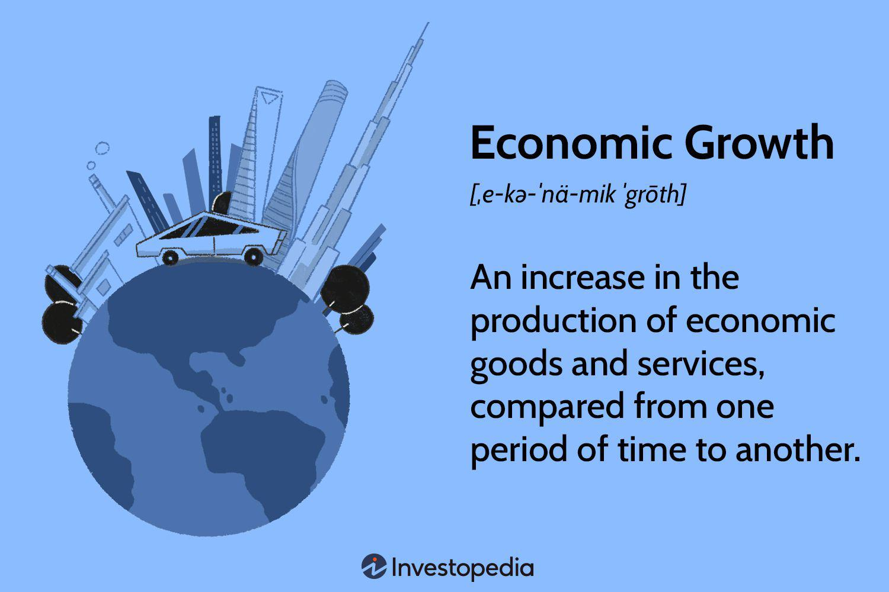

World War II was a pivotal moment not only in global politics but also profoundly affected economic history. The onset of the war was heavily influenced by economic factors that deteriorated international relations and led nations toward conflict. The economic conditions preceding World War II played a significant role in laying the groundwork for the war. These conditions included the punitive reparations imposed by the Treaty of Versailles, global economic instability manifested in events such as the Great Depression, and the resulting policy shifts toward economic nationalism and militarism.

Key economic elements shaped the landscape of the time. For instance, the harsh economic penalties inflicted on Germany through the Treaty of Versailles led to severe financial strain and political resentment, fostering an environment ripe for radical ideologies. Economic instability, particularly the hyperinflation in post-war Germany, eroded public confidence and facilitated the rise of extremist parties, including the Nazi Party, which sought economic revitalization under charismatic yet authoritarian leadership.



Additionally, the global impact of the Great Depression exacerbated these issues, as it caused worldwide economic turmoil, severely affecting countries' abilities to engage in international trade and finance. Protectionist trade policies adopted by various nations as a response to the economic downturn further isolated economies, fostering a climate of economic contraction that compelled countries like Japan and Germany to pursue expansionist policies driven by resource scarcity.

These historical economic events have implications beyond their immediate impact, informing modern financial and economic strategies, including algorithmic trading. Algorithmic trading systems use historical data to build predictive models that analyze market trends and mitigate risks, learning from the economic disruptions of the past to better navigate future uncertainties. As we examine the economic influences that contributed to World War II, we gain insights into the complexities of economic stability and its role in preserving peace. Understanding these factors is crucial as we develop future economic policies and trading systems.

## Table of Contents

## Pre-War Economic Conditions: Treaty of Versailles and Article 231

The Treaty of Versailles, signed on June 28, 1919, marked the end of World War I and sought to establish conditions of peace. However, its punitive measures against Germany sowed economic instability that contributed to the outbreak of World War II. The treaty imposed heavy reparations on Germany, amounting to $33 billion (equivalent to nearly $500 billion today), placing an enormous financial burden on the already weakened German economy. This resulted in severe economic hardship, characterized by crippling debt, inflation, and unemployment.

At the heart of the treaty's economic impact was Article 231, famously known as the 'war guilt clause.' This clause forced Germany to accept full responsibility for initiating the war, creating widespread resentment among the German populace. The clause served not only as a basis for the imposition of reparations but also as a catalyst for national humiliation and economic hardship. The German economy, struggling to pay off the reparations, saw hyperinflation erode savings and wages, leading to mounting public dissatisfaction.

The economic grievances generated by the Treaty of Versailles and Article 231 provided fertile ground for the rise of nationalist sentiments. This environment of discontent was capitalized upon by political figures such as Adolf Hitler, whose rhetoric promised a return to national prosperity and vengeance against perceived injustices. The economic conditions set by the treaty thus became a foundational grievance that fueled the nationalist and militaristic movements within Germany, ultimately playing a significant role in the lead-up to World War II.

The legacy of the Treaty of Versailles serves as a historical example of how economic policy and conditions can drastically influence political landscapes and lead to widespread conflict. Understanding these dynamics is critical in formulating sustainable economic policies to prevent similar geopolitical tensions in the future.

## Economic Crisis in Germany and the Rise of the Nazi Party

The economic turmoil in post-World War I Germany played a significant role in shaping the political landscape of the Weimar Republic, ultimately facilitating the rise of the Nazi Party. One of the most acute manifestations of this turmoil was hyperinflation, which plagued Germany during the early 1920s. The roots of this hyperinflationary period can be traced back to the Treaty of Versailles and its reparations requirements, which imposed a significant financial burden on the already struggling German economy. Unable to meet its reparations obligations through standard economic means, the Weimar government resorted to excessive money printing, causing the German mark to undergo drastic devaluation.

Hyperinflation eroded public confidence in the government and led to severe economic instability. The value of money depreciated rapidly, and basic goods became unaffordable for large segments of the population. This economic hardship created fertile ground for extremist parties to gain traction by exploiting public dissatisfaction. Amidst this environment of economic despair, Adolf Hitler and the National Socialist German Workers' Party (NSDAP) emerged as a formidable political force.

Adolf Hitler adeptly capitalized on the widespread economic woes by positioning himself as a leader capable of restoring Germany to its former glory. His rhetoric, filled with promises of economic revitalization and national rejuvenation, resonated with many Germans who felt betrayed by the political and economic elites. Hitler blamed the Weimar Republic and the Versailles Treaty for Germany's plight, providing a simple explanation for complex economic problems and offering a vision of recovery that was appealing to those suffering from economic deprivation.

The Nazi Party's rise to power was not solely the result of economic factors, but it is undeniable that the loss of economic stability was a critical element that fueled their ascent. By tapping into the pervasive economic discontent, the Nazis garnered substantial support from various socio-economic classes. This support was pivotal in their eventual success in taking control of the German government in 1933, signaling a dramatic shift in the [course](/wiki/best-algorithmic-trading-courses) of German and world history.

In conclusion, the hyperinflationary crisis and subsequent loss of economic stability played a crucial role in eroding public confidence in the Weimar Republic. This economic disarray provided Adolf Hitler with an opportunity to appeal to the German populace, offering a vision of economic recovery and national revival that ultimately contributed to the rise of the Nazi Party.

## The Great Depression's Global Impact

The Great Depression, which began in 1929, was an unprecedented global economic crisis that significantly affected all major economies, including Germany. The interconnectedness of global financial systems meant that the economic collapse in the United States had far-reaching effects, rippling across Europe and elsewhere. As the U.S. economy faltered following the stock market crash, American banks began to recall the loans they had extended to European countries, including Germany. This reduction in capital flow severely constrained European economies, amplifying Germany's economic woes.

Germany, already struggling with the burden of reparations payments imposed by the Treaty of Versailles, saw its fragile economic recovery from earlier hyperinflation collapse once more. The withdrawal of international loans, particularly from the United States, worsened economic conditions, leading to skyrocketing unemployment and a dramatic decline in industrial production. In the period between 1929 and 1932, German industrial output fell by nearly 50%, and unemployment soared, reaching close to 30% of the labor force. These dire economic circumstances fueled social unrest and political instability, which extremist parties such as the Nazis exploited.

The global economic slowdown was further compounded by protectionist trade policies that nations adopted in an attempt to safeguard their own economies, thereby exacerbating the depression. The United States enacted the Smoot-Hawley Tariff in 1930, imposing high tariffs on imports in a bid to protect domestic industry. This policy led to a retaliatory response from other countries, resulting in a drastic decline in international trade. The reduction in trade [volume](/wiki/volume-trading-strategy), combined with shrinking credit and investment, stifled any prospects for economic recovery, as countries originally reliant upon export-led growth could no longer sustain themselves.

In summary, the Great Depression's impact was multi-dimensional, rooted in both financial and policy failures that reverberated across borders. The combination of halted international loans and protectionist measures deepened Germany's economic crisis, setting a stage ripe for socio-political upheaval. The destabilized German economy ultimately became a fertile ground for radical ideologies, contributing to the preconditions for World War II.

## From Economic Contraction to Imperialism

Economic contraction in the interwar period significantly contributed to the aggressive expansionist policies of nations like Japan and Germany. The economic devastation and resource scarcity drove these countries toward militaristic and imperialistic ventures in pursuit of economic relief and strategic advantage.

In the case of Japan, the Great Depression exacerbated the vulnerability of its economy, which heavily relied on international trade. Protectionist policies by trading partners further limited Japan's access to vital resources such as oil and rubber, which were crucial for its industrial and military operations. This scarcity motivated Japan to adopt expansionist policies, exemplified by its invasion of Manchuria in 1931 and later, its broader military actions across Asia. The Japanese government perceived territorial expansion as a solution to economic and resource dilemmas, aiming to establish control over the rich natural resources of East Asia through the creation of the Greater East Asia Co-Prosperity Sphere. This expansionist policy increased regional tensions and contributed to the initiation of conflicts in the Pacific theater.

Similarly, Germany under Adolf Hitler pursued imperialism as a remedy for economic contraction. The Weimar Republic's economic crisis, compounded by the global economic depression, presented an opportunity for the Nazi regime to advocate for Lebensraum (living space) for the German people. Hitler's expansionist ideology was driven by a desire to acquire territories with abundant resources, particularly in Eastern Europe, as illustrated by the invasion of Poland in 1939. This pursuit of expansion was justified as a means to sustain Germany's economy and provide for its population, resulting in a series of military campaigns that played a pivotal role in the outbreak of World War II.

Thus, the economic needs and contractions faced by these nations fostered imperialistic endeavors, intensifying global tensions and setting the stage for World War II. The pursuit of territorial acquisition as a solution to economic woes demonstrated how deeply economic conditions can influence national policies and international relations. These aggressive policies ultimately disrupted global peace and contributed to the escalation of conflict on an unprecedented scale.

## The Intersection of Economic Theory and Warfare

World War II marked a significant turning point in economic thought and practice, as nations reoriented their economic priorities in response to the demands of total war. The conflict necessitated a radical transformation in both economic theory and policy-making, fostering innovations that have had a lasting impact on modern economic systems.

During the war, the mobilization of resources on an unprecedented scale prompted economists and policymakers to develop new approaches to economic planning. The wartime economy demanded efficient allocation and utilization of resources, leading to the emergence of advanced planning and optimization techniques. One such method, known as activity analysis, was pioneered by economists like Tjalling Koopmans and involved using linear programming to optimize resource allocation in production processes. This method sought to determine the best way to allocate limited resources to achieve desired outcomes, laying the groundwork for modern optimization models used in today's financial markets.

The war also accelerated government involvement in economic management, leading to the development of macroeconomic theories and policies that would shape the post-war economic order. Keynesian economics, which advocated for active government intervention to manage economic cycles, gained prominence as governments sought to stabilize economies and maintain full employment during and after the war. This theoretical framework influenced policies that supported economic recovery and growth in the post-war period.

Furthermore, the wartime experience highlighted the importance of coordinated economic planning and international cooperation. This realization led to the establishment of institutions like the International Monetary Fund (IMF) and the World Bank, designed to promote global economic stability and development. These institutions continue to play a crucial role in the international economic landscape.

The period also saw the refinement of existing economic theories and the development of new ones that addressed the complexities of modern economies. Concepts such as input-output analysis, developed by Wassily Leontief, provided a systematic approach to understanding inter-industry relationships and the interconnectedness of economic activities. This analytical tool has since become integral to economic planning and analysis, influencing sectors such as logistics, supply chain management, and trade policy.

In summary, World War II reshaped economic theory and practice by driving innovation in resource allocation and optimization, enhancing government involvement in economic management, and fostering international cooperation. These developments have had enduring impacts on economic planning and policy, informing the strategies and tools used in today's financial markets.

## Algorithmic Trading: Learning from Economic History

Algorithmic trading, which utilizes computer algorithms to execute financial transactions at high speeds and volumes, is significantly shaped by historical economic events, including the crises and upheavals witnessed during World War II. These historical episodes provide valuable data and insights that inform the development of sophisticated risk management models used in [algorithmic trading](/wiki/algorithmic-trading) today.

Understanding the causes and consequences of economic crises, such as those during World War II, is crucial for developing robust risk management frameworks. Economists and quantitative analysts examine the financial instability of the past to identify patterns and indicators that precede economic downturns. For instance, the hyperinflation experienced in the Weimar Republic and the global economic contraction during the Great Depression offer critical lessons on market [volatility](/wiki/volatility-trading-strategies) and systemic risks.

Today's traders employ quantitative methods to predict market movements, drawing lessons from these historical events. By analyzing vast datasets from past financial crises, traders can develop predictive models that estimate the likelihood of future market fluctuations. Techniques like time series analysis and [machine learning](/wiki/machine-learning) algorithms are widely used to model and forecast economic dynamics. A common approach involves the use of regression models to analyze historical price data:

```python
import numpy as np
import pandas as pd
from sklearn.linear_model import LinearRegression

# Load historical price data
data = pd.read_csv('historical_prices.csv')
X = data[['Previous_Price', 'Volatility', 'Volume']].values
y = data['Current_Price'].values

# Fit regression model
model = LinearRegression()
model.fit(X, y)

# Predict future prices
predicted_prices = model.predict(X)
```

By applying these techniques, traders can make informed decisions based on statistical probabilities rather than speculation. These quantitative models incorporate risk factors identified during past economic crises to manage current and future risks effectively. Traders utilize these insights to build strategies that are resilient to potential economic upheavals.

Algorithmic trading strategies also involve stress testing, where scenarios based on historical economic downturns are simulated to evaluate the robustness of trading models. This helps ensure that trading algorithms can withstand market shocks similar to those that occurred during WWII.

In conclusion, historical economic events, particularly those around World War II, continue to guide and enrich the practices of algorithmic trading. By incorporating lessons from the past, traders and financial institutions can enhance the resilience and performance of their trading systems in a complex and ever-evolving market environment.

## Conclusion

World War II's economic conditions highlight the importance of economic stability as a foundation for peace. The conflict underscored how economic vulnerabilities and disparities can catalyze global tensions and unrest. Central to the economic landscape of the war were factors such as the Treaty of Versailles, hyperinflation, protectionism, and the resulting nationalist movements—all of which contributed to the outbreak of hostilities. These conditions serve as a poignant reminder of the intricate relationship between economic stability and global harmony.

As the world seeks to avoid repeating the mistakes of the past, lessons from history become integral to developing sustainable economic policies. By understanding the economic triggers of World War II, policymakers can devise strategies that bolster stability, prevent economic crisis, and promote equitable growth. Moreover, in the financial sector, historical insights drive innovation in trading systems, most notably in algorithmic trading where data-driven approaches predict market trends and assess risks.

Algorithmic trading illustrates how historical economic events shape modern financial practices. By analyzing past economic crises and their repercussions, traders develop risk management models aimed at preempting potential market disruptions. Techniques such as quantitative analysis and machine learning algorithms allow for the anticipation of economic shifts, thereby safeguarding financial systems against volatility.

Modern advancements in economic theory likewise owe much to the economic trials of World War II. The war prompted the development of economic planning tools such as activity analysis and optimization models, laying the groundwork for contemporary economic policies. As these tools evolve, they continue to be informed by insights garnered from past economic conditions, contributing to the resilience and adaptability of today's global economy.

In summary, the economic conditions surrounding World War II underscore the critical role of economic stability in maintaining peace and order. By learning from history, we can forge sustainable economic frameworks and advanced trading mechanisms, decreasing the likelihood of future conflicts arising from economic disarray. These insights not only help in avoiding past pitfalls but also enhance our capacity to navigate the complexities of the modern economic landscape.

## References & Further Reading

[1]: Keynes, J. M. (1936). ["The General Theory of Employment, Interest, and Money."](https://link.springer.com/book/10.1007/978-3-319-70344-2) Palgrave Macmillan.

[2]: Tooze, A. (2007). ["The Wages of Destruction: The Making and Breaking of the Nazi Economy."](https://onlinelibrary.wiley.com/doi/10.1111/j.1468-0289.2007.00384_14.x) Viking.

[3]: Eichengreen, B. (1992). ["Golden Fetters: The Gold Standard and the Great Depression, 1919-1939."](https://academic.oup.com/book/36016) Oxford University Press.

[4]: Goldstein, J. S. (1991). ["A Study of Exogenous Factors and War in Nations."](https://scholar.google.com/citations?user=srVso8AAAAAJ&hl=en) Journal of Peace Research.

[5]: Ferguson, N. (1999). ["The Pity of War: Explaining World War I."](https://www.amazon.com/Pity-War-Explaining-World/dp/0465057128) Basic Books.

[6]: Eichengreen, B., & Irwin, D. A. (1995). ["Trade Blocs, Currency Blocs and the Reorientation of Trade in the 1930s."](https://www.sciencedirect.com/science/article/pii/002219969592754P) Journal of International Economics. 

[7]: Keynes, J. M. (1920). ["The Economic Consequences of the Peace."](http://files.libertyfund.org/files/303/Keynes_0550_EBk_v6.0.pdf) Harcourt, Brace and Howe.