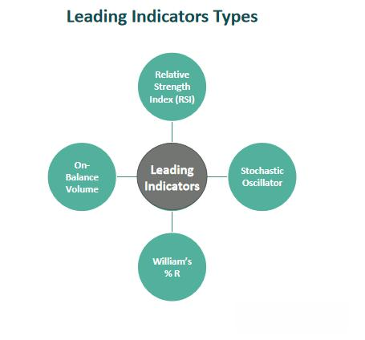

Economic forecasting is a crucial process involving the prediction of future economic conditions through the analysis of key economic indicators. These indicators, such as GDP growth, inflation rates, and unemployment figures, provide valuable insights that are fundamental to various economic decisions. This article examines how these indicators are applied in algorithmic trading, where predictive models and real-time data are utilized to inform trading strategies.

Economic forecasting is significant because it assists policymakers, investors, and businesses in making informed decisions. Policymakers use forecasts to manage economic policies, aiming to stabilize the economy and promote growth. For investors, economic forecasts can indicate whether an economy is heading towards recession or expansion, allowing them to adjust their strategies accordingly. Businesses rely on these forecasts to make decisions on expansion, hiring, and pricing strategies, all of which impact their competitiveness and profitability.



Despite its importance, economic forecasting presents numerous challenges. The complexity and unpredictability of economic factors make accurate forecasting a difficult task. Economic systems are dynamic and influenced by a myriad of factors including political events, natural disasters, and technological advances. These factors introduce a level of uncertainty that makes economic forecasting an inherently challenging endeavor. However, advancements in data analysis and predictive modeling continue to improve the accuracy and reliability of economic forecasts.

## Table of Contents

## Understanding Economic Forecasting

Economic forecasting involves the systematic prediction of future economic conditions through the analysis of historical data and evaluation of current economic indicators. This process is integral to understanding potential economic shifts, which can assist policymakers, investors, and business leaders in making informed decisions. Forecasting relies heavily on a variety of statistical models and analytical tools that translate data into actionable insights about future economic trends.

**Key Economic Indicators**

Key economic indicators play a crucial role in the forecasting process as they provide measurable variables influencing the economy's trajectory. Among the most influential indicators are Gross Domestic Product (GDP) growth, inflation rates, unemployment rates, and consumer confidence:

- **GDP Growth**: GDP is a comprehensive measure of a nation's overall economic activity. Changes in GDP offer insights into economic expansion or contraction, making it a critical indicator for forecasting economic health.

- **Inflation**: Measuring the rate at which the general level of prices for goods and services is rising, inflation affects purchasing power and economic stability. Accurate forecasting of inflation helps in monetary policy formulation and economic planning.

- **Unemployment Rates**: The level of unemployment is a lagging indicator that provides information about the economy's past performance. However, understanding trends in employment data is vital for anticipating economic recovery or downturn.

- **Consumer Confidence**: Reflecting how optimistic consumers are about the economy's present and future, changes in consumer confidence can signal shifts in spending behaviors, influencing economic forecasts.

**Forecasting Models and Statistical Tools**

Economic forecasting employs a range of models and statistical techniques, each selected based on the analysis scope and the indicator in question. Common methodologies include:

- **Time Series Analysis**: This approach involves modeling and forecasting the future value of a variable based on its past behavior over time. Methods such as ARIMA (Auto-Regressive Integrated Moving Average) models are frequently employed.

- **Econometric Models**: These models use statistical techniques to quantify relationships between economic variables. For instance, multiple regression models might predict GDP growth based on variables like interest rates and government spending.

- **Computational Algorithms**: Advanced algorithms, often rooted in machine learning, are applied to identify patterns in large datasets. Such predictive models can adjust to new data dynamically, improving forecasting accuracy.

Python implementation of a simple time series forecast using ARIMA could look like this:

```python
import pandas as pd
from statsmodels.tsa.arima.model import ARIMA

# Load the economic data
data = pd.read_csv('economic_data.csv')  # Assumes a CSV with a datetime index and target variable

# Fit ARIMA model
model = ARIMA(data['GDP'], order=(1, 1, 1))  # Example order parameters for ARIMA
fit_model = model.fit()

# Forecasting future values
forecast = fit_model.forecast(steps=10)  # Forecast for 10 future periods
print(forecast)
```

**Assessing Impact on Trends**

The ultimate goal of economic forecasting is to evaluate the potential impacts of these indicators on macroeconomic trends. Understanding these dynamics enables stakeholders to develop adaptive strategies in policy and business. The complexity of economic systems, however, makes precise forecasting challenging. As such, continuous refinement of models and incorporation of real-time data are essential to enhancing forecast reliability and utility.

## Key Economic Indicators

Economic indicators are vital statistical measures that provide insight into the health and direction of an economy. These indicators are categorized into three main types: leading, lagging, and coincident indicators. Each category serves a distinct purpose in understanding and predicting economic trends.

**Leading Indicators**

Leading indicators are predictive in nature, offering foresight into future economic activity. They typically change before the economy as a whole changes, thus serving as early signals of economic turning points. An example of a leading indicator is stock market returns, which reflect investor sentiment about future business conditions. Other common leading indicators include new business startups, consumer sentiment indexes, and building permits. These indicators are valuable for anticipating economic upswings or downturns, although they are not always precise. 

Leading indicators can be quantified using various statistical and econometric models to predict future economic performance. An example formula often used in creating a composite leading indicator is:
$$
\text{CLI}_t = \sum_{i=1}^n w_i \cdot I_{it}
$$
where $\text{CLI}_t$ is the composite leading indicator at time $t$, $w_i$ are the weights assigned to each individual indicator $I_{it}$, based on their predictive power and reliability.

**Lagging Indicators**

Lagging indicators confirm economic trends that have already been established. These indicators typically change after the economy has begun to follow a particular path, thus serving to validate or invalidate economic forecasts. A traditional example of a lagging indicator is the unemployment rate, which often remains high even after the economy begins to recover from a recession. Other lagging indicators include inflation rates, corporate profits, and labor costs. These measurements help confirm ongoing economic patterns, aiding in the adjustment of strategies and policies.

**Coincident Indicators**

Coincident indicators provide real-time assessments of an economy's current state. These indicators move in tandem with the overall economy, offering a snapshot of its current conditions. A key example of a coincident indicator is GDP, which tracks the total output of goods and services. Additional coincident indicators include personal income levels, industrial production, and sales figures. Monitoring coincident indicators is crucial for assessing ongoing economic health and making immediate decisions.

These three categories of economic indicators play a crucial role in economic analysis, offering different perspectives that help economists, policymakers, and analysts interpret past trends, assess the present economic condition, and forecast future economic scenarios. Each type of indicator serves its purpose by fitting within a broader analytical framework designed to enhance both the understanding and management of economic activities.

## Example of Economic Forecasting

A practical example of economic forecasting can be illustrated through the prediction of GDP growth employing time series analysis. Time series analysis involves the use of statistical tools and models to analyze data points collected or recorded at specific time intervals. The fundamental objective is to identify patterns or trends in historical data, which can then be extrapolated to make future predictions.

In the context of predicting GDP growth, one might utilize historical GDP figures, alongside key economic indicators such as industrial production, retail sales, and employment rates. These indicators are often selected based on their historical correlation with economic growth. The process typically starts with data preprocessing to ensure cleanliness and consistency, which might include adjusting for inflation or converting to a common currency if analyzing data from multiple countries.

An effective model for this task is the Autoregressive Integrated Moving Average (ARIMA) model, which is particularly suited for time series data that demonstrate trends and seasonality. The ARIMA model combines three components: autoregression (AR), differencing (I), and moving average (MA). The AR component regresses the variable on its own lagged values, the I component involves differencing the data to achieve stationarity, and the MA component accounts for the relationship between an observation and a residual error from a moving average model applied to lagged observations.

Here's a simplified example of how ARIMA might be implemented in Python:

```python
import pandas as pd
from statsmodels.tsa.arima.model import ARIMA

# Assume 'data' is a pandas DataFrame with a column 'GDP_growth'
# where the index is a DateTime index of the data points.

# Differencing to achieve stationarity
data['GDP_growth_diff'] = data['GDP_growth'].diff().dropna()

# Define the ARIMA model
model = ARIMA(data['GDP_growth_diff'].dropna(), order=(1, 1, 1)) # 'p', 'd', 'q' parameters
model_fit = model.fit()

# Forecast future GDP growth
forecast = model_fit.forecast(steps=12) # forecast for 12 time periods
print(forecast)
```

In addition to time series models, simulation of future market scenarios using leading indicators can enhance the forecast's accuracy. For instance, the incorporation of stock market returns, interest rates predictions, or consumer confidence indices can help simulate potential scenarios in the economic landscape.

These forecasts are integral to businesses and policymakers as they engage in strategic planning and decision-making. By providing insights into potential economic trajectories, firms can optimize inventory levels, manage investment portfolios, and adjust pricing strategies, while policymakers might use the forecasts to shape fiscal and monetary policies. Ultimately, an informed prediction of GDP growth aids in navigating economic uncertainties and capitalizing on emerging opportunities.

## Algorithmic Trading and Economic Indicators

Algorithmic trading, often referred to as algo trading, is a method of executing orders using automated, pre-programmed trading instructions that account for variables such as time, price, and [volume](/wiki/volume-trading-strategy). A significant aspect of [algorithmic trading](/wiki/algorithmic-trading) is its reliance on economic indicators to forecast market movements. These indicators provide critical insights into the broader economic landscape, which can significantly impact asset prices and market trends. 

One of the fundamental ways algorithmic trading utilizes economic indicators is through predictive models. These models analyze historical data to inform trading decisions. By processing past market data and economic indicators such as GDP growth rates, unemployment figures, inflation [statistics](/wiki/bayesian-statistics), and consumer confidence indices, traders can develop algorithms that predict future price movements. For example, a linear regression model or more complex [machine learning](/wiki/machine-learning) algorithms, such as random forests or support vector machines (SVMs), might be used to identify patterns and relationships within the data, offering forecasts that can dictate the buying or selling of financial instruments.

In addition, real-time data integration is crucial for enhancing trading strategies in algorithmic trading. With advancements in technology, there is an increasing ability to collect and process data instantaneously. This capability allows trading algorithms to respond immediately to economic changes. For instance, high-frequency trading ([HFT](/wiki/high-frequency-trading-strategies)) platforms utilize real-time data feeds to make trading decisions within milliseconds, adapting to dynamic market conditions as soon as economic indicators are released. This immediacy enables traders to exploit short-term inefficiencies in the market, maximize returns, and minimize exposure to risk.

Incorporating these elements into algorithmic trading strategies can significantly enhance their effectiveness. For instance, a Python-based trading algorithm might use the pandas library to collect and manipulate real-time economic data, employing the sklearn library for developing predictive models:

```python
import pandas as pd
from sklearn.model_selection import train_test_split
from sklearn.ensemble import RandomForestRegressor

# Load dataset containing economic indicators
data = pd.read_csv('economic_indicators.csv')

# Define features and target variable
features = data[['GDP_growth', 'Inflation', 'Unemployment', 'Consumer_confidence']]
target = data['Stock_market_returns']

# Split the data into training and test sets
X_train, X_test, y_train, y_test = train_test_split(features, target, test_size=0.2, random_state=42)

# Develop a predictive model using Random Forest
model = RandomForestRegressor(n_estimators=100, random_state=42)
model.fit(X_train, y_train)

# Predict stock market returns using test data
predictions = model.predict(X_test)
```

This example illustrates how economic indicators can be integrated into algorithmic models to forecast market movement. By leveraging both historical data and real-time updates, traders can optimize their strategies, maintaining a competitive edge in volatile markets.

## Challenges in Economic Forecasting and Algo Trading

Economic forecasting, despite its critical importance, is fraught with challenges that stem from data limitations and unforeseen events. These challenges impact the accuracy and reliability of forecasts, which can, in turn, affect decision-making processes across various sectors.

Data limitations present a significant hurdle. Quality and completeness of data are vital for accurate forecasts; however, economic data often suffer from issues such as sampling errors, reporting delays, and revisions. These limitations can introduce noise and bias, skewing the results of predictive models. For instance, Gross Domestic Product (GDP) figures—widely used in forecasting—are typically revised multiple times post-release as more accurate data becomes available.

Unforeseen events further complicate forecasting efforts. Economic models generally derive predictions from historical data, assuming that future events will mirror past patterns. However, unanticipated disruptions—such as financial crises, geopolitical tensions, or natural disasters—can lead to significant deviations from these predictions. The 2008 financial crisis is a pertinent example where existing models could not predict the severity of the economic downturn.

Algorithmic trading, while benefiting from advanced analytics and high-frequency data, faces its own set of challenges. One critical issue is data integrity. Algorithms rely on high-quality, real-time data to execute trades effectively. Any inaccuracies or lags in data can lead to suboptimal trading decisions, potentially incurring significant financial losses.

Market unpredictability poses another challenge to algorithmic trading. Financial markets are inherently volatile, influenced by countless factors that models may not fully encapsulate. Rapid fluctuations in market conditions can render existing algorithms inadequate, necessitating constant refinement and adaptation of trading strategies.

To mitigate these challenges, strategies such as diversification and sensitivity analysis are employed. Diversification involves spreading investments across a range of financial instruments to reduce exposure to any single economic event's adverse effects. Sensitivity analysis, on the other hand, assesses the impact of variations in key economic indicators on trading outcomes, helping traders understand potential vulnerabilities in their strategies.

In Python, sensitivity analysis can be performed by simulating various scenarios and observing the resultant changes in portfolio performance. For example:

```python
import numpy as np

# Example sensitivity analysis for a portfolio based on varying interest rates
interest_rates = np.linspace(0.01, 0.05, num=5)  # Different interest rate scenarios
portfolio_returns = []

for rate in interest_rates:
    # Dummy formula for portfolio return affected by interest rate
    return_rate = 0.03 + (0.5 * rate)
    portfolio_returns.append(return_rate)

print("Interest Rates:", interest_rates)
print("Portfolio Returns:", portfolio_returns)
```

This script demonstrates how varying interest rates can affect a portfolio's returns, providing insight into the sensitivity of the portfolio to changes in economic conditions.

Overall, economic forecasting and algorithmic trading engage with complex and dynamic systems, necessitating robust models and adaptive strategies. By acknowledging and addressing these challenges, forecasters and traders can enhance decision-making processes and better navigate the uncertainties inherent in economic and financial environments.

## Conclusion

Economic indicators serve as essential tools in forecasting economic conditions and formulating trading strategies. These indicators, derived from key economic metrics such as GDP growth, inflation, and unemployment rates, enable investors and policymakers to make informed predictions about future market dynamics. The integration of these indicators into algorithmic trading systems represents a significant advancement in the financial sector. By leveraging predictive models that assess historical data and current economic conditions, algorithmic trading platforms enhance decision-making processes and manage investment risk more effectively.

The evolution of data analysis techniques plays a critical role in enhancing the precision and reliability of economic forecasts. Machine learning algorithms and statistical modeling are employed to analyze vast datasets, uncovering patterns and trends that might be invisible through traditional analysis. For example, regression analysis and time series models are commonly used to predict future economic conditions. These models benefit from improvements in computational power and data availability, enabling them to generate more accurate forecasts. A typical regression model might be expressed as:

$$
Y_t = \alpha + \beta X_t + \epsilon_t
$$

where $Y_t$ represents the economic indicator being predicted, $X_t$ denotes predictor variables, $\alpha$ and $\beta$ are coefficients, and $\epsilon_t$ is the error term.

Moreover, real-time data integration in algorithmic trading allows for immediate adjustments to trading strategies in response to dynamic market conditions. This capability supports traders in capitalizing on emerging opportunities and mitigating potential risks, ensuring a robust response to market [volatility](/wiki/volatility-trading-strategies). The adaptability of algorithmic systems in processing and reacting to instant data enhances their utility in today's fast-paced trading environment.

As these technological capabilities continue to advance, the accuracy and effectiveness of economic forecasts are expected to improve, providing more reliable guidance for trading strategies. This progress underscores the critical role of economic indicators in both traditional forecasting and cutting-edge trading technologies, emphasizing their importance in the finance industry's pursuit of enhanced predictive accuracy and strategic planning.

## References & Further Reading

[1]: Stock, J.H., & Watson, M.W. (2001). ["Vector Autoregressions."](https://www.princeton.edu/~mwatson/papers/Stock_Watson_JEP_2001.pdf) Journal of Economic Perspectives, 15(4), 101-115.

[2]: Elliott, G., Granger, C.W.J., & Timmermann, A. (2006). ["Handbook of Economic Forecasting."](https://www.sciencedirect.com/handbook/handbook-of-economic-forecasting/vol/1/suppl/C) Elsevier.

[3]: Hamilton, J.D. (1994). ["Time Series Analysis."](https://archive.org/details/timeseriesanalys0000hami) Princeton University Press.

[4]: Diebold, F.X. (2015). ["Forecasting in Economics, Business, Finance and Beyond: The Unifying Role of Latent Variables and Predictive Densities."](https://www.sciencedirect.com/science/article/pii/S0165176524005366) Journal of Economic Perspectives, 29(3), 33-52.

[5]: Lopez de Prado, M. (2018). ["Advances in Financial Machine Learning."](https://www.amazon.com/Advances-Financial-Machine-Learning-Marcos/dp/1119482089) Wiley.

[6]: Engle, R.F. (2001). ["GARCH 101: The Use of ARCH/GARCH Models in Applied Econometrics."](https://www.aeaweb.org/articles?id=10.1257/jep.15.4.157) Journal of Economic Perspectives, 15(4), 157-168. 

[7]: Box, G.E.P, & Jenkins, G.M. (1976). ["Time Series Analysis: Forecasting and Control."](https://www.semanticscholar.org/paper/Time-Series-Analysis%3A-Forecasting-and-Control-Box-Jenkins/95f3a22272b0ce87f6cf85dd6e1026e4a5c0aeba) Holden-Day.