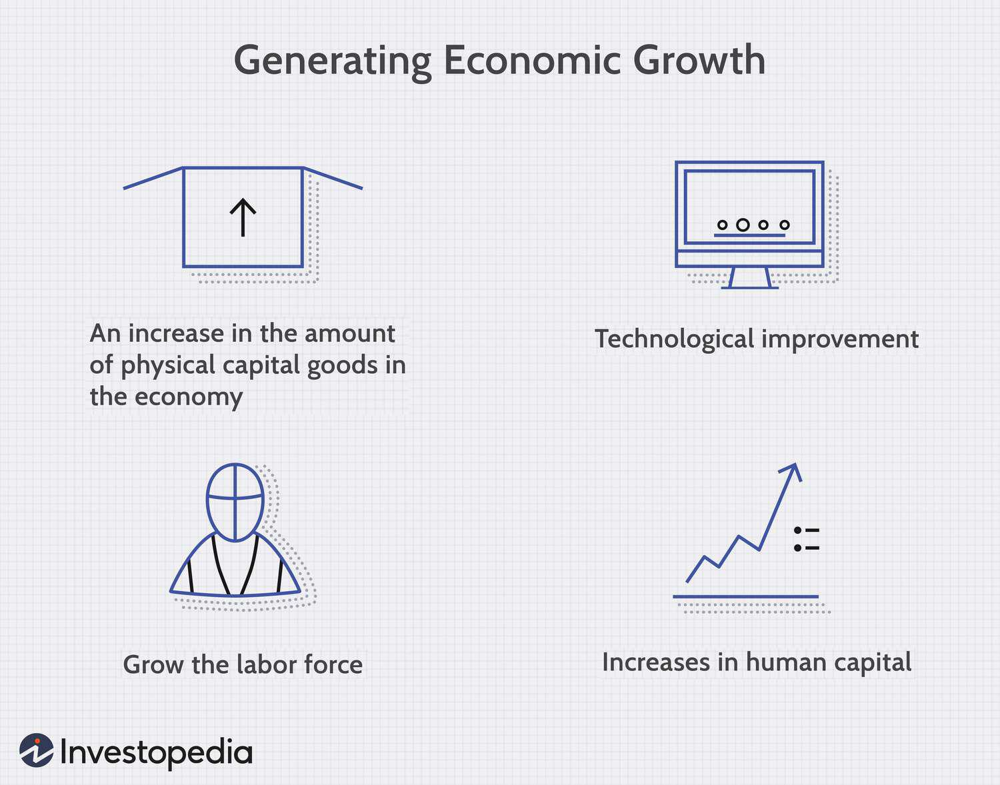

## Table of Contents

## What is economic growth?

Economic growth is when a country's economy gets bigger over time. It means that the country is making more goods and services, and people are usually better off. We measure economic growth by looking at the Gross Domestic Product (GDP), which is the total value of everything produced in a country in a year. When GDP goes up, it shows that the economy is growing.

Economic growth is important because it can lead to more jobs and higher incomes for people. When businesses grow, they often need more workers, which means less unemployment. Also, when people earn more money, they can buy more things and have a better standard of living. However, economic growth can also have some downsides, like pollution and using up natural resources too quickly. So, it's important for countries to try to grow their economies in a way that is good for both people and the planet.

## How is economic growth measured?

Economic growth is measured mainly by looking at the Gross Domestic Product (GDP). GDP is the total value of all the goods and services made in a country during a year. If the GDP goes up from one year to the next, it means the economy is growing. People often look at the percentage change in GDP to see how fast the economy is growing. For example, if the GDP was $100 billion last year and $105 billion this year, the economy grew by 5%.

There are other ways to measure economic growth too. One way is to look at the Gross National Product (GNP), which is similar to GDP but includes income from abroad. Another way is to measure the growth in people's income or the number of jobs in the country. Sometimes, economists also look at things like how much people are spending, how much businesses are investing, and how much the government is spending. All these measures help give a fuller picture of how the economy is doing.

## What is Gross Domestic Product (GDP) and how does it relate to economic growth?

Gross Domestic Product, or GDP, is the total value of all the goods and services produced in a country in a year. It's like adding up everything that people buy, from food and clothes to cars and houses, and all the services like haircuts and doctor visits. GDP is a big number that helps us understand how much a country's economy is producing.

GDP is closely related to economic growth. When the GDP of a country goes up from one year to the next, it means the economy is growing. For example, if a country's GDP was $1 trillion last year and $1.05 trillion this year, the economy grew by 5%. This growth shows that the country is making more things and providing more services, which usually means more jobs and higher incomes for people. So, by looking at changes in GDP, we can see if the economy is getting bigger or smaller over time.

## What are the different methods of calculating GDP?

There are three main ways to calculate GDP: the production approach, the income approach, and the expenditure approach. The production approach adds up the value of all the goods and services produced in the country. It looks at the output of different industries like farming, manufacturing, and services. To avoid counting the same thing twice, it only counts the value added at each stage of production.

The income approach adds up all the income earned in the country. This includes wages for workers, profits for businesses, and taxes minus subsidies. It's based on the idea that all the money made from producing goods and services ends up as income for someone. The expenditure approach adds up all the spending in the country. This includes what people spend on things like food and cars, what businesses spend on things like machines, what the government spends, and the difference between what a country exports and imports. All these approaches should give the same total GDP, just looked at from different angles.

## What are the limitations of using GDP as a measure of economic growth?

GDP is a good way to measure how much a country is making and selling, but it has some problems. One big problem is that GDP doesn't show how fair the wealth is spread out among people. A country might have a high GDP, but if a few people have most of the money, many others might still be poor. Also, GDP doesn't count the work people do at home, like cooking and cleaning, because no money changes hands. So, it misses out on a lot of important work that people do.

Another issue is that GDP doesn't tell us about the health of the environment. If a country cuts down a lot of trees or pollutes the air and water to make more things, the GDP might go up, but the country might be worse off in the long run. Also, GDP doesn't measure how happy or satisfied people are with their lives. Just because a country is making more things doesn't mean people are happier. So, while GDP is useful, it doesn't give us the whole picture of how well a country and its people are doing.

## How do economic indicators other than GDP reflect economic growth?

Other economic indicators, like unemployment rates and personal income, can show us how the economy is growing in ways that GDP can't. When the economy grows, businesses often need more workers, so the unemployment rate might go down. This means more people have jobs, which is a good sign of economic growth. Also, if people's incomes are going up, it means they are earning more money, which is another way to see if the economy is doing well. These indicators can give us a clearer picture of how well people are doing, not just how much stuff the country is making.

Another important indicator is the Consumer Price Index (CPI), which measures how much prices are going up or down. If prices are going up a lot, it might mean that the economy is growing too fast, which can lead to inflation. On the other hand, if prices aren't changing much, it might mean the economy is stable. Also, looking at how much businesses are investing can tell us about economic growth. If businesses are spending more money on new machines and buildings, it shows they are confident about the future and expect the economy to keep growing.

## What is the difference between nominal and real GDP?

Nominal GDP is the total value of all goods and services produced in a country in a year, using the current prices. It's like adding up everything people buy and sell right now. If prices go up, nominal GDP will go up too, even if the amount of stuff made stays the same. So, nominal GDP can be tricky because it doesn't tell us if the economy is really making more things or if things just cost more.

Real GDP, on the other hand, adjusts for changes in prices. It uses a base year's prices to measure the value of goods and services, so we can see how much the economy is actually growing. If real GDP goes up, it means the country is making more stuff, not just that prices are higher. Real GDP gives us a better idea of true economic growth because it takes out the effect of inflation.

## How do inflation and deflation affect the measurement of economic growth?

Inflation and deflation can make it hard to measure economic growth accurately. Inflation is when prices go up over time. If we only look at nominal GDP, which uses current prices, it might seem like the economy is growing a lot. But if prices are just higher, the economy might not be making more stuff. That's why we use real GDP, which adjusts for inflation. Real GDP shows us the true growth by using prices from a base year, so we can see if the economy is really getting bigger.

Deflation is the opposite of inflation, when prices go down over time. If deflation happens, nominal GDP might go down even if the economy is making the same amount of stuff. This can make it look like the economy is shrinking when it's not. Again, real GDP helps us see the real picture by adjusting for these price changes. So, to understand economic growth properly, we need to look at real GDP to see past the effects of inflation and deflation.

## What role do economic policies play in fostering economic growth?

Economic policies are like rules and plans that governments make to help their countries grow. These policies can do things like make it easier for businesses to start and grow, build roads and schools, and help people find jobs. For example, if the government lowers taxes, businesses might have more money to spend on new machines or to hire more workers. This can make the economy grow because more people are working and making things. Also, if the government spends money on building roads, it can help businesses move their goods around more easily, which can also help the economy grow.

Another important part of economic policies is making sure that money is used in a good way. If the government keeps inflation low, it means that prices don't go up too fast, which can help people and businesses plan better. Also, if the government helps people learn new skills through education and training, more people can get better jobs. This can make the economy grow because people are earning more money and spending it on things they need. So, good economic policies can really help a country's economy get bigger and better over time.

## How does economic growth impact income inequality?

Economic growth can affect income inequality in different ways. When the economy grows, it can create more jobs and higher incomes for people. If everyone gets a fair share of this growth, income inequality might go down. For example, if new jobs are created in many different industries and pay well, more people might earn enough money to live comfortably. This can help close the gap between the rich and the poor.

However, economic growth can also make income inequality worse if the benefits are not shared equally. Sometimes, the rich get most of the gains from growth, while the poor and middle class see little change. For example, if only high-tech companies grow and pay their workers a lot, but other jobs don't see much improvement, the rich might get richer while others stay the same. So, it's important for governments to make sure that economic growth helps everyone, not just a few people at the top.

## What are the theories of economic growth and how do they differ?

There are several theories about how economies grow. One famous theory is the Classical Growth Theory, which says that as more people work and more machines are used, the economy grows. But, it also says that after a while, the economy stops growing because there isn't enough new land or resources. Another theory is the Neoclassical Growth Theory, which focuses on how saving and investing money can make the economy grow. It says that if people save more money, businesses can use it to buy new machines, which helps the economy grow faster.

Another important theory is the Endogenous Growth Theory, which looks at how new ideas and technology can make the economy grow without stopping. It says that if people keep coming up with new inventions and better ways of doing things, the economy can keep growing. This is different from the classical and neoclassical theories because it doesn't think the economy will stop growing. Finally, there's the Keynesian Growth Theory, which focuses on how government spending and helping people during tough times can keep the economy growing. It says that if the government spends money on things like roads and schools, it can create jobs and help the economy grow.

These theories all try to explain how economies grow, but they look at different things. The Classical and Neoclassical theories focus on how much people work and save, while the Endogenous Growth Theory looks at new ideas and technology. The Keynesian theory focuses on what the government can do to help. Each theory has its own way of thinking about economic growth, and they can all help us understand how to make economies bigger and better.

## How can sustainable development be integrated into the measurement of economic growth?

Sustainable development means making sure that the economy grows in a way that is good for people and the planet, both now and in the future. To measure this, we need to look at more than just the Gross Domestic Product (GDP). GDP tells us how much a country is making and selling, but it doesn't show if that growth is harming the environment or if everyone is getting a fair share of the benefits. So, to include sustainable development, we need to use other measures like the Human Development Index (HDI), which looks at things like health, education, and living standards. We can also use the Genuine Progress Indicator (GPI), which takes into account things like pollution and income inequality to give a better picture of how well a country is doing.

One way to integrate sustainable development into economic growth measurements is by using the concept of green GDP. Green GDP tries to adjust the regular GDP by taking away the costs of environmental damage. For example, if a country cuts down a lot of trees to build more houses, the green GDP would subtract the value of those lost trees. This helps us see if the economy is growing in a way that is good for the environment. Another way is to focus on social indicators, like how happy people are or how equal the society is. By looking at these things alongside economic growth, we can make sure that the growth is helping everyone and not just making things worse for the planet.

## How does Gross Domestic Product relate to Economic Growth?

Gross Domestic Product (GDP) stands as a cornerstone of economic analysis, reflecting the total value of goods and services produced within a nation's borders over a specific period, typically a year or a quarter. GDP serves as the primary metric for assessing a country’s economic performance and growth, offering insights into the scale and health of an economy.

The calculation of GDP can be approached through three distinct methods: the production approach, the expenditure approach, and the income approach, each providing unique perspectives on the value generation within an economy.

1. **Production Approach**: This method, also known as the output method, calculates GDP by adding the value of all goods and services produced in the economy, after deducting the value of intermediate consumption. It focuses primarily on the value added at each stage of production, which contributes to a comprehensive picture of economic outputs.

2. **Expenditure Approach**: The most commonly used method globally, this approach calculates GDP by summing up all expenditures made in the economy. The formula for GDP through the expenditure approach is:
$$
   \text{GDP} = C + I + G + (X - M)

$$
   where $C$ represents consumption, $I$ stands for investment, $G$ symbolizes government spending, and $(X - M)$ denotes net exports (exports minus imports).

3. **Income Approach**: This method calculates GDP by aggregating all incomes earned by individuals and businesses in the economy, including wages, profits, rents, and taxes, minus subsidies. It reflects the distribution of earned income across different economic agents and sectors.

While GDP serves as an essential indicator of economic activity, it has inherent limitations. It does not account for income distribution disparities, environmental degradation, or activities in the informal economy, which can skew perceptions of overall economic well-being. For instance, GDP growth might mask underlying social inequality if economic gains are not equitably shared among the population.

Moreover, GDP overlooks environmental costs and sustainability concerns, as it emphasizes quantitative output over qualitative improvement. Activities causing environmental harm may contribute positively to GDP figures despite having detrimental long-term impacts on ecological and societal health.

To achieve a more comprehensive understanding of economic health, GDP should be considered alongside alternative metrics. Gross National Product (GNP) offers a broader perspective by encompassing the total economic output by a nation’s residents, regardless of their geographical location. Additionally, productivity metrics, such as total [factor](/wiki/factor-investing) productivity, and well-being indices, such as the Human Development Index (HDI), can provide essential context to GDP figures, offering a holistic view of both economic performance and societal progress.

In summary, while GDP remains a fundamental measure of national economic performance, its limitations necessitate the inclusion of supplementary indicators to accurately gauge economic and societal health.

## What are the Key Indicators for Economic Pulse?

Economic indicators serve as pivotal tools for assessing the health and trajectory of an economy, providing valuable insights beyond the basic metrics such as Gross Domestic Product (GDP). Key among these indicators are the Consumer Price Index (CPI), Producer Price Index (PPI), and unemployment rates.

The Consumer Price Index (CPI) is crucial for gauging inflation, reflecting the average change over time in the prices paid by urban consumers for a basket of goods and services. It is calculated using the formula:

$$
\text{CPI} = \frac{\text{Cost of Market Basket in a Given Year}}{\text{Cost of Market Basket in Base Year}} \times 100
$$

This index is instrumental for policymakers and businesses alike, as it influences monetary policy, cost of living adjustments, and financial market predictions. Rising CPI values indicate increasing inflation, which can erode purchasing power if wages do not keep pace.

Similarly, the Producer Price Index (PPI) offers insights into inflation from the perspective of producers. It measures the average change over time in the selling prices received by domestic producers for their output, distinguishing it from the CPI, which focuses on consumer prices. The PPI provides a wholesale-level view of inflationary trends, capturing price changes in various stages of production. By analyzing PPI data, analysts can predict consumer price inflation trends, as cost increases at the production level often trickle down to consumers.

Unemployment rates, another vital economic indicator, describe the percentage of the labor force that is jobless and actively seeking employment. These rates are pivotal for understanding labor market conditions, which directly affect consumer spending—an essential driver of economic growth. High unemployment often signals economic distress, potentially leading to decreased consumer confidence and spending, while low unemployment suggests economic strength and stability.

Together, these three indicators—CPI, PPI, and unemployment rates—provide a comprehensive view of economic conditions. They facilitate informed decision-making for traders, investors, and policymakers by highlighting inflationary pressures, production cost trends, and labor market health. By incorporating these signals into strategic frameworks, stakeholders can better anticipate economic shifts and adjust their strategies accordingly.

## References & Further Reading

[1]: Bergstra, J., Bardenet, R., Bengio, Y., & Kégl, B. (2011). ["Algorithms for Hyper-Parameter Optimization."](https://papers.nips.cc/paper/4443-algorithms-for-hyper-parameter-optimization) Advances in Neural Information Processing Systems 24.

[2]: ["Advances in Financial Machine Learning"](https://www.amazon.com/Advances-Financial-Machine-Learning-Marcos/dp/1119482089) by Marcos Lopez de Prado

[3]: ["Evidence-Based Technical Analysis: Applying the Scientific Method and Statistical Inference to Trading Signals"](https://www.amazon.com/Evidence-Based-Technical-Analysis-Scientific-Statistical/dp/0470008741) by David Aronson

[4]: ["Machine Learning for Algorithmic Trading"](https://github.com/stefan-jansen/machine-learning-for-trading) by Stefan Jansen

[5]: ["Quantitative Trading: How to Build Your Own Algorithmic Trading Business"](https://www.amazon.com/Quantitative-Trading-Build-Algorithmic-Business/dp/1119800064) by Ernest P. Chan

[6]: Aizeman, J., & Ito, H. (2014). "Living with the Trilemma Constraint: Relative Trilemma Policy Divergence, Crises, and Output Losses for Developing Countries." Journal of International Money and Finance, 49, part B, 28-51.

[7]: Raj, J. (2023). ["Algorithmic Trading: A Practitioner's Guide"](https://www.amazon.com/Algorithmic-Trading-Practitioners-Jeffrey-Bacidore/dp/0578715236) by John Wiley & Sons.