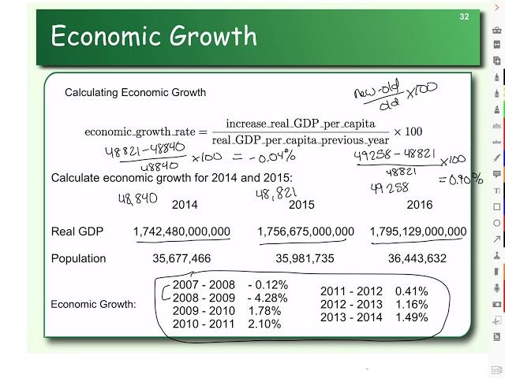

Economic growth, characterized by the increase in the production of goods and services, is vital for the enhancement of societal well-being and the alleviation of poverty. Growth rates, expressed as percentage changes in economic output, often measured using Gross Domestic Product (GDP) or Gross National Product (GNP), serve as indicators of an economy's health. Positive growth rates signify an expanding economy, while negative rates indicate contraction, impacting everything from employment opportunities to social progress.

In the fast-evolving landscape of financial markets, algorithmic trading has become a formidable force, transforming how trading is executed. Algorithmic trading, or algo trading, leverages computer algorithms to automate trading decisions based on pre-defined criteria. This approach enables rapid and precise trading activities that exceed human capabilities. With a robust reliance on financial metrics, including growth rates, algo trading strategies are designed to assess market conditions efficiently and capitalize on opportunities.



This article seeks to explore the intricate relationship between economic growth, growth rates, and algorithmic trading. By understanding these core concepts, investors and traders can improve their decision-making processes, aligning with the dynamic nature of global financial markets. Specifically, the article will highlight how growth rates can be integrated into algorithmic trading strategies, offering a pathway to optimize performance and manage risks effectively. 

As we navigate through the concepts of economic growth rates and algo trading, the intention is to equip financial market participants with the insights required to devise more sophisticated and reactive trading strategies. This foundational understanding is instrumental in enhancing risk management and exploiting market conditions to the fullest potential.

## Table of Contents

## Understanding Economic Growth and Growth Rates

Economic growth represents the increase in the production of goods and services within an economy over a specific period. This growth is typically quantified using macroeconomic indicators such as Gross Domestic Product (GDP) or Gross National Product (GNP). A growth rate, expressed as a percentage, reflects the change in economic output. For instance, a GDP growth rate of 3% annually signifies that the economic output has increased by 3% over the previous year.

Positive growth rates suggest that an economy is expanding, often characterized by increased industrial production, higher employment rates, and improved consumer spending. Conversely, negative growth rates are indicative of an economic contraction, potentially leading to unemployment and reduced spending, typically observed during economic recessions.

Various elements contribute to economic growth. Investment in capital goods enables increased production capacity. Technological advancements boost productivity and efficiency. Government policies, including tax incentives or regulatory changes, play a pivotal role by creating a conducive environment for economic activities. Human capital, marked by education and skill development, further aids in sustaining robust economic growth.

Understanding growth rates is essential for assessing the economic health of a country and making forward-looking judgments regarding future economic performance. Analysts utilize growth rate data to gain insights into an economy's current standing and forecast potential trends. This knowledge helps in devising strategies to harness economic opportunities and mitigate risks associated with economic downturns.

 to Algorithmic Trading

Algorithmic trading, often referred to as algo trading, involves the use of computer algorithms to autonomously execute trades within financial markets. These algorithms operate based on pre-defined rules and criteria, facilitating trade execution with speed and accuracy that surpasses human capabilities. This trading approach not only increases efficiency but also minimizes the chances of human errors, which can be significant in high-pressure trading environments.

Central to the functionality of algo trading are various financial metrics and indicators that guide decision-making processes. Among these, growth rates play a critical role in evaluating current market conditions and predicting potential opportunities. Specifically, the Compound Annual Growth Rate (CAGR) is a widely used metric that provides insights into the mean annual growth rate of an investment over a specified period, assuming the profits are reinvested at the end of each period. The formula for CAGR is expressed as:

$$
\text{CAGR} = \left( \frac{\text{EV}}{\text{BV}} \right)^{\frac{1}{n}} - 1
$$

where EV is the ending value, BV is the beginning value, and $n$ is the number of years.

In tandem with growth rates, other essential metrics such as the Sharpe Ratio and Sortino Ratio are integral to algo trading strategies. The Sharpe Ratio, defined as the average return earned in excess of the risk-free rate per unit of [volatility](/wiki/volatility-trading-strategies), serves as a measure of risk-adjusted return. Its formula is:

$$
\text{Sharpe Ratio} = \frac{R_p - R_f}{\sigma_p}
$$

where $R_p$ is the return of the portfolio, $R_f$ is the risk-free rate, and $\sigma_p$ is the standard deviation of the portfolio's excess return.

The Sortino Ratio, a variation of the Sharpe Ratio, considers only downside volatility, thus offering a more focused risk assessment. It is calculated as:

$$
\text{Sortino Ratio} = \frac{R_p - R_f}{\sigma_d}
$$

where $\sigma_d$ represents the downside deviation.

A comprehensive understanding of these metrics not only enables traders to devise robust algo trading strategies but also enhances their ability to navigate market volatility and optimize returns. Modern [algorithmic trading](/wiki/algorithmic-trading) systems often employ programming languages such as Python for implementing complex trade algorithms, given its extensive libraries and tools tailored for data analysis and financial computations. By leveraging these metrics through algorithmic frameworks, traders can systematically capture inefficiencies in the market and exploit profit opportunities with precision.

## The Role of Growth Rates in Financial Metrics

Growth rates, particularly the Compound Annual Growth Rate (CAGR), are essential tools in financial analysis. CAGR is a formula that provides the consistent annual growth rate of an investment over a specified period. It compensates for the volatility and fluctuations within that period, offering a smooth trajectory of growth. This makes it an invaluable metric for comparing different investments or trading strategies, especially when these investments exhibit variable rates of return over time.

The formula for CAGR is expressed as:

$$
\text{CAGR} = \left( \frac{\text{Ending Value}}{\text{Beginning Value}} \right)^{\frac{1}{n}} - 1
$$

where $n$ is the number of years.

Investors use CAGR to evaluate the performance of individual assets or investment portfolios. In algorithmic trading, CAGR helps traders compare the profitability of various trading strategies objectively. By providing a single annual growth rate, CAGR allows for straightforward comparisons, which can drive strategic decisions about where to allocate resources. This can be particularly useful for traders designing algorithms to select assets with the best long-term growth potential.

When integrated into algorithmic trading strategies, growth rates like CAGR can inform the selection and adjustment of trading parameters. For instance, traders can utilize historical growth rate data to backtest strategies, ensuring they perform optimally under different market conditions. In volatile markets, understanding growth rates supports traders in making informed decisions designed to navigate and respond effectively to market fluctuations.

Traders also use growth rates to assess a strategy's viability over the long term. By analyzing the smoothed growth rate, they can focus on sustainable, long-term investments rather than short-term gains, which might come with higher risks due to market volatility.

In terms of risk mitigation, employing growth rates like CAGR provides a framework for balancing potential rewards against inherent risks. It assists traders not just in optimizing strategies for maximum return but also in fortifying them against possible downturns. This approach enables algorithmic trading models to adjust dynamically in response to economic growth conditions.

By incorporating CAGR and similar growth rates, algorithmic trading strategies can achieve a more sophisticated understanding of potential market opportunities, leading to strategic adaptations that closely align with economic realities and forecasts. This empowers traders to capitalize on periods of economic expansion while remaining resilient during contractions.

## Incorporating Growth Rates into Algorithmic Trading Strategies

Incorporating growth rates into algorithmic trading strategies offers a systematic approach to refining trade execution and enhancing decision-making capabilities. By leveraging historical growth rate data, traders can backtest strategies with greater accuracy, assessing their performance across various market conditions. This validation process is crucial for identifying robust strategies that can withstand market fluctuations.

The automatic adjustment of trading parameters based on economic growth rates ensures that algorithms remain adaptive in ever-changing market landscapes. For instance, an algorithm may be designed to increase trade [volume](/wiki/volume-trading-strategy) when economic indicators suggest robust growth and reduce exposure during periods of economic contraction. Such adaptability can be programmed using conditional statements that account for growth rate metrics.

Python, with its rich ecosystem of libraries, provides a powerful environment for implementing these strategies. Libraries such as pandas and numpy facilitate data manipulation and analysis, while tools like [backtrader](/wiki/backtrader) allow for comprehensive [backtesting](/wiki/backtesting). An example implementation might involve calculating the Compound Annual Growth Rate (CAGR) to adjust trading tactics:

```python
import pandas as pd
import numpy as np

def calculate_cagr(data, start, end):
    """Calculate the CAGR for a given dataset."""
    total_years = (end - start).days / 365.25
    start_value = data.loc[start]
    end_value = data.loc[end]
    cagr = (end_value / start_value) ** (1 / total_years) - 1
    return cagr

# Example usage
data = pd.Series({'2020-01-01': 100, '2023-01-01': 150})
cagr = calculate_cagr(data, '2020-01-01', '2023-01-01')
print(f"CAGR: {cagr:.2%}")
```

In this code snippet, the `calculate_cagr` function computes the CAGR over a specified period, guiding the adjustment of trading parameters. Integrating such calculations into trading algorithms enhances their responsiveness to economic growth rates, promoting effective risk management and opportunity capitalization.

In conclusion, incorporating growth rates into algorithmic trading strategies allows for more flexible and informed trading approaches. By utilizing tools like Python, traders can seamlessly integrate these metrics into their models, ultimately refining strategy effectiveness in dynamic financial environments.

## Benefits and Limitations of Using Growth Rates in Algo Trading

The primary benefit of using growth rates in algorithmic trading is the enhanced capacity to forecast future market movements, which is crucial for developing effective trading strategies. Growth rates provide a quantitative measure by which traders can evaluate past performance and potential future trends, allowing them to make informed, data-driven decisions. For example, the Compound Annual Growth Rate (CAGR) is frequently employed to assess the annualized return of investments over time and to compare the growth rates of different securities or strategies. This kind of rigorous analysis can help traders optimize their approaches and gain a competitive edge.

Growth rates also enable traders to fine-tune their trading algorithms by incorporating metrics that consider economic expansions and contractions. Trading algorithms can be designed to adjust their parameters automatically in response to changes in growth rates, thus increasing their adaptability to dynamic market conditions. This adaptability is crucial for mitigating risks, especially in volatile markets where economic conditions can shift rapidly and unpredictably.

Despite these benefits, using growth rates in algorithmic trading is not without limitations. Growth rates provide a macro-level view that may not capture short-term market volatility or other qualitative factors that can significantly impact financial markets. For instance, abrupt political changes, technological breakthroughs, or unexpected natural events are factors that quantitative growth metrics might overlook. These qualitative elements are crucial for a comprehensive understanding of market dynamics.

Therefore, it is essential to complement growth rate data with qualitative analysis to achieve a holistic trading approach. Combining quantitative metrics, such as growth rates, with market sentiment analysis, geopolitical assessments, and news analytics can help traders develop a more robust and well-rounded trading strategy. For instance, advanced [machine learning](/wiki/machine-learning) models can integrate both types of data, providing equilibrium between the quantitative and qualitative aspects necessary for making informed trading decisions.

In conclusion, while growth rates are invaluable for providing historical context and future market predictions, they must be used in conjunction with qualitative insights for comprehensive trading strategies. Continuous refinement and integration of diverse data types are crucial for optimizing algorithmic trading outcomes.

## Conclusion

Economic growth rates and algorithmic trading are interconnected elements that can significantly influence trading outcomes. Understanding how growth rates can be seamlessly integrated into algorithmic trading strategies enriches both the strategy refinement and risk management processes. By incorporating growth rates, algorithms can adapt to dynamic market conditions, offering traders the opportunity to leverage economic insights for enhanced decision-making. This data-driven approach allows for the development of more advanced trading strategies that align with changing economic landscapes.

As financial markets continue to evolve, continuous learning and adaptation become essential for maintaining competitiveness. Traders and financial analysts who stay abreast of economic trends and technological advancements are better positioned to capitalize on market opportunities. Developing a strong foundation in both algorithmic trading and macroeconomic analysis can provide a significant edge.

Moreover, relying solely on quantitative metrics like growth rates may not fully capture all drivers of market behavior, such as political developments or consumer sentiment. Thus, it is crucial to balance these metrics with qualitative insights for a comprehensive approach. Combining hard data with contextual understanding enhances the robustness and effectiveness of trading systems, potentially leading to improved financial outcomes and more resilient strategies in the face of market uncertainties.

## References & Further Reading

Various resources are available for deeper insights into economic growth, growth rates, and algorithmic trading. Here are a few that stand out:

- **'Advances in Financial Machine Learning' by Marcos Lopez de Prado**: This book is renowned for its comprehensive take on the application of machine learning techniques in the financial sector, particularly in developing robust algorithmic trading strategies. It provides a scholarly exploration of the intersection between advanced data analytics and market trading, offering insights into implementing sophisticated algorithms.

- **Publications and Official Data from Economic Research Institutions**: Institutions like the International Monetary Fund (IMF), World Bank, and the Organisation for Economic Co-operation and Development (OECD) regularly publish reports and datasets that are invaluable for understanding economic growth and forecasting trends. These resources typically cover macroeconomic indicators, analysis of growth trends, and projections that can be crucial for developing algorithms that incorporate economic growth rates.

- **Investopedia**: As a well-regarded online resource, Investopedia provides clear and accessible explanations of key economic concepts, growth metrics, and trading strategies. Whether you are looking to understand Compound Annual Growth Rate (CAGR) or seeking guidance on implementing algorithmic trading strategies, Investopedia offers practical information and examples relevant to both novice and experienced traders.

For those looking to deepen their technical expertise, leveraging programming languages like Python can facilitate the implementation of growth rate data into trading models. By utilizing libraries such as NumPy, Pandas, and Scikit-learn, traders can perform complex data manipulation and analysis, test hypotheses, and backtest trading strategies to ensure robust outcomes in varying market conditions.