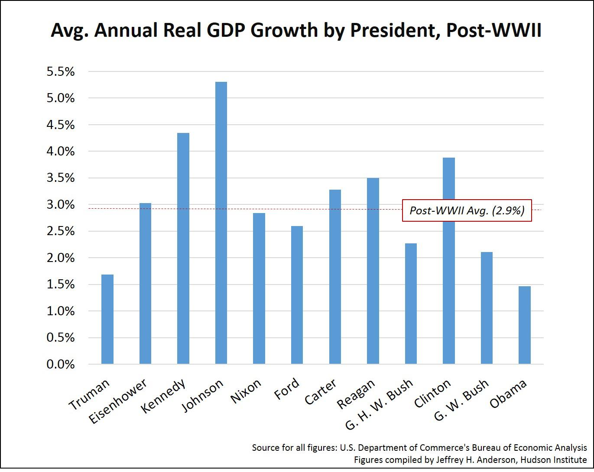

In this article, we explore the economic performance of U.S. presidents through the lens of GDP growth, with a focus on how algorithmic trading contributes to understanding these economic trends. Gross Domestic Product (GDP) serves as a vital indicator of a nation's economic health, reflecting the outcome of presidential policies and their impacts on national prosperity. Analyzing historical GDP growth provides valuable insights into the economic strategies employed by different presidents and how external events, such as financial crises or global pandemics, shaped these outcomes.

Understanding GDP growth is crucial for assessing economic performance. It plays a significant role in influencing investment decisions, employment rates, and the federal budget. By evaluating the GDP growth under different presidential administrations, we aim to understand the broader economic implications of policy decisions and the resilience of economic frameworks during times of challenge.



Algorithmic trading offers a modern perspective on economic analysis, enabling sophisticated evaluations of GDP trends. By utilizing complex algorithms to process economic data, traders and analysts can predict market movements and optimize investment strategies more effectively. This technological advancement enhances the analytical capabilities in the economic discipline, offering a data-driven approach to understanding the interplay between GDP and broader financial markets.

Join us as we journey through economic history, examining the interplay between presidential leadership, GDP dynamics, and financial technology. Through this exploration, we aim to provide a comprehensive understanding of how each of these elements interacts to influence economic outcomes and future economic strategies.

## Table of Contents

## Understanding GDP Growth and Its Importance

Gross Domestic Product (GDP) stands as a fundamental metric for gauging the economic activity of a nation. It encompasses the total market value of all finished goods and services produced within a country during a specified period. This measure serves as a comprehensive scorecard of a country's economic health, providing insights into the scale and dynamism of its economic output. GDP is often presented in three forms: nominal GDP, real GDP, and GDP per capita, each offering a different perspective on economic performance.

GDP growth is intrinsically linked to a country's prosperity and has substantial implications for economic planning and policy-making. A positive GDP growth rate indicates economic expansion, fostering a conducive environment for investment and employment. It ensures that businesses are confident about the future, leading to increased production capacities and job creation. Conversely, a negative GDP growth rate signals an economic downturn, potentially leading to employment cuts and reduced corporate profits.

The ideal GDP growth rate is generally accepted to be between 2% and 3%. This range signifies a balanced expansion that maintains sufficient job creation and income generation without overheating the economy. Growth rates significantly above this threshold might lead to inflationary pressures, while rates below could suggest stagnation or recession.

Presidential fiscal and monetary policies are pivotal in influencing GDP growth. Fiscal policies, which encompass government spending and tax policies, directly impact aggregate demand. For instance, tax cuts can increase household disposable income, translating to higher consumer spending, thereby boosting GDP. Conversely, increased government spending on infrastructure can create jobs and stimulate economic activity.

Monetary policies, typically managed by the Federal Reserve, also play a crucial role. These policies include managing interest rates and controlling the money supply to maintain price stability and foster economic growth. Lowering interest rates can encourage borrowing and investing, contributing positively to GDP growth. Conversely, raising rates might be necessary to control inflationary pressures.

Historical data supports the significance of these policies. For instance, during periods of economic recession, expansionary fiscal and monetary policies have been employed to spur GDP growth. The effectiveness of such policies often hinges on the collaboration between the Presidential administration and Congress, ensuring that economic measures align with the broader economic objectives and challenges.

In addition to domestic policies, GDP growth is influenced by global economic conditions, trade dynamics, and technological advancements. As such, understanding GDP growth requires a comprehensive approach that considers a multitude of economic variables and policy tools.

## Historical U.S. GDP Growth by President

Analyzing historical GDP growth under U.S. presidents provides valuable insights into the nation's economic trajectory over time. The Gross Domestic Product (GDP) growth rate, an essential measure of economic health, is influenced by numerous factors, including the policies enacted by each administration. 

Franklin D. Roosevelt's presidency, beginning in 1933 amidst the Great Depression, exemplifies the connection between policy and economic growth. His New Deal programs, designed to boost economic recovery, coupled with the extensive government spending during World War II, resulted in an average annual GDP growth rate of approximately 8.5% [1]. This period marked one of the highest GDP growth rates in U.S. history, showcasing how government policies and extraordinary external circumstances can collectively drive economic expansion.

Conversely, Herbert Hoover's presidency from 1929 to 1933 is often associated with the most severe economic contraction in U.S. history. The GDP saw a drastic decline of about 7% annually during the Great Depression ([2]). Hoover's policies, which many historians argue were inadequate to combat the economic downturn, were overshadowed by the stock market crash of 1929 and the subsequent banking failures. These events illustrate how external economic shocks can overwhelm presidential policies, leading to significant contractions in GDP.

Each president's economic performance must be considered within the context of their unique challenges and policy decisions. For instance, under Ronald Reagan in the 1980s, the U.S. experienced an average annual GDP growth rate of approximately 3.5%, largely attributed to tax cuts, deregulation, and increased defense spending. These supply-side economic policies, often referred to as "Reaganomics," aimed to stimulate growth by enhancing private sector activity [3].

More recently, during Barack Obama's presidency, the U.S. faced the aftermath of the 2008 financial crisis. The GDP growth rate averaged around 2.1% annually, reflecting the slow recovery process from the Great Recession [4]. In response, Obama implemented stimulus measures, including the American Recovery and Reinvestment Act, aiming to bolster economic recovery and stabilize financial markets.

Each administration navigates different economic landscapes influenced by previous policies, global events, and domestic conditions. While presidents can guide economic strategy, they must also adapt to changing circumstances that affect GDP growth. Understanding these historical contexts is essential for examining the economic legacies of U.S. presidents and the factors that shape their impacts on national prosperity.

### References
[1] - "World War II and the New Deal" - Historical sources indicate Roosevelt's New Deal and WWII expenditures boosted GDP growth.
[2] - "The Great Depression and Herbert Hoover" - Analysis of Hoover's presidency provides data on GDP decline during the Great Depression.
[3] - "Reaganomics and Economic Growth" - Studies examining the effects of Reagan's policies on GDP growth.
[4] - "Obama's Economic Policies and the Great Recession" - Evaluations of GDP growth during Obama's response to the 2008 financial crisis.

## How Presidents Influence GDP

Presidents exert significant influence on GDP through fiscal policies, including tax legislation, government spending, and budgetary priorities. These policy tools are crucial in shaping the economic landscape and determining the direction of national economic growth. For instance, reducing taxes can increase disposable income for individuals and businesses, potentially boosting consumption and investment, which are critical components of GDP. Conversely, increasing taxes might slow down economic activity by reducing disposable income. 

Government spending is another powerful lever. By increasing spending on infrastructure, healthcare, or defense, the government injects money into the economy, stimulating demand and potentially leading to higher GDP growth. The multiplier effect—where an increase in spending leads to even greater increases in national income and output—amplifies these impacts. The formula to calculate this multiplier effect in its simplest form is:

$$
\text{Multiplier} = \frac{1}{1-MPC}
$$

where $\text{MPC}$ represents the marginal propensity to consume. A higher MPC value suggests that people are more likely to spend additional income, leading to a higher multiplier effect.

However, presidential influence on GDP is not absolute. External factors, such as wars, financial crises, and pandemics, can overshadow presidential policies. For example, the COVID-19 pandemic had a profound impact on GDP growth worldwide, disrupting supply chains and causing sudden changes in consumer behavior, regardless of existing policy measures. Such events can lead to rapid contractions in GDP despite the government's best efforts to stabilize the economy.

Moreover, cooperation with Congress and the Federal Reserve is vital for enacting effective fiscal and monetary policies that foster economic growth. The president must often negotiate with Congress to achieve their economic agenda, as legislative approval is required for changes in taxation and public expenditure. The relationship with the Federal Reserve, the central banking system of the United States, is equally important. While it operates independently, the Federal Reserve's monetary policy decisions, such as setting interest rates and implementing quantitative easing, have significant implications for GDP growth. Coordinated efforts between the president, Congress, and the Federal Reserve can lead to more stable and sustained economic growth by ensuring that fiscal and monetary policies are complementary.

In summary, while the president has tools at their disposal to influence GDP, the robustness of economic growth is often the result of a complex interplay between governmental policies, external events, and the collaborative functioning of key institutions.

## Algorithmic Trading and GDP Analysis

Algorithmic trading represents an intersection of technology and finance, where automated systems make trading decisions based on pre-set rules and sophisticated algorithms. These systems analyze market trends, incorporating economic indicators like Gross Domestic Product (GDP) growth to forecast movements and refine trading strategies. 

GDP growth is an integral [factor](/wiki/factor-investing) in economic analysis, often influencing investor sentiment and market trajectories. By integrating GDP trends into their algorithms, traders can align their strategies with broader economic patterns. For example, during periods of robust GDP growth, an algorithm might flag opportunities in sectors typically thriving during economic booms, such as technology or consumer goods.

The algorithms employed in trading are designed to process vast amounts of data at high speeds, surpassing human capabilities. They use statistical models to identify patterns and correlations within time-series data, facilitating the anticipation of future price movements. Consider a simple algorithm that predicts stock prices based on GDP data:

```python
import numpy as np
from sklearn.linear_model import LinearRegression

# Hypothetical GDP and stock price data
gdp_growth = np.array([[2.5], [3.0], [3.5], [4.0], [4.5]])
stock_prices = np.array([100, 105, 108, 112, 117])

# Linear regression model to predict stock prices based on GDP growth
model = LinearRegression()
model.fit(gdp_growth, stock_prices)

# Predict stock price with a GDP growth of 3.8%
predicted_price = model.predict(np.array([[3.8]]))
print(f"Predicted Stock Price: {predicted_price[0]}")
```

In this example, a linear regression model uses past GDP growth rates to predict future stock prices. While simplistic, such models form the basis of more complex algorithms used in high-frequency trading environments.

Algorithmic trading systems benefit from enhanced analytical capabilities, allowing traders to obtain more precise forecasts and make informed investment decisions. Tools like [machine learning](/wiki/machine-learning) and [artificial intelligence](/wiki/ai-artificial-intelligence) enhance these systems, enabling adaptive learning from new data inputs and improving predictive accuracy.

The incorporation of GDP analysis into [algorithmic trading](/wiki/algorithmic-trading) also involves [backtesting](/wiki/backtesting) strategies to ensure reliability and performance. Traders simulate market conditions using historical data to validate the effectiveness of their algorithms before deploying them in live market conditions. This testing process aids in refining models, reducing risk, and enhancing potential returns.

In conclusion, algorithmic trading offers a modern framework for interpreting economic indicators such as GDP growth. By leveraging advanced computational resources and analytical techniques, traders can better navigate market complexities, optimize strategies, and capitalize on economic trends.

## Conclusion

Gross Domestic Product (GDP) growth remains a fundamental measure for evaluating the economic achievements of U.S. presidents and their contributions to national prosperity. The economic environment each president navigates significantly influences their economic legacy. Policy initiatives, including fiscal and monetary strategies, are tools presidents use to stimulate or sustain GDP growth. However, the complexity of global and domestic events, such as economic downturns, geopolitical conflicts, and health pandemics, often plays a decisive role in dictating economic outcomes beyond presidential control.

The rise of algorithmic trading offers a modern instrument for economic analysis, transforming how GDP data is utilized. Through the use of complex algorithms and high-frequency data processing, algorithmic trading enables market participants to examine GDP trends with increased accuracy. This technological advancement facilitates more precise economic forecasts and investment decisions, enhancing the ability to respond to economic fluctuations promptly.

As we look to the future, it is essential to appreciate the interplay between presidential policies, GDP dynamics, and financial technologies like algorithmic trading. Comprehending these relationships will be vital for policymakers, investors, and analysts striving to steer through the economic trials of the coming years. This understanding will not only support more informed decision-making but also contribute to formulating resilient strategies to sustain robust economic growth amidst an ever-evolving global landscape.

## References & Further Reading

[1]: Bernstein, M. A., & Adler, M. R. (2003). ["Understanding American Economic Growth"](https://www.amazon.com/Understanding-American-Economic-Decline-Bernstein/dp/0521456797). Cambridge University Press.

[2]: Jaffe, D., & Quinn, D. P. (1996). ["America's Economic Policy Makers: The Federal Reserve and the Treasury in the 1970s"](https://pmc.ncbi.nlm.nih.gov/articles/PMC3225953/). University Press of America.

[3]: Lopez de Prado, M. (2018). ["Advances in Financial Machine Learning"](https://www.amazon.com/Advances-Financial-Machine-Learning-Marcos/dp/1119482089). John Wiley & Sons.

[4]: Aronson, D. R. (2007). ["Evidence-Based Technical Analysis: Applying the Scientific Method and Statistical Inference to Trading Signals"](https://www.amazon.com/Evidence-Based-Technical-Analysis-Scientific-Statistical/dp/0470008741). John Wiley & Sons.

[5]: Ohanian, L. E. (2009). ["What—or Who—Started the Great Depression?"](https://www.nber.org/papers/w15258) National Bureau of Economic Research.

[6]: Blinder, A. S., & Zandi, M. (2010). ["How the Great Recession Was Brought to an End"](https://www.princeton.edu/~blinder/End-of-Great-Recession.pdf). Moody's Analytics.