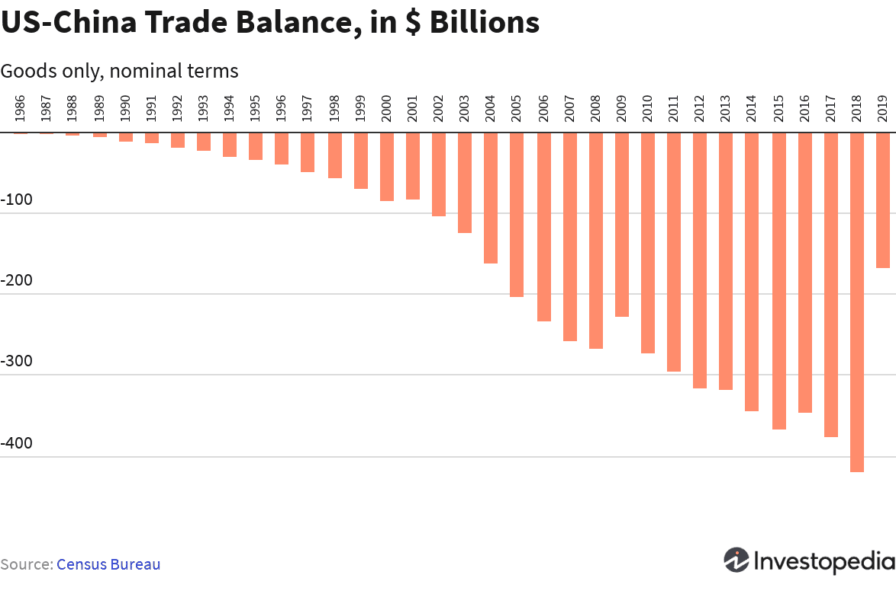

The global economy experienced significant shifts during 2020, largely driven by the sweeping impacts of the COVID-19 pandemic. This public health crisis led to an unprecedented contraction in economic activities worldwide as countries enacted lockdowns and travel restrictions to curb the spread of the virus. These measures resulted in disrupted supply chains, reduced consumer spending, and volatile financial markets.

A central component of the global economic landscape is the interconnection between the U.S. and Chinese economies. As two of the largest economies in the world, their bilateral relations significantly influence global trade patterns and financial flows. In 2020, the dynamics between these economies were further complicated by existing trade tensions, supply chain dependencies, and differing governmental responses to the pandemic challenges.

Algorithmic trading, a technology-driven method of executing financial transactions, played a crucial role in navigating the volatile market environment of 2020. This form of trading leverages complex algorithms to make decisions at speeds and frequencies far beyond human capabilities, influencing asset prices, liquidity, and market perception. As a result, understanding the role of algorithmic trading provides an additional lens through which to analyze the economic interplay between the U.S. and China.

The interconnectedness of the U.S. and Chinese economies, coupled with the role of algorithmic trading, underscores the complexity of global market trends. These relationships shape investor strategies and policy decisions, highlighting the importance of understanding these dynamics to anticipate and respond to future economic shifts effectively. The insights gathered from analyzing these interactions in 2020 offer valuable lessons for navigating potential challenges and opportunities in the global economy.

## Table of Contents

## The State of the U.S. Economy in 2020

The U.S. economy in 2020 experienced unprecedented challenges primarily due to the COVID-19 pandemic. A significant contraction in GDP highlighted these economic difficulties, with the annual GDP decreasing by 3.5%, the most substantial decline since the post-World War II era[^1^]. The imposition of lockdowns and restrictions to curb the virus's spread disrupted business operations across various sectors. This led to a severe impact on employment rates, as non-essential businesses closed temporarily, resulting in widespread layoffs and furloughs. By April 2020, the unemployment rate had surged to 14.8%, the highest level observed in the post-war period[^2^].

The federal government implemented several fiscal measures to mitigate the economic fallout. Notably, the Coronavirus Aid, Relief, and Economic Security (CARES) Act injected approximately $2 trillion into the economy, providing direct payments to individuals, unemployment benefits, and loans to small businesses[^3^]. Despite these measures, challenges persisted, as the scale of the economic disruption overshadowed legislative efforts.

Simultaneously, the Federal Reserve enacted monetary policies to support [liquidity](/wiki/liquidity-risk-premium) and stabilize financial markets. These included reducing the federal funds rate to near-zero levels and purchasing large quantities of Treasury and mortgage-backed securities under quantitative easing programs[^4^]. However, these measures faced limitations. While they mitigated immediate financial crises, they could not directly address pandemic-induced supply chain disruptions or the reduced consumer demand resulting from ongoing health concerns and mobility restrictions.

The combination of fiscal and monetary measures offered temporary relief but underlined the challenges of utilizing traditional economic tools in exceptional circumstances. The dual nature of health and economic crises during 2020 required adaptive strategies to bolster long-term recovery while addressing short-term economic disruptions.

[^1^]: Bureau of Economic Analysis (BEA). "Gross Domestic Product, Fourth Quarter and Year 2020 (Advance Estimate)." January 28, 2021.
[^2^]: U.S. Bureau of Labor Statistics. "Labor Force Statistics from the Current Population Survey."
[^3^]: U.S. Department of the Treasury. "The CARES Act Works for All Americans."
[^4^]: Board of Governors of the Federal Reserve System. "Federal Reserve Issues FOMC Statement." March 15, 2020.

## China's Economic Resilience

In 2020, while many countries faced economic downturns provoked by the COVID-19 pandemic, China distinguished itself with reported economic growth. This growth can be attributed to several factors, including effective pandemic management, a robust structural economy, and China's pivotal role in global manufacturing.

The Chinese government's quick and decisive action in managing the COVID-19 pandemic was crucial to its relatively rapid economic recovery. Implementing rigorous measures, such as widespread testing, travel restrictions, and social distancing policies, China was able to curb the spread of the virus more effectively than many other nations. This swift response allowed the nation to reopen its economy sooner, reducing the negative impacts on economic output and facilitating a return to growth.

China's strategic importance as a global manufacturing hub played a substantial role in its economic resilience. The country's extensive manufacturing infrastructure and export capabilities helped maintain economic activity even when domestic consumption was subdued. As major economies around the world grappled with lockdowns and disruptions to supply chains, China's manufacturing sector remained critical, supplying essential goods like medical supplies and electronics. This not only supported China's domestic economy but also fulfilled the increased global demand for specific products during the pandemic.

The adaptability of Chinese industries further bolstered economic activity. Many sectors rapidly adjusted their operations to meet the changing demands and constraints posed by the pandemic. For instance, companies in the manufacturing sector adeptly shifted their production lines to prioritize essential goods, while the technology and e-commerce sectors capitalized on increased demand for digital services and remote work solutions.

Additionally, governmental fiscal and monetary policies played an important role in sustaining economic growth. These policies included tax relief, financial support for businesses, and measures to boost consumer spending. Infrastructure investments continued to provide a solid foundation for economic stability and growth, helping to offset some of the negative impacts brought by the global downturn.

China’s economic growth amid a global recession in 2020 exemplifies the impact of decisive governance, the country's entrenched position in global trade, and its ability to swiftly adapt to unprecedented challenges. This resilience not only highlights China's strengths in crisis management but also reinforces its importance in the interconnected global economic landscape.

## Impact of U.S.-China Trade Relations

The 'China shock' refers to the profound impact on global trade patterns following China's accession to the World Trade Organization (WTO) in 2001. This event led to a rapid expansion of China's manufacturing capabilities, which significantly influenced global economic dynamics. The increased competition from Chinese imports reshaped various industries worldwide, affecting employment and production in numerous countries, particularly the United States. Economists David Autor, David Dorn, and Gordon Hanson documented the extensive impacts of the 'China shock' on U.S. manufacturing jobs, emphasizing the shifts in labor markets and wage structures [^1^].

The trade war between the U.S. and China, which began in 2018, further complicated these dynamics. The imposition of tariffs and counter-tariffs disrupted global supply chains, increased production costs, and contributed to market [volatility](/wiki/volatility-trading-strategies). For instance, tariffs on Chinese goods led to higher prices for imported products, impacting both companies and consumers. A study by the Federal Reserve suggested that U.S. manufacturing firms faced increased input costs due to these tariffs, which in turn reduced profit margins and slowed economic growth [^2^].

Despite these challenges, the trade relationship between the U.S. and China remains crucial for both economies. In 2020, China was the largest trading partner of the United States, highlighting the interdependence of the two nations. This relationship plays a significant role in the availability and pricing of goods, as consumers and businesses benefit from competitive pricing due to foreign imports. The complex trade dynamics are exemplified by the tech industry, where supply chains are intricately linked across both countries [^3^].

As both nations navigate this complex trade landscape, maintaining a stable and mutually beneficial trade relationship is essential for global economic stability. The ongoing negotiations and policy adjustments reflect the importance of managing these ties to mitigate disruptions in global markets and to support economic growth.

[^1^]: Autor, D. H., Dorn, D., & Hanson, G. H. "The China Syndrome: Local Labor Market Effects of Import Competition in the United States." American Economic Review, 2013.
[^2^]: Fajgelbaum, P. D., Goldberg, P. K., Kennedy, P. J., & Khandelwal, A. K. "The Return to Protectionism." The Quarterly Journal of Economics, 2020.
[^3^]: Chad P. Bown, "US-China Trade War: The Guns of August," Harvard Business Review, 2019.

## Algorithmic Trading and Economic Challenges

Algorithmic trading refers to the use of computer algorithms to automate trading strategies, allowing for rapid execution of trades based on predetermined criteria. The rise of [algorithmic trading](/wiki/algorithmic-trading) has significantly transformed financial markets, providing enhanced liquidity, reducing transaction costs, and enabling more precise execution of complex trading strategies. This transformation has concurrently presented challenges, particularly during periods of economic uncertainty.

Algorithmic trading systems are designed to quickly process large volumes of data and react to market news in fractions of a second. This ability enables these systems to influence asset prices and market stability significantly. For instance, by executing trades based on the latest news or market trends, algorithms can cause rapid changes in asset prices, contributing to market volatility. This effect was notably present during the economic uncertainty of 2020, caused by the COVID-19 pandemic.

In 2020, when global markets faced unprecedented disruptions, algorithmic trading volumes surged. The pandemic-induced volatility created an environment where speed and precision were critical. Algorithms, thus, became increasingly valuable, enabling market participants to swiftly adjust their portfolios in response to the swiftly changing conditions. However, the heightened reliance on algorithmic trading also led to new risks, such as the potential for "flash crashes," where rapid sell-offs occur within minutes due to algorithms reacting simultaneously to unfavorable market conditions.

The impact of algorithmic trading on economic challenges is further exemplified through its influence on market stability. While algorithms can provide liquidity and reduce bid-ask spreads, they can also exacerbate price swings during turbulent times. For instance, when algorithms detect the same market signals, they may collectively execute similar trades, amplifying market movements in the process. This herding behavior can lead to exaggerated market responses, compounding the challenges already present in volatile economic periods.

Despite these challenges, algorithmic trading continues to be a crucial component of modern financial markets. Its efficiency and precision make it an invaluable tool for managing investment risks, particularly in uncertain economic climates. As technology and data analytics advance, the role of algorithmic trading is likely to expand further, necessitating the development of more robust strategies and regulatory frameworks to mitigate associated risks while harnessing its benefits.

Understanding the dynamics of algorithmic trading and its interaction with economic challenges is vital for investors and policymakers. As algorithmic systems become increasingly sophisticated, maintaining a balance between leveraging their capabilities and ensuring market stability will be critical in navigating future economic landscapes.

## The Future of U.S.-China Economic Interactions

Future economic policies will significantly shape the trajectory of U.S.-China relations. As two of the world's largest economies, both nations play crucial roles in influencing global economic trends and stability. The necessity for cooperation is evident in addressing common global challenges such as climate change, technological innovation, and international trade regulations.

While collaboration is essential, the complexity of bilateral ties is underscored by ongoing debates about economic decoupling. Economic decoupling refers to the process of reducing dependency between the U.S. and China, particularly in trade and technological exchanges. Proponents argue that this could protect national security and foster domestic industries. However, critics highlight the potential risks, including increased costs for consumers and disruptions to global supply chains.

The discussions surrounding economic decoupling also highlight the intricacies of interdependence between the U.S. and China in various sectors. For instance, the global technology industry relies heavily on Chinese manufacturing, while the U.S. is a leader in technological research and development. Policies that aim to decouple these sectors need careful consideration to avoid significant economic disruptions.

Furthermore, future U.S.-China economic interactions will likely be influenced by geopolitical factors, including regional security concerns and alliances. The strategic competition between the two countries might impact future trade agreements and investment flows. It is crucial for policymakers to balance these strategic concerns with economic imperatives to ensure a stable and prosperous global economy. 

Navigating these complexities will require nuanced policies that recognize the mutual benefits of collaboration while safeguarding national interests. Enhanced diplomatic efforts, clear communication, and international collaborations on shared interests, such as sustainable development and public health, can serve as avenues for fostering a more stable U.S.-China economic relationship.

## Conclusion

The year 2020 presented a pivotal period in understanding the depth of global economic interconnection, magnified by the acute challenges of the COVID-19 pandemic. This interconnectedness was prominently observed in the economic relationship between the United States and China, two of the world's largest economies. This bilateral economic interaction illustrated the complexities and dependencies that define contemporary global trade networks. 

The synergy between U.S.-China economic relations and the increasing prevalence of algorithmic trading offers critical insights for future economic strategies. The pandemic-induced volatility tested the resilience of these automatic trading systems, as they responded rapidly to financial news and shifts in market dynamics. Algorithmic trading significantly influenced asset pricing and market liquidity, thus providing a powerful tool for navigating economic uncertainties that were heightened in 2020.

For policymakers and investors, the experiences garnered from the events of 2020 underline the necessity of a nuanced understanding of global economic dynamics. Decisions made in one major economy, such as fiscal stimuli or tariff impositions, have far-reaching impacts across global supply chains and financial markets. Similarly, algorithmic trading strategies must be continually adapted to consider these multifaceted economic interactions, ensuring that they contribute to market stability rather than exacerbate volatility.

Looking forward, the ability to comprehend and anticipate the intricate interplay of international economic relations and technological advancements such as algorithmic trading will be paramount. As globalization continues to evolve, these insights will be invaluable in crafting policies and investment strategies that are resilient in the face of unpredictable global events. The lessons from 2020 serve as a reminder of the importance of fostering cooperation among global economies to promote sustained economic stability and growth.

## References & Further Reading

[1]: Bergstra, J., Bardenet, R., Bengio, Y., & Kégl, B. (2011). ["Algorithms for Hyper-Parameter Optimization."](https://dl.acm.org/doi/10.5555/2986459.2986743) Advances in Neural Information Processing Systems 24.

[2]: ["Advances in Financial Machine Learning"](https://www.amazon.com/Advances-Financial-Machine-Learning-Marcos/dp/1119482089) by Marcos Lopez de Prado

[3]: ["Evidence-Based Technical Analysis: Applying the Scientific Method and Statistical Inference to Trading Signals"](https://www.amazon.com/Evidence-Based-Technical-Analysis-Scientific-Statistical/dp/0470008741) by David Aronson

[4]: ["Machine Learning for Algorithmic Trading"](https://github.com/stefan-jansen/machine-learning-for-trading) by Stefan Jansen

[5]: ["Quantitative Trading: How to Build Your Own Algorithmic Trading Business"](https://www.amazon.com/Quantitative-Trading-Build-Algorithmic-Business/dp/1119800064) by Ernest P. Chan