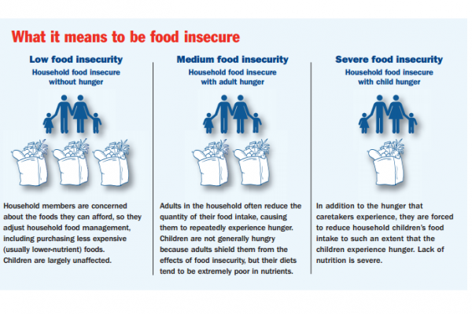

Food insecurity and hunger remain some of the most pressing challenges facing our world today. According to the Food and Agriculture Organization of the United Nations, an estimated 690 million people were undernourished in 2019, a number that likely increased due to the global disruptions caused by the COVID-19 pandemic. The root causes of food insecurity are complex and multifaceted, involving economic instability, natural disasters, conflict, and poverty. Food insecurity does not merely signify a lack of sufficient calories; it also encompasses a lack of essential nutrients, impacting physical and mental health, productivity, and long-term development.

On a parallel but seemingly unrelated front, algorithmic trading has revolutionized the financial sector. This form of trading involves using complex algorithms and mathematical models to execute trades at speeds and frequencies that are impossible for human traders. Algorithmic trading, or algo trading, leverages technology to make high-frequency trading decisions, typically seeking to exploit tiny price discrepancies across global markets. Known for its efficiency and precision, algo trading has become an integral part of financial markets, often representing a significant portion of daily trading volume.

Given the significant role both food insecurity and financial markets play in global economies, examining their intersection can yield insights into potential solutions to mitigate hunger and its economic impacts. Specifically, algorithmic trading in agricultural markets influences food prices and accessibility, affecting global food security. While algo trading can contribute to more efficient market operations, it may also introduce volatility and unpredictability, impacting food prices in ways that exacerbate food insecurity for vulnerable populations.

This article aims to explore how financial markets, particularly through the lens of algorithmic trading, intersect with the issues of food insecurity and hunger. The structure of the article first provides a comprehensive understanding of food insecurity and its global implications. Following that, it investigates into the mechanics and impacts of algorithmic trading within financial markets. Economic consequences of food insecurity are then examined to highlight the broader societal implications. The discussion extends to analyzing the specific impacts of algo trading on food commodity markets and concludes by exploring innovative approaches that leverage financial technologies to address food insecurity. The goal is to foster awareness and inspire collaborative efforts among stakeholders in finance, technology, and policy to combat hunger effectively.

## Table of Contents

## Understanding Food Insecurity and Hunger

Food insecurity is a multifaceted issue characterized by the lack of consistent access to sufficient and nutritious food necessary for a healthy life. The Food and Agriculture Organization (FAO) defines food insecurity as a complex issue influenced by a myriad of factors, including economic instability, political unrest, and environmental challenges. Common causes of food insecurity include poverty, supply chain disruptions, climate change, and conflict. These factors can disrupt the availability, access, and utilization of food, leading to both short-term hunger and chronic malnutrition.

Globally, the numbers are staggering. According to the FAO's 2022 report, approximately 828 million people were affected by hunger. This statistic highlights the persistent and widespread nature of food insecurity, with certain regions, particularly sub-Saharan Africa and parts of Asia, experiencing acute food shortages. Furthermore, the prevalence of moderate to severe food insecurity affected an estimated 29% of the global population, illustrating not only the reach of hunger but also its gradations and severity.

The impact of food insecurity extends beyond mere physical hunger, affecting individuals and communities in profound ways. On an individual level, chronic food insecurity can lead to malnutrition, growth stunting in children, cognitive impairments, and increased susceptibility to diseases. Communities burdened by food insecurity often experience heightened social tensions, reduced educational outcomes, and increased poverty levels.

Economically, the costs of hunger are substantial at both local and national levels. Food insecurity can significantly impede workforce productivity as malnourished individuals often suffer from lower energy levels and cognitive function, resulting in decreased efficiency and economic output. According to the United Nations World Food Programme (WFP), malnutrition in all its forms could cost the global economy up to $3.5 trillion annually. These costs manifest in various ways, including increased healthcare expenditures, reduced economic productivity, and the continuous cycle of poverty perpetuated by chronic hunger. For example, a study in Zimbabwe showed that eliminating micronutrient deficiencies could result in economic benefits equivalent to 1% of their GDP.

Addressing food insecurity requires targeted policies and effective interventions to enhance food availability, accessibility, and utilization, ensuring that food systems are resilient and equitable.

## Algorithmic Trading in the Financial Markets

Algorithmic trading, often referred to as algo trading, is a type of trading that utilizes computer algorithms to execute trades at high speeds and volumes, far beyond the capability of human traders. These algorithms are designed to follow a set of defined instructions, such as timing, price, or quantity, enabling the execution of trades with minimal human intervention. This process helps in identifying profitable opportunities faster and executing them much more efficiently than manual trading.

Over the past few decades, [algorithmic trading](/wiki/algorithmic-trading) has grown exponentially, becoming a dominant force in modern financial markets. This growth is driven by advances in technology, increased market efficiency, and the availability of vast amounts of data that can be processed almost instantaneously. Today, it is estimated that over 80% of trades in the U.S. stock market are executed through algorithmic trading systems, highlighting the prevalence and significance of this approach in trading activities worldwide.

The advantages of algorithmic trading are numerous. Firstly, it reduces transaction costs by executing trades more efficiently and at optimal prices. Secondly, algorithms can operate continuously without fatigue, unlike human traders, ensuring that opportunities are acted upon in real-time. Thirdly, algorithmic trading minimizes human error and emotional bias in trading decisions, leading to more consistent and objective outcomes. Finally, algo trading allows for the execution of highly sophisticated trading strategies, such as [arbitrage](/wiki/arbitrage), market-making, and trend-following, that might be impossible to implement manually.

However, algorithmic trading also presents significant disadvantages. One of the primary concerns is the potential for increased market [volatility](/wiki/volatility-trading-strategies), as rapid trading can lead to sudden price fluctuations, exemplified by notable "flash crashes." Additionally, the complexity of algorithms can lead to unforeseen errors or glitches, resulting in substantial financial losses. The lack of transparency in trading algorithms also raises concerns about market fairness and the potential for manipulative practices.

Recent trends in algorithmic trading showcase its expanding role beyond traditional markets. With the advent of [machine learning](/wiki/machine-learning) and [artificial intelligence](/wiki/ai-artificial-intelligence), algo trading systems are becoming increasingly sophisticated, capable of self-learning and adapting to market dynamics. These advancements are leading to more predictive and adaptive trading strategies. Furthermore, the use of algorithmic trading has extended to emerging markets such as cryptocurrencies, where it helps to manage volatility and provide [liquidity](/wiki/liquidity-risk-premium).

In summary, algorithmic trading stands as a pivotal innovation in the financial sector, enhancing trading efficiency and market dynamics. While offering substantial benefits, it also requires careful management of its risks and challenges, pointing to the necessity for robust regulatory frameworks to ensure market stability and integrity.

## Economic Impacts of Food Insecurity

Food insecurity is a critical issue with significant economic implications on both micro and macroeconomic levels. The direct and indirect economic consequences of food insecurity are profound and multifaceted, affecting productivity, healthcare costs, and long-term economic development.

Food insecurity severely impacts workforce productivity. Individuals who lack adequate nutrition are likely to experience a decrease in cognitive functions and physical capabilities. This malnutrition leads to inefficiencies in labor performance, translating into lower productivity. The cycle of poor nutrition and reduced productivity is particularly concerning in economies heavily reliant on manual labor. For example, studies indicate that iron deficiency, a common condition due to inadequate nutrition, can reduce work capacity by up to 20% in affected populations. This reduction represents a significant economic loss for businesses and national economies alike.

In terms of healthcare, food insecurity escalates healthcare costs due to the increased prevalence of illness and disease in undernourished populations. Poor nutritional intake weakens immune systems, heightening the susceptibility to infections and chronic diseases such as diabetes and cardiovascular conditions. Consequently, healthcare systems face mounting pressures as they address the treatment needs arising from malnutrition-related health conditions. These increased healthcare demands result in higher public health expenditures, leaving less funding available for other critical areas of public service and development.

The long-term economic challenges posed by food insecurity are equally concerning. Persistent hunger stifles human capital development through its impact on education. Malnourished children often face difficulties concentrating in school, leading to higher absenteeism rates and lower educational outcomes. This educational underachievement hinders the development of skilled labor markets, essential for economic growth and competitiveness in an increasingly knowledge-based global economy.

To illustrate the economic burden of food insecurity, consider the case of sub-Saharan Africa. In this region, food insecurity has not only led to immediate nutritional deficits but has also translated into broader economic repercussions. Studies have estimated that malnutrition can cost countries up to 11% of their GDP annually. The economic burden encompasses losses from diminished productivity, increased healthcare expenditures, and reduced educational achievements. Addressing these challenges requires substantial and sustained investments in nutrition and food security programs.

To conclude, the economic impacts of food insecurity are extensive, affecting individual productivity, escalating healthcare costs, and impeding long-term economic growth through reduced educational outcomes. These challenges call for concerted efforts to address the root causes of hunger, ultimately fostering economic resilience and societal well-being.

## The Role of Algorithmic Trading in Food Markets

Algorithmic trading has become an influential force in food commodity markets, leveraging automation and data analysis to execute trades at high speed and [volume](/wiki/volume-trading-strategy). This method of trading has brought several changes to how these markets operate, with both positive and negative implications.

**Influence on Food Commodity Markets**

Algorithmic trading (algo trading) in food commodity markets typically involves the use of pre-programmed instructions based on various parameters such as price, timing, and volume. These algorithms can process vast amounts of data far quicker than a human trader, allowing for rapid decision-making and trade execution. As a result, market participants can respond almost instantly to market signals, leading to increased market efficiency.

**Potential Benefits and Risks**

The integration of algo trading in agricultural markets offers notable benefits. It enhances liquidity by facilitating continuous trading and narrowing bid-ask spreads, resulting in cost reductions for market participants. This increased liquidity can, in theory, make markets more robust against price shocks, theoretically stabilizing food prices.

However, the risks are just as significant. Algo trading can exacerbate volatility in commodity prices, as evidenced by the 2010 "Flash Crash," when stock markets plummeted in minutes due to algorithmic trading errors. In agricultural markets, such volatility can have severe implications. Rapid fluctuations can lead to price distortions, affecting the income of farmers and increasing costs for consumers.

**Impact on Food Prices and Accessibility**

Algo trading has the potential to influence food prices significantly. By facilitating price discovery and increasing market efficiency, these algorithms can help align prices more closely with supply and demand dynamics. However, when algorithms are improperly calibrated or when too many market participants rely on similar strategies, they can lead to price manipulation or unintended market scenarios.

Various studies have shown that increased speculation due to algo trading can lead to artificial inflation of prices, especially in staple commodities like wheat, corn, and rice. As these prices escalate, accessibility becomes an issue, particularly for lower-income populations who spend a larger share of their income on food.

**Market Volatility and Food Security**

The relationship between market volatility and food security is an area of growing concern. Volatility in food commodity prices can lead to uncertainty and risk aversion among farmers and investors, potentially disrupting supply chains. Unexpected price swings may discourage investment in agriculture, leading to reduced production and exacerbating food insecurity.

Moreover, increased volatility can lead to higher insurance premiums and hedging costs, hindering producers' ability to secure stable revenue streams. This instability has wide-reaching implications for food security, as it can ultimately result in decreased food availability and increased long-term prices for consumers.

In conclusion, while algorithmic trading offers increased efficiency and potential cost savings in food commodity markets, the challenges of managing increased volatility and price impacts are significant. For algo trading to contribute positively to food security, it is crucial to implement regulatory measures that balance market efficiency with the need for stability in essential commodity markets.

## Leveraging Technology and Finance to Address Food Insecurity

Innovative financial approaches have the potential to significantly mitigate food insecurity, particularly when integrated with advanced technologies. One such approach is applying algorithmic trading (algo trading) in addressing hunger issues. Algo trading can optimize the distribution of resources, minimize losses, and increase efficiencies across food supply chains. By employing predictive analytics and machine learning, algorithms can anticipate supply and demand trends, leading to more stable food prices and improved access for vulnerable populations.

The application of algo trading in agricultural markets can be exemplified by its use in managing agricultural derivatives and futures. These financial instruments offer farmers and producers tools to hedge against price volatility, providing a more predictable income and securing better pricing structures. Moreover, innovative algo trading strategies can identify market inefficiencies and provide real-time insights, enabling stakeholders to make informed decisions to prevent food waste and improve logistics.

Several technology-driven initiatives in agriculture showcase the successful integration of finance and technology to address food disparities. For instance, precision agriculture technologies use data analytics and AI to optimize farming practices, enhancing crop yields and reducing resource use. Mobile technology, like digital payment systems, also plays a pivotal role by providing farmers with access to financial services, such as microloans and crop insurance, which are crucial in stabilizing their livelihoods.

Policy and regulation are critical in aligning financial technology with food security goals. Effective regulatory frameworks ensure that technological advancements and financial mechanisms do not exacerbate inequalities or lead to exploitation. Policies that promote data transparency, ethical AI use, and equitable financial access are essential to harnessing technology for public good. Initiatives aiming to foster public-private partnerships and provide incentives for socially responsible investing can further enhance the synergy between financial markets and food security efforts.

In summary, leveraging technology and finance in innovative ways presents substantial opportunities to combat food insecurity. By aligning advanced trading algorithms and precision agriculture with supportive policies, stakeholders can create a more resilient and equitable food system, ultimately reducing global hunger.

## Conclusion

Addressing food insecurity is crucial from an economic standpoint not only because it threatens the well-being of individuals and communities but also due to its broader implications on societal productivity and healthcare costs. Alleviating hunger can lead to improved labor market outcomes, higher educational achievements, and substantial savings in healthcare expenditures. This underlines the imperative nature of integrating innovative solutions to address this pervasive issue.

Algorithmic trading has made significant inroads into food commodity markets, fundamentally altering how prices are determined and, consequently, affecting food accessibility and affordability. By automating the trading processes, algorithms can rapidly respond to market signals, thereby increasing market efficiency and liquidity. However, this same rapidity can sometimes lead to increased price volatility, which could, in turn, adversely impact food prices and accessibility. Therefore, understanding the dual impact of algo trading on food markets is critical to mitigating its potential risks while leveraging its benefits.

Stakeholders in finance, technology, and policy sectors are uniquely positioned to drive effective interventions addressing food insecurity. Financial institutions can innovate trading systems that incorporate sustainable and ethical investment strategies focused on agricultural commodities. Technological advancements should aim to enhance supply chain efficiency and transparency, ensuring that market distortions do not disadvantage smaller producers and consumers.

Policymakers are tasked with creating a regulatory environment that encourages the positive application of financial technologies in agriculture while protecting vulnerable populations from unintended negative consequences. Regulatory frameworks must balance innovation with oversight, fostering environments where technology supports rather than undermines food security.

Encouraging multi-sector collaboration is paramount to effectively combating hunger. By forging partnerships between the financial sector, technology firms, agricultural stakeholders, and governments, a strategic, coordinated approach can be developed. These collaborations should focus on leveraging data analytics, promoting sustainable agricultural practices, and ensuring fair trading systems that contribute positively to global food security.

The integration of algorithmic trading in food markets, coupled with increased collaboration across sectors, holds the potential to transform and stabilize food systems globally. This necessitates concerted efforts and a visionary approach to not only alleviate current food insecurity challenges but also to build resilient economic systems for future generations.

## References & Further Reading

[1]: Food and Agriculture Organization of the United Nations (2022). ["The State of Food Security and Nutrition in the World."](https://www.fao.org/publications/home/fao-flagship-publications/the-state-of-food-security-and-nutrition-in-the-world/2022/en) FAO.

[2]: United Nations World Food Programme. ["World Hunger Facts."](https://www.wfp.org/global-hunger-crisis) 

[3]: De Schutter, Olivier. (2014). ["The Transformative Potential of the Right to Food."](https://digitallibrary.un.org/record/766914) Report to the United Nations Human Rights Council.

[4]: King, M. R. (2020). ["A Review of Algorithmic Trading."](https://www.researchgate.net/publication/378548435_Algorithmic_Trading_and_AI_A_Review_of_Strategies_and_Market_Impact) Journal of Economic Surveys, 34(5), 947-984.

[5]: Irwin, S. H., & Sanders, D. R. (2011). ["Index Funds, Financialization, and Commodity Prices."](https://onlinelibrary.wiley.com/doi/abs/10.1093/aepp/ppq032) Spanish Journal of Agricultural Research, 9(1), 6-17.

[6]: Gai, P., & Kapadia, S. (2010). ["Contagion in Financial Networks."](https://royalsocietypublishing.org/doi/10.1098/rspa.2009.0410) Proceedings of the Royal Society A: Mathematical, Physical and Engineering Sciences, 466, 2401-2423.

[7]: Piesse, J., & Thirtle, C. (2009). ["Three Bubbles and a Panic: An Explanatory Review of Recent Food Commodity Price Events."](https://repository.up.ac.za/bitstream/handle/2263/10939/Piesse_Three(2009).pdf) Food Policy, 34(2), 119-129.