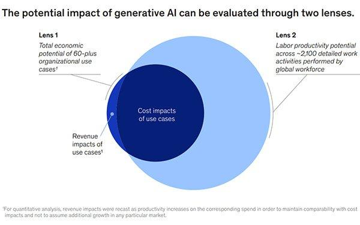

Artificial Intelligence (AI) has emerged as a revolutionary technology, significantly transforming various industries by automating processes, enhancing decision-making, and enabling predictive analytics. AI systems are designed to perform tasks that traditionally require human intelligence, including speech recognition, visual perception, and language translation. These capabilities have led to applications across healthcare, finance, manufacturing, and more, driving efficiency and innovation.

Generative AI, a subset of AI, focuses on creating content indistinguishable from human-produced content. It utilizes techniques such as deep learning and neural networks to generate text, images, and other media autonomously. The potential economic impacts of generative AI are profound, as it can automate content creation, design, and even complex problem-solving tasks across industries, potentially leading to significant changes in business models and job markets.

Algorithmic trading, a critical component of the financial sector, involves using computerized systems to execute trades based on predefined criteria. This technology has evolved with AI advancements, enhancing trading efficiency and profitability. AI algorithms analyze vast datasets at a speed and accuracy level beyond human capability, identifying patterns and making informed trading decisions. The integration of generative AI into algorithmic trading promises to push these enhancements further by developing novel trading strategies and adapting to market changes dynamically.

Understanding how AI intersects with economic sectors is crucial for policymakers and businesses aiming to harness these technologies responsibly. The fusion of AI with economic activities presents opportunities for growth and innovation but also poses challenges, including ethical and regulatory considerations.

The objective of this article is to explore the economic impacts of generative AI, particularly focusing on its influence within algorithmic trading. By examining this intersection, we aim to highlight how generative AI reshapes economic landscapes, offering insights into the opportunities and challenges it presents.

## Table of Contents

## Understanding Generative AI

Generative Artificial Intelligence (AI) is a subfield of AI focused on creating models that can produce new data, simulating variations of the input data while maintaining its inherent characteristics. Unlike traditional AI systems that simply predict outcomes based on input data, generative AI can generate new content, making it a significant innovation in AI technology. The fundamental difference lies in its ability to produce novel and complex patterns without explicit instructions, mimicking creative processes.

Historically, the development of generative AI has progressed through various milestones. One early example is the Generative Adversarial Networks (GANs), introduced by Ian Goodfellow in 2014. GANs utilize two neural networks—a generator and a discriminator—that train simultaneously through adversarial zero-sum games. The generator creates data, and the discriminator evaluates it, enhancing the realism of the generated content over time. Other notable advancements include Variational Autoencoders (VAEs) and Transformer models, both instrumental in advancing generative AI capabilities.

Key technologies in generative AI involve neural networks and [deep learning](/wiki/deep-learning) methodologies. Architectures such as GANs, VAEs, and Transformers exemplify the diverse approaches within the field. GANs consist of two components slated in a min-max game, defined by:

$$

\min_G \max_D V(D, G) = \mathbb{E}_{x \sim p_{data}(x)} [\log D(x)] + \mathbb{E}_{z \sim p_z(z)} [\log(1 - D(G(z)))]
$$

where $D(x)$ distinguishes real from generated data, and $G(z)$ is the generative process. VAEs offer another approach using probabilistic graphical models to infer latent variable distributions, and Transformers provide a sequence-to-sequence mapping in data generation using attention mechanisms.

Generative AI diverges from traditional paradigms by emphasizing creativity and autonomy rather than deterministic output generation or pattern recognition. Traditional AI is typically constraint-based, focusing on classification, clustering, or prediction with fixed rules. In contrast, generative AI models generate non-deterministic outputs, allowing for the creation of new, previously unseen data. 

Applications of generative AI pervade numerous industries. In entertainment, it is used for creating music, art, and virtual environments. In healthcare, it aids in drug discovery and the generation of synthetic patient data for research. The automotive industry uses generative designs in engineering to innovate new vehicle structures optimizing performance and cost. Additionally, it revolutionizes natural language processing, enabling sophisticated language translation and generation tasks, as seen in models like OpenAI's GPT series.

This dynamic evolution of generative AI, driven by continuous enhancement in computational power and algorithms, heralds a transformative era across various sectors, influencing both technological and economic landscapes.

## Economic Impacts of Generative AI

Generative AI, a subset of [artificial intelligence](/wiki/ai-artificial-intelligence) focused on creating content by learning patterns from data, is poised to fundamentally alter the global economic landscape. Its capacity to generate text, images, music, and more has significant implications for economic growth, job markets, business models, innovation, ethics, and economic inequality.

### Influence on Global Economic Growth

Generative AI holds the potential to boost global economic output by automating tasks and enhancing productivity. By reducing the time and resources needed for tasks such as content creation, customer service, and product design, businesses can achieve greater efficiency, leading to increased GDP. According to a report by PwC, AI could contribute up to $15.7 trillion to the global economy by 2030, with generative AI playing a crucial role in this expansion.

### Impact on Job Markets

While generative AI creates opportunities for innovation, it also presents challenges for the job market. Automation of tasks traditionally performed by humans, such as customer service and media production, could result in job displacement. However, it simultaneously generates new roles, particularly in AI development, data analysis, and digital content creation. The key challenge will be the transition for workers displaced by automation, necessitating retraining and adaptation to new roles.

### Influence on Business Models and Competitive Dynamics

Generative AI is reshaping business models across industries. Companies are increasingly leveraging AI to offer personalized experiences, automate customer interactions, and streamline operations. For example, in the fashion industry, AI-driven design tools allow rapid prototyping and customization, fostering competitive advantage. Furthermore, as businesses integrate AI into their operations, the competitive dynamics shift, with early adopters likely gaining a significant edge.

### Ethics and Regulatory Challenges

The integration of generative AI raises critical ethical and regulatory issues. Concerns regarding data privacy, intellectual property, and the potential misuse of AI-generated content need addressing. Regulatory frameworks must evolve to balance innovation with protection against unintended consequences, such as the dissemination of deepfakes or AI-generated misinformation. Policymakers face the challenge of crafting regulations that foster innovation while safeguarding societal interests.

### Addressing Economic Inequalities

Generative AI presents opportunities to address economic inequalities by democratizing access to technology and resources. It can enhance educational and professional opportunities by providing tools and platforms for remote learning and digital entrepreneurship. Moreover, AI can support underserved communities by automating healthcare services and facilitating microloans and financial inclusion. However, the risk of exacerbating existing inequalities remains if access to AI technology and benefits is unevenly distributed.

In conclusion, while generative AI offers transformative economic opportunities, societies must navigate the associated challenges thoughtfully. Balancing innovation with ethical considerations, regulatory oversight, and equitable access will be crucial to maximizing the positive economic impacts of generative AI.

## Generative AI in Algorithmic Trading

Algorithmic trading, a predominant feature in the financial services industry, leverages computer algorithms to execute trades at optimal speeds and prices. This method has revolutionized the trading landscape, accounting for the majority of trades in major financial markets. It enables efficient operations by minimizing human error, reducing transaction costs, and analyzing large data sets at speeds unattainable by human traders.

Generative AI, a recent advancement within AI technologies, is significantly enhancing [algorithmic trading](/wiki/algorithmic-trading). Generative AI models, such as Generative Adversarial Networks (GANs) and Variational Autoencoders (VAEs), are being applied to predict market movements and develop strategies that humans have not considered. Unlike traditional AI methods that rely on pre-defined rules, generative AI can generate new data and solutions, offering a more dynamic and innovative approach to trading.

Examples of generative AI's application in trading include the development of new trading signals through data synthesis, augmentation of existing data to fill gaps, and creation of synthetic financial markets to test trading strategies under controlled conditions. These capabilities are especially valuable given the unpredictable nature of financial markets, which are influenced by countless variables.

Case studies illustrate the successful integration of generative AI in trading. For instance, some hedge funds use generative models for predicting market [volatility](/wiki/volatility-trading-strategies) and [arbitrage](/wiki/arbitrage) opportunities, leading to significant returns. These models are capable of digesting vast amounts of historical and real-time data, uncovering patterns that indicate profitable trades.

The advantages of generative AI in trading are evident. The speed at which these models can process information and execute trades far surpasses human capabilities, ensuring that traders can capitalize on fleeting market opportunities. Furthermore, by enhancing the efficiency of trading operations, firms can reduce costs associated with manual trading processes. Accuracy is another key benefit; generative models refine predictive analytics, improving decision-making processes and minimizing risks associated with market volatility.

Despite its potential, the implementation of generative AI in algorithmic trading is not without challenges. One major issue is the oversight of AI models to ensure they make ethical and sound trading decisions, adhering to the regulatory framework. Additionally, there are risks associated with over-reliance on AI, such as model shortcomings leading to erroneous predictions or failures in rapidly changing market conditions. Moreover, the complexity of these models requires substantial expertise and computational resources, potentially creating barriers to entry for smaller trading firms.

Overall, the introduction of generative AI in algorithmic trading represents a paradigm shift with significant economic implications. As the technology continues to evolve, addressing the associated challenges will be crucial to harnessing its full potential and ensuring fair, reliable, and transparent financial markets.

## Future Outlook for Generative AI and Economic Impact

As generative AI continues to evolve, its future integration across economic sectors presents substantial opportunities and challenges. This transformative technology is anticipated to further permeate industries, driving innovation and creating new market avenues. The potential for automated content creation, personalized experiences, and enhanced decision-making capabilities encompasses sectors as diverse as healthcare, entertainment, finance, and manufacturing. Such integration is likely to yield significant efficiency gains and spur the development of novel products and services.

The emergence of new markets driven by generative AI technologies is one of the most promising aspects. Industries can exploit AI-generated designs, simulations, and virtual models, opening pathways for bespoke products tailored to individual consumer needs. Generative AI could potentially revolutionize sectors like fashion, where AI designs offer endless customization options, or the automotive industry, facilitating rapid prototyping and iterations, leading to quicker time-to-market cycles.

In the long term, generative AI is expected to reshape global economic structures. By enhancing productivity and reducing costs, AI technologies could alter competitive dynamics, leading to widespread economic growth. However, this transformation could also exacerbate existing disparities and necessitate structural adjustments in labor markets. Economies must adapt to shifts in employment patterns, where the demand for AI-related skills may outpace supply. Consequently, investment in education and retraining programs will be vital to mitigate displacement.

Alongside these advancements, the regulatory landscape must evolve to address the ethical and societal implications of generative AI. International cooperation will be crucial to establish comprehensive frameworks that ensure the responsible development and deployment of AI technologies. Policymakers need to collaborate across borders to standardize regulations, promoting transparency and accountability. This also includes addressing privacy concerns and ensuring that AI systems operate within established ethical norms.

Preparing for an AI-driven economic future involves embracing a proactive approach to innovation and regulation. Businesses and policymakers should focus on flexible frameworks that can accommodate rapid technological advancements while safeguarding public interests. Encouraging a collaborative international effort is essential for refining regulatory measures, fostering innovation, and maintaining competitive markets.

In conclusion, the trajectory of generative AI across economic sectors is poised to offer unprecedented opportunities, albeit accompanied by inherent challenges. The balance between fostering innovation and implementing necessary regulations will determine how societies can effectively harness the potential of AI to drive sustainable economic growth. This ongoing evolution underscores the importance of continuous dialogue and research to navigate the complexities of an AI-augmented future.

## Conclusion

In this article, we discussed the profound implications of generative AI on economic domains such as algorithmic trading. Generative AI stands as a transformative force, shaping economic frameworks by enhancing efficiency, innovation, and competitive dynamics. Its influence stretches across job markets, prompting both potential displacement and creation, while also stirring ethical and regulatory conversations. The integration of generative AI into algorithmic trading exemplifies its potential to revolutionize financial markets by improving speed, accuracy, and efficiency.

The economic implications of generative AI are critical for policymakers and businesses. Policymakers must navigate the regulatory challenges posed by rapid AI advancements to ensure ethical use and address economic inequalities potentially exacerbated by AI-driven technologies. Businesses, on the other hand, can leverage generative AI to enhance productivity and foster innovation, which in turn can contribute to economic growth.

Continuous innovation and adaptation are essential in unleashing the full potential of AI technologies while mitigating associated risks. Encouraging further research and dialogue on the economic impacts of AI is vital for devising strategies that could harness AI for societal benefit. As AI technologies continue to evolve, international cooperation and discussions will be crucial in creating balanced regulations that protect public interests while fostering technological progress.

The challenge is to strike a balance between encouraging innovation and establishing regulatory frameworks that prevent misuse and ensure equitable benefits. Successful navigation of these challenges will be instrumental in shaping an AI-driven economic future characterized by sustainable growth and minimal disruption.

## References & Further Reading

[1]: Goodfellow, I., Pouget-Abadie, J., Mirza, M., Xu, B., Warde-Farley, D., Ozair, S., ... & Bengio, Y. (2014). ["Generative Adversarial Networks."](https://arxiv.org/abs/1406.2661) arXiv preprint arXiv:1406.2661.

[2]: ["Advances in Financial Machine Learning"](https://www.amazon.com/Advances-Financial-Machine-Learning-Marcos/dp/1119482089) by Marcos Lopez de Prado

[3]: Devlin, J., Chang, M. W., Lee, K., & Toutanova, K. (2018). ["BERT: Pre-training of Deep Bidirectional Transformers for Language Understanding."](https://aclanthology.org/N19-1423/) arXiv preprint arXiv:1810.04805.

[4]: Radford, A., Wu, J., Child, R., Luan, D., Amodei, D., & Sutskever, I. (2019). ["Language Models are Unsupervised Multitask Learners."](https://cdn.openai.com/better-language-models/language_models_are_unsupervised_multitask_learners.pdf) OpenAI.

[5]: ["Machine Learning for Algorithmic Trading"](https://github.com/PacktPublishing/Machine-Learning-for-Algorithmic-Trading-Second-Edition) by Stefan Jansen