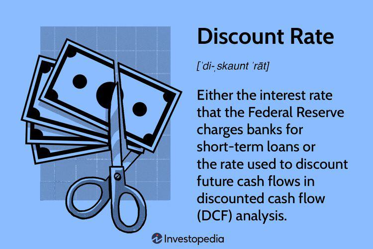

In today's fast-paced financial landscape, understanding the interconnection between key economic variables is crucial. One such key variable is the discount rate, which can significantly impact economic activities and market dynamics. The discount rate, often set by central banks like the Federal Reserve, directly influences borrowing costs for financial institutions, thereby cascading its effects throughout the economy. Changes in this rate can alter consumer interest rates and investment decisions, ultimately shaping economic growth or contraction.

Simultaneously, financial markets have experienced a transformation with the advent of algorithmic trading. These automated systems utilize complex algorithms to execute large volumes of trades at high speeds, reacting almost instantaneously to market conditions and economic data, including shifts in the discount rate. The implications of algorithmic trading extend beyond mere market efficiency; they have the potential to affect market volatility and liquidity, contributing to deeper systemic changes in financial ecosystems.

This article explores the economic impact of the discount rate and its interaction with algorithmic trading within the broader economy. By breaking down these complex concepts, the article aims to elucidate their implications for investors, policymakers, and everyday consumers. Understanding how these elements interlink is crucial for making informed decisions in today's economy. By the end of this article, you'll be equipped with valuable insights into how the discount rate and algorithmic trading influence economic activity and financial markets.

## Table of Contents

## Understanding the Discount Rate

The discount rate is a key component of the Federal Reserve's monetary policy toolkit, critical in influencing the broader financial landscape. It is the interest rate set by the Federal Reserve at which commercial banks and other depository institutions can borrow reserves overnight. This mechanism enables central banks to control the money supply within the economy, thus playing a pivotal role in economic stability and growth.

A foundational aspect of the discount rate is its impact on the cost of borrowing for financial institutions. When the Federal Reserve adjusts the rate, it directly affects the short-term borrowing costs for these institutions. A higher discount rate means increased costs for banks to borrow funds, which are typically passed on to consumers in the form of higher interest rates on loans such as mortgages, car loans, and credit cards. Consequently, elevated borrowing costs can suppress consumer spending and business investments, as both individuals and businesses may find loans less attractive due to the higher interest expense.

Conversely, a reduction in the discount rate can invigorate economic activity by making loans more accessible and affordable. Lower rates reduce the cost of borrowing for banks, allowing them to offer lower interest rates to consumers. This scenario can lead to increased consumer spending and more robust investment from businesses, as the financial environment becomes more conducive to borrowing.

The influence of the discount rate extends beyond mere borrowing costs. It signals the Federal Reserve's stance on monetary policy to the markets. A high rate typically indicates an intent to cool down an overheating economy and control inflationary pressures, reflecting a contractionary policy stance. On the other hand, a lower discount rate suggests an expansionary policy aimed at stimulating economic growth by boosting spending and investment levels.

Ultimately, the discount rate serves as a barometer for the health of the economy, influencing the cost of credit and the dynamics of economic growth. Its adjustment is a deliberate action by the Federal Reserve to either encourage economic expansion or to temper inflation, thus maintaining economic equilibrium. Understanding this intricate mechanism is crucial for stakeholders across the financial spectrum, affecting decisions that range from investment strategies to consumer spending plans.

## Economic Impact of the Discount Rate

High discount rates are commonly employed as a contractionary monetary policy strategy by central banks, particularly aiming to control inflationary pressures. When a central bank raises the discount rate, it effectively increases the cost of borrowing for commercial banks. Consequently, these increased costs are usually passed on to consumers and businesses through higher interest rates on loans and credit. This mechanism restrains consumer spending as higher interest rates make borrowing more expensive, reducing consumers’ inclination to take loans for major purchases such as homes, cars, or education. Additionally, businesses curtail investments in new projects and capital expansion when they face higher borrowing costs, which in turn can lead to slowed economic growth.

For instance, if the discount rate is increased from 2% to 3%, the cost of borrowing rises, leading to a decrease in the money supply in the economy. This phenomenon can be understood using the money demand function, which could be illustrated by the equation: 

$$
M_d = P \cdot \text{L}(i, Y)
$$

where $M_d$ is money demand, $P$ is the price level, $\text{L}(i, Y)$ is a liquidity function of interest rate ($i$) and real output ($Y$). An increase in the interest rate ($i$) reduces liquidity preference and money demand, constraining the money available for spending and investment.

Conversely, reducing the discount rate often signals an expansionary monetary policy aimed at boosting economic growth. Lower discount rates reduce the cost of borrowing for commercial banks. In turn, banks reduce the interest rates for their customers, making loans for consumers and businesses more affordable. This stimulates consumer spending as people are more willing to finance large purchases at lower interest rates. Similarly, businesses are encouraged to expand and invest in new ventures due to the reduced cost of capital, fostering economic growth.

To summarize, high discount rates act as a brake on the economy by increasing borrowing costs, thereby curtailing spending and investment. Lower discount rates act as an economic [accelerator](/wiki/accelerator), lowering borrowing costs, increasing disposable income, and encouraging investment, thus promoting economic activity. Understanding these impacts is crucial for stakeholders, as these decisions affect inflation, unemployment, and overall economic stability.

## Algorithmic Trading and Its Economic Implications

Algorithmic trading, often termed algo trading, leverages sophisticated mathematical models and software to execute trades at high speeds and volumes. It uses pre-defined strategies based on various market variables, automating the buying and selling processes to achieve optimal investment outcomes. The primary aim is to capitalize on market conditions that may be too fleeting for human traders to exploit effectively.

These algorithmic systems offer notable advantages over traditional trading methodologies, particularly their capacity to process and react to large datasets in real-time. By using historical data, statistical analysis, and [machine learning](/wiki/machine-learning), algorithms can swiftly interpret market signals and make informed trading decisions. For instance, in the context of monetary policy, modifications in the discount rate are promptly absorbed by these algorithms, enabling traders to adjust their strategies in anticipation of market shifts.

The proliferation of [algorithmic trading](/wiki/algorithmic-trading) has profound implications for market dynamics, especially concerning [volatility](/wiki/volatility-trading-strategies) and [liquidity](/wiki/liquidity-risk-premium). One critical aspect of algorithmic trading is its potential to amplify volatility, especially during periods of market uncertainty. Algorithms react not only to economic data but also to the trades of others, creating feedback loops that can drive sharp price swings. This characteristic becomes evident during economic events such as [interest rate](/wiki/interest-rate-trading-strategies) announcements, where algorithms may execute large volumes of trades in short timeframes, heightening volatility.

Liquidity, the ease with which assets can be bought or sold without affecting their price, is also influenced by algorithmic trading. While algorithms can enhance liquidity by ensuring continuous market participation, they can also pose risks if trading strategies coincide, leading to short-term illiquidity. For example, during sudden market downturns, if multiple algorithms engage in large-scale selling, it can depress prices rapidly, causing liquidity shortages.

Algorithmic trading's role in financial markets continues to grow, and its influence is palpable across various asset classes. As market participants increasingly adopt these technologies, understanding how they interact with fundamental economic variables like the discount rate becomes essential. With this knowledge, investors, regulatory bodies, and policymakers can better anticipate and manage the potential outcomes of rapid, algorithm-driven trading activities. 

The integration of algorithmic trading into financial ecosystems necessitates robust regulatory frameworks to mitigate associated risks, ensuring that while market efficiency and liquidity improve, they do not come at the expense of stability.

## Interplay Between Discount Rate and Algorithmic Trading

The interplay between the discount rate and algorithmic trading is a complex yet fascinating area within the modern financial ecosystem. When the Federal Reserve adjusts the discount rate, it can have immediate and significant effects on financial markets. This is primarily because algorithmic trading systems, which are designed to execute trades based on pre-defined algorithms, can quickly assimilate such economic data and respond accordingly.

Algorithmic trading systems use mathematical models and statistical techniques to make trading decisions. These systems can be programmed to react almost instantaneously to economic indicators such as changes in the discount rate. For example, a decrease in the discount rate is typically viewed as a signal for lower borrowing costs, which can lead to an increase in asset prices due to heightened investment and consumer spending. Algorithmic trading systems, recognizing this pattern, might escalate buy orders immediately following a rate cut, thereby intensifying upward market movements.

Conversely, an increase in the discount rate might prompt algorithmic trading platforms to initiate sell-off strategies, anticipating higher borrowing costs and reduced economic activity. This rapid response can magnify the initial market reaction, leading to sharper declines in asset prices. The swift actions of these automated systems mean that markets can experience heightened volatility during periods of monetary policy adjustment.

Understanding this interplay is crucial for investors and policymakers. Investors can better position their portfolios to either take advantage of or protect against rapid market changes. Policymakers, on their part, gain insights into potential market responses, allowing them to anticipate the broader economic impact of their decisions. By integrating these insights, stakeholders can make more informed decisions, navigating the challenges of a dynamic financial landscape effectively.

## Real-World Case Studies

Examining historical instances where changes in the discount rate influenced algorithmic trading activities reveals the interplay between monetary policy and modern financial markets. One notable example occurred during the 2007-2008 financial crisis. As the Federal Reserve lowered the discount rate multiple times to stimulate the economy, algorithmic trading systems rapidly adjusted their trading strategies. These systems, designed to capitalize on interest rate changes, responded by reallocating investments and altering purchasing decisions based on anticipated market movements.

The economic impacts of these algorithmic responses were significant. Lowering the discount rate generally aims to reduce borrowing costs and encourage spending and investment. However, the speed at which algorithmic trading systems operate can lead to swift and, sometimes, excessive market reactions. During this period, the volatility in financial markets surged as algorithms executed a high [volume](/wiki/volume-trading-strategy) of trades in response to the Fed's rate adjustments. This increased volatility can distort asset prices and create challenges for traditional investors who may not react as quickly.

Another case study involves the period following the Great Recession when the Federal Reserve introduced a series of rate hikes starting in December 2015. Algorithmic trading strategies were again pivotal in shaping market responses. As rates were incrementally increased, algorithms that capitalized on interest rate differentials adjusted their positions to exploit the anticipated rise in bond yields. This shift led to substantial fluctuations in equity markets and influenced investment trends, as sectors sensitive to interest rate changes, such as real estate and utilities, experienced varied impacts.

To further illustrate the implications of discount rate changes on algorithmic trading, consider the formula for the fundamental valuation of a stock: 

$$
P = \frac{D}{r - g}
$$

where $P$ is the price of the stock, $D$ is the dividend, $r$ is the discount rate, and $g$ is the growth rate of dividends. A decrease in the discount rate $r$ can increase the stock price $P$, assuming other variables remain constant. Algorithmic systems equipped with this understanding can exploit such valuation adjustments in real-time, amplifying market reactions.

These case studies highlight the need for investors and policymakers to anticipate the potential ramifications of discount rate changes on algorithmic trading activities. Recognizing the pace and magnitude of responses by these trading systems can help in developing strategies to mitigate undue market volatility and align investment decisions with the broader economic environment.

## Conclusion

The discount rate serves as a critical component of monetary policy, exerting significant influence over economic activity by affecting both investment and spending. A change in the discount rate alters the cost of borrowing for financial institutions, which subsequently impacts consumer and business spending. When the discount rate increases, borrowing becomes more expensive, potentially slowing down economic activity as consumers and businesses may choose to delay or reduce their spending and investment plans. Conversely, a lower discount rate reduces borrowing costs, encouraging economic expansion through increased consumer expenditure and business investment.

Algorithmic trading introduces an additional layer of complexity to financial markets, functioning through advanced computational algorithms that automatically execute trading decisions based on predefined criteria. These systems are particularly sensitive to changes in economic indicators, such as movements in the discount rate. When the discount rate changes, algorithmic trading systems can react almost instantaneously, leading to swift adjustments in asset prices and market dynamics. This rapid response capability can result in increased market volatility, particularly in periods of significant or unexpected economic announcements.

For stakeholders, including investors, policymakers, and financial institutions, understanding the dynamics between the discount rate and algorithmic trading is invaluable. It equips them to anticipate potential market responses to monetary policy shifts and formulate strategies that mitigate risks and capitalize on opportunities. By recognizing the intricate interactions between these elements, stakeholders can navigate the complexities of the modern economy with greater agility and informed decision-making. Overall, the integration of the discount rate as a monetary tool and the prominence of algorithmic trading in financial markets necessitate a comprehensive understanding to manage their broad economic impacts effectively.

## References & Further Reading

[1]: Bergstra, J., Bardenet, R., Bengio, Y., & Kégl, B. (2011). ["Algorithms for Hyper-Parameter Optimization."](https://papers.nips.cc/paper/4443-algorithms-for-hyper-parameter-optimization) Advances in Neural Information Processing Systems 24.

[2]: ["Advances in Financial Machine Learning"](https://www.amazon.com/Advances-Financial-Machine-Learning-Marcos/dp/1119482089) by Marcos Lopez de Prado

[3]: ["Evidence-Based Technical Analysis: Applying the Scientific Method and Statistical Inference to Trading Signals"](https://www.amazon.com/Evidence-Based-Technical-Analysis-Scientific-Statistical/dp/0470008741) by David Aronson

[4]: ["Machine Learning for Algorithmic Trading"](https://github.com/stefan-jansen/machine-learning-for-trading) by Stefan Jansen

[5]: ["Quantitative Trading: How to Build Your Own Algorithmic Trading Business"](https://www.amazon.com/Quantitative-Trading-Build-Algorithmic-Business/dp/1119800064) by Ernest P. Chan