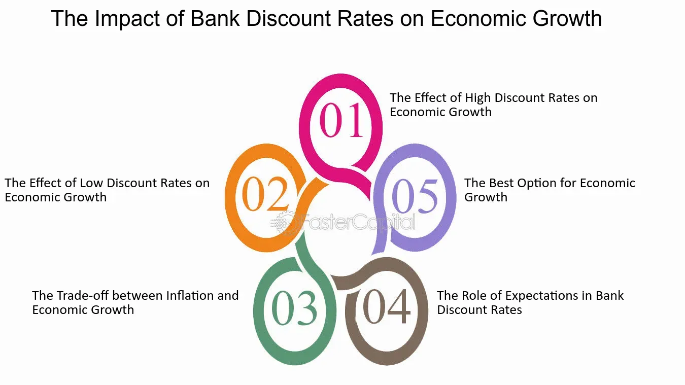

## Table of Contents

## What is a discount rate in economic terms?

In economics, a discount rate is a way to figure out how much future money is worth today. Imagine someone promises to give you $100 next year. Because of things like inflation and the fact that you could invest that money now, that $100 next year is not worth the same as $100 today. The discount rate helps you calculate how much less that future money is worth by turning it into today's dollars.

The discount rate is important for making decisions about investments and projects. For example, businesses use it to see if a new project will be profitable. If the money they expect to make in the future, when discounted back to today, is more than what they need to spend now, then the project might be a good idea. Governments also use discount rates when they plan long-term projects like building roads or bridges, to see if the future benefits are worth the current costs.

## How do high discount rates affect consumer spending?

High discount rates can make people think more about saving money than spending it. When the discount rate is high, the future money is worth a lot less today. So, if someone is thinking about buying something expensive, like a car or a house, they might decide to wait. They might want to save their money now because they think it will be worth more in the future. This means they spend less money on big things right away.

This change in behavior can slow down the economy. When a lot of people decide to save their money instead of spending it, businesses sell less stuff. If businesses are selling less, they might not need to produce as much, which can lead to fewer jobs or lower wages. So, high discount rates can make people more careful with their money, and this carefulness can affect the whole economy by reducing how much people spend and how much businesses grow.

## What are the immediate effects of high discount rates on businesses?

When discount rates are high, businesses feel it right away. They start to think twice about spending money on new projects or expanding because the future money they expect to make is worth a lot less now. So, they might put off buying new equipment or opening new stores. This can slow down their growth and make them more cautious with their money.

Also, high discount rates can make it harder for businesses to borrow money. Banks and lenders might charge more interest because they see the future money as less valuable. This means businesses have to pay more to get loans, which can make it tough for them to do the things they need to do to keep growing. If businesses can't borrow as easily or cheaply, they might have to cut back on their plans or even lay off workers to save money.

## How do high discount rates influence investment decisions?

High discount rates make businesses and people think more about saving money than investing it. When the discount rate is high, the money you might make in the future is worth a lot less today. So, if a company is thinking about starting a new project or buying new machines, they might decide to wait. They might think it's better to keep their money now because it will be worth more later. This can slow down new investments and make businesses more careful with their money.

High discount rates also make borrowing money more expensive. Banks and lenders want more interest when the discount rate is high because they see the money they will get back in the future as less valuable. This means businesses have to pay more to get loans, which can make it harder for them to start new projects or grow. If borrowing is too expensive, companies might choose to save their money instead of investing it, which can slow down the whole economy.

## What is the relationship between high discount rates and inflation?

High discount rates can affect inflation by making people and businesses more careful with their money. When the discount rate is high, future money is worth less today, so people might decide to save more instead of spending. If a lot of people start saving more and spending less, there's less demand for things like cars, houses, and other big purchases. When demand goes down, businesses might not raise prices as much, which can help keep inflation lower.

On the other hand, high discount rates can also make borrowing money more expensive. When it's harder and more costly to borrow, businesses might not want to take out loans to grow or invest in new projects. This can slow down the economy because businesses are not spending as much. If the economy slows down a lot, it might lead to lower inflation or even deflation, where prices actually go down. So, high discount rates can help control inflation by making people save more and spend less, but they can also risk slowing the economy too much.

## How do high discount rates impact the housing market?

High discount rates can make it harder for people to buy homes. When the discount rate is high, it makes future money worth less today. So, if someone is thinking about buying a house, they might decide to wait because they think their money will be worth more later. Also, high discount rates make it more expensive to borrow money. Banks charge more interest on loans when the discount rate is high, which means people have to pay more every month on their mortgages. This can make it tough for people to afford a new home, so fewer people buy houses when discount rates are high.

This change can slow down the whole housing market. When fewer people are buying homes, the demand goes down. If there's less demand, home prices might not go up as fast, or they might even go down. Builders might decide to build fewer new homes because they see that people aren't buying as much. This can lead to a slowdown in the construction industry, too. So, high discount rates can make the housing market less active and can affect home prices and new building projects.

## What are the long-term economic consequences of sustained high discount rates?

If high discount rates last a long time, they can slow down the whole economy. When the discount rate is high, people think that the money they will get in the future is worth a lot less today. This makes them want to save more instead of spending or investing. If a lot of people save their money, businesses sell less stuff, and they might not want to start new projects or grow. This can lead to fewer jobs and slower economic growth. Over time, if businesses keep putting off investments, it can hurt how much the economy can grow in the future.

High discount rates also make borrowing money more expensive. When it's harder and costs more to borrow, businesses might not want to take out loans to expand or start new projects. This can slow down industries like construction and manufacturing. If the economy slows down a lot, it might lead to lower inflation or even deflation, where prices actually go down. This can make people feel like they should wait to buy things, hoping prices will drop even more. Over time, this can create a cycle where the economy stays slow, and people keep saving instead of spending or investing, which can make it hard for the economy to recover and grow.

## How do high discount rates affect international trade and currency valuation?

High discount rates can change how countries trade with each other. When a country has high discount rates, its businesses might not want to borrow money to buy things from other countries. This can make them buy less from abroad, which means less international trade. Also, if a country's discount rate is higher than other countries, its money might be worth more compared to other currencies. This is because investors might want to put their money in that country to get higher returns. But if the country's money becomes too strong, its exports can become more expensive for other countries to buy, which can hurt the country's ability to sell things abroad.

High discount rates can also affect how much a country's money is worth. When a country's discount rate is high, it can make its currency more valuable because people from other countries might want to invest there to get better returns. This can make the country's money stronger compared to other currencies. But if the currency gets too strong, it can make the country's exports more expensive and less competitive in the global market. This might lead to a decrease in exports, which can hurt the country's economy. So, high discount rates can have a big impact on both international trade and how much a country's money is worth.

## Can high discount rates lead to economic recessions? How?

High discount rates can help cause economic recessions by making people and businesses more careful with their money. When the discount rate is high, future money is worth a lot less today. This makes people want to save their money instead of spending it. If a lot of people start saving more and spending less, businesses sell less stuff. When businesses sell less, they might not need to produce as much, which can lead to fewer jobs or lower wages. This can start a cycle where the economy slows down because people have less money to spend, and businesses have less reason to invest or grow.

High discount rates also make borrowing money more expensive. When it's harder and costs more to borrow, businesses might not want to take out loans to start new projects or expand. This can slow down industries like construction and manufacturing. If the economy slows down a lot, it might lead to lower inflation or even deflation, where prices actually go down. This can make people feel like they should wait to buy things, hoping prices will drop even more. Over time, this can create a cycle where the economy stays slow, and people keep saving instead of spending or investing, which can lead to a recession.

## What role do high discount rates play in monetary policy?

High discount rates are an important part of monetary policy. They are used by central banks to control how much money is in the economy. When the discount rate is high, it costs more for banks to borrow money from the central bank. This makes banks charge more interest on loans to people and businesses. When loans are more expensive, people and businesses might borrow less money, which can slow down spending and help control inflation.

High discount rates can also make people save more instead of spending. If people think their money will be worth more in the future, they might hold onto it now. This can make the economy slow down because businesses sell less stuff. If the economy slows down too much, it might go into a recession. So, central banks have to be careful about setting high discount rates because they can help control inflation but might also hurt economic growth if they are too high for too long.

## How do high discount rates affect different sectors of the economy differently?

High discount rates can hit different parts of the economy in different ways. For the housing sector, high discount rates mean it costs more to borrow money for a mortgage. This can make it harder for people to buy houses, so fewer homes get sold. When fewer people are buying, home prices might not go up as fast, or they might even go down. Builders might build fewer new homes because they see that people aren't buying as much, which can slow down the construction industry too.

For businesses, high discount rates can make them think twice about starting new projects or buying new equipment. They might decide to wait because the money they expect to make in the future is worth a lot less now. This can slow down growth in industries like manufacturing and technology. If businesses borrow less money, it can also mean fewer jobs or lower wages, which can affect the whole economy. 

In the financial sector, high discount rates can make banks charge more interest on loans. This can make people save more money in the bank instead of spending it. While this can help banks because they have more money to lend, it can also mean that fewer people want to borrow. This can slow down the financial sector because there's less activity with loans and investments. Overall, high discount rates can make different parts of the economy more careful with their money, which can slow things down.

## What are the theoretical models used to predict the economic impact of high discount rates?

Economists use different models to guess how high discount rates might affect the economy. One common model is the IS-LM model, which looks at how interest rates and spending work together. When discount rates go up, it makes borrowing money more expensive. This can make people and businesses spend less, which can slow down the economy. The IS-LM model helps economists see how changes in interest rates can change how much people spend and invest.

Another model is the Dynamic Stochastic General Equilibrium (DSGE) model. This model tries to predict how the whole economy might change over time when things like discount rates change. It looks at how people make choices about saving and spending, and how businesses decide to invest. When discount rates are high, the DSGE model can show how this might make people save more and businesses invest less, which can lead to slower growth or even a recession.

Both of these models help economists understand how high discount rates can affect different parts of the economy. They show that when it's more expensive to borrow money, people and businesses might be more careful with their money, which can slow down the economy. By using these models, economists can try to predict what might happen and help make better decisions about things like interest rates and spending.

## What is the economic impact of the discount rate?

High discount rates are commonly employed as a contractionary monetary policy strategy by central banks, particularly aiming to control inflationary pressures. When a central bank raises the discount rate, it effectively increases the cost of borrowing for commercial banks. Consequently, these increased costs are usually passed on to consumers and businesses through higher interest rates on loans and credit. This mechanism restrains consumer spending as higher interest rates make borrowing more expensive, reducing consumers’ inclination to take loans for major purchases such as homes, cars, or education. Additionally, businesses curtail investments in new projects and capital expansion when they face higher borrowing costs, which in turn can lead to slowed economic growth.

For instance, if the discount rate is increased from 2% to 3%, the cost of borrowing rises, leading to a decrease in the money supply in the economy. This phenomenon can be understood using the money demand function, which could be illustrated by the equation: 

$$
M_d = P \cdot \text{L}(i, Y)
$$

where $M_d$ is money demand, $P$ is the price level, $\text{L}(i, Y)$ is a liquidity function of interest rate ($i$) and real output ($Y$). An increase in the interest rate ($i$) reduces liquidity preference and money demand, constraining the money available for spending and investment.

Conversely, reducing the discount rate often signals an expansionary monetary policy aimed at boosting economic growth. Lower discount rates reduce the cost of borrowing for commercial banks. In turn, banks reduce the interest rates for their customers, making loans for consumers and businesses more affordable. This stimulates consumer spending as people are more willing to finance large purchases at lower interest rates. Similarly, businesses are encouraged to expand and invest in new ventures due to the reduced cost of capital, fostering economic growth.

To summarize, high discount rates act as a brake on the economy by increasing borrowing costs, thereby curtailing spending and investment. Lower discount rates act as an economic [accelerator](/wiki/accelerator), lowering borrowing costs, increasing disposable income, and encouraging investment, thus promoting economic activity. Understanding these impacts is crucial for stakeholders, as these decisions affect inflation, unemployment, and overall economic stability.

## What are some real-world case studies?

Examining historical instances where changes in the discount rate influenced [algorithmic trading](/wiki/algorithmic-trading) activities reveals the interplay between monetary policy and modern financial markets. One notable example occurred during the 2007-2008 financial crisis. As the Federal Reserve lowered the discount rate multiple times to stimulate the economy, algorithmic trading systems rapidly adjusted their trading strategies. These systems, designed to capitalize on [interest rate](/wiki/interest-rate-trading-strategies) changes, responded by reallocating investments and altering purchasing decisions based on anticipated market movements.

The economic impacts of these algorithmic responses were significant. Lowering the discount rate generally aims to reduce borrowing costs and encourage spending and investment. However, the speed at which algorithmic trading systems operate can lead to swift and, sometimes, excessive market reactions. During this period, the [volatility](/wiki/volatility-trading-strategies) in financial markets surged as algorithms executed a high [volume](/wiki/volume-trading-strategy) of trades in response to the Fed's rate adjustments. This increased volatility can distort asset prices and create challenges for traditional investors who may not react as quickly.

Another case study involves the period following the Great Recession when the Federal Reserve introduced a series of rate hikes starting in December 2015. Algorithmic trading strategies were again pivotal in shaping market responses. As rates were incrementally increased, algorithms that capitalized on interest rate differentials adjusted their positions to exploit the anticipated rise in bond yields. This shift led to substantial fluctuations in equity markets and influenced investment trends, as sectors sensitive to interest rate changes, such as real estate and utilities, experienced varied impacts.

To further illustrate the implications of discount rate changes on algorithmic trading, consider the formula for the fundamental valuation of a stock: 

$$
P = \frac{D}{r - g}
$$

where $P$ is the price of the stock, $D$ is the dividend, $r$ is the discount rate, and $g$ is the growth rate of dividends. A decrease in the discount rate $r$ can increase the stock price $P$, assuming other variables remain constant. Algorithmic systems equipped with this understanding can exploit such valuation adjustments in real-time, amplifying market reactions.

These case studies highlight the need for investors and policymakers to anticipate the potential ramifications of discount rate changes on algorithmic trading activities. Recognizing the pace and magnitude of responses by these trading systems can help in developing strategies to mitigate undue market volatility and align investment decisions with the broader economic environment.

## References & Further Reading

[1]: Bergstra, J., Bardenet, R., Bengio, Y., & Kégl, B. (2011). ["Algorithms for Hyper-Parameter Optimization."](https://papers.nips.cc/paper/4443-algorithms-for-hyper-parameter-optimization) Advances in Neural Information Processing Systems 24.

[2]: ["Advances in Financial Machine Learning"](https://www.amazon.com/Advances-Financial-Machine-Learning-Marcos/dp/1119482089) by Marcos Lopez de Prado

[3]: ["Evidence-Based Technical Analysis: Applying the Scientific Method and Statistical Inference to Trading Signals"](https://www.amazon.com/Evidence-Based-Technical-Analysis-Scientific-Statistical/dp/0470008741) by David Aronson

[4]: ["Machine Learning for Algorithmic Trading"](https://github.com/stefan-jansen/machine-learning-for-trading) by Stefan Jansen

[5]: ["Quantitative Trading: How to Build Your Own Algorithmic Trading Business"](https://www.amazon.com/Quantitative-Trading-Build-Algorithmic-Business/dp/1119800064) by Ernest P. Chan