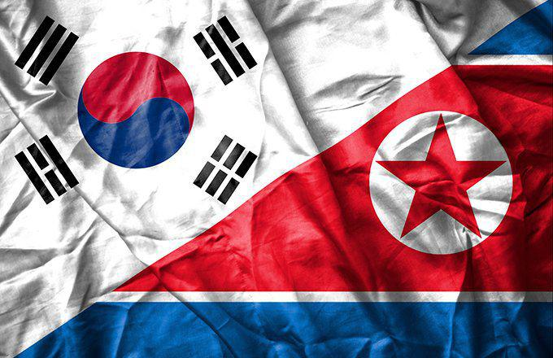

The potential reunification of North and South Korea is a subject that has captured the interest of economists, political analysts, and policymakers worldwide due to its significant geopolitical and economic implications. The peninsula, divided since the end of World War II, presents a stark contrast between North Korea's centrally planned and isolated economy and South Korea's vibrant, free-market system. Merging these two disparate economies presents not only complex challenges but also unprecedented opportunities, especially within the global economic framework.

Reunification could dramatically alter the economic landscape of Northeast Asia, potentially transforming Korea into a formidable economic entity. Economists speculate that a united Korea could leverage North Korea's untapped natural resources and relatively inexpensive labor force alongside South Korea's technological advancements and capital wealth. This synergy could potentially propel a unified Korea to become an economic powerhouse, comparable to major global economies such as Japan or Germany.



A critical area of economic interest lies in algorithmic trading and how it might evolve in a post-reunification Korean economy. The integration of the two economies would likely produce a wealth of new economic data and market conditions, which algorithmic trading platforms could exploit to optimize market efficiencies. This anticipated growth in fintech sectors could lead to significant advancements in automated trading systems and strategies.

This article aims to explore the potential economic impacts of Korean reunification, with a particular emphasis on algorithmic trading. By examining the challenges and opportunities that reunification presents, the analysis will provide insights into the future economic dynamics of a unified Korea and its implications for global markets.

## Table of Contents

## Economic Landscape of North and South Korea

The economic landscape of the Korean Peninsula is marked by stark contrasts between the centrally planned, isolated economy of North Korea and South Korea's dynamic free-market economy. 

North Korea's economy is characterized by its central planning and self-reliance principles (juche), leading to minimal international trade and reliance on government directives rather than market forces. The country remains heavily dependent on industries such as mining, agriculture, and military manufacturing. Despite possessing significant natural resources, including coal, iron ore, and rare earth metals, the full potential of these resources remains largely untapped. International sanctions, aimed at curbing North Korea's nuclear ambitions, exacerbate economic difficulties by restricting foreign trade and investment, thereby stifling growth [1].

Conversely, South Korea exhibits a robust and globally integrated economy, driven by rapid industrialization and advanced technology sectors. From the 1960s onwards, South Korea transitioned from an agrarian economy to a high-tech and industrialized nation, characterized by strong exports, innovation, and a well-educated workforce. Major sectors contributing to economic growth include information technology, automotive, shipbuilding, and petrochemicals. However, challenges persist, such as a stagnating birth rate leading to an aging population, high household debt, and a competitive global market [2].

While South Korea continues to thrive economically, its population's aging could strain public welfare systems and lead to labor shortages, potentially impacting long-term growth. In juxtaposition, integrating underutilized North Korean labor and natural resources presents opportunities for balanced economic evolution across the peninsula.

By comparing these divergent economic structures, one gains insight into the complexities and potential synergies of a unified Korea's economy. The combination of North Korea's untapped resources and labor pool with South Korea's capital and technological prowess could create a complementary economic framework, were reunification to occur.

[1]: [Central Intelligence Agency Factbook - North Korea](https://www.cia.gov/the-world-factbook/countries/korea-north/)
[2]: [OECD Economic Surveys: Korea 2020](https://www.oecd.org/economy/korea-economic-snapshot/)

## Reunification: Opportunities and Challenges

The potential reunification of North and South Korea presents a unique set of opportunities and challenges, which are primarily shaped by the stark economic differences between the two nations. South Korea is characterized by its advanced technological infrastructure and robust capital resources, standing as a global leader in industries such as electronics, automotive, and shipbuilding. In contrast, North Korea, heavily impacted by international sanctions, remains isolated with a centrally planned economy but possesses significant untapped natural resources and a relatively young labor force.

**Opportunities**: 

1. **Resource Synergy**: Integrating South Korea's technological expertise with North Korea's labor and natural resources could create substantial economic synergies. South Korea's strengths in technology and capital could significantly enhance North Korea's economic potential by increasing productivity and enabling the development of industries that are currently underdeveloped due to lack of technology and investment.

2. **Labor Market Expansion**: North Korea's labor force could help alleviate some of the demographic challenges faced by South Korea, such as an aging population. A larger, youthful workforce could drive economic growth and support the expansion of industries that are currently facing labor shortages.

3. **Investment Opportunities**: Post-reunification, North Korea could open up to foreign direct investment, providing lucrative opportunities for both local and international investors. Developing infrastructure, modernizing industries, and tapping into natural resources are potential areas that investors might find attractive.

**Challenges**:

1. **Economic Adjustments**: Reunification would require substantial economic adjustments. The integration of two vastly different economies could lead to short-term instability. Differences in currency, economic policies, and business practices would need to be harmonized.

2. **Social and Political Issues**: Social integration poses a significant challenge as the two nations have been divided for decades, leading to cultural and ideological differences. Political adjustments would also involve creating a governance structure that represents both regions fairly.

3. **Financial Burden**: The financial cost of reunification is potentially enormous. The reconstruction of North Korea's infrastructure and the integration of its economy are expected to require substantial investment. Estimates vary, but the burden could range in hundreds of billions of dollars, necessitating support from international bodies and alliances.

4. **Risk of Economic Disparities**: Bridging the economic gap between the prosperous South and the impoverished North would be crucial to prevent internal economic inequalities. Policies would need to focus on equitable growth to maintain social cohesion.

In conclusion, while reunification holds immense economic promise by potentially transforming the Korean Peninsula into a significant global economic player, it requires careful balancing of opportunities with challenges, necessitating strategic planning and international collaboration.

## Impact of Reunification on the Korean Economy

The reunification of North and South Korea presents an extraordinary opportunity for the region's economic landscape, with the potential to elevate a unified Korea to the status of an economic powerhouse similar to Japan or Germany. The integration of these two diverse economies could unlock multifaceted advantages, fostering a prosperous and influential national economy.

A primary benefit of reunification would be the expansion of the workforce. South Korea currently faces demographic challenges, including an aging population and declining birth rates, which threaten its long-term economic growth. Combining the youthful and sizable labor pool of North Korea with South Korea's technologically advanced industries and capital could counterbalance these demographic issues, leading to increased productivity and innovation.

Moreover, the creation of a larger consumer market would significantly enhance economic potential. North Korea's economic isolation has resulted in a market that is largely untapped. By integrating with South Korea, the resulting market could drive domestic demand, presenting substantial opportunities for growth in consumption and the services sector. This increased demand would likely encourage both domestic and foreign investment, stimulating further economic development.

Importantly, reunification offers the potential for reduced military spending. The ongoing military tension between the North and South demands substantial financial resources from both sides. A peaceful and unified Korea could redirect these resources towards infrastructural development, education, healthcare, and technological advancements, thereby improving the overall standard of living and economic conditions.

In economic terms, let's consider the formula for Gross Domestic Product (GDP):  

$$
\text{GDP} = C + I + G + (X - M)
$$

where:
- $C$ is the consumer spending,
- $I$ is the investment by businesses,
- $G$ is government spending,
- $X$ is exports,
- $M$ is imports.

With reunification, consumer spending ($C$) and government spending ($G$) could increase as the economy stabilizes and grows, due to larger markets and reduced military expenditures, respectively. Furthermore, increased investment ($I$) from both domestic and international sources could accelerate the GDP growth trajectory, setting the stage for a thriving united Korea on the global economic scene.

Overall, the economic impact of Korean reunification holds the promise of transforming the nation into a key economic player, provided the transition is managed effectively with strategic planning and international support.

## Algorithmic Trading in a Reunified Korea

The potential reunification of North and South Korea offers a unique landscape for the development of [algorithmic trading](/wiki/algorithmic-trading), which uses computational algorithms to drive financial transactions based on predetermined criteria. In a reunified Korea, the integration of North Korea's labor resources and South Korea's advanced technological infrastructure could significantly enhance market efficiencies.

The unification of the Korean Peninsula would likely lead to the convergence of financial markets, providing a more extensive database of economic indicators and market behavior. These data sets could be used to refine trading algorithms, potentially increasing accuracy in predicting market movements. For instance, algorithms could be developed to analyze a larger [volume](/wiki/volume-trading-strategy) of economic data, such as commodity prices, demographic shifts, and industrial productivity, which would become accessible post-reunification.

Additionally, economic integration could stimulate growth in fintech sectors, particularly in automated trading platforms. The expanded labor market and consumer base would necessitate more sophisticated financial services, driving demand for innovative trading solutions. These platforms could leverage improvements in telecommunications and internet infrastructure across a unified Korea to facilitate real-time data exchange and algorithm execution.

The increased diversity of economic data sources from both North and South Korea could also enhance [machine learning](/wiki/machine-learning) models used in algorithmic trading. For example, using Python, a basic framework for a machine learning-based trading algorithm might involve data preprocessing steps such as:

```python
import pandas as pd
from sklearn.preprocessing import StandardScaler
from sklearn.model_selection import train_test_split

# Load economic data
data = pd.read_csv('economic_data.csv')

# Preprocess data
features = data.drop('Target', axis=1)
target = data['Target']
scaler = StandardScaler()
features_scaled = scaler.fit_transform(features)

# Split data for training and testing
X_train, X_test, y_train, y_test = train_test_split(features_scaled, target, test_size=0.2, random_state=42)

# The trading model can be further developed using appropriate algorithms such as random forests or neural networks.
```

The convergence of big data analytics and financial technologies in a reunified Korea holds the potential to reshape algorithmic trading strategies profoundly, positioning the country as a leader in the fintech sector. The harmonized economic environment could ensure more seamless implementation of automated trading systems, fostering efficiency and innovation in global markets.

## Geopolitical Impacts and Global Market Reactions

The potential reunification of North and South Korea would likely lead to significant geopolitical shifts within the Asia-Pacific region, influencing the global market landscape. A unified Korea could alter the balance of power, affecting neighboring countries such as China and Japan, and potentially destabilizing existing economic alliances and dynamics.

China, sharing a border with North Korea, has vested interests in the Korean Peninsula's stability. A reunified Korea could shift the strategic balance, possibly reducing China's influence while increasing economic competition. Enhanced infrastructure, resulting from reunification efforts, might facilitate increased trade between Korea and China. However, China may perceive a unified Korea that allies closely with the United States as a strategic threat, potentially leading to diplomatic tensions.

Japan, historically adversarial towards Korea, might view reunification with ambivalence. While economic integration could open new markets and create opportunities for cooperation, political implications may cause concern. The emergence of a unified Korea with significant economic and military capabilities could compel Japan to reevaluate its defense and foreign policies. Improved infrastructure and connectivity in the Korean Peninsula might enhance regional supply chains, benefiting Japan's export-driven economy by reducing costs and delivery times.

The Asian Development Bank (ADB) has highlighted the potential for enhanced infrastructure to facilitate increased cross-border trade. Reunification could lead to major investments in transport networks, such as railways and ports, boosting connectivity throughout the region. This infrastructure expansion would not only enhance trade within Asia but could also link more effectively to global markets, supporting economic growth.

The restructuring of regional supply chains might follow, as a unified Korea could act as a logistical hub, leveraging its strategic location between major economies. Improved infrastructure, coupled with a larger, more diverse economy, may attract international investments, fostering innovation and technological advancement. Consequently, global market reactions could include shifts in supply chain strategies, with corporations seeking to capitalize on new opportunities.

Moreover, the geopolitical shifts induced by reunification could prompt regional and global powers to engage more actively in the Korean Peninsula. Countries might increase their diplomatic and economic engagement to ensure stable relations and benefit from emerging economic prospects. The Organization for Economic Co-operation and Development (OECD) might play a role in facilitating dialogue and cooperation among member countries to mitigate geopolitical tensions and foster economic development.

## Economic Preparations and Risk Management

To prepare for economic [volatility](/wiki/volatility-trading-strategies) and ensure readiness in the financial markets following a potential reunification of North and South Korea, it is crucial to implement robust risk management strategies. Proper risk management can mitigate potential financial disruptions, stabilize markets, and foster investor confidence. One of the initial steps in this process is conducting comprehensive economic impact assessments to understand the potential risks and opportunities that could arise. Financial institutions, governments, and businesses should employ scenario analysis and stress testing to evaluate the impacts of various reunification scenarios on their operations and market positions.

Scenario analysis involves creating multiple potential future states of the economy, considering factors such as changes in regulations, market demand fluctuations, and macroeconomic policies. By understanding these scenarios, stakeholders can develop contingency plans and adjust their portfolios to minimize risk. Stress testing, a complementary strategy, evaluates how financial systems and portfolios perform under adverse economic conditions. This method helps identify vulnerabilities within financial entities and provides insights into necessary capital reserves to withstand economic shocks.

International engagement and investments play a vital role in ensuring a smooth economic transition post-reunification. Attracting foreign direct investment (FDI) can boost economic growth by providing access to capital, technology, and expertise essential for developing infrastructure and industries. Strategic partnerships with countries experienced in managing reunification processes, such as Germany after its reunification, could offer valuable lessons on addressing economic disparities and synchronizing disparate economic systems.

Additionally, international organizations like the International Monetary Fund (IMF) and World Bank could provide financial and advisory support, aiding in short-term economic stabilization and long-term development plans. Building a collaborative framework for trade and investment with neighboring countries and major economic powers could further facilitate the integration of a reunified Korea into the global economy.

Implementing advanced risk management frameworks in financial markets, such as the Basel III guidelines, can enhance the stability and resilience of Korean financial institutions. These frameworks advocate for higher capital requirements, enhanced risk assessment procedures, and improved regulatory oversight, helping to safeguard against systemic risks during the reunification process.

In summary, preparing for potential economic volatility following Korean reunification involves a comprehensive approach that includes scenario analysis, stress testing, international engagement, and advanced risk management practices. A focus on these elements can help stabilize markets, attract necessary investments, and guide the combined economy toward sustainable growth.

## Conclusion

The prospect of Korean reunification, while still speculative, is one laden with profound economic promise. The integration of the Korean Peninsula could pave the way for a significant shift in global economic power and market dynamics. A unified Korea could leverage its combined resources—technological prowess and capital from the South with natural resources and labor from the North—potentially transforming it into an economic powerhouse. 

The potential benefits are vast, ranging from a larger workforce and a broader consumer market to reduced military expenditures, all of which could enhance economic productivity and growth. The ripple effects of such economic expansion are anticipated to influence not only domestic markets but also Asia-Pacific geopolitical stability and global trade networks. 

In this dynamic landscape, economic integration may stimulate advancements in sectors such as technology and finance, fostering innovation and efficiency. This is particularly evident in areas such as algorithmic trading, where enhanced data-driven decisions could harness market efficiencies resulting from the economic convergence of the two economies. 

Ultimately, while the path to reunification involves navigating complex socio-political and economic challenges, the potential dividends for Korea and the global community are notable. Korean reunification represents a beacon of potential economic transformation and a harbinger of new market opportunities.

## References & Further Reading

[1]: Eberstadt, N., & Banister, J. (2011). "The Population of North Korea: How Do They Live and How Are They Surviving?" In "The North Korean Economy: Between Crisis and Catastrophe."

[2]: [Central Intelligence Agency Factbook - North Korea](https://www.cia.gov/the-world-factbook/countries/korea-north/)

[3]: [OECD Economic Surveys: Korea 2020](https://www.oecd.org/en/publications/oecd-economic-surveys-korea-2020_2dde9480-en.html)

[4]: Yoon, B. S. (1990). "The Korean Reunification Issue: Past, Present, and Future." Asian Affairs: An American Review.

[5]: Schüller, M., & Volz, U. (2011). "Reunification of Korea: Economic Adjustments and Overcoming Past Legacies in Germany." In Suh, J. J. (Ed.), "The North Korean Economy: Between Crisis and Catastrophe."

[6]: Barro, R. J. (1996). "Economic Growth in a Cross Section of Countries." The Quarterly Journal of Economics. 

[7]: Chang, H. J. (2007). "Bad Samaritans: The Myth of Free Trade and the Secret History of Capitalism." Bloomsbury Press.

[8]: William Lee, W. (2012). "Algorithmic Trading and DMA: An Introduction to Direct Access Trading Strategies." London: 4Myeloma Press.