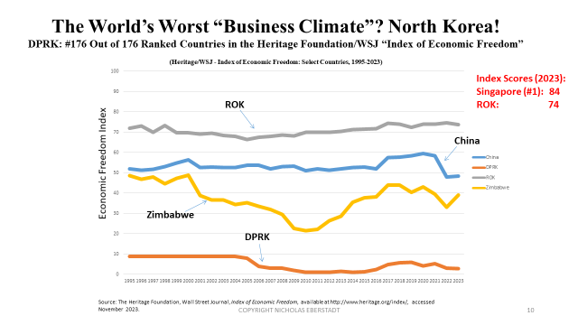

## Table of Contents

## What is Korean reunification?

Korean reunification is the idea of bringing North Korea and South Korea back together as one country. Right now, they are two separate countries with different governments and ways of life. North Korea is a communist country, and South Korea is a democratic country. Many people think that reuniting the two Koreas could bring peace and help the people in both countries live better lives.

However, reunification is very hard to achieve. There are big differences between the two countries, like their economies and political systems. North Korea has a lot of problems, like poverty and human rights issues. South Korea is much richer and more developed. If the two countries were to reunite, it would be a huge challenge to make everything work together. Still, many people hope that one day, Korea can be one country again.

## Why is Korean reunification considered economically significant?

Korean reunification is considered economically significant because it could bring big changes to both North and South Korea. Right now, North Korea is very poor and its economy is not doing well. If the two countries reunite, South Korea's richer economy could help North Korea grow and develop. This could mean better jobs, more money, and a higher standard of living for people in North Korea. It could also open up new markets and opportunities for businesses in both countries.

However, reunification would also be very expensive and challenging. South Korea would need to spend a lot of money to help North Korea catch up. This includes building new roads, schools, and hospitals, and helping North Korean workers learn new skills. It could take many years and a lot of effort to make the economies of the two countries work well together. Despite these challenges, many people believe that the long-term benefits of a united Korea could be worth it.

## What are the current economic conditions in North and South Korea?

North Korea's economy is very poor. The country has a lot of problems like not enough food, bad infrastructure, and not many jobs. Most people in North Korea live in poverty. The government controls almost everything, and it's hard for the country to trade with other countries because of sanctions. These sanctions are rules that other countries have put in place to try to stop North Korea from making nuclear weapons. Because of this, North Korea struggles to grow and develop its economy.

South Korea, on the other hand, has a strong and rich economy. It is one of the biggest economies in the world. South Korea is known for its technology, cars, and other products that it sells to other countries. The people in South Korea have a high standard of living, with good jobs, schools, and healthcare. The government in South Korea works to help businesses grow and to make life better for its citizens. The difference between the economies of North and South Korea is very big.

## What are the potential immediate economic costs of reunification?

If North and South Korea reunite, it would cost a lot of money right away. South Korea would have to spend a lot to help North Korea. They would need to fix roads, build new hospitals and schools, and give people in North Korea jobs and food. It would also cost money to help North Korean workers learn new skills so they can work in South Korea's economy. All of this would be very expensive and could take a long time.

Another big cost would be dealing with the different money systems. North Korea and South Korea use different money, so they would need to figure out how to make one money system for both countries. This would be hard and could cause problems. Also, South Korea might have to pay for a lot of the costs of reunification, which could make their own economy struggle for a while. Even though it would be hard, many people think that the long-term benefits of reuniting could be worth it.

## How might reunification affect South Korea's economy in the short term?

In the short term, reunification could put a lot of strain on South Korea's economy. South Korea would need to spend a lot of money to help North Korea. This means building new roads, hospitals, and schools in North Korea, and giving people there food and jobs. South Korea might have to borrow money or use money that could have been spent on other things. This could slow down South Korea's own economy and make life harder for people there for a while.

Also, bringing the two different economies together would be hard. North Korea and South Korea use different money, so they would need to make one money system for both countries. This would be confusing and could cause problems. South Korea's businesses might also have to help North Korean workers learn new skills, which would cost more money and time. Even though it would be tough, many people believe that helping North Korea could be good for everyone in the long run.

## What are the potential long-term economic benefits of reunification for the Korean Peninsula?

In the long run, reuniting North and South Korea could bring a lot of good things for the whole Korean Peninsula. If North Korea gets help from South Korea, it could grow and develop a lot. This means more jobs, better schools, and hospitals for people in North Korea. It could also mean that businesses in both countries can work together and make more money. A united Korea could become a bigger and stronger economy, helping everyone live better lives.

Another big benefit could be more trade and new markets. Right now, North Korea can't trade with many countries because of sanctions. If the countries reunite, these sanctions could go away, and North Korea could start selling things to other countries. This would help their economy grow. South Korea could also use North Korea's resources and land to make more things and sell them. Over time, a united Korea could become a very important part of the world's economy.

## What economic challenges might arise during the integration process?

During the integration process, one big challenge would be making the two different economies work together. North Korea's economy is very poor and not well developed. South Korea's economy is rich and modern. It would be hard to combine these two very different systems. South Korea would need to spend a lot of money to help North Korea catch up. This means building new roads, schools, and hospitals, and helping North Korean workers learn new skills. It would take a lot of time and money to make the economies work well together.

Another challenge would be dealing with the different money systems. North Korea and South Korea use different money, so they would need to make one money system for both countries. This would be confusing and could cause problems. It might be hard for people to understand the new money and how to use it. Also, South Korea might have to pay for a lot of the costs of reunification, which could make their own economy struggle for a while. Even though it would be hard, many people think that the long-term benefits of reuniting could be worth it.

## How could the international community's economic policies impact Korean reunification?

The international community's economic policies could have a big impact on Korean reunification. Right now, North Korea faces a lot of sanctions from other countries. These sanctions make it hard for North Korea to trade and grow its economy. If the countries reunite, these sanctions might go away. This could help North Korea's economy a lot. But, it would also depend on how other countries react to reunification. If they keep some sanctions or make new rules, it could still be hard for a united Korea to do well.

Another way international policies could affect reunification is through help and support. If other countries give money and resources to help North and South Korea come together, it could make the process easier. For example, if countries help pay for building new roads and schools in North Korea, it would not be as hard for South Korea to do it alone. But, if other countries do not help or even try to stop reunification, it could make things much harder and more expensive. So, what other countries do with their economic policies will be very important for how well reunification goes.

## What lessons can be learned from the German reunification experience?

When East and West Germany reunited in 1990, it was a big challenge. West Germany was rich and had a strong economy, while East Germany was poor and not as developed. West Germany had to spend a lot of money to help East Germany catch up. They built new roads, schools, and hospitals, and helped East German workers learn new skills. It was very expensive and took a long time. Many people in West Germany had to pay more taxes to help pay for it. This made life harder for them for a while.

But, over time, reunification brought a lot of good things. East Germany's economy got better, and people there started to live better lives. The whole country became stronger and more united. One big lesson from Germany is that reunification can be very hard and expensive in the short term. But, if everyone works together and keeps trying, it can bring a lot of benefits in the long run. Another lesson is that it's important to plan carefully and get help from other countries if you can. This can make the process easier and help everyone do better in the end.

## What are the proposed economic models for a reunified Korea?

One idea for a reunified Korea is to use a market economy model, like the one in South Korea. In this model, businesses can make their own choices about what to make and sell. People can also choose where they want to work. This could help North Korea grow and develop faster because it would be more like South Korea's economy. But, it would be hard for North Korea to change from their current system where the government controls everything. South Korea would need to help North Korea learn how to work in a market economy.

Another idea is to use a mixed economy model. This would be a mix of the market economy in South Korea and the planned economy in North Korea. The government would still control some things, but businesses would have more freedom. This could help North Korea change more slowly and carefully. It might be easier for people in North Korea to understand and work with. But, it could also take longer for the economy to grow and for people to start living better lives. Either way, it would take a lot of planning and help from South Korea to make it work.

## How might reunification influence regional economic dynamics in East Asia?

If North and South Korea reunite, it could change a lot of things in East Asia. A united Korea would be a bigger and stronger country. This could make other countries in the area, like China and Japan, want to work with Korea more. They might want to trade more with Korea because it would be a bigger market. But, it could also make some countries worried. They might be scared that a united Korea would be too powerful and could cause problems. So, other countries would need to think carefully about how to work with a united Korea.

Also, reunification could help the whole region grow. If North Korea's economy gets better, it could mean more trade and more money for everyone. Other countries might want to help Korea reunite because it could be good for them too. But, it would take a lot of time and work. Countries in East Asia would need to help Korea and work together to make sure everyone benefits. In the end, a united Korea could make East Asia a stronger and richer place.

## What are the expert opinions on the feasibility and economic timeline of Korean reunification?

Many experts think that Korean reunification is a big challenge but not impossible. They say it would take a lot of time and money to make it happen. Some experts believe it could take 20 to 30 years for North and South Korea to come together and for their economies to work well together. They think South Korea would need to spend a lot of money to help North Korea catch up. This means building new roads, schools, and hospitals, and helping North Korean workers learn new skills. It would be very hard, but many experts think it could be worth it in the end.

Other experts are more cautious. They say that the big differences between North and South Korea's economies and ways of life make reunification very hard. They worry that it could take even longer than 30 years, maybe 50 years or more, to make everything work together. Some experts also think that other countries might not help as much as they need to. They say that without a lot of help from other countries, it could be even harder and take more time. But, even these experts agree that if everyone works together and keeps trying, reunification could happen one day.

## What is the impact of reunification on the Korean economy?

The reunification of North and South Korea presents an extraordinary opportunity for the region's economic landscape, with the potential to elevate a unified Korea to the status of an economic powerhouse similar to Japan or Germany. The integration of these two diverse economies could unlock multifaceted advantages, fostering a prosperous and influential national economy.

A primary benefit of reunification would be the expansion of the workforce. South Korea currently faces demographic challenges, including an aging population and declining birth rates, which threaten its long-term economic growth. Combining the youthful and sizable labor pool of North Korea with South Korea's technologically advanced industries and capital could counterbalance these demographic issues, leading to increased productivity and innovation.

Moreover, the creation of a larger consumer market would significantly enhance economic potential. North Korea's economic isolation has resulted in a market that is largely untapped. By integrating with South Korea, the resulting market could drive domestic demand, presenting substantial opportunities for growth in consumption and the services sector. This increased demand would likely encourage both domestic and foreign investment, stimulating further economic development.

Importantly, reunification offers the potential for reduced military spending. The ongoing military tension between the North and South demands substantial financial resources from both sides. A peaceful and unified Korea could redirect these resources towards infrastructural development, education, healthcare, and technological advancements, thereby improving the overall standard of living and economic conditions.

In economic terms, let's consider the formula for Gross Domestic Product (GDP):  

$$
\text{GDP} = C + I + G + (X - M)
$$

where:
- $C$ is the consumer spending,
- $I$ is the investment by businesses,
- $G$ is government spending,
- $X$ is exports,
- $M$ is imports.

With reunification, consumer spending ($C$) and government spending ($G$) could increase as the economy stabilizes and grows, due to larger markets and reduced military expenditures, respectively. Furthermore, increased investment ($I$) from both domestic and international sources could accelerate the GDP growth trajectory, setting the stage for a thriving united Korea on the global economic scene.

Overall, the economic impact of Korean reunification holds the promise of transforming the nation into a key economic player, provided the transition is managed effectively with strategic planning and international support.

## References & Further Reading

[1]: Eberstadt, N., & Banister, J. (2011). "The Population of North Korea: How Do They Live and How Are They Surviving?" In "The North Korean Economy: Between Crisis and Catastrophe."

[2]: [Central Intelligence Agency Factbook - North Korea](https://www.cia.gov/the-world-factbook/countries/korea-north/)

[3]: [OECD Economic Surveys: Korea 2020](https://www.oecd.org/en/publications/oecd-economic-surveys-korea-2020_2dde9480-en.html)

[4]: Yoon, B. S. (1990). "The Korean Reunification Issue: Past, Present, and Future." Asian Affairs: An American Review.

[5]: Schüller, M., & Volz, U. (2011). "Reunification of Korea: Economic Adjustments and Overcoming Past Legacies in Germany." In Suh, J. J. (Ed.), "The North Korean Economy: Between Crisis and Catastrophe."

[6]: Barro, R. J. (1996). "Economic Growth in a Cross Section of Countries." The Quarterly Journal of Economics. 

[7]: Chang, H. J. (2007). "Bad Samaritans: The Myth of Free Trade and the Secret History of Capitalism." Bloomsbury Press.

[8]: William Lee, W. (2012). "Algorithmic Trading and DMA: An Introduction to Direct Access Trading Strategies." London: 4Myeloma Press.