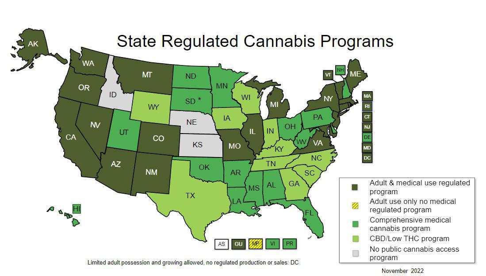

The cannabis industry is experiencing a transformative period, marked by significant legislative and economic changes in the United States. As more states move towards legalizing marijuana, this shift is not just a social or cultural milestone but an economic one as well, ushering in a myriad of benefits and opportunities. For instance, marijuana legalization is increasingly recognized for its potential to generate substantial tax revenues, alleviate enforcement costs, and spur job creation. These economic benefits are reshaping state economies and broadening the horizons for investors.

This article examines the multifaceted impacts of cannabis legalization, analyzing its influence on economic growth and the emerging role of algorithmic trading in this sector. The potential fiscal benefits are substantial, with legal cannabis sales contributing billions in tax revenue to state coffers. This transformation is also reflected in the labor market, where there is a surge in employment opportunities within cannabis-related industries, such as cultivation facilities, dispensaries, and ancillary services.



Furthermore, the legalization of cannabis provides a fertile ground for investment, attracting both individual and institutional investors seeking to capitalize on the burgeoning market. Despite federal restrictions, these investments are facilitated by the growing presence of publicly-traded cannabis firms and exchange-traded funds (ETFs), presenting diverse avenues for potential high returns.

As the cannabis industry continues to evolve, understanding the economic implications of its legalization is crucial for stakeholders, including policymakers, investors, and communities. The intersection of cannabis and algorithmic trading adds a layer of complexity and opportunity, as trading technologies offer sophisticated means to navigate the volatility and regulatory dynamics that characterize this emerging sector. Through this exploration, we aim to provide comprehensive insights into how cannabis legalization is reshaping the economic landscape, offering both promising opportunities and prompting critical considerations.

## Table of Contents

## The Economic Impact of Marijuana Legalization

Legalizing cannabis has significantly impacted state economies across the United States, primarily through the generation of substantial tax revenue. The states of California and Colorado serve as prime examples of the fiscal benefits that accompany marijuana legalization. In California, the legal cannabis market has rapidly expanded since the legalization of recreational use in 2016. According to the California Department of Tax and Fee Administration, the state collected over $1 billion in cannabis tax revenue in 2020 alone.\cite{1} Similarly, Colorado, which legalized recreational marijuana in 2012, reported over $387 million in revenue from marijuana taxes, licenses, and fees in 2020.\cite{2} These financial inflows have been instrumental in funding various public services, including education, health care, and infrastructure development.

The tax revenue generated by legal cannabis sales is not only substantial but also continuously growing. Nationally, cannabis sales are anticipated to reach $41 billion by 2025, suggesting a corresponding increase in tax revenue.\cite{3} This steady growth underscores the potential of cannabis legalization to be a major economic engine for state governments.

Beyond tax revenue, the legalization of cannabis has led to a surge in employment opportunities. The cannabis industry has created jobs across diverse sectors such as cultivation, processing, manufacturing, distribution, and retail. According to the 2021 Leafly Jobs Report, the legal cannabis industry supported over 321,000 full-time jobs in the United States, marking a 32% increase in cannabis employment from the previous year.\cite{4} In particular, roles in nurseries, dispensaries, and other related businesses have contributed significantly to employment growth.

Moreover, cannabis legalization positively impacts secondary economic activities. It enhances consumer spending and job creation within ancillary industries, such as legal services, real estate, construction, and marketing. The demand for commercial real estate has increased as businesses seek spaces for cultivation facilities and retail dispensaries, benefiting local economies and promoting ancillary economic activity.

In conclusion, the economic impact of marijuana legalization spans multiple spheres, primarily through substantial tax revenue, increased employment opportunities, and strengthened secondary industries. As more states consider legalization, these economic benefits could potentially extend nationwide, contributing significantly to broader economic growth.

## Algorithmic Trading and Cannabis Industry

Algorithmic trading, a method of executing orders using automated pre-programmed trading instructions, is increasingly influential in equity markets, including cannabis stocks. This system relies on complex mathematical models and high-speed computer programs to decide on the timing, price, and quantity of stock trades. The cannabis industry, characterized by its volatile market dynamics, presents unique challenges and opportunities for traders using algorithmic approaches.

Cannabis stocks are notoriously volatile due to the sector's sensitivity to regulatory changes and evolving market perceptions. Algorithms are particularly adept at managing this [volatility](/wiki/volatility-trading-strategies), analyzing large datasets at speeds far surpassing human capabilities. By scanning market signals, trading algorithms can execute swift trades that capitalize on price fluctuations triggered by regulatory announcements or other newsworthy events. For instance, when a state announces legislation that affects cannabis policy, prices of related stocks can fluctuate rapidly. Algorithms are designed to react to such information in real-time, enabling traders to optimize their buy and sell strategies.

An important development in the cannabis trading landscape is the emergence of cannabis-focused Exchange-Traded Funds (ETFs). These funds bundle a variety of cannabis-related assets, offering diversified investment risk while still granting exposure to the sector. Algorithmic trading technologies manage these funds, balancing portfolios in response to continuous shifts in stock performance and market predictions. The automation inherent in these technologies ensures efficient fund management, adjusting investment weights and executing trades more frequently than would be feasible manually.

Algorithmic trading strategies are tailored to handle the idiosyncrasies of marijuana stocks. Algorithms may incorporate predictive analytics, employing techniques such as [machine learning](/wiki/machine-learning) to forecast price movements based on historical data. For example, they might use regression analysis to identify correlations between cannabis stock prices and external factors, such as changes in regulatory environments or economic indicators.

Below is a simplified version of what such a predictive model might look like in Python, using linear regression:

```python
import numpy as np
from sklearn.linear_model import LinearRegression

# Example data: historical price changes and regulatory news sentiment scores
price_changes = np.array([[3.2], [2.1], [-1.2], [0.5], [2.6], [-0.9]])
sentiment_scores = np.array([1, 0.8, -0.3, 0.2, 0.9, -0.5])

# Create a linear regression model
model = LinearRegression()

# Train the model
model.fit(sentiment_scores.reshape(-1, 1), price_changes)

# Predict future price changes based on news sentiment
future_sentiment = np.array([[1.5]])
predicted_price_change = model.predict(future_sentiment)

print(predicted_price_change)
```

In conclusion, [algorithmic trading](/wiki/algorithmic-trading) is pivotal in navigating the rapidly changing and often unpredictable terrain of the cannabis industry. By leveraging sophisticated algorithms, traders can effectively respond to market conditions driven by regulatory developments and other influential factors, ensuring that the cannabis sector remains an appealing and dynamic arena for investment.

## Investment Opportunities in the Cannabis Sector

Legal marijuana presents an array of promising investment opportunities both locally and nationally. As the cannabis sector continues to evolve, investors can explore a range of avenues that promise potentially high returns, notwithstanding the existing federal restrictions.

Despite being federally classified as a Schedule I substance under the Controlled Substances Act, which limits traditional banking services and creates regulatory challenges, the cannabis industry has thrived through innovative financial models and niche investment opportunities. Entrepreneurs have capitalized on state-level legalizations, creating a burgeoning market ripe for investment. In this environment, cannabis-related businesses can offer investors a pathway to capitalize on early-stage sector growth similar to the tech boom.

Publicly-traded cannabis companies and Exchange-Traded Funds (ETFs) substantially lower the barrier to entry for individual investors in the market. Cannabis ETFs, in particular, provide diversified exposure to the sector, pooling investments across multiple companies involved in different facets of the industry, such as cultivation, distribution, and biotechnology. Notable ETFs like the ETFMG Alternative Harvest [ETF](/wiki/etf-trading-strategies) (MJ) allow investors to hedge against the risks inherent in investing in single stocks while still taking advantage of the sector's growth prospects.

The investment landscape, however, is not without its challenges. Regulatory changes remain a notable risk [factor](/wiki/factor-investing) that can substantially influence market conditions. Policies at both the state and federal levels affect market dynamics, which in turn impacts stock valuations and investment returns in the cannabis sector. Algorithmic trading emerges as a powerful tool for investors in this volatile environment, enabling them to create strategies that adapt swiftly to regulatory news and market changes. Algorithms can be programmed to analyze large datasets for patterns, allowing timely buy-and-sell decisions that maximize returns while minimizing risks associated with sudden policy shifts.

In conclusion, the cannabis sector offers robust investment opportunities within a dynamic regulatory framework. By leveraging tools such as algorithmic trading and diversifying through ETFs, investors can navigate potential risks while positioning themselves to benefit from the continued growth and legalization [momentum](/wiki/momentum) within the industry.

## Economic Benefits and Social Costs

The legalization of marijuana offers substantial economic benefits that are becoming increasingly evident across various states in the United States. One of the most significant advantages is the increase in state income. Legal cannabis markets generate substantial tax revenues—a crucial fiscal stimulus that supports public services and infrastructure. For instance, states like Colorado have reported hundreds of millions of dollars in tax revenue from cannabis sales, which are then reinvested into public health, education, and safety programs.

Additionally, the legalization of marijuana affects real estate dynamics, often leading to increased house prices. As cannabis-related businesses proliferate, there is a heightened demand for commercial real estate to accommodate dispensaries and cultivation facilities. This demand can boost property values in areas zoned for cannabis commerce. Furthermore, regions with legal cannabis laws tend to experience population growth as individuals migrate to access job opportunities within the cannabis sector or simply to reside in a state with legal marijuana.

While the economic benefits are considerable, states must also acknowledge and address the potential social costs associated with marijuana legalization. Challenges such as substance abuse can emerge, necessitating the implementation of effective public health strategies and social support systems. Research indicates that increased availability may lead to higher consumption rates, which could exacerbate issues related to addiction and health among vulnerable populations.

Homelessness is another pressing concern. Some regions have reported a correlation between marijuana legalization and increased homelessness, although this relationship is complex and influenced by multiple factors beyond cannabis laws alone. It suggests the need for comprehensive policy responses that consider housing, public health, and social welfare in an integrated manner.

In conclusion, while the economic benefits of marijuana legalization are clear, such as increased state revenue and growth in housing markets, the accompanying social costs, including potential increases in substance abuse and homelessness, must be thoughtfully managed. Policymakers must balance these factors to develop effective and equitable legalization policies that maximize benefits while minimizing social drawbacks. This balanced approach is crucial for ensuring that the positive economic impacts do not overshadow the need for strong social safeguards.

## Conclusion

Marijuana legalization presents a significant opportunity for economic growth, with benefits that include increased job creation and substantial tax revenues. These economic advantages underscore the potential for the cannabis industry to contribute to state and national economies. Moreover, the advent of algorithmic trading has enhanced this sector by allowing investors to optimize their strategies, thereby navigating the distinctive challenges posed by cannabis stocks' volatility and regulatory dynamics. 

The journey towards nationwide legalization, however, remains complex. It involves a delicate balance between tapping into financial potentials and addressing social responsibilities. Policymakers must consider not only the economic gains but also the social implications, such as public health and safety. This multifaceted approach is crucial for crafting policies that ensure sustainable development of the cannabis sector.

Investors face the task of maneuvering through an evolving regulatory landscape, where algorithmic trading can serve as a valuable tool in mitigating risks associated with market volatility. By leveraging advanced trading technologies, investors can better respond to rapid changes and seize investment opportunities as they arise. 

To fully harness the industry’s potential, stakeholders—from investors to policymakers—must collaborate to address the diverse challenges posed by marijuana legalization. This cooperation will be key to ensuring the cannabis industry reaches its full economic and social potential, while also safeguarding community welfare and adapting to changing legislations.

## References & Further Reading

[1]: Light, M. K., Orens, A., Lewandowski, B., & Pickton, T. (2020). ["Market Size and Demand for Marijuana in Colorado 2020 Market Update."](https://sbg.colorado.gov/sites/sbg/files/documents/Market%20Size%20and%20Demand%20Study%2C%20July%209%2C%202014%5B1%5D_0.pdf) Colorado Department of Revenue.

[2]: California Department of Tax and Fee Administration. ["California’s Cannabis Tax Revenues."](https://www.cdtfa.ca.gov/Industry/cannabis/)

[3]: Leafly. (2021). ["Leafly Jobs Report 2021."](https://www.leafly.com/news/industry/cannabis-jobs-report-2021)

[4]: Federal Reserve Bank of St. Louis. ["Marijuana Legalization and Its Economic Impacts"](https://www.stlouisfed.org/publications/regional-economist/first-quarter-2020/states-legalize-marijuana-economics)

[5]: Wallace, H., Troutman, W. P. (2021). ["The Economic Impacts of State Marijuana Legalization"](https://cdpsdocs.state.co.us/ors/docs/reports/2021_SB13-283_Rpt.pdf) Congressional Research Service.