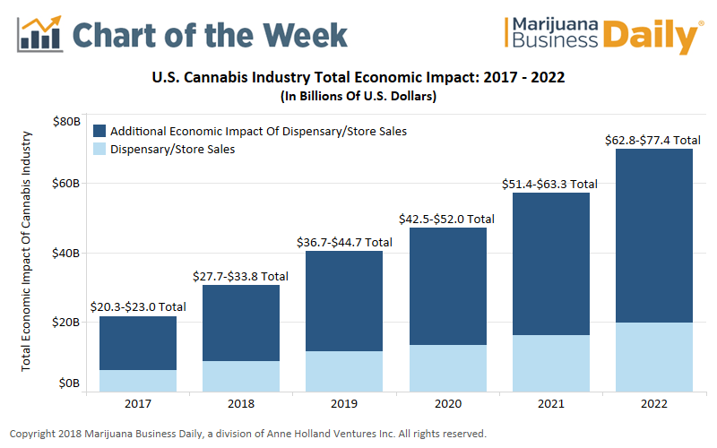

## Table of Contents

## What is marijuana legalization?

Marijuana legalization means making it legal to use, sell, and grow marijuana. This can be for medical reasons, where people use it to help with health problems, or for recreational reasons, where people use it just for fun. Many places around the world are starting to change their laws about marijuana because more people are learning about its benefits and risks.

When a place legalizes marijuana, it usually sets up rules about who can use it, how much they can have, and where they can use it. For example, some places only let adults use it, and they might not allow it in public places like parks or schools. Legalization also means the government can tax marijuana, which can bring in money to help pay for things like schools and roads. But, there are still debates about whether legalization is a good idea because some people worry about the effects on health and society.

## How does marijuana legalization affect state economies?

Marijuana legalization can bring a lot of money into state economies. When states make marijuana legal, they can tax it. This means they get money every time someone buys marijuana. This tax money can be used to pay for things like schools, roads, and health programs. Also, when marijuana is legal, new businesses can start up. These businesses create jobs for people, which helps the economy grow. More jobs mean more people have money to spend, which can help other businesses too.

However, there are also some challenges. Legalizing marijuana can lead to more people using it, which might increase costs for things like health care and law enforcement. If a lot of people start using marijuana and have problems, the state might have to spend more money to help them. Also, if the rules about marijuana are not clear or if other states nearby do not allow it, it can be hard for businesses to know what to do. This can make it harder for the economy to benefit from legalization.

## What are the tax revenues generated from legal marijuana sales?

When states legalize marijuana, they can earn a lot of money from taxes. For example, in 2022, Colorado made about $367 million from marijuana taxes. This money comes from every sale of marijuana, and states use it to help pay for things like schools, roads, and health programs. The exact amount of tax money can change from year to year and depends on how many people buy marijuana and how much they buy.

However, not all states make the same amount of money from marijuana taxes. It depends on how many people live in the state, how many people use marijuana, and what the tax rates are. For example, California, which has a lot of people, made about $1.3 billion in 2022 from marijuana taxes. But smaller states might make less money because fewer people live there and fewer people might buy marijuana. Overall, the tax money from legal marijuana sales can be a big help to state budgets.

## How does legalization impact law enforcement and criminal justice costs?

When marijuana is legalized, it can change how much money states spend on law enforcement and criminal justice. Before legalization, police and courts had to spend a lot of time and money dealing with marijuana-related crimes. This included arresting people, going to court, and putting people in jail. After legalization, police and courts do not have to spend as much time and money on these things because using marijuana is no longer a crime. This can save states a lot of money that they can use for other things.

However, there are also new costs that come with legalization. States need to make sure that people follow the new rules about marijuana, which means they still need to spend money on law enforcement. For example, police might need to check that businesses are selling marijuana legally and safely. Also, if more people use marijuana and have problems, there might be more costs for things like health care and treatment programs. So, while legalization can save money in some ways, it can also lead to new costs in others.

## What economic benefits do legal marijuana businesses bring to local communities?

Legal marijuana businesses can bring a lot of good things to local communities. When these businesses start up, they create new jobs for people. This means more people in the community can work and earn money. When people have jobs, they can spend more money at local stores and restaurants, which helps the whole community's economy grow. Also, these businesses often pay taxes, and that money can be used to improve things like schools, roads, and parks in the community.

However, there are also some challenges that come with having legal marijuana businesses in a community. Some people might worry about more crime or traffic because of these businesses. Also, if the rules about marijuana are not clear or if people do not follow them, it can cause problems. But if the community works together and makes good rules, the benefits from these businesses can be big. Overall, legal marijuana businesses can help local communities by creating jobs and bringing in tax money, but it's important to manage them well to avoid problems.

## How does the legalization of marijuana influence employment rates?

When marijuana is made legal, new businesses start up. These businesses need people to work in them, so they create new jobs. This can help lower the number of people without jobs in a community. For example, someone might get a job growing marijuana, working in a store that sells it, or helping with the business side of things. More jobs mean more people have money to spend, which can help other businesses in the area too.

However, there can be some challenges. Some people might worry that more marijuana use could lead to more people not working or having trouble at their jobs. Also, not all jobs might be good jobs. Some might pay less or not have good benefits. It's important for communities to make rules that help make sure these new jobs are good for people and the community. Overall, legalizing marijuana can help create more jobs, but it's important to think about all the different effects it might have.

## What are the economic costs associated with marijuana legalization?

When marijuana is made legal, it can cost money in different ways. One big cost is setting up and running the new rules. The government needs to make sure people follow the laws about selling and using marijuana. This means spending money on things like checking businesses, making sure products are safe, and teaching people about the rules. Also, if more people start using marijuana, it might cost more for health care. If someone has problems because of using marijuana, they might need help, and that can be expensive.

Another cost is dealing with any new problems that come up. For example, if more people start using marijuana, there might be more traffic accidents or more people needing help for addiction. This means spending more money on things like police, emergency services, and treatment programs. Also, not everyone might agree with legalization, so there could be costs from debates and disagreements in the community. Overall, while legalization can bring in money from taxes and new businesses, it also brings new costs that need to be managed carefully.

## How does marijuana legalization affect healthcare costs and public health?

When marijuana is made legal, it can change how much money we spend on healthcare. If more people start using marijuana, there might be more health problems. For example, some people might use too much and need help for addiction. This can cost a lot of money for treatment and care. Also, if marijuana use leads to more car accidents or other injuries, hospitals and emergency rooms might see more patients, which also costs money. So, legalization can mean higher healthcare costs if more people have problems because of marijuana.

On the other hand, some people believe that legalizing marijuana can help with healthcare in other ways. For example, if people use marijuana for medical reasons, like to help with pain or other health problems, it might mean they need less of other, more expensive medicines. This could save money. Also, if marijuana is legal and safe to buy, it might stop people from buying dangerous fake marijuana from the street, which can be bad for health. So, while there are costs, there might also be some savings and health benefits from legalization.

## What is the impact of marijuana legalization on the black market?

When marijuana is made legal, it can make the black market smaller. Before legalization, people bought marijuana from the black market because it was the only way to get it. But when it becomes legal, people can buy it from safe, legal stores. This means fewer people need to buy from the black market, and the people who sell marijuana illegally might lose business. Also, legal stores have to follow rules, so the marijuana is safer and people know what they are getting.

However, the black market does not go away completely. Some people might still buy from the black market if legal marijuana is too expensive or if they do not like the rules about buying it. Also, if the rules about legal marijuana are too strict or if it is hard to get, some people might still go to the black market. So, while legalization can make the black market smaller, it does not make it disappear.

## How do different legalization models (e.g., recreational vs. medical) influence economic outcomes?

When a place legalizes marijuana for recreational use, it means anyone who is old enough can buy it just for fun. This can bring a lot of money into the economy because more people might buy it. States can tax the sales and use that money to help pay for things like schools and roads. Also, new businesses start up to sell marijuana, which creates jobs and helps the economy grow. However, more people using marijuana might also mean more costs for things like health care if they have problems. So, while recreational legalization can bring in a lot of money, it can also lead to new costs.

When marijuana is only legal for medical use, fewer people can buy it because they need a doctor's permission. This means less money from taxes compared to recreational use, but it can still help the economy. People who need marijuana for health reasons might spend less on other medicines, which can save money. Also, businesses that sell medical marijuana can create jobs. However, the costs for making sure the marijuana is safe and that people follow the rules can be high. So, medical legalization can help the economy but in a smaller way than recreational legalization, and it still has its own set of costs.

## What are the long-term economic projections for states that have legalized marijuana?

In the long run, states that have legalized marijuana can expect to see a lot of money coming in from taxes on marijuana sales. This money can help pay for things like schools, roads, and health programs. As more businesses open up to sell marijuana, more jobs will be created, which means more people will have money to spend. This can help the whole economy grow. Over time, as more people get used to buying legal marijuana, the amount of tax money could keep going up.

However, there are also some long-term costs to think about. If more people use marijuana over many years, there might be more health problems, which could mean higher costs for healthcare. Also, states will need to keep spending money to make sure the rules about marijuana are followed and that the marijuana is safe. Even though the black market might get smaller, it might not go away completely, which could mean some ongoing costs for law enforcement. Overall, while there are big benefits from legalization, states will need to manage the costs carefully to make sure it's good for the economy in the long run.

## How does international trade and policy affect the economic impact of marijuana legalization in the U.S.?

When the U.S. legalizes marijuana, it can affect how it trades with other countries. Some countries do not allow marijuana, so they might not want to buy things from states where it is legal. This can make it harder for U.S. businesses to sell their products to other countries. Also, if other countries start to legalize marijuana too, they might start selling it, which could mean more competition for U.S. businesses. So, what other countries do about marijuana can change how much money U.S. states make from it.

International rules and policies can also make things tricky for U.S. states. For example, if the U.S. wants to sell marijuana to other countries, it has to follow a lot of rules set by groups like the United Nations. These rules might make it hard or expensive to sell marijuana outside the U.S. Also, if the U.S. government changes its rules about marijuana, it can affect what states can do. If the rules are not clear or keep changing, it can be hard for businesses to know what to do, which can affect how much money they make. So, what happens in other countries and what the U.S. government does can have a big impact on the money states make from legal marijuana.

## References & Further Reading

[1]: Light, M. K., Orens, A., Lewandowski, B., & Pickton, T. (2020). ["Market Size and Demand for Marijuana in Colorado 2020 Market Update."](https://sbg.colorado.gov/sites/sbg/files/documents/Market%20Size%20and%20Demand%20Study%2C%20July%209%2C%202014%5B1%5D_0.pdf) Colorado Department of Revenue.

[2]: California Department of Tax and Fee Administration. ["California’s Cannabis Tax Revenues."](https://www.cdtfa.ca.gov/Industry/cannabis/)

[3]: Leafly. (2021). ["Leafly Jobs Report 2021."](https://www.leafly.com/news/industry/cannabis-jobs-report-2021)

[4]: Federal Reserve Bank of St. Louis. ["Marijuana Legalization and Its Economic Impacts"](https://www.stlouisfed.org/publications/regional-economist/first-quarter-2020/states-legalize-marijuana-economics)

[5]: Wallace, H., Troutman, W. P. (2021). ["The Economic Impacts of State Marijuana Legalization"](https://cdpsdocs.state.co.us/ors/docs/reports/2021_SB13-283_Rpt.pdf) Congressional Research Service.