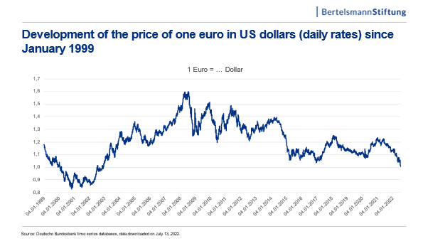

## Table of Contents

## What is the Euro and why is it important for the European economy?

The Euro is the official currency used by 20 of the 27 European Union countries, known as the Eurozone. It was introduced in 1999 to make trading and traveling between these countries easier. Before the Euro, each country had its own money, like the German Mark or the French Franc. Now, people in these countries use the same money, which makes it simpler to buy things from other countries in the Eurozone.

The Euro is important for the European economy because it helps countries work together more easily. When countries use the same currency, it's easier for them to trade goods and services with each other. This can make their economies stronger. Also, the Euro makes the European Union more powerful in the world because it is used by many countries. This can help the European Union have a bigger say in global economic decisions.

## How is the value of the Euro determined?

The value of the Euro is determined by something called the foreign exchange market. This is a place where people and businesses from all over the world buy and sell different currencies. The value of the Euro goes up or down based on how much people want to buy it compared to other currencies, like the US Dollar or the Japanese Yen. If more people want to buy Euros, its value goes up. If fewer people want Euros, its value goes down.

Many things can affect how much people want Euros. For example, if the economy of the Eurozone countries is doing well, more people might want to buy Euros because they think it's a good investment. On the other hand, if the Eurozone economy is not doing well, people might not want to buy Euros as much. Also, big events like political changes or natural disasters can make the value of the Euro change quickly. The European Central Bank, which is like a big bank for the Eurozone, can also do things to try to keep the value of the Euro stable.

## What does it mean for the Euro to be weak?

When we say the Euro is weak, it means that the Euro can buy less of other currencies like the US Dollar or the Japanese Yen. For example, if you have one Euro and it used to buy you two US Dollars but now it only buys one US Dollar, the Euro has gotten weaker. This can happen because fewer people want to buy Euros, or because other currencies are getting stronger.

A weak Euro can have different effects on the Eurozone countries. On one hand, it can be good for countries that sell things to other countries. When the Euro is weak, their products become cheaper for people in other countries to buy, so they might sell more. On the other hand, a weak Euro can make things more expensive for people living in the Eurozone. If they want to buy things from other countries, like oil or electronics, they will have to spend more Euros to get them.

## How does a weak Euro affect exports from Eurozone countries?

When the Euro is weak, it means that things made in Eurozone countries become cheaper for people in other countries to buy. This is because the Euro can buy less of other currencies. So, if a company in Germany wants to sell cars to the United States, those cars will cost fewer US Dollars when the Euro is weak. This can make the cars more attractive to buyers in the US, which can lead to more sales. As a result, a weak Euro can help Eurozone countries sell more of their products to other countries, which is good for their economy.

However, a weak Euro isn't always good for everyone in the Eurozone. While it can help companies that sell things to other countries, it can make things harder for companies that need to buy things from outside the Eurozone. For example, if a company in France needs to buy parts from Japan, those parts will cost more Euros when the Euro is weak. This can make it more expensive for the French company to make their products, which might hurt their business. So, while a weak Euro can boost exports, it can also create challenges for some businesses within the Eurozone.

## What impact does a weak Euro have on inflation within the Eurozone?

When the Euro is weak, it can make prices go up inside the Eurozone, which is called inflation. This happens because things that the Eurozone countries buy from other countries, like oil or electronics, cost more Euros when the Euro is weak. If these things are used to make other products or if they are sold directly to people, the higher costs can make the prices of many things go up. So, a weak Euro can lead to higher inflation.

But, a weak Euro isn't always bad for inflation. If the Eurozone countries are selling more of their own products to other countries because the Euro is weak, this can help their economy grow. When the economy is doing well, it can sometimes help keep inflation from getting too high. So, while a weak Euro can push prices up, it can also help the economy in ways that might balance out some of the effects on inflation.

## How does a weak Euro influence tourism in Europe?

When the Euro is weak, it can be good for tourism in Europe. People from other countries, like the United States or Japan, will find that their money can buy more Euros. This means they can spend less of their own money to travel, stay in hotels, and buy things in Europe. So, more people might choose to visit Europe because it's cheaper for them, which can help the tourism industry in the Eurozone countries.

However, a weak Euro might not be so good for Europeans who want to travel outside of Europe. When the Euro is weak, it costs more Euros to buy other currencies like the US Dollar or the Japanese Yen. This means that trips to other countries can become more expensive for people living in the Eurozone. So, while a weak Euro can bring more tourists to Europe, it might make it harder for Europeans to travel abroad.

## What are the effects of a weak Euro on foreign investments in the Eurozone?

When the Euro is weak, it can attract more foreign investments into the Eurozone. This is because investors from other countries can buy more Euros with their money. So, if they want to buy a business or invest in a company in the Eurozone, it will cost them less of their own money. This can make the Eurozone a more attractive place for foreign investors, which can help the economy grow.

However, a weak Euro can also make some investors worried. They might think that the Eurozone's economy is not doing well, which could make them less likely to invest. Also, if investors think the Euro might get even weaker in the future, they might not want to keep their money in Euros. So, while a weak Euro can bring in more foreign investment in the short term, it can also make some investors cautious about the long-term stability of the Eurozone economy.

## How does a weak Euro impact the purchasing power of Eurozone residents?

When the Euro is weak, it means that Eurozone residents can buy less with their money when they want things from other countries. For example, if someone in France wants to buy a computer from the United States, that computer will cost more Euros because the Euro doesn't go as far when it's weak. This can make things like electronics, oil, and other imported goods more expensive for people living in the Eurozone. So, a weak Euro can lower the purchasing power of Eurozone residents when it comes to things from outside the Eurozone.

On the other hand, a weak Euro can make things made in the Eurozone cheaper for people in other countries to buy. This can help companies in the Eurozone sell more of their products abroad, which might mean more jobs and money coming into the Eurozone. While this doesn't directly help Eurozone residents buy more things, it can make the economy stronger, which might eventually help their purchasing power. So, the impact of a weak Euro on purchasing power can be a bit complicated, depending on what people want to buy and how the economy is doing.

## What are the implications of a weak Euro on the European Central Bank's monetary policy?

When the Euro is weak, the European Central Bank (ECB) might need to do things to try to make it stronger. The ECB can change interest rates, which is like the price of borrowing money. If the ECB makes interest rates higher, it can make the Euro more attractive to investors because they can earn more money from saving in Euros. This can help the Euro get stronger. But the ECB has to be careful because changing interest rates can also affect how much people spend and how businesses grow, so they need to think about the whole economy.

The ECB can also use other tools to help the Euro. For example, they can buy and sell currencies in the foreign exchange market to try to change the value of the Euro. If the ECB thinks the Euro is too weak, they might sell other currencies and buy Euros to try to make it stronger. But this can be tricky because other countries might not like it if the ECB tries to change the value of the Euro too much. So, the ECB has to balance making the Euro stronger with keeping good relationships with other countries and helping the Eurozone economy.

## How does a weak Euro affect the competitiveness of European companies in global markets?

When the Euro is weak, it makes things made in Europe cheaper for people in other countries to buy. This is because the Euro doesn't buy as much of other currencies like the US Dollar or the Japanese Yen. So, if a company in Italy makes shoes and wants to sell them to people in the United States, those shoes will cost fewer US Dollars when the Euro is weak. This can make the Italian company's shoes more attractive to buyers in the US, helping the company sell more shoes and compete better in the global market.

However, a weak Euro can also make things harder for European companies that need to buy things from outside Europe. For example, if a German car company needs to buy parts from Japan, those parts will cost more Euros when the Euro is weak. This can make it more expensive for the German company to make their cars, which might make it harder for them to compete with car companies from other countries. So, while a weak Euro can help European companies sell more of their products abroad, it can also create challenges for companies that rely on imports.

## What are the long-term economic consequences of a sustained weak Euro?

A sustained weak Euro can have a big effect on the Eurozone's economy over time. If the Euro stays weak, it can help Eurozone countries sell more of their stuff to other countries because their products will be cheaper for people outside the Eurozone to buy. This can make businesses in the Eurozone do better and create more jobs. But, it can also make things from other countries more expensive for people in the Eurozone. This means things like oil, electronics, and other imports will cost more Euros, which can make life more expensive for people living in the Eurozone.

Over the long term, a weak Euro can also make the Eurozone's economy grow in some ways, but it can also create problems. If the Euro stays weak, it might make the Eurozone look less stable to people who want to invest money there. This could make them less likely to put their money into Eurozone businesses or buy Euros. Also, if the Euro stays weak for a long time, the European Central Bank might need to do things to try to make it stronger, like changing interest rates. This can be tricky because it can affect how much people spend and how businesses grow, so the ECB has to be careful to balance everything.

## How do different sectors within the Eurozone economy respond differently to a weak Euro?

When the Euro is weak, different parts of the Eurozone economy react in different ways. For example, businesses that sell things to other countries, like car makers or fashion companies, can do better. Their products become cheaper for people outside the Eurozone to buy, so they might sell more and make more money. This can help these businesses grow and create more jobs. But, companies that need to buy things from other countries, like energy companies that import oil, might have a harder time. The things they need to buy will cost more Euros, which can make their costs go up and make it harder for them to make a profit.

Tourism is another part of the economy that can be helped by a weak Euro. When the Euro is weak, it's cheaper for people from other countries to visit Europe. They can spend less of their own money to travel, stay in hotels, and buy things, so more people might choose to come to Europe. This can help hotels, restaurants, and other businesses that depend on tourists. But, for people living in the Eurozone who want to travel outside Europe, a weak Euro can make their trips more expensive. They will need more Euros to buy other currencies, which can make it harder for them to go on holidays abroad.

In the long run, a weak Euro can make the whole Eurozone economy more complicated. While some parts of the economy, like exporters and tourism, might do better, other parts, like importers and people who want to travel, might struggle. This can make the economy grow in some ways but also create problems. The European Central Bank might need to do things to try to make the Euro stronger, which can affect how much people spend and how businesses grow. So, a weak Euro can have both good and bad effects on different parts of the Eurozone economy.

## References & Further Reading

[1]: Fung, H. G., & Wang, Y. H. (2002). ["Currency volatility and international equity market returns."](https://www.sciencedirect.com/science/article/pii/S0148296323005155) International Journal of Finance & Economics.

[2]: Cœuré, B. (2017). ["The international role of the euro: Concepts, empirical status, and outlook."](https://www.bis.org/review/r151006e.pdf) European Central Bank.

[3]: Lopez de Prado, M. (2018). ["Advances in Financial Machine Learning"](https://www.amazon.com/Advances-Financial-Machine-Learning-Marcos/dp/1119482089) Wiley.

[4]: Bouveret, A., & Piquard, T. (2017). ["Algorithmic trading in practice."](https://www.researchgate.net/profile/Antoine-Bouveret/publication/321787356_Liquidity_Stress_Tests_for_Investment_Funds_A_Practical_Guide/links/5cebca4292851c4eabc17d8f/Liquidity-Stress-Tests-for-Investment-Funds-A-Practical-Guide.pdf) Journal of Financial Data Science.

[5]: Breslow, A. L. (2002). ["Quantitative Easing: Concept and Application."](https://academic.oup.com/ije/article-abstract/1/4/347/706095) Federal Reserve Bank of St. Louis.

[6]: Chan, E. (2009). ["Quantitative Trading: How to Build Your Own Algorithmic Trading Business"](https://github.com/ftvision/quant_trading_echan_book) John Wiley & Sons.

[7]: Jansen, S. (2020). ["Machine Learning for Algorithmic Trading"](https://github.com/stefan-jansen/machine-learning-for-trading) Packt Publishing.

[8]: Aronson, D. (2007). ["Evidence-Based Technical Analysis: Applying the Scientific Method and Statistical Inference to Trading Signals"](https://onlinelibrary.wiley.com/doi/book/10.1002/9781118268315) Wiley Trading.