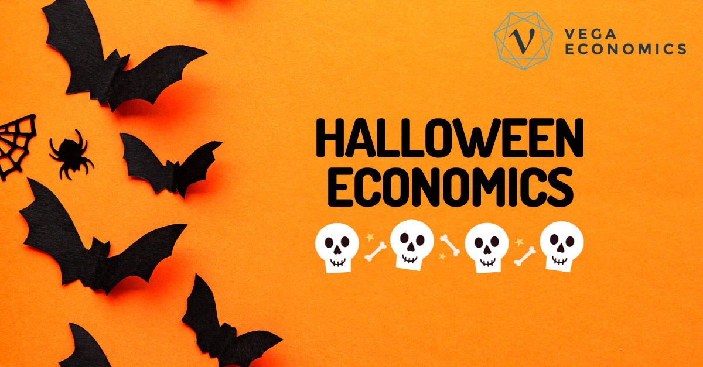

## Table of Contents

## What is Halloween and why is it celebrated?

Halloween is a holiday celebrated on October 31st. It started a long time ago with a festival called Samhain. This festival was important to people in Ireland, the United Kingdom, and northern France. They believed that on this night, the boundary between the living and the dead became thin. People wore costumes and lit bonfires to scare away ghosts.

Today, Halloween is celebrated in many countries, especially in the United States. People dress up in costumes, go to parties, and children go trick-or-treating. They knock on doors and say "trick or treat" to get candy. Halloween is also a time for spooky stories, decorations like pumpkins and skeletons, and watching scary movies. It's a fun holiday that brings people together to enjoy the spooky season.

## How much do Americans spend on Halloween each year?

Americans spend a lot of money on Halloween every year. In 2022, they spent about $10.6 billion. This money goes towards costumes, decorations, candy, and parties. People enjoy dressing up and making their homes look spooky, so they are willing to spend a lot to have fun on this holiday.

The biggest part of the spending is on costumes. Both adults and children like to dress up as their favorite characters or scary creatures. Candy is also a big expense because many people give out treats to trick-or-treaters. Decorations like pumpkins, ghosts, and skeletons help make Halloween special and fun for everyone.

## What are the main categories of Halloween spending?

The main categories of Halloween spending are costumes, candy, and decorations. Costumes are very popular because both kids and adults like to dress up. They can be anything from superheroes to scary monsters. People spend a lot of money to find the perfect outfit for Halloween parties or trick-or-treating.

Candy is another big category because it's a big part of the holiday. Kids go from house to house saying "trick or treat" to get candy. People buy lots of sweets to give out to the children who come to their doors. Decorations are also important. People use things like pumpkins, ghosts, and skeletons to make their homes look spooky and festive. These three categories make up most of the money spent on Halloween each year.

## How does Halloween spending impact the retail sector?

Halloween spending is really good for stores and shops. When people buy costumes, candy, and decorations, it helps businesses make more money. Stores get ready for Halloween by putting out special items and sales. This time of year can be very busy for them, and it can help them earn a lot more money than usual. 

The extra money from Halloween can also help stores in other ways. They might use it to hire more workers or to buy more things to sell. It's not just big stores that benefit; small shops and local businesses can also make more money. Halloween is a fun holiday that also helps the economy by getting people to spend money on things they enjoy.

## What is the economic contribution of Halloween to local economies?

Halloween helps local economies by bringing in more money. When people buy costumes, candy, and decorations, they are spending money in their own communities. This helps local shops and businesses earn more. Stores often see a big increase in sales during October because of Halloween. This extra money can help them pay for things like hiring more workers or buying more things to sell.

Local events and parties also add to the economy. People might spend money on tickets to haunted houses, or they might go out to eat at local restaurants before or after trick-or-treating. All of this spending helps the local economy grow. It's not just big stores that benefit; small shops and local businesses can also make more money during Halloween, which is good for everyone in the community.

## How do small businesses benefit from Halloween?

Small businesses really benefit from Halloween because people spend more money during this time. They buy costumes, candy, and decorations, which means more sales for local shops. This extra money can help small businesses pay for things like hiring more workers or buying more things to sell. It's a busy time, and it can make a big difference for them.

Local events and parties also help small businesses. People might spend money on tickets to haunted houses or go out to eat at local restaurants before or after trick-or-treating. All of this spending helps the local economy grow. Halloween is not just fun; it's also good for small businesses because it brings more customers and more money into their shops.

## What are the employment effects of Halloween?

Halloween can help create more jobs. When people spend more money on costumes, candy, and decorations, stores need more workers to help with all the extra customers. This means they might hire more people to work in their shops during October. It's not just big stores; small businesses also need more help because they get busier too. So, Halloween can lead to more jobs for people in the community.

Local events like haunted houses and Halloween parties also create jobs. People are needed to set up these events, work at them, and clean up afterward. Restaurants and cafes might need more staff because more people go out to eat during Halloween. All these extra jobs help people earn money and can make a big difference in the local economy. Halloween is a fun holiday that also helps create work for many people.

## How does Halloween affect agricultural markets, particularly for pumpkins and candy?

Halloween is a big time for farmers who grow pumpkins. People buy a lot of pumpkins to carve into jack-o'-lanterns or use as decorations. This means farmers can sell more pumpkins and make more money. They might grow more pumpkins just for Halloween because they know people will buy them. This helps the farmers and also helps the places that sell pumpkins, like stores and markets.

Candy is another big part of Halloween. People buy a lot of candy to give to kids who come trick-or-treating. This means candy makers need to make more candy and might need to hire more people to help. Stores that sell candy also get busier and can make more money. So, Halloween helps the candy business a lot by making people buy more sweets.

## What are the indirect economic effects of Halloween, such as on tourism?

Halloween can help bring more tourists to a place. Some towns and cities have big Halloween events like haunted houses or parades. People might travel to these places just to join in the fun. This means they spend money on things like hotels, food, and tickets to the events. So, Halloween can make more money for places that have special celebrations.

These tourists also help local businesses. When people come to a town for Halloween, they might shop at local stores or eat at local restaurants. This extra spending can help the local economy grow. Halloween is not just a fun holiday; it can also bring more visitors and more money to a place.

## How has the economic impact of Halloween changed over the past decade?

Over the past decade, the economic impact of Halloween has grown a lot. People are spending more money on Halloween every year. In 2012, Americans spent about $8 billion on Halloween. By 2022, that number went up to $10.6 billion. This shows that Halloween is becoming a bigger deal for the economy. More people are buying costumes, candy, and decorations, which helps stores and businesses make more money.

The way people celebrate Halloween has also changed. More adults are dressing up and going to parties, which means they spend more on costumes and decorations. This has made Halloween a bigger event for everyone, not just kids. The rise of social media and online shopping has also made it easier for people to buy Halloween stuff, which helps the economy even more. Overall, Halloween has become a more important time for spending and fun over the last ten years.

## What are the global economic effects of Halloween celebrations?

Halloween is not just a big deal in the United States; it's becoming popular in other countries too. When people in different countries start celebrating Halloween, they buy costumes, candy, and decorations. This means more money is spent, which helps the economy in those places. Stores and businesses in other countries can make more money because of Halloween. It's like a big party that helps the economy grow, not just in America but all over the world.

The global spread of Halloween also helps with tourism. Some places have big Halloween events that attract visitors from other countries. These tourists spend money on hotels, food, and tickets to the events, which helps the local economy. When more people celebrate Halloween around the world, it can create more jobs and help businesses in different countries. Halloween is becoming a fun holiday that also has a big impact on the global economy.

## How can economic models predict future trends in Halloween spending?

Economic models can help us guess how much people might spend on Halloween in the future. These models look at things like how much money people have, how many people celebrate Halloween, and what they usually spend money on. If more people start celebrating Halloween or if they have more money to spend, the models might predict that spending will go up. They can also look at past years to see if there are patterns, like if spending goes up a little bit every year.

These models can be useful for stores and businesses. If they know that people might spend more on Halloween in the future, they can get ready by buying more costumes, candy, and decorations to sell. They might also plan bigger Halloween events or sales to attract more customers. By using these predictions, businesses can make smart choices and help make Halloween even more fun and profitable.

## Is Halloween Spending Productive or Inefficient?

Economists have long debated whether Halloween spending is productive or inefficient, with two primary schools of thought providing contrasting viewpoints. Keynesian economists often champion the notion that increased consumer expenditure during events like Halloween stimulates economic growth and activity. This perspective hinges on the idea that spending contributes to higher aggregate demand, which in turn encourages production, increases income, and supports employment. The formula for aggregate demand (AD) can be expressed as:

$$
AD = C + I + G + (X - M)
$$

where $C$ stands for consumer spending, $I$ for investment, $G$ for government spending, $X$ for exports, and $M$ for imports. An uptick in consumer spending (C), such as that seen during Halloween, is believed to enhance economic output by increasing aggregate demand.

Conversely, critics argue that Halloween spending is inefficient, as it is primarily directed towards temporary and sometimes frivolous consumer goods like costumes and decorations. These goods typically have a limited lifespan and do not contribute to long-term economic growth. The consumption of non-durable goods means that resources are allocated towards production and sales processes that may not lead to lasting economic benefits. This argument is often rooted in the idea that spending on ephemeral items diverts attention and resources from investments in sectors that could yield sustainable economic growth, such as technology or infrastructure development.

To put this into context, consider the production and distribution dynamics of Halloween costumes. Resources, including labor and materials, are dedicated to creating products with a brief lifecycle. Therefore, while the immediate economic input is realized through wages and retail sales, the lack of lasting utility diminishes potential long-term contribution to the economy.

Despite the differences in opinion, it is essential to acknowledge the social and cultural dimensions of Halloween spending. While it may not entirely redefine economic landscapes, the increased seasonal activity provides opportunities for businesses to innovate and adapt, particularly in retail and digital sales platforms.

The debate reflects broader economic discussions about consumerism and its role in driving economic progress. As such, the economic impact of Halloween spending should be weighed alongside these broader considerations, recognizing that its contributions—whether viewed as beneficial or inefficient—form a complex tapestry within the economic structure.

## References & Further Reading

[1]: ["Halloween Spending Statistics."](https://www.statista.com/topics/1727/halloween-in-the-us/) National Retail Federation.

[2]: Lopez de Prado, M. (2018). ["Advances in Financial Machine Learning."](https://www.amazon.com/Advances-Financial-Machine-Learning-Marcos/dp/1119482089) John Wiley & Sons.

[3]: Chan, E. P. (2008). ["Quantitative Trading: How to Build Your Own Algorithmic Trading Business."](https://github.com/ftvision/quant_trading_echan_book) John Wiley & Sons.

[4]: Jansen, S. (2020). ["Machine Learning for Algorithmic Trading."](https://github.com/stefan-jansen/machine-learning-for-trading) Pact Publishing.

[5]: Aronson, D. R. (2006). ["Evidence-Based Technical Analysis: Applying the Scientific Method and Statistical Inference to Trading Signals."](https://www.amazon.com/Evidence-Based-Technical-Analysis-Scientific-Statistical/dp/0470008741) John Wiley & Sons.